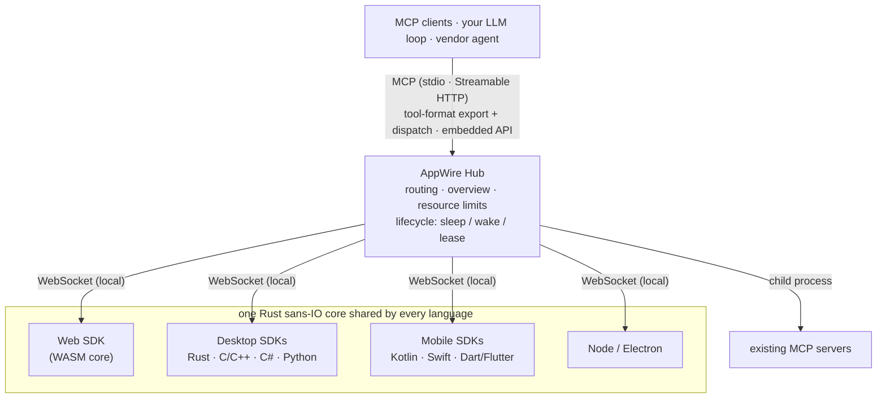

<p align="center">
  <picture>
    <source media="(prefers-color-scheme: dark)" srcset="docs/assets/logo/appwire-logo-dark.png">
    
  </picture>
</p>

# AppWire — turn any app into MCP tools for AI agents

[](#license)
[](https://modelcontextprotocol.io)
[](https://github.com/stareing/appwire)

**English** · [简体中文](docs/README.zh-CN.md) · [繁體中文](docs/README.zh-TW.md) · [日本語](docs/README.ja.md) · [한국어](docs/README.ko.md) · [Español](docs/README.es.md) · [Português (Brasil)](docs/README.pt-BR.md) · [Français](docs/README.fr.md) · [Deutsch](docs/README.de.md) · [Русский](docs/README.ru.md) · [Italiano](docs/README.it.md)

**AppWire is an open-source [Model Context Protocol (MCP)](https://modelcontextprotocol.io) SDK and
local hub that exposes the real actions of web, desktop and mobile apps as tools for AI agents** —
Claude, ChatGPT, Gemini, Claude Code or your own LLM loop. Declare a tool next to the code that
already does the work (a React hook, an HTML attribute, a doc comment, a Kotlin or Swift function)
and any MCP client can call it. No screen scraping, no computer use, no browser automation.

- **One SDK per platform, one Rust core:** React, plain HTML, Node, Electron, Tauri, Rust, C/C++,
  C# (WPF, WinUI), Kotlin/Android, Swift (iOS, macOS), Python (Qt, Tk), Dart/Flutter.
- **One hub for every app on the device:** speaks MCP (stdio, Streamable HTTP) and exports OpenAI,
  Anthropic and Gemini tool-calling / function-calling formats, or embeds into your own agent.
- **Standards in, standards out:** consumes and generates WebMCP, Apple App Intents, Android
  AppFunctions and Windows App Actions; aggregates existing MCP servers.
- **Description is not authorization:** apps declare what each tool does (standard MCP tool annotations:
  read-only, destructive, idempotent, open-world); your agent decides whether a call runs, and the app
  confirms high-risk steps such as payment in its own UI. AppWire passes declarations through faithfully
  and protects apps and the device (rate, wake and size limits).

> **Everything is a Tool.**
> Apps are capabilities. Interfaces are declarations. A call is a wake-up.

> The project was developed under the working name **app-mcp**; package, crate and binary names
> (`@app-mcp/*`, `app-mcp-*`, `app-mcp-host`) still use it.

## Contents

[What it is for](#what-appwire-is-for) · [Quick start](#quick-start) · [Quick look](#a-quick-look) · [Install](#install) · [Try it](#try-it) ·
[Platforms](#platforms-and-packages) · [How it works](#how-it-works) · [Scope](#scope) ·
[Comparison](#how-appwire-compares) · [Philosophy](#philosophy) · [FAQ](#faq) ·
[Docs](#documentation)

## What AppWire is for

AppWire lets an AI assistant operate the apps on a device the way the apps themselves do it —
through their own actions, with typed inputs, the user's existing login and the app's own checks —
instead of looking at the screen and guessing where to tap. An app declares what it can do once, in
its own code. Any agent on the device — a desktop assistant, a phone's built-in assistant, a car's
voice assistant or your own LLM loop — can then find those actions, call them, read the results and
wake the app when it is not running. The same declaration serves voice, chat and automation, so one
integration covers every way people talk to their devices.

| Device | What an agent can do there (examples) | How apps join | Status |
|---|---|---|---|
| **Computer** — Windows, macOS, Linux | "Export this report as a PDF and attach it to a new email"; drive desktop and web apps side by side from Claude Code, Cursor or Claude Desktop | Electron, Tauri, C# (WPF, WinUI), Python (Qt, Tk), C/C++, Rust; web pages via the browser | tested on Linux and Windows; Apple platforms verified on Linux only |
| **Phone** — Android, iOS, HarmonyOS NEXT | "Reorder last week's groceries"; "move my 3 pm meeting and message the attendees" — the on-device assistant calls app actions and wakes apps in the background | Kotlin, Swift, Dart/Flutter, ArkTS; the assistant embeds the Hub | Android tested on a device; iOS and HarmonyOS built and unit-tested, not yet on a device |
| **Tablet** — iPadOS, Android, Windows | act on what is shown in each split-screen pane; fill a form in one app from notes in another | the phone and computer SDKs; tools follow the visible screen | as for phone and computer |
| **Car smart cockpit** — Android Automotive OS, HarmonyOS cockpits, Linux/Qt head units | "Navigate to the nearest free charger and play my driving playlist" — the voice assistant calls navigation, charging and media apps directly, with no taps on the screen while driving | Kotlin (Android Automotive), ArkTS (HarmonyOS), C/C++ or Python (Qt); the cockpit assistant embeds the Hub (Rust, C, Kotlin) | same SDKs as phone and Linux; not yet verified on in-vehicle systems |
| **Assistant and device makers** | give your assistant every compatible app on the device through one integration, as OpenAI, Anthropic, Gemini or MCP tools | embed the Hub: Rust, Node, C/C#, Kotlin, Swift, Python | see [Status](#status) |

The examples show what apps can expose; they are not built-in features. What makes the interaction
deep rather than scripted:

- **Precise, not visual:** the agent calls the app's real action with a typed schema — no
  screenshots, coordinates or OCR — so it works with the window hidden, the screen off, or the
  driver's eyes on the road.
- **Always callable, not always running:** tools are listed from the app's manifest, and the app is
  woken through the platform's own activation only when called; idle apps give their resources back.
- **Aware of the current context:** tools appear and disappear with the screen and the app's state,
  so the assistant only sees what can be done now.
- **Across apps:** one request can combine tools from several apps; each result says whether the
  action is done or still pending in the app (for example, waiting for the user to confirm a
  payment).
- **The user stays in control:** the agent decides whether to ask first, the app confirms high-risk
  steps in its own UI, and users can hide or block any app or tool (`app-mcp-host policy`).

## Quick start

Connect your AI agents to the AppWire-enabled apps on this computer:

```bash
npx appwire-cli setup        # or: uvx appwire-cli setup
npx appwire-cli uninstall    # later, to undo everything setup did
```

`setup` installs the AppWire Host (`app-mcp-host`) for the current user: it copies the binary out of
the package manager's cache into `~/.app-mcp/bin`, registers it to start at login, and adds it to the
MCP configuration of the agents it finds — Claude Code, Codex, Gemini CLI, Cursor and VS Code (for
Windsurf and Claude Desktop it prints the entry to add by hand). It backs up every file it edits,
never overwrites a different existing entry unless you pass `--force`, finishes with a `doctor`
self-check, and is safe to run again; `--dry-run` shows the plan first. Local agents need no access
token. Restart your agent, open an app that uses AppWire, and its tools appear. After installing the
package globally (`npm install -g appwire-cli` or `uv tool install appwire-cli`) the command is
`appwire`.

The `appwire-cli` packages on npm and PyPI are published with the first release. Until then, build
from source — `cargo build -p app-mcp-host`, then `target/debug/app-mcp-host setup` — or follow
[Try it](#try-it).

## A quick look

**React** — a tool that exists only while the component is mounted

```tsx
useTool('cart.checkout', {
  description: 'Check out the current cart',
  risk: 'payment',
  input: z.object({ addressId: z.string() }),
  handler: ({ addressId }) => checkout(addressId),
})
```

**Plain HTML** — no JavaScript required

```html
<button data-mcp-tool="cart.clear" data-mcp-desc="Empty the cart">Clear</button>
```

**A doc comment** (with `@app-mcp/build`) — tools generated at compile time

```ts
/** Estimate delivery days for a city. @mcp */
export function deliveryEstimate(city: string, express?: boolean) { … }
```

**Your own LLM loop** (embedded Hub, Node) — one call to export every app's tools

```ts
const hub = await Hub.start({})
const tools = hub.exportTools('anthropic')            // or 'openai-chat', 'openai-responses', 'gemini', 'mcp'
const results = await handleAnthropicToolUses(hub, response.content)
```

## Install

Packages are published with the first release; until then, build from source as shown in
[Try it](#try-it).

```bash
# Web
npm install @app-mcp/web @app-mcp/react        # also: @app-mcp/dom, @app-mcp/store, @app-mcp/build
# Node / Electron
npm install @app-mcp/node @app-mcp/electron
# Embed the hub in a Node agent (LangChain.js, Vercel AI SDK, OpenAI / Anthropic SDK)
npm install @app-mcp/hub
# Rust / Tauri v2
cargo add app-mcp-native                       # Tauri: tauri-plugin-app-mcp + @app-mcp/tauri
# The local hub (MCP server for Claude Code, Claude Desktop, Cursor and other MCP clients)
cargo install app-mcp-host
```

Native SDKs for C/C++, C#, Kotlin, Swift, Python and Dart live under [`sdks/`](sdks) and
[`bindings/`](bindings); each has its own build instructions.

## Try it

```bash
# build the Host and run it as a resident service (one process serves every MCP client)
cargo build -p app-mcp-host
target/debug/app-mcp-host serve            # or: app-mcp-host service install  (start at login)
target/debug/app-mcp-host status           # one-line summary
target/debug/app-mcp-host doctor           # something wrong? each check gives a verdict and a fix

# run the demo shop, then open it in a browser
pnpm --filter @app-mcp/example-shop dev
```

The Host serves everything on one port, `127.0.0.1:7717`: web apps connect to `/app` (WebSocket),
MCP clients use Streamable HTTP at `http://127.0.0.1:7717/mcp`, and `/healthz` reports the Host's
identity. Native apps connect over a per-user local socket (Unix domain socket / Windows named
pipe), which also serves MCP for agents that speak HTTP over local sockets. A lock file keeps one
Host per user, and the actual endpoints are recorded in `~/.app-mcp/run/endpoints.json`.

This repository's `.mcp.json` points Claude Code at that endpoint; restart the session, open the
demo page, and ask Claude to operate the shop. Any other MCP client works the same way:

```json
{ "mcpServers": { "appwire": { "type": "http", "url": "http://127.0.0.1:7717/mcp" } } }
```

When something does not connect, `app-mcp-host doctor` checks the Host, lock, local socket
permissions, which process holds the port, Windows excluded port ranges, the token mode,
`adb reverse`, and each app's state and last error; SDK states carry machine-readable error codes
(`spec/protocol.md` §10). See [`crates/host/README.md`](crates/host/README.md) for configuration,
the access token and other MCP clients.

## Platforms and packages

| Where | Package | Notes |
|---|---|---|
| Web | `@app-mcp/web`, `@app-mcp/react`, `@app-mcp/dom`, `@app-mcp/store`, `@app-mcp/build` | WASM core; WebMCP polyfill/bridge; HTML attributes; Zustand / Redux / Pinia; compile-time `@mcp` |
| Node / Electron | `@app-mcp/node`, `@app-mcp/electron` | main process + renderer bridge |
| Rust (Tauri, egui…) | `crates/native` | direct dependency |
| Tauri v2 | `crates/tauri-plugin`, `@app-mcp/tauri` | plugin: Rust tools + webview pages via Tauri IPC (`@app-mcp/web` unchanged) |
| C / C++ | `bindings/c`, `sdks/cpp` | stable C ABI (`app_mcp.h`) |
| C# (WPF, WinUI) | `sdks/dotnet` | P/Invoke; single-instance and protocol activation helpers |
| Kotlin / Android | `sdks/kotlin` | coroutines; `WakeReceiver` + expedited WorkManager |
| Swift (iOS, macOS) | `sdks/swift` | async/await; SwiftUI lifecycle modifier |
| Python | `sdks/python` | sync or asyncio handlers; Qt / Tk dispatchers; D-Bus wake |
| Dart / Flutter | `sdks/dart` | dart:ffi; `AppLifecycleListener` integration |
| HarmonyOS NEXT (ArkTS) | `sdks/harmony` (`@app-mcp/harmony`), `bindings/harmony` | Node-API module (same binding source as `@app-mcp/node`); app foreground/background and `Want` wake |
| Native intents | `crates/codegen` | generates App Intents, AppFunctions, Windows App Actions, HarmonyOS InsightIntent and typed interfaces |
| Agents / vendors | `crates/hub`, `@app-mcp/hub`, `bindings/hub-c`, `bindings/hub-uniffi` | embeddable Hub for Rust, Node, C/C#, Kotlin, Swift, Python |

## How it works



- **App SDKs** register tools and resources; a single Rust core (`crates/core`) implements the
  protocol, so behavior is identical in every language.
- **The Hub** (`crates/hub`) aggregates apps and upstream MCP servers, routes calls to the right
  instance, attaches a short app overview on first contact, passes each tool's declarations through
  unchanged, and wakes sleeping apps. It does not decide whether a call may run: that is the agent's
  job (a vendor embedding the Hub can plug its own confirmation UI into the optional `ApprovalHandler`
  callback). `app-mcp-host` is its command-line front end.
- **Static manifests** (`app-mcp.json`) let the Hub list an app's tools and wake it even when the app
  is not running.

## Scope

AppWire is the channel between AI agents and apps: it provides mechanism, not policy. It turns what an app declares — tools, input and output schemas, MCP tool annotations, content annotations and result status — into tools any agent can call, passing those declarations through unchanged; it discovers apps, routes each call to the right instance and wakes sleeping apps on demand; it keeps the channel correct with cancellation, timeouts, classified errors and results that say whether an action is done or still pending; it protects apps and the device with rate, wake and size limits; and it enforces the hide and deny rules that the user or a vendor writes, with no built-in judgement of its own. It does not decide whether a call should run or whether to ask the user — that is the agent's job; the final confirmation of a high-risk step such as a payment belongs to the app, in its own UI; and choosing models, orchestrating prompts, keeping agent memory and reading the screen are outside its scope.

## How AppWire compares

| Approach | What the model sees | Works when the app is closed | Platforms |
|---|---|---|---|
| Computer use / screen agents | screenshots, pixels | no | desktop |
| Browser automation (e.g. Playwright MCP) | DOM / accessibility tree | no | web |
| A hand-written MCP server per app | tools, maintained separately from the app | depends | one per server |
| WebMCP | tools declared by the page | no | browser only |
| App Intents / AppFunctions / App Actions | system intents | yes | one OS each |
| **AppWire** | **tools declared in the app's own code** | **yes (manifest + wake)** | **web, desktop, mobile** |

AppWire does not replace these standards: it reads and generates WebMCP, App Intents, AppFunctions
and Windows App Actions, and it can aggregate existing MCP servers behind the same Hub.

## Philosophy

Unix says *everything is a file*: devices, pipes and processes share one interface — `open`, `read`,
`write`. Plugin systems say *everything is a plugin*: features are code loaded into a host.

AppWire says **everything is a tool**. A button, a form, a menu command, a store action, an OS
capability, an existing MCP server — each is expressed the same way: a name, an input schema, a risk
level and a handler. A model needs only three verbs: **list, call, read**.

A plugin moves code *into* the host. A tool is the opposite: the code stays in the app, the app
declares what it can do, and the model orchestrates.

### Nine principles

1. **Declare where the action lives.** Capabilities are declared where they already are — a React
   hook, an HTML attribute, a doc comment, a state store, a native `ToolSpec`. No second description
   to maintain; when the code changes, the tool changes.
2. **Declare, don't parse.** No screenshots, no DOM scraping, no guessing which button is clickable.
   The app states what it can do; the model receives intent, not pixels. UI inspection
   (`@app-mcp/inspect`) is an opt-in fallback only.
3. **Tools live and die with the interface.** Open a tab and its tools appear; close it and they
   disappear; an empty cart has no `checkout`. The model always sees what can be done *now*.
4. **Summoned on call, dismissed when done.** The goal is *always callable*, not *always running*.
   Discovery never launches an app: its tools are listed from the manifest and its last snapshot. A call
   wakes it through the platform's own activation; when the work is done the connection and threads are
   released and the process is handed back to the OS. Nothing pins a process in memory, no per-app daemon
   stands in for the app, and the OS, not AppWire, owns the process lifecycle. A connection is a means,
   never a burden.
5. **One hub, every endpoint.** One Hub serves web, desktop and mobile apps, and speaks MCP, OpenAI,
   Anthropic and Gemini tool formats — or embeds directly into a vendor's own agent. Integrate once,
   use everywhere.
6. **Compatible, therefore a superset.** WebMCP, App Intents, AppFunctions and Windows App Actions
   can all be consumed and generated. We don't compete with standards; we connect them.
7. **Description is not authorization.** An overview tells the model what an app is for, and a
   tool's annotations say what it does; neither grants anything. Whether a call runs is decided by
   the agent and its user; the final confirmation of a high-risk action, such as a payment, belongs
   to the app, in its own UI with its own verification. AppWire passes declarations through
   faithfully and protects apps and the device.
8. **Fix it at the source.** Solve a problem in the layer where it originates. No forwarding
   processes, wrapper scripts, monkeypatches or fallback conversions to paper over it.
9. **Every AI action is visible; what is declared undoable can be undone.** The person whose apps an
   agent operates can always see what it did, and an action the app declares reversible can be
   taken back. Being able to act is not enough; the user must be able to see and correct.

## FAQ

**How do I turn my React app into an MCP server?**
Add `@app-mcp/react`, wrap the actions you want to expose in `useTool`, and run `app-mcp-host`.
The page connects to the local Hub, and every MCP client connected to the Hub sees the tools while
the component is mounted. Plain pages can use `data-mcp-*` attributes with `@app-mcp/dom` instead.

**How do I let Claude (or ChatGPT, Gemini, Cursor) control a desktop or mobile app?**
Register tools with the SDK for your platform (Electron, Tauri, C#, Kotlin, Swift, Python,
Flutter…) and point the MCP client at `http://127.0.0.1:7717/mcp`. Android apps reach the Hub via
`adb reverse` during development.

**Do I need to write a separate MCP server for each app?**
No. Apps register with one local Hub, and the Hub is the single MCP server every client talks to.
Existing MCP servers can be added behind the same Hub as upstreams.

**Can I use it without MCP, in my own agent?**
Yes. Embed the Hub (Rust, Node, C/C#, Kotlin, Swift, Python), export tools in OpenAI, Anthropic or
Gemini format, and dispatch the model's tool calls back through the Hub. See
[`spec/hub-api.md`](spec/hub-api.md).

**How is this different from computer use or browser automation?**
Those approaches make the model read the screen and guess where to click. AppWire has the app
declare its actions with typed input schemas, so calls are precise, fast and work when the window is
hidden — or when the app is not running at all (it is woken on demand).

**Is it safe to let a model call app actions?**
AppWire leaves that decision where it belongs. Each tool declares what it does (as standard MCP tool
annotations: read-only, destructive, idempotent, open-world) and AppWire passes those declarations
to the agent unchanged; the agent (Claude Code, Cursor or your own loop) decides with its own
permission settings whether a call runs or needs your confirmation. High-risk steps such as payment
are confirmed inside the app, with its own UI and verification (password, 3-D Secure, biometrics).
An app overview never grants permissions. The Hub's own job is to protect apps and the device with
rate, wake and size limits.

**Does it work with WebMCP?**
Yes. `@app-mcp/web/webmcp` implements the WebMCP `modelContext` API as a polyfill and bridges it,
so pages written against the standard are exposed through the Hub too.

## Documentation

| Document | Content |
|---|---|
| [`spec/protocol.md`](spec/protocol.md) | SDK ↔ Hub protocol (authoritative) |
| [`spec/manifest.md`](spec/manifest.md) | static manifest `app-mcp.json` |
| [`spec/lifecycle.md`](spec/lifecycle.md) | app lifecycle: sleep, wake, lease, fast resume |
| [`spec/hub-api.md`](spec/hub-api.md) | embeddable Hub API and bindings |
| [`crates/host/README.md`](crates/host/README.md) | Host configuration, access token, MCP clients |
| [`llms.txt`](llms.txt) | project summary for LLMs and AI search |
| [`app-mcp-plan.md`](app-mcp-plan.md) | full design and roadmap (Chinese) |
| [`TASKS.md`](TASKS.md) | current status (Chinese) |

Other languages: [简体中文](docs/README.zh-CN.md) · [繁體中文](docs/README.zh-TW.md) · [日本語](docs/README.ja.md) · [한국어](docs/README.ko.md) · [Español](docs/README.es.md) · [Português (Brasil)](docs/README.pt-BR.md) · [Français](docs/README.fr.md) · [Deutsch](docs/README.de.md) · [Русский](docs/README.ru.md) · [Italiano](docs/README.it.md)

## Status

Prototype (milestones M1–M2). The protocol, core, Hub and all language SDKs are implemented and
tested on Linux and Windows, with an Android device run; Apple platforms are verified on Linux only.
APIs may still change. Issues and pull requests are welcome.

## License

Licensed under either of [Apache License 2.0](LICENSE-APACHE) or [MIT](LICENSE-MIT), at your option.
