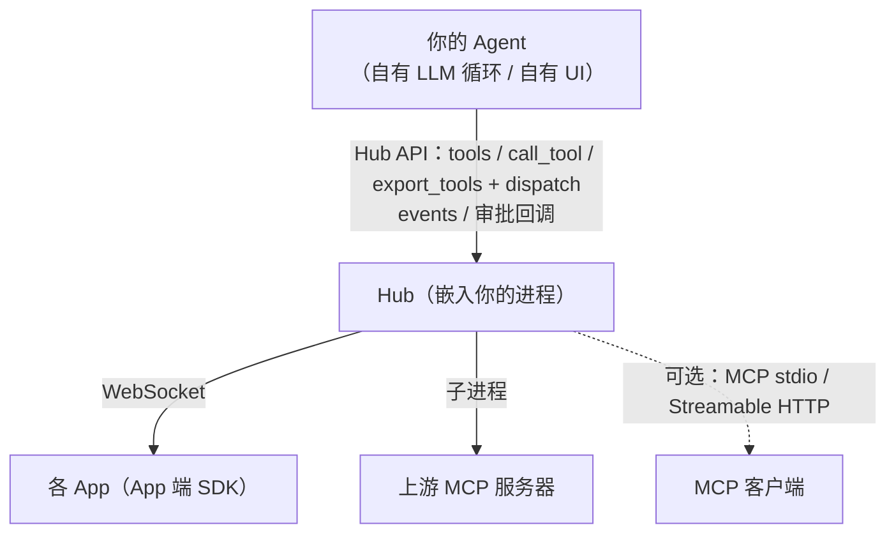

# app-mcp-hub：厂商接入指南

`app-mcp-hub` 把"连接本机所有 App"的能力做成一个库，给手机 / 车机 / PC 助手、IDE、自研 Agent 框架直接嵌入：

- 本机 App 通过 App 端 SDK（`@app-mcp/web`、`app-mcp-native`、Kotlin / Swift / C# …）连上 Hub，登记工具与资源；
- 你的 Agent 通过 Hub 列出工具、调用、读资源、接收事件，并由你的 UI 接管调用确认与 App 配对；
- 已有的 MCP 服务器可作为"上游"聚合进来；需要时 Hub 也能同时以 MCP 对外提供。

接口契约见 `spec/hub-api.md`（权威）。`app-mcp-host` 可执行程序就是本库之上的命令行薄壳。



## 三种接法

| 接法 | 适合 | 用到的 API |
|---|---|---|
| A. 嵌入 Rust API | 自己决定何时调用哪个工具（规则、菜单、语音意图） | `tools` / `call_tool` / `read_resource` / `events` |
| B. 自有 LLM + 格式导出 | 已有 OpenAI / Anthropic / Gemini 调用循环 | `export_tools` + `dispatch` |
| C. 对外开 MCP | Agent 本身是 MCP 客户端（Claude Desktop、IDE 等） | `serve_stdio` / `serve_http` / `mcp_session` |

三种接法可以同时使用；它们共用**同一份调用逻辑**（schema 校验 → 审批 → 路由 → 转发 → 首次附带总览），行为一致。

依赖：

```toml
[dependencies]
app-mcp-hub = { path = "crates/hub" }
tokio = { version = "1", features = ["full"] }
serde_json = "1"
```

### 启动

```rust
use app_mcp_hub::{Hub, HubConfig};

let hub = Hub::start(HubConfig {
    ws_addr: Some("127.0.0.1:7717".into()), // 网页 App 连接服务（WebSocket）；None = 不开
    // 原生 App 默认连接的本地 IPC 端点（Unix 域套接字 / Windows 命名管道）；缺省为平台默认端点，None = 不开
    ..Default::default()
})
.await?;
println!("原生 App 端点：{:?}", hub.ipc_endpoint()); // 如 Some("unix:/run/user/1000/app-mcp/hub.sock")
```

端点格式、鉴权（同一用户）与单实例语义见 spec/protocol.md 第 1 节、spec/hub-api.md 3.8。
同一台机器上只能有一个 Hub 使用默认端点：测试或第二个 Hub 请设 `ipc_endpoint: None` 或临时路径。

`HubConfig` 还包括静态清单（`manifests`，未连接的 App 也能列出工具）、额外允许的 Origin、各类超时、
上游 MCP 服务器（`upstreams`）、审批策略（`approval`）。所有 `async` 方法需要 tokio 多线程运行时。

### A. 嵌入 Rust API

```rust
use app_mcp_hub::{CallRequest, ToolFilter};
use serde_json::json;

for t in hub.tools(&ToolFilter::default()) {
    println!("{} [{:?}] {}", t.name, t.risk, t.description);   // 全名 "<appId>.<tool>"
}

let mut req = CallRequest::new("shop.cart.add", json!({ "sku": "A1", "qty": 1 }));
req.session = Some("conv-42".into());          // 你的会话 ID：总览"首次附带"按会话计算
let outcome = hub.call_tool(req).await?;       // Err 仅当名称无法解析（appId 未知 / 格式不对）
match outcome.result {
    Ok(data) => println!("成功：{data}，可能变化的资源：{:?}", outcome.state_hints),
    Err(e) => println!("失败：{}: {}", e.kind, e.message),  // USER_REJECTED / TIMEOUT / APP_DISCONNECTED …
}
if let Some(ov) = outcome.overview {
    // 该会话第一次接触这个 App：把 ov.text 放进模型上下文
}
```

事件（UI 刷新、重新导出工具）：

```rust
let mut rx = hub.events();
while let Ok(ev) = rx.recv().await {
    // AppConnected / AppDisconnected / ToolsChanged / ResourcesChanged /
    // ResourceUpdated / VisibilityChanged / UpstreamState / AppDormant / AppWaking
}
```

### B. 自有 LLM：格式导出 + dispatch

`export_tools` 把工具转成目标厂商的格式；`dispatch` 接收模型返回的"工具调用"，执行后返回该格式的"工具结果"消息，
直接放回对话即可。支持 `Mcp`、`OpenAiChat`、`OpenAiResponses`、`Anthropic`、`Gemini`。

最短的 Anthropic 循环（伪代码中的 `llm.messages` 换成你自己的 HTTP 调用）：

```rust
use app_mcp_hub::{ToolFilter, ToolFormat};
use serde_json::{Value, json};

let tools = hub.export_tools(ToolFormat::Anthropic, &ToolFilter::default());
let mut messages = vec![json!({ "role": "user", "content": "把牛奶加进购物车" })];
loop {
    let resp: Value = llm.messages(&messages, &tools).await?;      // 你的模型调用
    messages.push(json!({ "role": "assistant", "content": resp["content"] }));
    let calls: Vec<Value> = resp["content"].as_array().into_iter().flatten()
        .filter(|b| b["type"] == "tool_use").cloned().collect();
    if calls.is_empty() { break; }                                   // 模型给出最终回答
    let mut results = Vec::new();
    for c in calls {
        results.push(hub.dispatch(ToolFormat::Anthropic, c).await);  // → {type:"tool_result", tool_use_id, content, is_error?}
    }
    messages.push(json!({ "role": "user", "content": results }));
}
```

要点：

- **名称编码**：OpenAI / Anthropic 只允许 `[a-zA-Z0-9_-]{1,64}`。导出名 = 全名把 `.` 换成 `__`
  （`shop.cart.add` → `shop__cart__add`）；冲突、超长或含其他字符时截断到 59 字符并加 `_<4 位十六进制哈希>`。
  映射只取决于当前工具集合；`dispatch` 同时接受导出名和全名。所有格式使用同一导出名。
- **结果内容**：成功为 JSON 文本（含 `stateHints` 提示；该会话首次接触 App 时最前面附带总览）；
  失败为 `<KIND>: <message>` 文本，Anthropic 带 `is_error: true`，Gemini 放在 `response.error`。
- **描述**：风险不是 read / write 时追加 `（风险：payment）` 等标记；Gemini 格式剔除不支持的 schema 关键字
  （`additionalProperties`、`$ref` 等）。
- **会话**：`dispatch` 使用默认会话；多会话用 `dispatch_in_session(format, call, Some("conv-42"))`，
  开始新对话时 `reset_session(Some("conv-42"))`。
- **取消**：OpenAI 的 `id` / `call_id`、Anthropic 的 `id` 同时作为 callId，可用 `hub.cancel_call(id)` 取消。
- 工具列表变化（`HubEvent::ToolsChanged`）后重新 `export_tools`。
- **工具很多时（渐进暴露）**：见下一节；多会话时导出与分派用同一个会话 ID
  （`ToolFilter { session: Some("conv-42".into()), .. }` 与 `dispatch_in_session(.., Some("conv-42"))`），并且每轮重新导出。

### 渐进暴露（工具很多时）

`HubConfig.tool_exposure`（spec/hub-api.md 3.7）：

| 值 | 行为 |
|---|---|
| `ToolExposure::Auto`（默认） | App 与上游工具总数超过 `tool_exposure_threshold`（默认 40）时按 `Progressive`，否则按 `All` |
| `ToolExposure::Progressive` | 工具列表只含内置工具 `apps.list` / `apps.select` / `apps.overview` / `apps.tools`，以及**该会话**展开过（调用 `apps.tools`）、直接调用过、或选定了实例（`apps.select` / `select_instance`）的 App 的工具 |
| `ToolExposure::All` | 全部列出（旧行为） |

- 模型调用 `apps.tools {"appId": "shop"}` 得到该 App 的全部工具（`HubTool` 形态：全名、说明、`inputSchema`、风险、可用性），
  之后这些工具出现在该会话的 `tools()` / `export_tools()` / MCP `tools/list` 中；MCP 出口只向该会话发 `tools/list_changed`。
- 路由不变：未列出的工具按全名或导出名仍可直接调用，调用后该 App 也加入会话列表。导出名按全部工具计算，展开前后不变。
- 给出 `ToolFilter.apps` 时列出这些 App 的全部工具（不受渐进暴露影响），适合你自己的 UI。
- 会话状态随 `reset_session` / MCP 会话结束清除。`apps.tools` 在 `All` 模式下也可调用，但不出现在列表中。

### C. 对外开 MCP

```rust
hub.serve_http("127.0.0.1:7718", false).await?; // Streamable HTTP：http://127.0.0.1:7718/mcp（多会话，另有 GET /healthz）
// 带本地访问令牌：浏览器来源（带 Origin）必须携带 Authorization: Bearer <令牌>（spec/hub-api.md 3.6）
// hub.serve_http_with("127.0.0.1:7718", HttpOptions { token: Some(t), ..Default::default() }).await?;
hub.serve_stdio().await?;                         // 或 stdio（阻塞到客户端断开）
// 自有传输：hub.mcp_session() 是 rmcp ServerHandler，可 .serve(任意 AsyncRead + AsyncWrite)
```

## 审批与配对（你的 UI 接管）

```rust
use std::sync::Arc;
use app_mcp_hub::{ApprovalHandler, ApprovalPolicy, ApprovalRequest, HubConfig, Risk, async_trait};

struct MyUi;
#[async_trait]
impl ApprovalHandler for MyUi {
    async fn approve(&self, req: ApprovalRequest) -> bool {
        // 弹窗："{app_name} 想要执行 {title}（风险：{risk}）" → 用户选择
        show_dialog(&req).await
    }
}

let hub = Hub::start(HubConfig {
    approval: ApprovalPolicy { require_at_or_above: Some(Risk::Destructive), timeout: None },
    ..Default::default()
}).await?;
hub.set_approval_handler(Arc::new(MyUi));
```

- 风险顺序：read < write < destructive < payment < os-sensitive；低于阈值的调用不询问。
- 拒绝、超时（`timeout`，缺省为 `response_timeout`）、策略要求审批但未设置处理器 → `USER_REJECTED`，调用不会发给 App。
- MCP 出口与 `dispatch` 同样经过审批。

`set_pairing_handler` 设置后，**无静态清单**或 **Origin 不在白名单**的 App 首次连接时，Hub 先回复 `pending`，
询问处理器后再以 `app/pairingResult` 通知结果（同意后同一 appId + Origin 或携带已发 token 的重连不再询问）。
未设置时行为与原 Host 一致：白名单内直接配对，白名单外拒绝。

## 休眠、唤醒与租约（App 端生命周期配合）

App 端 SDK 在 `idle` / `on-demand` 模式下空闲后会发 `app/sleep` 并断开（spec/lifecycle.md）。Hub 的配合：

- **休眠实例不消失**：工具仍列出，`HubTool.availability == Availability::Dormant`；`AppInfo.dormant_instances`
  列出休眠实例；事件 `HubEvent::AppDormant`。不发 `ToolsChanged`，你的 LLM 工具列表无需变化。
- **调用即唤醒**：调用休眠实例的工具时，Hub 先按快照校验参数、走审批，再生成一次性令牌并调用 `Waker` 激活 App
  （事件 `HubEvent::AppWaking`），等待回连（`HubConfig.wake_timeout`，默认 15 秒，超时 `APP_NOT_RESPONDING`）后派发。
  回连时工具摘要一致则跳过完整同步（`toolsCurrent`）。
- **租约**：每次调用完成后 Hub 发送 `app/lease`（`HubConfig.lease_ttl`，默认 60 秒；`Duration::ZERO` 关闭），
  让 App 在模型连续调用期间保持连接；MCP 会话关闭或 `reset_session` 时取消。
- **清单冷启动**：App 未运行而清单显式声明了 `wake` 时也会唤醒；`wake_from_launch: true` 时还会由 `launch` 推导。

默认 `SystemWaker` 按平台激活（`uri` → `cmd start` / `open -g` / `xdg-open`；`aumid` →
`IApplicationActivationManager::ActivateApplication(aumid, "app-mcp-wake:<令牌>")`；`dbus` → `gdbus call … ActivateAction app-mcp-wake`；
`web-url` → 打开 `url#app-mcp-wake=<令牌>`），参数不经 shell。`HubConfig::waker` 可改为 `WakerConfig::None`（不唤醒）或
`WakerConfig::Exec(argv)`（执行指定程序，`WakeRequest` 以 JSON 写入其 stdin）。平台上有更合适的激活方式（如 Android 显式广播）时自行实现：

```rust
use std::sync::Arc;
use app_mcp_hub::{HubError, WakeKind, WakeRequest, Waker, async_trait};

struct AndroidWaker;
#[async_trait]
impl Waker for AndroidWaker {
    async fn wake(&self, req: WakeRequest) -> Result<(), HubError> {
        // req.descriptor.kind == WakeKind::AndroidIntent 时 target 为 "<包名>/<接收器类名>"
        // 发送显式广播 dev.appmcp.action.WAKE，extra 带 req.token
        send_wake_broadcast(req.descriptor.target.as_deref(), &req.token)
    }
}
hub.set_waker(Arc::new(AndroidWaker));
```

## 示例

`examples/embed.rs`：启动 Hub（随机端口）→ 同进程用 `app-mcp-native` 起一个 App 注册 `notes.add` →
`export_tools(Anthropic)` → 模拟模型返回的 `tool_use` → `dispatch` → 打印 `tool_result`。

```bash
cargo run -p app-mcp-hub --example embed
```

## 其他语言

C ABI（C / C++ / C# / Dart）、uniffi（Kotlin / Swift / Python）、napi（Node / Electron）绑定见 `spec/hub-api.md` 第 2、6 节。
复杂结构均以 JSON 传递：本库所有公开数据类型都实现了 serde（camelCase）。
