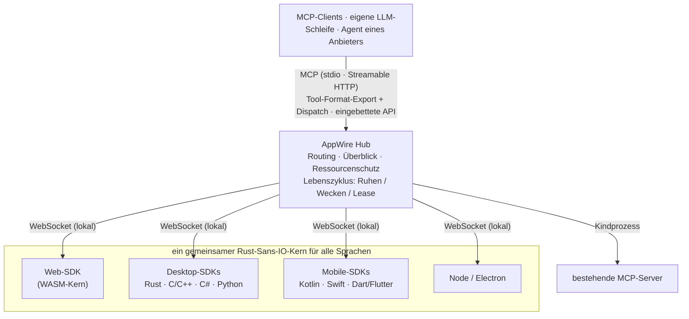

<p align="center">
  <picture>
    <source media="(prefers-color-scheme: dark)" srcset="assets/logo/appwire-logo-dark.png">
    
  </picture>
</p>

# AppWire — jede App in MCP-Tools für KI-Agenten verwandeln

[](#lizenz)
[](https://modelcontextprotocol.io)
[](https://github.com/stareing/appwire)

[English](../README.md) · [简体中文](README.zh-CN.md) · [繁體中文](README.zh-TW.md) · [日本語](README.ja.md) · [한국어](README.ko.md) · [Español](README.es.md) · [Português (Brasil)](README.pt-BR.md) · [Français](README.fr.md) · **Deutsch** · [Русский](README.ru.md) · [Italiano](README.it.md)

**AppWire ist ein quelloffenes SDK und ein lokaler Hub für das [MCP (Model Context Protocol)](https://modelcontextprotocol.io),
das die echten Aktionen von Web-, Desktop- und Mobile-Apps als Tools für KI-Agenten bereitstellt** —
für Claude, ChatGPT, Gemini, Claude Code oder Ihre eigene LLM-Schleife. Sie deklarieren ein Tool direkt
neben dem Code, der die Arbeit bereits erledigt (ein React-Hook, ein HTML-Attribut, ein Doc-Kommentar,
eine Kotlin- oder Swift-Funktion), und jeder MCP-Client kann es aufrufen. Kein eigener MCP-Server pro App,
kein Screen Scraping, kein Computer Use, keine Browser-Automatisierung.

- **Ein SDK pro Plattform, ein gemeinsamer Rust-Kern:** React, reines HTML, Node, Electron, Tauri, Rust, C/C++,
  C# (WPF, WinUI), Kotlin/Android, Swift (iOS, macOS), Python (Qt, Tk), Dart/Flutter.
- **Ein Hub für alle Apps auf dem Gerät:** spricht MCP (stdio, Streamable HTTP) und exportiert Tools in den
  Formaten für Tool-Aufrufe (Function Calling) von OpenAI, Anthropic und Gemini – oder lässt sich direkt in
  Ihren eigenen Agenten einbetten.
- **Standards rein, Standards raus:** liest und erzeugt WebMCP, Apple App Intents, Android
  AppFunctions und Windows App Actions; bündelt bestehende MCP-Server.
- **Beschreibung ist keine Autorisierung:** Apps deklarieren, was jedes Tool tut (standardisierte MCP-Tool-Annotationen:
  nur lesend, destruktiv, idempotent, Open World); ob ein Aufruf ausgeführt wird, entscheidet Ihr Agent, und Schritte
  mit hohem Risiko wie Zahlungen bestätigt die App in ihrer eigenen Oberfläche. AppWire gibt Deklarationen unverändert
  weiter und schützt Apps und Gerät (Raten-, Weck- und Größenlimits).

> **Alles ist ein Tool.**
> Apps sind Fähigkeiten. Oberflächen sind Deklarationen. Ein Aufruf ist ein Weckruf.

> Das Projekt wurde unter dem Arbeitstitel **app-mcp** entwickelt; Paket-, Crate- und Binärnamen
> (`@app-mcp/*`, `app-mcp-*`, `app-mcp-host`) verwenden ihn weiterhin.

## Inhalt

[Schnellstart](#schnellstart) · [Kurzer Überblick](#ein-kurzer-überblick) · [Installation](#installation) · [Ausprobieren](#ausprobieren) ·
[Plattformen](#plattformen-und-pakete) · [So funktioniert es](#so-funktioniert-es) ·
[Vergleich](#appwire-im-vergleich) · [Philosophie](#philosophie) · [FAQ](#faq) ·
[Dokumentation](#dokumentation)

## Schnellstart

Verbinden Sie Ihre KI-Agenten mit den AppWire-fähigen Apps auf diesem Computer:

```bash
npx appwire-cli setup        # oder: uvx appwire-cli setup
npx appwire-cli uninstall    # später, um alles rückgängig zu machen, was setup getan hat
```

`setup` installiert den AppWire Host (`app-mcp-host`) für den aktuellen Benutzer: Es kopiert die Binärdatei aus
dem Cache des Paketmanagers nach `~/.app-mcp/bin`, registriert den Start bei der Anmeldung und trägt den Host in
die MCP-Konfiguration der gefundenen Agenten ein — Claude Code, Codex, Gemini CLI, Cursor und VS Code (für
Windsurf und Claude Desktop gibt es den Eintrag zum manuellen Hinzufügen aus). Jede bearbeitete Datei wird
gesichert, ein abweichender vorhandener Eintrag wird nur mit `--force` ersetzt, am Ende läuft ein
`doctor`-Selbsttest, und der Befehl kann gefahrlos wiederholt werden; `--dry-run` zeigt zuerst den Plan. Lokale
Agenten brauchen kein Zugriffstoken. Starten Sie Ihren Agenten neu, öffnen Sie eine App mit AppWire, und ihre
Tools erscheinen. Nach einer globalen Installation (`npm install -g appwire-cli` oder
`uv tool install appwire-cli`) heißt der Befehl `appwire`.

Die Pakete `appwire-cli` auf npm und PyPI werden mit dem ersten Release veröffentlicht. Bis dahin aus dem
Quellcode bauen — `cargo build -p app-mcp-host`, dann `target/debug/app-mcp-host setup` — oder
[Ausprobieren](#ausprobieren) folgen.

## Ein kurzer Überblick

**React** — ein Tool, das nur existiert, solange die Komponente gemountet ist

```tsx
useTool('cart.checkout', {
  description: 'Den aktuellen Warenkorb bezahlen',
  risk: 'payment',
  input: z.object({ addressId: z.string() }),
  handler: ({ addressId }) => checkout(addressId),
})
```

**Reines HTML** — kein JavaScript nötig

```html
<button data-mcp-tool="cart.clear" data-mcp-desc="Warenkorb leeren">Leeren</button>
```

**Ein Doc-Kommentar** (mit `@app-mcp/build`) — Tools werden zur Compile-Zeit generiert

```ts
/** Lieferzeit in Tagen für eine Stadt schätzen. @mcp */
export function deliveryEstimate(city: string, express?: boolean) { … }
```

**Ihre eigene LLM-Schleife** (eingebetteter Hub, Node) — ein einziger Aufruf exportiert die Tools aller Apps

```ts
const hub = await Hub.start({})
const tools = hub.exportTools('anthropic')            // oder 'openai-chat', 'openai-responses', 'gemini', 'mcp'
const results = await handleAnthropicToolUses(hub, response.content)
```

## Installation

Die Pakete werden mit dem ersten Release veröffentlicht; bis dahin bauen Sie aus dem Quellcode, wie unter
[Ausprobieren](#ausprobieren) beschrieben.

```bash
# Web
npm install @app-mcp/web @app-mcp/react        # außerdem: @app-mcp/dom, @app-mcp/store, @app-mcp/build
# Node / Electron
npm install @app-mcp/node @app-mcp/electron
# Hub in einen Node-Agenten einbetten (LangChain.js, Vercel AI SDK, OpenAI / Anthropic SDK)
npm install @app-mcp/hub
# Rust / Tauri v2
cargo add app-mcp-native                       # Tauri: tauri-plugin-app-mcp + @app-mcp/tauri
# Der lokale Hub (MCP-Server für Claude Code, Claude Desktop, Cursor und andere MCP-Clients)
cargo install app-mcp-host
```

Native SDKs für C/C++, C#, Kotlin, Swift, Python und Dart liegen unter [`sdks/`](../sdks) und
[`bindings/`](../bindings); jedes hat eine eigene Build-Anleitung.

## Ausprobieren

```bash
# Host bauen und als residenten Dienst starten (ein Prozess bedient alle MCP-Clients)
cargo build -p app-mcp-host
target/debug/app-mcp-host serve            # oder: app-mcp-host service install  (Start bei Anmeldung)
target/debug/app-mcp-host status           # einzeilige Zusammenfassung
target/debug/app-mcp-host doctor           # Problem? Jede Prüfung liefert ein Ergebnis und eine Lösung

# Demo-Shop starten und dann im Browser öffnen
pnpm --filter @app-mcp/example-shop dev
```

Der Host stellt alles über einen einzigen Port bereit, `127.0.0.1:7717`: Web-Apps verbinden sich mit `/app` (WebSocket),
MCP-Clients nutzen Streamable HTTP unter `http://127.0.0.1:7717/mcp`, und `/healthz` meldet die Identität
des Hosts. Native Apps verbinden sich über einen lokalen Socket pro Benutzer (Unix Domain Socket / Windows Named
Pipe), der auch MCP für Agenten bereitstellt, die HTTP über lokale Sockets sprechen. Eine Lock-Datei sorgt für genau
einen Host pro Benutzer, und die tatsächlichen Endpunkte werden in `~/.app-mcp/run/endpoints.json` festgehalten.

Die `.mcp.json` dieses Repositorys verweist Claude Code auf diesen Endpunkt; starten Sie die Sitzung neu, öffnen Sie
die Demo-Seite und bitten Sie Claude, den Shop zu bedienen. Jeder andere MCP-Client funktioniert genauso:

```json
{ "mcpServers": { "appwire": { "type": "http", "url": "http://127.0.0.1:7717/mcp" } } }
```

Wenn keine Verbindung zustande kommt, prüft `app-mcp-host doctor` den Host, die Lock-Datei, die Berechtigungen des
lokalen Sockets, welcher Prozess den Port belegt, die unter Windows ausgeschlossenen Portbereiche, den Token-Modus,
`adb reverse` sowie Zustand und letzten Fehler jeder App; SDK-Zustände enthalten maschinenlesbare Fehlercodes
(`spec/protocol.md` §10). Konfiguration, Zugriffstoken und weitere MCP-Clients beschreibt
[`crates/host/README.md`](../crates/host/README.md).

## Plattformen und Pakete

| Wo | Paket | Hinweise |
|---|---|---|
| Web | `@app-mcp/web`, `@app-mcp/react`, `@app-mcp/dom`, `@app-mcp/store`, `@app-mcp/build` | WASM-Kern; WebMCP-Polyfill/-Bridge; HTML-Attribute; Zustand / Redux / Pinia; `@mcp` zur Compile-Zeit |
| Node / Electron | `@app-mcp/node`, `@app-mcp/electron` | Main-Prozess + Renderer-Bridge |
| Rust (Tauri, egui…) | `crates/native` | direkte Abhängigkeit |
| Tauri v2 | `crates/tauri-plugin`, `@app-mcp/tauri` | Plugin: Rust-Tools + Webview-Seiten über Tauri IPC (`@app-mcp/web` unverändert) |
| C / C++ | `bindings/c`, `sdks/cpp` | stabiles C-ABI (`app_mcp.h`) |
| C# (WPF, WinUI) | `sdks/dotnet` | P/Invoke; Hilfsfunktionen für Einzelinstanz und Protokollaktivierung |
| Kotlin / Android | `sdks/kotlin` | Coroutines; `WakeReceiver` + Expedited WorkManager |
| Swift (iOS, macOS) | `sdks/swift` | async/await; SwiftUI-Lifecycle-Modifier |
| Python | `sdks/python` | synchrone oder asyncio-Handler; Qt-/Tk-Dispatcher; Aufwecken per D-Bus |
| Dart / Flutter | `sdks/dart` | dart:ffi; Integration mit `AppLifecycleListener` |
| Native Intents | `crates/codegen` | generiert App Intents, AppFunctions, Windows App Actions und typisierte Schnittstellen |
| Agenten / Anbieter | `crates/hub`, `@app-mcp/hub`, `bindings/hub-c`, `bindings/hub-uniffi` | einbettbarer Hub für Rust, Node, C/C#, Kotlin, Swift, Python |

## So funktioniert es



- **App-SDKs** registrieren Tools und Ressourcen; ein einziger Rust-Kern (`crates/core`) implementiert das
  Protokoll, sodass sich alles in jeder Sprache identisch verhält.
- **Der Hub** (`crates/hub`) bündelt Apps und vorgelagerte MCP-Server, leitet Aufrufe an die richtige
  Instanz weiter, liefert beim ersten Kontakt einen kurzen Überblick über die App mit, gibt die Deklarationen jedes
  Tools unverändert weiter und weckt ruhende Apps auf. Ob ein Aufruf ausgeführt werden darf, entscheidet er nicht: Das
  ist Aufgabe des Agenten (ein Anbieter, der den Hub einbettet, kann über den optionalen `ApprovalHandler`-Callback
  seine eigene Bestätigungsoberfläche anbinden). `app-mcp-host` ist sein Kommandozeilen-Frontend.
- **Statische Manifeste** (`app-mcp.json`) erlauben dem Hub, die Tools einer App aufzulisten und sie aufzuwecken,
  auch wenn die App gerade nicht läuft.

## AppWire im Vergleich

| Ansatz | Was das Modell sieht | Funktioniert bei geschlossener App | Plattformen |
|---|---|---|---|
| Computer Use / Bildschirm-Agenten | Screenshots, Pixel | nein | Desktop |
| Browser-Automatisierung (z. B. Playwright MCP) | DOM / Accessibility-Baum | nein | Web |
| Ein handgeschriebener MCP-Server pro App | Tools, getrennt von der App gepflegt | je nachdem | einer pro Server |
| WebMCP | von der Seite deklarierte Tools | nein | nur Browser |
| App Intents / AppFunctions / App Actions | System-Intents | ja | jeweils ein Betriebssystem |
| **AppWire** | **im eigenen Code der App deklarierte Tools** | **ja (Manifest + Aufwecken)** | **Web, Desktop, Mobile** |

AppWire ersetzt diese Standards nicht: Es liest und erzeugt WebMCP, App Intents, AppFunctions
und Windows App Actions und kann bestehende MCP-Server hinter demselben Hub bündeln.

## Philosophie

Unix sagt *alles ist eine Datei*: Geräte, Pipes und Prozesse teilen sich eine Schnittstelle — `open`, `read`,
`write`. Plugin-Systeme sagen *alles ist ein Plugin*: Funktionen sind Code, der in einen Host geladen wird.

AppWire sagt **alles ist ein Tool**. Ein Button, ein Formular, ein Menübefehl, eine Store-Action, eine
Betriebssystemfunktion, ein bestehender MCP-Server — alles wird auf dieselbe Weise ausgedrückt: ein Name, ein
Eingabeschema, eine Risikostufe und ein Handler. Ein Modell braucht nur drei Verben: **auflisten, aufrufen, lesen**.

Ein Plugin verschiebt Code *in* den Host. Ein Tool ist das Gegenteil: Der Code bleibt in der App, die App
deklariert, was sie kann, und das Modell orchestriert.

### Neun Prinzipien

1. **Dort deklarieren, wo die Aktion lebt.** Fähigkeiten werden dort deklariert, wo sie ohnehin schon sind — ein
   React-Hook, ein HTML-Attribut, ein Doc-Kommentar, ein State-Store, eine native `ToolSpec`. Keine zweite
   Beschreibung, die gepflegt werden muss; ändert sich der Code, ändert sich das Tool.
2. **Deklarieren statt parsen.** Keine Screenshots, kein DOM-Scraping, kein Raten, welcher Button klickbar ist.
   Die App sagt, was sie kann; das Modell erhält Absichten, keine Pixel. UI-Inspektion
   (`@app-mcp/inspect`) ist nur ein optionaler Fallback.
3. **Tools entstehen und vergehen mit der Oberfläche.** Öffnen Sie einen Tab, erscheinen seine Tools; schließen Sie
   ihn, verschwinden sie; ein leerer Warenkorb hat kein `checkout`. Das Modell sieht immer, was *jetzt* möglich ist.
4. **Im Leerlauf ruhen, bei Aufruf aufwachen.** Untätige Apps trennen ihre Verbindung und geben Threads frei; nichts
   hält einen Prozess im Speicher fest. Bei Bedarf weckt der Hub die App über den nativen Aktivierungsmechanismus der
   Plattform und setzt in einem einzigen Round Trip fort. Eine Verbindung ist ein Mittel, nie eine Last.
5. **Ein Hub, alle Endpunkte.** Ein Hub bedient Web-, Desktop- und Mobile-Apps und spricht die Tool-Formate von MCP,
   OpenAI, Anthropic und Gemini — oder wird direkt in den eigenen Agenten eines Anbieters eingebettet. Einmal
   integrieren, überall nutzen.
6. **Kompatibel, deshalb eine Obermenge.** WebMCP, App Intents, AppFunctions und Windows App Actions
   lassen sich alle lesen und erzeugen. Wir konkurrieren nicht mit Standards; wir verbinden sie.
7. **Beschreibung ist keine Autorisierung.** Ein Überblick sagt dem Modell, wofür eine App da ist, und die
   Annotationen eines Tools sagen, was es tut; beides gewährt nichts. Ob ein Aufruf ausgeführt wird, entscheiden der
   Agent und sein Nutzer; die endgültige Bestätigung einer Aktion mit hohem Risiko, etwa einer Zahlung, liegt bei der
   App, in ihrer eigenen Oberfläche und mit ihrer eigenen Prüfung. AppWire gibt Deklarationen getreu weiter und
   schützt Apps und Gerät.
8. **An der Quelle beheben.** Ein Problem wird in der Schicht gelöst, in der es entsteht. Keine Weiterleitungsprozesse,
   Wrapper-Skripte, Monkeypatches oder Fallback-Konvertierungen, die es nur überdecken.
9. **Jede KI-Aktion ist sichtbar; was als rückgängig machbar deklariert ist, lässt sich rückgängig machen.** Wer
   seine Apps von einem Agenten bedienen lässt, kann jederzeit sehen, was dieser getan hat, und eine Aktion, die die
   App als umkehrbar deklariert, lässt sich zurücknehmen. Handeln zu können reicht nicht: Der Nutzer muss sehen und
   korrigieren können.

## FAQ

**Wie mache ich aus meiner React-App einen MCP-Server?**
Fügen Sie `@app-mcp/react` hinzu, verpacken Sie die Aktionen, die Sie bereitstellen möchten, in `useTool` und starten Sie `app-mcp-host`.
Die Seite verbindet sich mit dem lokalen Hub, und jeder mit dem Hub verbundene MCP-Client sieht die Tools, solange
die Komponente gemountet ist. Einfache Seiten können stattdessen `data-mcp-*`-Attribute mit `@app-mcp/dom` verwenden.

**Wie lasse ich Claude (oder ChatGPT, Gemini, Cursor) eine Desktop- oder Mobile-App steuern?**
Registrieren Sie Tools mit dem SDK für Ihre Plattform (Electron, Tauri, C#, Kotlin, Swift, Python,
Flutter…) und richten Sie den MCP-Client auf `http://127.0.0.1:7717/mcp`. Android-Apps erreichen den Hub während
der Entwicklung über `adb reverse`.

**Muss ich für jede App einen eigenen MCP-Server schreiben?**
Nein. Apps registrieren sich bei einem lokalen Hub, und der Hub ist der einzige MCP-Server, mit dem alle Clients sprechen.
Bestehende MCP-Server lassen sich als Upstreams hinter demselben Hub einbinden.

**Kann ich es ohne MCP in meinem eigenen Agenten nutzen?**
Ja. Betten Sie den Hub ein (Rust, Node, C/C#, Kotlin, Swift, Python), exportieren Sie die Tools im Format von OpenAI,
Anthropic oder Gemini und leiten Sie die Tool-Aufrufe des Modells über den Hub zurück. Siehe
[`spec/hub-api.md`](../spec/hub-api.md).

**Worin unterscheidet sich das von Computer Use oder Browser-Automatisierung?**
Bei diesen Ansätzen muss das Modell den Bildschirm lesen und raten, wohin es klicken soll. Bei AppWire deklariert
die App ihre Aktionen mit typisierten Eingabeschemas, sodass Aufrufe präzise und schnell sind und auch funktionieren,
wenn das Fenster verborgen ist — oder wenn die App gar nicht läuft (sie wird bei Bedarf aufgeweckt).

**Ist es sicher, ein Modell App-Aktionen aufrufen zu lassen?**
AppWire überlässt diese Entscheidung bewusst den Stellen, zu denen sie gehört. Jedes Tool deklariert, was es tut
(als standardisierte MCP-Tool-Annotationen: nur lesend, destruktiv, idempotent, Open World), und AppWire gibt diese
Deklarationen unverändert an den Agenten weiter; der Agent (Claude Code, Cursor oder Ihre eigene Schleife)
entscheidet mit seinen eigenen Berechtigungseinstellungen, ob ein Aufruf ausgeführt wird oder Ihre Bestätigung
braucht. Schritte mit hohem Risiko wie Zahlungen werden in der App bestätigt, mit ihrer eigenen Oberfläche und
Prüfung (Passwort, 3-D Secure, Biometrie). Ein App-Überblick gewährt niemals Berechtigungen. Die eigene Aufgabe des
Hubs ist es, Apps und Gerät mit Raten-, Weck- und Größenlimits zu schützen.

**Funktioniert es mit WebMCP?**
Ja. `@app-mcp/web/webmcp` implementiert die WebMCP-API `modelContext` als Polyfill und bindet sie an,
sodass Seiten, die gegen den Standard geschrieben sind, ebenfalls über den Hub bereitgestellt werden.

## Dokumentation

| Dokument | Inhalt |
|---|---|
| [`spec/protocol.md`](../spec/protocol.md) | Protokoll SDK ↔ Hub (maßgeblich) |
| [`spec/manifest.md`](../spec/manifest.md) | statisches Manifest `app-mcp.json` |
| [`spec/lifecycle.md`](../spec/lifecycle.md) | App-Lebenszyklus: Ruhen, Aufwecken, Lease, schnelle Wiederaufnahme |
| [`spec/hub-api.md`](../spec/hub-api.md) | API des einbettbaren Hubs und Bindings |
| [`crates/host/README.md`](../crates/host/README.md) | Host-Konfiguration, Zugriffstoken, MCP-Clients |
| [`llms.txt`](../llms.txt) | Projektzusammenfassung für LLMs und KI-Suche |
| [`app-mcp-plan.md`](../app-mcp-plan.md) | vollständiges Design und Roadmap (auf Chinesisch) |
| [`TASKS.md`](../TASKS.md) | aktueller Stand (auf Chinesisch) |

Andere Sprachen: [English](../README.md) · [简体中文](README.zh-CN.md) · [繁體中文](README.zh-TW.md) · [日本語](README.ja.md) · [한국어](README.ko.md) · [Español](README.es.md) · [Português (Brasil)](README.pt-BR.md) · [Français](README.fr.md) · [Русский](README.ru.md) · [Italiano](README.it.md)

## Status

Prototyp (Meilensteine M1–M2). Protokoll, Kern, Hub und alle Sprach-SDKs sind implementiert und
unter Linux und Windows getestet, inklusive eines Laufs auf einem Android-Gerät; Apple-Plattformen sind nur unter Linux verifiziert.
APIs können sich noch ändern. Issues und Pull Requests sind willkommen.

## Lizenz

Lizenziert wahlweise unter der [Apache License 2.0](../LICENSE-APACHE) oder der [MIT-Lizenz](../LICENSE-MIT).
