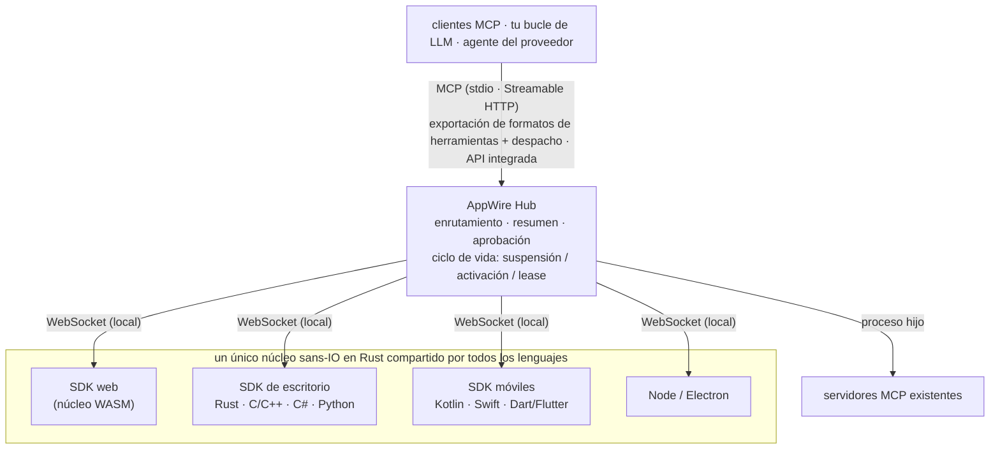

<p align="center">
  <picture>
    <source media="(prefers-color-scheme: dark)" srcset="assets/logo/appwire-logo-dark.png">
    
  </picture>
</p>

# AppWire — convierte cualquier app en herramientas MCP para agentes de IA

[](#licencia)
[](https://modelcontextprotocol.io)
[](https://github.com/stareing/appwire)

[English](../README.md) · [简体中文](README.zh-CN.md) · [繁體中文](README.zh-TW.md) · [日本語](README.ja.md) · [한국어](README.ko.md) · **Español** · [Português (Brasil)](README.pt-BR.md) · [Français](README.fr.md) · [Deutsch](README.de.md) · [Русский](README.ru.md) · [Italiano](README.it.md)

**AppWire es un SDK y un hub local de código abierto para [MCP (Model Context Protocol)](https://modelcontextprotocol.io)
que expone las acciones reales de apps web, de escritorio y móviles como herramientas para agentes de IA** —
Claude, ChatGPT, Gemini, Claude Code o tu propio bucle de LLM. Declara una herramienta junto al código que
ya hace el trabajo (un hook de React, un atributo HTML, un comentario de documentación, una función de Kotlin
o Swift) y cualquier cliente MCP podrá llamarla. No necesitas escribir un servidor MCP para cada app. Sin
scraping de pantalla, sin computer use, sin automatización del navegador.

- **Un SDK por plataforma, un único núcleo en Rust:** React, HTML puro, Node, Electron, Tauri, Rust, C/C++,
  C# (WPF, WinUI), Kotlin/Android, Swift (iOS, macOS), Python (Qt, Tk), Dart/Flutter.
- **Un solo hub para todas las apps del dispositivo:** habla MCP (stdio, Streamable HTTP) y exporta los formatos
  de llamadas a herramientas (function calling) de OpenAI, Anthropic y Gemini, o se integra en tu propio agente.
- **Estándares de entrada, estándares de salida:** consume y genera WebMCP, Apple App Intents, Android
  AppFunctions y Windows App Actions; agrega servidores MCP existentes.
- **Seguro por defecto:** niveles de riesgo por herramienta y aprobación humana para pagos y acciones destructivas.

> **Todo es una herramienta.**
> Las apps son capacidades. Las interfaces son declaraciones. Una llamada es un despertar.

> El proyecto se desarrolló con el nombre provisional **app-mcp**; los nombres de paquetes, crates y binarios
> (`@app-mcp/*`, `app-mcp-*`, `app-mcp-host`) todavía lo usan.

## Contenido

[Vistazo rápido](#un-vistazo-rápido) · [Instalación](#instalación) · [Pruébalo](#pruébalo) ·
[Plataformas](#plataformas-y-paquetes) · [Cómo funciona](#cómo-funciona) ·
[Comparación](#comparación-con-otros-enfoques) · [Filosofía](#filosofía) · [Preguntas frecuentes](#preguntas-frecuentes) ·
[Documentación](#documentación)

## Un vistazo rápido

**React** — una herramienta que solo existe mientras el componente está montado

```tsx
useTool('cart.checkout', {
  description: 'Pagar el carrito actual',
  risk: 'payment',
  input: z.object({ addressId: z.string() }),
  handler: ({ addressId }) => checkout(addressId),
})
```

**HTML puro** — no requiere JavaScript

```html
<button data-mcp-tool="cart.clear" data-mcp-desc="Vaciar el carrito">Vaciar</button>
```

**Un comentario de documentación** (con `@app-mcp/build`) — herramientas generadas en tiempo de compilación

```ts
/** Estima los días de entrega para una ciudad. @mcp */
export function deliveryEstimate(city: string, express?: boolean) { … }
```

**Tu propio bucle de LLM** (Hub integrado, Node) — una sola llamada para exportar las herramientas de todas las apps

```ts
const hub = await Hub.start({})
const tools = hub.exportTools('anthropic')            // o 'openai-chat', 'openai-responses', 'gemini', 'mcp'
const results = await handleAnthropicToolUses(hub, response.content)
```

## Instalación

Los paquetes se publicarán con la primera versión; mientras tanto, compila desde el código fuente como se
muestra en [Pruébalo](#pruébalo).

```bash
# Web
npm install @app-mcp/web @app-mcp/react        # también: @app-mcp/dom, @app-mcp/store, @app-mcp/build
# Node / Electron
npm install @app-mcp/node @app-mcp/electron
# Integrar el hub en un agente de Node (LangChain.js, Vercel AI SDK, OpenAI / Anthropic SDK)
npm install @app-mcp/hub
# Rust / Tauri v2
cargo add app-mcp-native                       # Tauri: tauri-plugin-app-mcp + @app-mcp/tauri
# El hub local (servidor MCP para Claude Code, Claude Desktop, Cursor y otros clientes MCP)
cargo install app-mcp-host
```

Los SDK nativos para C/C++, C#, Kotlin, Swift, Python y Dart están en [`sdks/`](../sdks) y
[`bindings/`](../bindings); cada uno tiene sus propias instrucciones de compilación.

## Pruébalo

```bash
# compila el Host y ejecútalo como servicio residente (un solo proceso atiende a todos los clientes MCP)
cargo build -p app-mcp-host
target/debug/app-mcp-host serve            # o: app-mcp-host service install  (inicio al iniciar sesión)
target/debug/app-mcp-host status           # resumen de una línea
target/debug/app-mcp-host doctor           # ¿algo falla? cada comprobación da un diagnóstico y una solución

# ejecuta la tienda de demostración y ábrela en el navegador
pnpm --filter @app-mcp/example-shop dev
```

El Host sirve todo en un único puerto, `127.0.0.1:7717`: las apps web se conectan a `/app` (WebSocket),
los clientes MCP usan Streamable HTTP en `http://127.0.0.1:7717/mcp` y `/healthz` informa la identidad del
Host. Las apps nativas se conectan mediante un socket local por usuario (socket de dominio Unix / named pipe
de Windows), que también sirve MCP para los agentes que hablan HTTP sobre sockets locales. Un archivo de bloqueo
garantiza un solo Host por usuario, y los endpoints reales se registran en `~/.app-mcp/run/endpoints.json`.

El `.mcp.json` de este repositorio apunta Claude Code a ese endpoint; reinicia la sesión, abre la página
de demostración y pídele a Claude que opere la tienda. Cualquier otro cliente MCP funciona de la misma manera:

```json
{ "mcpServers": { "appwire": { "type": "http", "url": "http://127.0.0.1:7717/mcp" } } }
```

Cuando algo no se conecta, `app-mcp-host doctor` revisa el Host, el bloqueo, los permisos del socket local,
qué proceso ocupa el puerto, los rangos de puertos excluidos de Windows, el modo del token, `adb reverse`,
y el estado y el último error de cada app; los estados del SDK incluyen códigos de error legibles por máquina
(`spec/protocol.md` §10). Consulta [`crates/host/README.md`](../crates/host/README.md) para la configuración,
el token de acceso y otros clientes MCP.

## Plataformas y paquetes

| Dónde | Paquete | Notas |
|---|---|---|
| Web | `@app-mcp/web`, `@app-mcp/react`, `@app-mcp/dom`, `@app-mcp/store`, `@app-mcp/build` | núcleo WASM; polyfill/puente de WebMCP; atributos HTML; Zustand / Redux / Pinia; `@mcp` en tiempo de compilación |
| Node / Electron | `@app-mcp/node`, `@app-mcp/electron` | proceso principal + puente con el renderer |
| Rust (Tauri, egui…) | `crates/native` | dependencia directa |
| Tauri v2 | `crates/tauri-plugin`, `@app-mcp/tauri` | plugin: herramientas en Rust + páginas del webview mediante Tauri IPC (`@app-mcp/web` sin cambios) |
| C / C++ | `bindings/c`, `sdks/cpp` | ABI de C estable (`app_mcp.h`) |
| C# (WPF, WinUI) | `sdks/dotnet` | P/Invoke; utilidades de instancia única y activación por protocolo |
| Kotlin / Android | `sdks/kotlin` | corrutinas; `WakeReceiver` + WorkManager acelerado (expedited) |
| Swift (iOS, macOS) | `sdks/swift` | async/await; modificador de ciclo de vida de SwiftUI |
| Python | `sdks/python` | handlers síncronos o con asyncio; dispatchers de Qt / Tk; activación por D-Bus |
| Dart / Flutter | `sdks/dart` | dart:ffi; integración con `AppLifecycleListener` |
| Intents nativos | `crates/codegen` | genera App Intents, AppFunctions, Windows App Actions e interfaces tipadas |
| Agentes / proveedores | `crates/hub`, `@app-mcp/hub`, `bindings/hub-c`, `bindings/hub-uniffi` | Hub integrable para Rust, Node, C/C#, Kotlin, Swift, Python |

## Cómo funciona



- **Los SDK de las apps** registran herramientas y recursos; un único núcleo en Rust (`crates/core`)
  implementa el protocolo, así que el comportamiento es idéntico en todos los lenguajes.
- **El Hub** (`crates/hub`) agrega apps y servidores MCP upstream, enruta las llamadas a la instancia
  correcta, adjunta un breve resumen de la app en el primer contacto, aplica las aprobaciones y activa las
  apps suspendidas. `app-mcp-host` es su interfaz de línea de comandos.
- **Los manifiestos estáticos** (`app-mcp.json`) permiten que el Hub liste las herramientas de una app y la
  active incluso cuando la app no se está ejecutando.

## Comparación con otros enfoques

| Enfoque | Qué ve el modelo | Funciona con la app cerrada | Plataformas | Aprobación |
|---|---|---|---|---|
| Computer use / agentes de pantalla | capturas de pantalla, píxeles | no | escritorio | ninguna integrada |
| Automatización del navegador (p. ej., Playwright MCP) | DOM / árbol de accesibilidad | no | web | ninguna integrada |
| Un servidor MCP escrito a mano para cada app | herramientas, mantenidas por separado de la app | depende | una por servidor | por servidor |
| WebMCP | herramientas declaradas por la página | no | solo navegador | aviso del navegador |
| App Intents / AppFunctions / App Actions | intents del sistema | sí | un SO cada uno | a nivel del SO |
| **AppWire** | **herramientas declaradas en el propio código de la app** | **sí (manifiesto + activación)** | **web, escritorio, móvil** | **niveles de riesgo por herramienta** |

AppWire no reemplaza estos estándares: lee y genera WebMCP, App Intents, AppFunctions y Windows App
Actions, y puede agregar servidores MCP existentes detrás del mismo Hub.

## Filosofía

Unix dice que *todo es un archivo*: dispositivos, pipes y procesos comparten una misma interfaz — `open`,
`read`, `write`. Los sistemas de plugins dicen que *todo es un plugin*: las funcionalidades son código que
se carga en un host.

AppWire dice que **todo es una herramienta**. Un botón, un formulario, un comando de menú, una acción de un
store, una capacidad del SO, un servidor MCP existente: cada uno se expresa de la misma forma, con un nombre,
un esquema de entrada, un nivel de riesgo y un handler. Un modelo solo necesita tres verbos: **listar, llamar,
leer** (list, call, read).

Un plugin mueve código *hacia* el host. Una herramienta es lo contrario: el código se queda en la app, la app
declara lo que puede hacer y el modelo orquesta.

### Ocho principios

1. **Declara donde vive la acción.** Las capacidades se declaran donde ya están: un hook de React, un atributo
   HTML, un comentario de documentación, un store de estado, un `ToolSpec` nativo. No hay una segunda
   descripción que mantener; cuando cambia el código, cambia la herramienta.
2. **Declarar, no analizar.** Sin capturas de pantalla, sin scraping del DOM, sin adivinar qué botón se puede
   pulsar. La app indica lo que puede hacer; el modelo recibe intención, no píxeles. La inspección de la UI
   (`@app-mcp/inspect`) es solo un recurso alternativo opcional.
3. **Las herramientas nacen y mueren con la interfaz.** Abre una pestaña y aparecen sus herramientas; ciérrala
   y desaparecen; un carrito vacío no tiene `checkout`. El modelo siempre ve lo que se puede hacer *ahora*.
4. **Dormir en reposo, despertar al ser llamado.** Las apps inactivas cierran su conexión y liberan hilos; nada
   mantiene un proceso fijado en memoria. Cuando se necesita, el Hub despierta la app mediante el mecanismo de
   activación nativo de la plataforma y la reanuda en un solo viaje de ida y vuelta. Una conexión es un medio,
   nunca una carga.
5. **Un hub, todos los endpoints.** Un único Hub atiende apps web, de escritorio y móviles, y habla los formatos
   de herramientas de MCP, OpenAI, Anthropic y Gemini, o se integra directamente en el agente propio de un
   proveedor. Integra una vez, úsalo en todas partes.
6. **Compatible y, por lo tanto, un superconjunto.** WebMCP, App Intents, AppFunctions y Windows App Actions
   pueden consumirse y generarse. No competimos con los estándares; los conectamos.
7. **Describir no es autorizar.** Un resumen le dice al modelo para qué sirve una app; no concede nada. Los
   niveles de riesgo y las aprobaciones deciden qué se ejecuta: el control sigue en manos de las personas.
8. **Arréglalo en el origen.** Resuelve un problema en la capa donde se origina. Nada de procesos de reenvío,
   scripts envoltorio, monkeypatches ni conversiones de respaldo para disimularlo.

## Preguntas frecuentes

**¿Cómo convierto mi app de React en un servidor MCP?**
Agrega `@app-mcp/react`, envuelve en `useTool` las acciones que quieras exponer y ejecuta `app-mcp-host`.
La página se conecta al Hub local, y todos los clientes MCP conectados al Hub ven las herramientas mientras
el componente está montado. Las páginas sin framework pueden usar en su lugar los atributos `data-mcp-*` con
`@app-mcp/dom`.

**¿Cómo permito que Claude (o ChatGPT, Gemini, Cursor) controle una app de escritorio o móvil?**
Registra las herramientas con el SDK de tu plataforma (Electron, Tauri, C#, Kotlin, Swift, Python,
Flutter…) y apunta el cliente MCP a `http://127.0.0.1:7717/mcp`. Durante el desarrollo, las apps de Android
llegan al Hub mediante `adb reverse`.

**¿Tengo que escribir un servidor MCP distinto para cada app?**
No. Las apps se registran en un único Hub local, y el Hub es el único servidor MCP con el que hablan todos
los clientes. Los servidores MCP existentes pueden añadirse detrás del mismo Hub como upstreams.

**¿Puedo usarlo sin MCP, en mi propio agente?**
Sí. Integra el Hub (Rust, Node, C/C#, Kotlin, Swift, Python), exporta las herramientas en formato de OpenAI,
Anthropic o Gemini y despacha las llamadas a herramientas del modelo de vuelta a través del Hub. Consulta
[`spec/hub-api.md`](../spec/hub-api.md).

**¿En qué se diferencia de computer use o de la automatización del navegador?**
Esos enfoques hacen que el modelo lea la pantalla y adivine dónde hacer clic. Con AppWire, la app declara sus
acciones con esquemas de entrada tipados, así que las llamadas son precisas, rápidas y funcionan aunque la
ventana esté oculta, o incluso cuando la app no se está ejecutando (se activa bajo demanda).

**¿Es seguro dejar que un modelo llame a las acciones de una app?**
Cada herramienta tiene un nivel de riesgo (`read`, `write`, `destructive`, `payment`, `os-sensitive`); las
llamadas riesgosas requieren aprobación humana en el Hub, y el resumen de una app nunca concede permisos por
sí solo.

**¿Funciona con WebMCP?**
Sí. `@app-mcp/web/webmcp` implementa la API `modelContext` de WebMCP como polyfill y hace de puente, de modo
que las páginas escritas según el estándar también se exponen a través del Hub.

## Documentación

| Documento | Contenido |
|---|---|
| [`spec/protocol.md`](../spec/protocol.md) | protocolo SDK ↔ Hub (referencia oficial) |
| [`spec/manifest.md`](../spec/manifest.md) | manifiesto estático `app-mcp.json` |
| [`spec/lifecycle.md`](../spec/lifecycle.md) | ciclo de vida de la app: suspensión, activación, lease, reanudación rápida |
| [`spec/hub-api.md`](../spec/hub-api.md) | API del Hub integrable y bindings |
| [`crates/host/README.md`](../crates/host/README.md) | configuración del Host, token de acceso, clientes MCP |
| [`llms.txt`](../llms.txt) | resumen del proyecto para LLM y búsqueda con IA |
| [`app-mcp-plan.md`](../app-mcp-plan.md) | diseño completo y hoja de ruta (en chino) |
| [`TASKS.md`](../TASKS.md) | estado actual (en chino) |

Otros idiomas: [English](../README.md) · [简体中文](README.zh-CN.md) · [繁體中文](README.zh-TW.md) · [日本語](README.ja.md) · [한국어](README.ko.md) · [Português (Brasil)](README.pt-BR.md) · [Français](README.fr.md) · [Deutsch](README.de.md) · [Русский](README.ru.md) · [Italiano](README.it.md)

## Estado

Prototipo (hitos M1–M2). El protocolo, el núcleo, el Hub y los SDK de todos los lenguajes están implementados
y probados en Linux y Windows, con una ejecución en un dispositivo Android; las plataformas de Apple solo se han
verificado en Linux. Las API todavía pueden cambiar. Los issues y pull requests son bienvenidos.

## Licencia

Con licencia [Apache License 2.0](../LICENSE-APACHE) o [MIT](../LICENSE-MIT), a tu elección.
