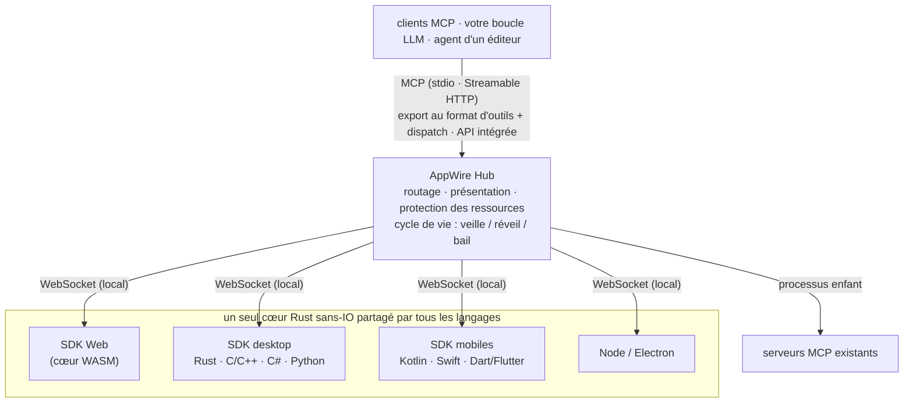

<p align="center">
  <picture>
    <source media="(prefers-color-scheme: dark)" srcset="assets/logo/appwire-logo-dark.png">
    
  </picture>
</p>

# AppWire — transformez n'importe quelle application en outils MCP pour les agents IA

[](#licence)
[](https://modelcontextprotocol.io)
[](https://github.com/stareing/appwire)

[English](../README.md) · [简体中文](README.zh-CN.md) · [繁體中文](README.zh-TW.md) · [日本語](README.ja.md) · [한국어](README.ko.md) · [Español](README.es.md) · [Português (Brasil)](README.pt-BR.md) · **Français** · [Deutsch](README.de.md) · [Русский](README.ru.md) · [Italiano](README.it.md)

**AppWire est un SDK et un hub local open source pour le [MCP (Model Context Protocol)](https://modelcontextprotocol.io),
qui expose les actions réelles des applications web, desktop et mobiles sous forme d'outils pour les agents IA** —
Claude, ChatGPT, Gemini, Claude Code ou votre propre boucle LLM. Déclarez un outil à côté du code qui fait
déjà le travail (un hook React, un attribut HTML, un commentaire de documentation, une fonction Kotlin ou Swift)
et n'importe quel client MCP peut l'appeler. Inutile d'écrire un serveur MCP par application. Pas de scraping
d'écran, pas de computer use, pas d'automatisation de navigateur.

- **Un SDK par plateforme, un seul cœur en Rust :** React, HTML simple, Node, Electron, Tauri, Rust, C/C++,
  C# (WPF, WinUI), Kotlin/Android, Swift (iOS, macOS), Python (Qt, Tk), Dart/Flutter.
- **Un seul hub pour toutes les applications de l'appareil :** il parle MCP (stdio, Streamable HTTP) et exporte
  les formats d'appel d'outils (function calling) d'OpenAI, d'Anthropic et de Gemini, ou s'intègre directement
  dans votre propre agent.
- **Des standards en entrée, des standards en sortie :** il consomme et génère WebMCP, Apple App Intents,
  Android AppFunctions et Windows App Actions, et agrège les serveurs MCP existants.
- **Décrire n'est pas autoriser :** les applications déclarent ce que fait chaque outil (annotations d'outil MCP
  standard : lecture seule, destructif, idempotent, monde ouvert) ; votre agent décide si un appel s'exécute, et
  l'application confirme les étapes à haut risque, comme un paiement, dans sa propre interface. AppWire transmet
  fidèlement les déclarations et protège les applications et l'appareil (limites de débit, de réveils et de taille).

> **Tout est un outil.**
> Les applications sont des capacités. Les interfaces sont des déclarations. Un appel est un réveil.

> Le projet a été développé sous le nom de code **app-mcp** ; les noms des paquets, des crates et des binaires
> (`@app-mcp/*`, `app-mcp-*`, `app-mcp-host`) l'utilisent encore.

## Sommaire

[Aperçu rapide](#aperçu-rapide) · [Installation](#installation) · [Essayer](#essayer) ·
[Plateformes](#plateformes-et-paquets) · [Fonctionnement](#fonctionnement) ·
[Comparaison](#appwire-face-aux-autres-approches) · [Philosophie](#philosophie) · [FAQ](#faq) ·
[Documentation](#documentation)

## Aperçu rapide

**React** — un outil qui n'existe que tant que le composant est monté

```tsx
useTool('cart.checkout', {
  description: 'Valider le panier en cours',
  risk: 'payment',
  input: z.object({ addressId: z.string() }),
  handler: ({ addressId }) => checkout(addressId),
})
```

**HTML simple** — aucun JavaScript nécessaire

```html
<button data-mcp-tool="cart.clear" data-mcp-desc="Vider le panier">Vider</button>
```

**Un commentaire de documentation** (avec `@app-mcp/build`) — outils générés à la compilation

```ts
/** Estimer le délai de livraison en jours pour une ville. @mcp */
export function deliveryEstimate(city: string, express?: boolean) { … }
```

**Votre propre boucle LLM** (Hub intégré, Node) — un seul appel pour exporter les outils de toutes les applications

```ts
const hub = await Hub.start({})
const tools = hub.exportTools('anthropic')            // ou 'openai-chat', 'openai-responses', 'gemini', 'mcp'
const results = await handleAnthropicToolUses(hub, response.content)
```

## Installation

Les paquets seront publiés avec la première version ; d'ici là, compilez depuis les sources comme indiqué dans
[Essayer](#essayer).

```bash
# Web
npm install @app-mcp/web @app-mcp/react        # aussi : @app-mcp/dom, @app-mcp/store, @app-mcp/build
# Node / Electron
npm install @app-mcp/node @app-mcp/electron
# Intégrer le hub dans un agent Node (LangChain.js, Vercel AI SDK, SDK OpenAI / Anthropic)
npm install @app-mcp/hub
# Rust / Tauri v2
cargo add app-mcp-native                       # Tauri : tauri-plugin-app-mcp + @app-mcp/tauri
# Le hub local (serveur MCP pour Claude Code, Claude Desktop, Cursor et les autres clients MCP)
cargo install app-mcp-host
```

Les SDK natifs pour C/C++, C#, Kotlin, Swift, Python et Dart se trouvent dans [`sdks/`](../sdks) et
[`bindings/`](../bindings) ; chacun a ses propres instructions de compilation.

## Essayer

```bash
# compiler le Host et le lancer comme service résident (un seul processus sert tous les clients MCP)
cargo build -p app-mcp-host
target/debug/app-mcp-host serve            # ou : app-mcp-host service install  (démarrage à l'ouverture de session)
target/debug/app-mcp-host status           # résumé sur une ligne
target/debug/app-mcp-host doctor           # un problème ? chaque vérification donne un verdict et un correctif

# lancer la boutique de démo, puis l'ouvrir dans un navigateur
pnpm --filter @app-mcp/example-shop dev
```

Le Host sert tout sur un seul port, `127.0.0.1:7717` : les applications web se connectent à `/app` (WebSocket),
les clients MCP utilisent Streamable HTTP sur `http://127.0.0.1:7717/mcp`, et `/healthz` indique l'identité
du Host. Les applications natives se connectent via un socket local propre à chaque utilisateur (socket de
domaine Unix / named pipe Windows), qui sert aussi MCP aux agents qui parlent HTTP sur des sockets locaux.
Un fichier de verrou garantit un seul Host par utilisateur, et les endpoints effectifs sont enregistrés dans
`~/.app-mcp/run/endpoints.json`.

Le `.mcp.json` de ce dépôt pointe Claude Code vers cet endpoint ; redémarrez la session, ouvrez la page de démo
et demandez à Claude de piloter la boutique. Tout autre client MCP fonctionne de la même façon :

```json
{ "mcpServers": { "appwire": { "type": "http", "url": "http://127.0.0.1:7717/mcp" } } }
```

Si quelque chose ne se connecte pas, `app-mcp-host doctor` vérifie le Host, le verrou, les permissions du socket
local, le processus qui occupe le port, les plages de ports exclues de Windows, le mode de jeton,
`adb reverse`, ainsi que l'état et la dernière erreur de chaque application ; les états du SDK comportent des codes
d'erreur lisibles par machine (`spec/protocol.md` §10). Voir [`crates/host/README.md`](../crates/host/README.md)
pour la configuration, le jeton d'accès et les autres clients MCP.

## Plateformes et paquets

| Cible | Paquet | Remarques |
|---|---|---|
| Web | `@app-mcp/web`, `@app-mcp/react`, `@app-mcp/dom`, `@app-mcp/store`, `@app-mcp/build` | cœur WASM ; polyfill/pont WebMCP ; attributs HTML ; Zustand / Redux / Pinia ; `@mcp` à la compilation |
| Node / Electron | `@app-mcp/node`, `@app-mcp/electron` | processus principal + pont vers le renderer |
| Rust (Tauri, egui…) | `crates/native` | dépendance directe |
| Tauri v2 | `crates/tauri-plugin`, `@app-mcp/tauri` | plugin : outils Rust + pages de la webview via l'IPC Tauri (`@app-mcp/web` inchangé) |
| C / C++ | `bindings/c`, `sdks/cpp` | ABI C stable (`app_mcp.h`) |
| C# (WPF, WinUI) | `sdks/dotnet` | P/Invoke ; utilitaires d'instance unique et d'activation par protocole |
| Kotlin / Android | `sdks/kotlin` | coroutines ; `WakeReceiver` + WorkManager en mode expedited |
| Swift (iOS, macOS) | `sdks/swift` | async/await ; modificateur de cycle de vie SwiftUI |
| Python | `sdks/python` | handlers synchrones ou asyncio ; dispatchers Qt / Tk ; réveil via D-Bus |
| Dart / Flutter | `sdks/dart` | dart:ffi ; intégration avec `AppLifecycleListener` |
| Intents natifs | `crates/codegen` | génère App Intents, AppFunctions, Windows App Actions et des interfaces typées |
| Agents / éditeurs | `crates/hub`, `@app-mcp/hub`, `bindings/hub-c`, `bindings/hub-uniffi` | Hub intégrable pour Rust, Node, C/C#, Kotlin, Swift, Python |

## Fonctionnement



- **Les SDK applicatifs** enregistrent des outils et des ressources ; un cœur Rust unique (`crates/core`)
  implémente le protocole, si bien que le comportement est identique dans tous les langages.
- **Le Hub** (`crates/hub`) agrège les applications et les serveurs MCP en amont, route les appels vers la bonne
  instance, joint une courte présentation de l'application au premier contact, transmet sans modification ce que
  déclare chaque outil et réveille les applications en veille. Il ne décide pas si un appel peut s'exécuter : c'est
  le rôle de l'agent (un éditeur qui intègre le Hub peut brancher sa propre interface de confirmation via le
  callback facultatif `ApprovalHandler`). `app-mcp-host` en est l'interface en ligne de commande.
- **Les manifestes statiques** (`app-mcp.json`) permettent au Hub de lister les outils d'une application et de
  la réveiller même lorsqu'elle n'est pas lancée.

## AppWire face aux autres approches

| Approche | Ce que voit le modèle | Fonctionne application fermée | Plateformes |
|---|---|---|---|
| Computer use / agents pilotant l'écran | captures d'écran, pixels | non | desktop |
| Automatisation de navigateur (p. ex. Playwright MCP) | DOM / arbre d'accessibilité | non | web |
| Un serveur MCP écrit à la main pour chaque application | outils, maintenus séparément de l'application | ça dépend | un par serveur |
| WebMCP | outils déclarés par la page | non | navigateur uniquement |
| App Intents / AppFunctions / App Actions | intents système | oui | un seul OS chacun |
| **AppWire** | **outils déclarés dans le code même de l'application** | **oui (manifeste + réveil)** | **web, desktop, mobile** |

AppWire ne remplace pas ces standards : il lit et génère WebMCP, App Intents, AppFunctions et
Windows App Actions, et peut agréger des serveurs MCP existants derrière le même Hub.

## Philosophie

Unix dit *tout est fichier* : périphériques, pipes et processus partagent une même interface — `open`, `read`,
`write`. Les systèmes de plugins disent *tout est plugin* : les fonctionnalités sont du code chargé dans un hôte.

AppWire dit **tout est outil**. Un bouton, un formulaire, une commande de menu, une action de store, une capacité
de l'OS, un serveur MCP existant — chacun s'exprime de la même manière : un nom, un schéma d'entrée, un niveau
de risque et un handler. Un modèle n'a besoin que de trois verbes : **lister, appeler, lire** (list, call, read).

Un plugin déplace du code *dans* l'hôte. Un outil fait l'inverse : le code reste dans l'application,
l'application déclare ce qu'elle sait faire, et le modèle orchestre.

### Neuf principes

1. **Déclarer là où vit l'action.** Les capacités sont déclarées là où elles se trouvent déjà — un hook React,
   un attribut HTML, un commentaire de documentation, un store d'état, un `ToolSpec` natif. Pas de seconde
   description à maintenir : quand le code change, l'outil change.
2. **Déclarer, ne pas analyser.** Pas de captures d'écran, pas de scraping du DOM, pas de devinettes sur le bouton
   cliquable. L'application dit ce qu'elle sait faire ; le modèle reçoit une intention, pas des pixels.
   L'inspection de l'UI (`@app-mcp/inspect`) n'est qu'un repli optionnel, à activer explicitement.
3. **Les outils naissent et meurent avec l'interface.** Ouvrez un onglet et ses outils apparaissent ;
   fermez-le et ils disparaissent ; un panier vide n'a pas de `checkout`. Le modèle voit toujours ce qui est
   possible *maintenant*.
4. **Dormir au repos, se réveiller à l'appel.** Les applications inactives coupent leur connexion et libèrent
   leurs threads ; rien ne retient un processus en mémoire. Au besoin, le Hub réveille l'application via le
   mécanisme d'activation natif de la plateforme et reprend en un seul aller-retour. Une connexion est un moyen,
   jamais un fardeau.
5. **Un seul hub, tous les endpoints.** Un seul Hub sert les applications web, desktop et mobiles, et parle les
   formats d'outils MCP, OpenAI, Anthropic et Gemini — ou s'intègre directement dans l'agent d'un éditeur.
   Intégrez une fois, utilisez partout.
6. **Compatible, donc sur-ensemble.** WebMCP, App Intents, AppFunctions et Windows App Actions peuvent tous être
   consommés et générés. Nous ne concurrençons pas les standards ; nous les relions.
7. **Décrire n'est pas autoriser.** Une présentation indique au modèle à quoi sert une application, et les
   annotations d'un outil disent ce qu'il fait ; ni l'une ni les autres n'accordent quoi que ce soit. L'exécution
   d'un appel est décidée par l'agent et son utilisateur ; la confirmation finale d'une action à haut risque, comme
   un paiement, revient à l'application, dans sa propre interface et avec sa propre vérification. AppWire transmet
   fidèlement les déclarations et protège les applications et l'appareil.
8. **Corriger à la source.** Résoudre un problème dans la couche où il naît. Pas de processus de relais, de
   scripts d'enrobage, de monkeypatches ni de conversions de repli pour le masquer.
9. **Chaque action de l'IA est visible ; ce qui est déclaré annulable peut être annulé.** La personne dont un
   agent manipule les applications peut toujours voir ce qu'il a fait, et une action que l'application déclare
   réversible peut être annulée. Pouvoir agir ne suffit pas : l'utilisateur doit pouvoir voir et corriger.

## FAQ

**Comment transformer mon application React en serveur MCP ?**
Ajoutez `@app-mcp/react`, enveloppez les actions à exposer dans `useTool` et lancez `app-mcp-host`.
La page se connecte au Hub local, et tous les clients MCP connectés au Hub voient les outils tant que
le composant est monté. Les pages simples peuvent utiliser à la place les attributs `data-mcp-*` avec `@app-mcp/dom`.

**Comment permettre à Claude (ou ChatGPT, Gemini, Cursor) de piloter une application desktop ou mobile ?**
Enregistrez des outils avec le SDK de votre plateforme (Electron, Tauri, C#, Kotlin, Swift, Python,
Flutter…) et pointez le client MCP vers `http://127.0.0.1:7717/mcp`. Pendant le développement, les applications
Android atteignent le Hub via `adb reverse`.

**Dois-je écrire un serveur MCP distinct pour chaque application ?**
Non. Les applications s'enregistrent auprès d'un seul Hub local, et ce Hub est l'unique serveur MCP auquel parlent
tous les clients. Des serveurs MCP existants peuvent être ajoutés en amont derrière le même Hub.

**Puis-je l'utiliser sans MCP, dans mon propre agent ?**
Oui. Intégrez le Hub (Rust, Node, C/C#, Kotlin, Swift, Python), exportez les outils au format OpenAI, Anthropic ou
Gemini, et renvoyez les appels d'outils du modèle au Hub, qui les dispatche. Voir
[`spec/hub-api.md`](../spec/hub-api.md).

**En quoi est-ce différent du computer use ou de l'automatisation de navigateur ?**
Ces approches obligent le modèle à lire l'écran et à deviner où cliquer. Avec AppWire, l'application
déclare ses actions avec des schémas d'entrée typés : les appels sont donc précis, rapides et fonctionnent même
lorsque la fenêtre est masquée — voire lorsque l'application n'est pas lancée du tout (elle est réveillée à la demande).

**Est-il sûr de laisser un modèle appeler les actions d'une application ?**
AppWire laisse cette décision là où elle doit être prise. Chaque outil déclare ce qu'il fait (sous forme
d'annotations d'outil MCP standard : lecture seule, destructif, idempotent, monde ouvert) et AppWire transmet ces
déclarations à l'agent sans les modifier ; l'agent (Claude Code, Cursor ou votre propre boucle) décide, selon ses
propres réglages de permissions, si un appel s'exécute ou demande votre confirmation. Les étapes à haut risque,
comme un paiement, sont confirmées dans l'application, avec sa propre interface et sa propre vérification (mot de
passe, 3-D Secure, biométrie). La présentation d'une application n'accorde jamais de permissions. Le rôle propre
du Hub est de protéger les applications et l'appareil par des limites de débit, de réveils et de taille.

**Est-ce compatible avec WebMCP ?**
Oui. `@app-mcp/web/webmcp` implémente l'API `modelContext` de WebMCP sous forme de polyfill et la relie au Hub ;
les pages écrites selon le standard sont donc elles aussi exposées via le Hub.

## Documentation

| Document | Contenu |
|---|---|
| [`spec/protocol.md`](../spec/protocol.md) | protocole SDK ↔ Hub (référence) |
| [`spec/manifest.md`](../spec/manifest.md) | manifeste statique `app-mcp.json` |
| [`spec/lifecycle.md`](../spec/lifecycle.md) | cycle de vie des applications : veille, réveil, bail, reprise rapide |
| [`spec/hub-api.md`](../spec/hub-api.md) | API du Hub intégrable et bindings |
| [`crates/host/README.md`](../crates/host/README.md) | configuration du Host, jeton d'accès, clients MCP |
| [`llms.txt`](../llms.txt) | résumé du projet pour les LLM et la recherche IA |
| [`app-mcp-plan.md`](../app-mcp-plan.md) | conception complète et feuille de route (en chinois) |
| [`TASKS.md`](../TASKS.md) | état d'avancement actuel (en chinois) |

Autres langues : [English](../README.md) · [简体中文](README.zh-CN.md) · [繁體中文](README.zh-TW.md) · [日本語](README.ja.md) · [한국어](README.ko.md) · [Español](README.es.md) · [Português (Brasil)](README.pt-BR.md) · [Deutsch](README.de.md) · [Русский](README.ru.md) · [Italiano](README.it.md)

## État du projet

Prototype (jalons M1–M2). Le protocole, le cœur, le Hub et tous les SDK de langage sont implémentés et
testés sous Linux et Windows, avec une exécution sur un appareil Android ; les plateformes Apple ne sont vérifiées
que sous Linux. Les API peuvent encore évoluer. Les issues et pull requests sont les bienvenues.

## Licence

Distribué sous [Apache License 2.0](../LICENSE-APACHE) ou [MIT](../LICENSE-MIT), au choix.
