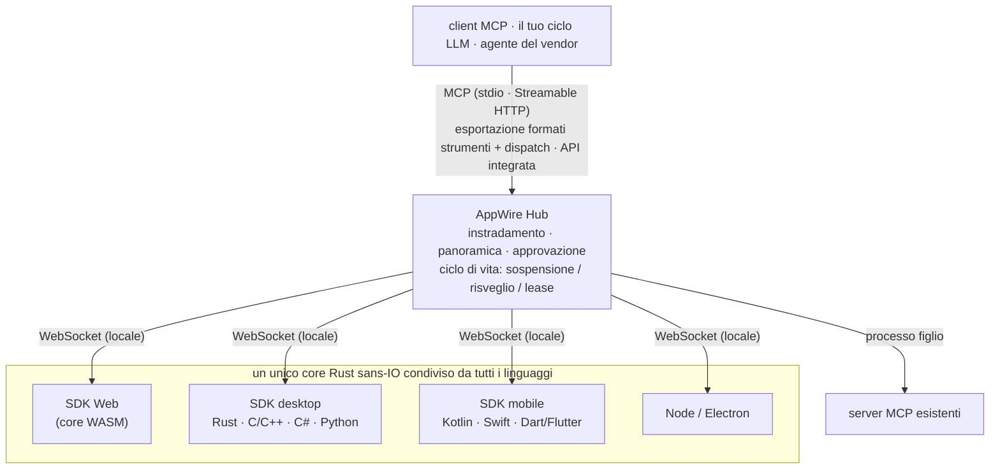

<p align="center">
  <picture>
    <source media="(prefers-color-scheme: dark)" srcset="assets/logo/appwire-logo-dark.png">
    
  </picture>
</p>

# AppWire — trasforma qualsiasi app in strumenti MCP per agenti IA

[](#licenza)
[](https://modelcontextprotocol.io)
[](https://github.com/stareing/appwire)

[English](../README.md) · [简体中文](README.zh-CN.md) · [繁體中文](README.zh-TW.md) · [日本語](README.ja.md) · [한국어](README.ko.md) · [Español](README.es.md) · [Português (Brasil)](README.pt-BR.md) · [Français](README.fr.md) · [Deutsch](README.de.md) · [Русский](README.ru.md) · **Italiano**

**AppWire è un SDK open source per [MCP (Model Context Protocol)](https://modelcontextprotocol.io) e un
hub locale che espone le azioni reali delle app web, desktop e mobile come strumenti per agenti IA** —
Claude, ChatGPT, Gemini, Claude Code o il tuo ciclo LLM personalizzato. Dichiari uno strumento accanto
al codice che già svolge il lavoro (un hook React, un attributo HTML, un commento di documentazione,
una funzione Kotlin o Swift) e qualsiasi client MCP può chiamarlo. Niente server MCP da scrivere per
ogni app, niente screen scraping, niente computer use, niente automazione del browser.

- **Un SDK per piattaforma, un unico core in Rust:** React, HTML semplice, Node, Electron, Tauri, Rust,
  C/C++, C# (WPF, WinUI), Kotlin/Android, Swift (iOS, macOS), Python (Qt, Tk), Dart/Flutter.
- **Un solo hub per tutte le app del dispositivo:** parla MCP (stdio, Streamable HTTP) ed esporta nei
  formati di chiamata di strumenti (function calling) di OpenAI, Anthropic e Gemini, oppure si integra
  nel tuo agente.
- **Standard in ingresso, standard in uscita:** legge e genera WebMCP, Apple App Intents, Android
  AppFunctions e Windows App Actions; aggrega i server MCP esistenti.
- **Sicuro per impostazione predefinita:** livelli di rischio per ogni strumento e approvazione umana
  per pagamenti e azioni distruttive.

> **Tutto è uno strumento.**
> Le app sono capacità. Le interfacce sono dichiarazioni. Una chiamata è un risveglio.

> Il progetto è stato sviluppato con il nome provvisorio **app-mcp**; i nomi di pacchetti, crate e
> binari (`@app-mcp/*`, `app-mcp-*`, `app-mcp-host`) lo usano ancora.

## Indice

[Esempi rapidi](#esempi-rapidi) · [Installazione](#installazione) · [Provalo](#provalo) ·
[Piattaforme](#piattaforme-e-pacchetti) · [Come funziona](#come-funziona) ·
[Confronto](#appwire-a-confronto) · [Filosofia](#filosofia) · [FAQ](#domande-frequenti) ·
[Documentazione](#documentazione)

## Esempi rapidi

**React** — uno strumento che esiste solo finché il componente è montato

```tsx
useTool('cart.checkout', {
  description: 'Completa l\'acquisto del carrello corrente',
  risk: 'payment',
  input: z.object({ addressId: z.string() }),
  handler: ({ addressId }) => checkout(addressId),
})
```

**HTML semplice** — nessun JavaScript necessario

```html
<button data-mcp-tool="cart.clear" data-mcp-desc="Svuota il carrello">Svuota</button>
```

**Un commento di documentazione** (con `@app-mcp/build`) — strumenti generati in fase di compilazione

```ts
/** Stima i giorni di consegna per una città. @mcp */
export function deliveryEstimate(city: string, express?: boolean) { … }
```

**Il tuo ciclo LLM** (Hub integrato, Node) — una sola chiamata per esportare gli strumenti di tutte le app

```ts
const hub = await Hub.start({})
const tools = hub.exportTools('anthropic')            // oppure 'openai-chat', 'openai-responses', 'gemini', 'mcp'
const results = await handleAnthropicToolUses(hub, response.content)
```

## Installazione

I pacchetti verranno pubblicati con la prima release; fino ad allora, compila dai sorgenti come
mostrato in [Provalo](#provalo).

```bash
# Web
npm install @app-mcp/web @app-mcp/react        # inoltre: @app-mcp/dom, @app-mcp/store, @app-mcp/build
# Node / Electron
npm install @app-mcp/node @app-mcp/electron
# Integrare l'hub in un agente Node (LangChain.js, Vercel AI SDK, SDK OpenAI / Anthropic)
npm install @app-mcp/hub
# Rust / Tauri v2
cargo add app-mcp-native                       # Tauri: tauri-plugin-app-mcp + @app-mcp/tauri
# L'hub locale (server MCP per Claude Code, Claude Desktop, Cursor e altri client MCP)
cargo install app-mcp-host
```

Gli SDK nativi per C/C++, C#, Kotlin, Swift, Python e Dart si trovano in [`sdks/`](../sdks) e
[`bindings/`](../bindings); ognuno ha le proprie istruzioni di compilazione.

## Provalo

```bash
# compila l'Host e avvialo come servizio residente (un solo processo serve tutti i client MCP)
cargo build -p app-mcp-host
target/debug/app-mcp-host serve            # oppure: app-mcp-host service install  (avvio al login)
target/debug/app-mcp-host status           # riepilogo in una riga
target/debug/app-mcp-host doctor           # qualcosa non va? ogni controllo dà un esito e una soluzione

# avvia il negozio demo, poi aprilo nel browser
pnpm --filter @app-mcp/example-shop dev
```

L'Host serve tutto su un'unica porta, `127.0.0.1:7717`: le app web si connettono a `/app` (WebSocket),
i client MCP usano Streamable HTTP su `http://127.0.0.1:7717/mcp` e `/healthz` riporta l'identità
dell'Host. Le app native si connettono tramite un socket locale per utente (socket di dominio Unix /
named pipe di Windows), che serve MCP anche agli agenti che parlano HTTP su socket locali. Un file di
lock garantisce un solo Host per utente, e gli endpoint effettivi sono registrati in
`~/.app-mcp/run/endpoints.json`.

Il file `.mcp.json` di questo repository punta Claude Code a quell'endpoint: riavvia la sessione,
apri la pagina demo e chiedi a Claude di gestire il negozio. Qualsiasi altro client MCP funziona allo
stesso modo:

```json
{ "mcpServers": { "appwire": { "type": "http", "url": "http://127.0.0.1:7717/mcp" } } }
```

Quando qualcosa non si connette, `app-mcp-host doctor` controlla l'Host, il lock, i permessi del
socket locale, quale processo occupa la porta, gli intervalli di porte esclusi di Windows, la modalità
del token, `adb reverse`, e lo stato e l'ultimo errore di ogni app; gli stati degli SDK riportano codici
di errore leggibili dalle macchine (`spec/protocol.md` §10). Consulta
[`crates/host/README.md`](../crates/host/README.md) per la configurazione, il token di accesso e gli
altri client MCP.

## Piattaforme e pacchetti

| Dove | Pacchetto | Note |
|---|---|---|
| Web | `@app-mcp/web`, `@app-mcp/react`, `@app-mcp/dom`, `@app-mcp/store`, `@app-mcp/build` | core WASM; polyfill/bridge WebMCP; attributi HTML; Zustand / Redux / Pinia; `@mcp` in fase di compilazione |
| Node / Electron | `@app-mcp/node`, `@app-mcp/electron` | processo principale + bridge del renderer |
| Rust (Tauri, egui…) | `crates/native` | dipendenza diretta |
| Tauri v2 | `crates/tauri-plugin`, `@app-mcp/tauri` | plugin: strumenti Rust + pagine webview tramite Tauri IPC (`@app-mcp/web` invariato) |
| C / C++ | `bindings/c`, `sdks/cpp` | ABI C stabile (`app_mcp.h`) |
| C# (WPF, WinUI) | `sdks/dotnet` | P/Invoke; helper per istanza singola e attivazione tramite protocollo |
| Kotlin / Android | `sdks/kotlin` | coroutine; `WakeReceiver` + WorkManager expedited |
| Swift (iOS, macOS) | `sdks/swift` | async/await; modificatore di ciclo di vita SwiftUI |
| Python | `sdks/python` | handler sincroni o asyncio; dispatcher Qt / Tk; risveglio via D-Bus |
| Dart / Flutter | `sdks/dart` | dart:ffi; integrazione con `AppLifecycleListener` |
| Intent nativi | `crates/codegen` | genera App Intents, AppFunctions, Windows App Actions e interfacce tipizzate |
| Agenti / vendor | `crates/hub`, `@app-mcp/hub`, `bindings/hub-c`, `bindings/hub-uniffi` | Hub integrabile per Rust, Node, C/C#, Kotlin, Swift, Python |

## Come funziona



- **Gli SDK per le app** registrano strumenti e risorse; un unico core in Rust (`crates/core`)
  implementa il protocollo, quindi il comportamento è identico in ogni linguaggio.
- **L'Hub** (`crates/hub`) aggrega le app e i server MCP upstream, instrada le chiamate all'istanza
  giusta, allega una breve panoramica dell'app al primo contatto, impone le approvazioni e risveglia
  le app sospese. `app-mcp-host` è il suo front-end a riga di comando.
- **I manifest statici** (`app-mcp.json`) permettono all'Hub di elencare gli strumenti di un'app e di
  risvegliarla anche quando l'app non è in esecuzione.

## AppWire a confronto

| Approccio | Cosa vede il modello | Funziona ad app chiusa | Piattaforme | Approvazione |
|---|---|---|---|---|
| Computer use / agenti basati sullo schermo | screenshot, pixel | no | desktop | nessuna integrata |
| Automazione del browser (es. Playwright MCP) | DOM / albero di accessibilità | no | web | nessuna integrata |
| Un server MCP scritto a mano per ogni app | strumenti, mantenuti separatamente dall'app | dipende | una per server | per server |
| WebMCP | strumenti dichiarati dalla pagina | no | solo browser | richiesta del browser |
| App Intents / AppFunctions / App Actions | intent di sistema | sì | un solo OS ciascuno | a livello di OS |
| **AppWire** | **strumenti dichiarati nel codice dell'app stessa** | **sì (manifest + risveglio)** | **web, desktop, mobile** | **livelli di rischio per strumento** |

AppWire non sostituisce questi standard: legge e genera WebMCP, App Intents, AppFunctions e Windows
App Actions, e può aggregare i server MCP esistenti dietro lo stesso Hub.

## Filosofia

Unix dice *tutto è un file*: dispositivi, pipe e processi condividono un'unica interfaccia — `open`,
`read`, `write`. I sistemi a plugin dicono *tutto è un plugin*: le funzionalità sono codice caricato
in un host.

AppWire dice **tutto è uno strumento**. Un pulsante, un modulo, un comando di menu, un'azione dello
store, una capacità del sistema operativo, un server MCP esistente — ognuno si esprime allo stesso
modo: un nome, uno schema di input, un livello di rischio e un handler. Al modello servono solo tre
verbi: **elencare, chiamare, leggere** (list, call, read).

Un plugin sposta il codice *dentro* l'host. Uno strumento è l'opposto: il codice resta nell'app, l'app
dichiara cosa sa fare e il modello orchestra.

### Otto principi

1. **Dichiara dove vive l'azione.** Le capacità si dichiarano dove già si trovano — un hook React, un
   attributo HTML, un commento di documentazione, uno store di stato, un `ToolSpec` nativo. Nessuna
   seconda descrizione da mantenere: quando cambia il codice, cambia lo strumento.
2. **Dichiara, non interpretare.** Niente screenshot, niente scraping del DOM, nessun tentativo di
   indovinare quale pulsante sia cliccabile. L'app dichiara cosa sa fare; il modello riceve
   intenzioni, non pixel. L'ispezione della UI (`@app-mcp/inspect`) è solo un fallback opzionale.
3. **Gli strumenti nascono e muoiono con l'interfaccia.** Apri una scheda e i suoi strumenti
   compaiono; chiudila e scompaiono; un carrello vuoto non ha `checkout`. Il modello vede sempre ciò
   che si può fare *adesso*.
4. **Dormi quando sei inattivo, svegliati quando vieni chiamato.** Le app inattive chiudono la
   connessione e rilasciano i thread; nulla tiene un processo bloccato in memoria. Quando serve,
   l'Hub risveglia l'app tramite il meccanismo di attivazione nativo della piattaforma e riprende in un
   solo round trip. Una connessione è un mezzo, mai un peso.
5. **Un solo hub, ogni endpoint.** Un unico Hub serve app web, desktop e mobile e parla i formati di
   strumenti di MCP, OpenAI, Anthropic e Gemini — oppure si integra direttamente nell'agente di un
   vendor. Integri una volta, usi ovunque.
6. **Compatibile, quindi un sovrainsieme.** WebMCP, App Intents, AppFunctions e Windows App Actions
   possono essere tutti letti e generati. Non facciamo concorrenza agli standard: li colleghiamo.
7. **Descrivere non significa autorizzare.** Una panoramica dice al modello a cosa serve un'app; non
   concede nulla. Sono i livelli di rischio e le approvazioni a decidere cosa viene eseguito — il
   controllo resta all'utente.
8. **Correggi alla fonte.** Risolvi un problema nel livello in cui nasce. Niente processi di inoltro,
   script wrapper, monkeypatch o conversioni di fallback per nasconderlo.

## Domande frequenti

**Come trasformo la mia app React in un server MCP?**
Aggiungi `@app-mcp/react`, racchiudi in `useTool` le azioni che vuoi esporre ed esegui
`app-mcp-host`. La pagina si connette all'Hub locale e ogni client MCP connesso all'Hub vede gli
strumenti finché il componente è montato. Le pagine semplici possono invece usare gli attributi
`data-mcp-*` con `@app-mcp/dom`.

**Come faccio a far controllare un'app desktop o mobile a Claude (o ChatGPT, Gemini, Cursor)?**
Registra gli strumenti con l'SDK della tua piattaforma (Electron, Tauri, C#, Kotlin, Swift, Python,
Flutter…) e punta il client MCP a `http://127.0.0.1:7717/mcp`. Durante lo sviluppo, le app Android
raggiungono l'Hub tramite `adb reverse`.

**Devo scrivere un server MCP separato per ogni app?**
No. Le app si registrano presso un unico Hub locale, e l'Hub è l'unico server MCP con cui parlano
tutti i client. I server MCP esistenti possono essere aggiunti dietro lo stesso Hub come upstream.

**Posso usarlo senza MCP, nel mio agente?**
Sì. Integra l'Hub (Rust, Node, C/C#, Kotlin, Swift, Python), esporta gli strumenti in formato OpenAI,
Anthropic o Gemini e inoltra le chiamate di strumenti del modello tramite l'Hub. Vedi
[`spec/hub-api.md`](../spec/hub-api.md).

**In cosa si differenzia dal computer use o dall'automazione del browser?**
Questi approcci costringono il modello a leggere lo schermo e a indovinare dove cliccare. Con AppWire
è l'app a dichiarare le proprie azioni con schemi di input tipizzati, quindi le chiamate sono precise,
veloci e funzionano anche quando la finestra è nascosta — o quando l'app non è affatto in esecuzione
(viene risvegliata su richiesta).

**È sicuro lasciare che un modello chiami le azioni di un'app?**
Ogni strumento ha un livello di rischio (`read`, `write`, `destructive`, `payment`, `os-sensitive`);
le chiamate rischiose richiedono l'approvazione umana nell'Hub, e una panoramica dell'app non concede
mai permessi di per sé.

**Funziona con WebMCP?**
Sì. `@app-mcp/web/webmcp` implementa l'API `modelContext` di WebMCP come polyfill e la collega
all'Hub, quindi anche le pagine scritte secondo lo standard vengono esposte tramite l'Hub.

## Documentazione

| Documento | Contenuto |
|---|---|
| [`spec/protocol.md`](../spec/protocol.md) | protocollo SDK ↔ Hub (riferimento ufficiale) |
| [`spec/manifest.md`](../spec/manifest.md) | manifest statico `app-mcp.json` |
| [`spec/lifecycle.md`](../spec/lifecycle.md) | ciclo di vita delle app: sospensione, risveglio, lease, ripresa rapida |
| [`spec/hub-api.md`](../spec/hub-api.md) | API dell'Hub integrabile e binding |
| [`crates/host/README.md`](../crates/host/README.md) | configurazione dell'Host, token di accesso, client MCP |
| [`llms.txt`](../llms.txt) | riepilogo del progetto per LLM e ricerca IA |
| [`app-mcp-plan.md`](../app-mcp-plan.md) | progettazione completa e roadmap (in cinese) |
| [`TASKS.md`](../TASKS.md) | stato attuale (in cinese) |

Altre lingue: [English](../README.md) · [简体中文](README.zh-CN.md) · [繁體中文](README.zh-TW.md) · [日本語](README.ja.md) · [한국어](README.ko.md) · [Español](README.es.md) · [Português (Brasil)](README.pt-BR.md) · [Français](README.fr.md) · [Deutsch](README.de.md) · [Русский](README.ru.md)

## Stato

Prototipo (milestone M1–M2). Il protocollo, il core, l'Hub e tutti gli SDK per i vari linguaggi sono
implementati e testati su Linux e Windows, con un'esecuzione su dispositivo Android; le piattaforme
Apple sono verificate solo su Linux. Le API potrebbero ancora cambiare. Issue e pull request sono
benvenute.

## Licenza

Distribuito, a tua scelta, sotto [Apache License 2.0](../LICENSE-APACHE) oppure [MIT](../LICENSE-MIT).
