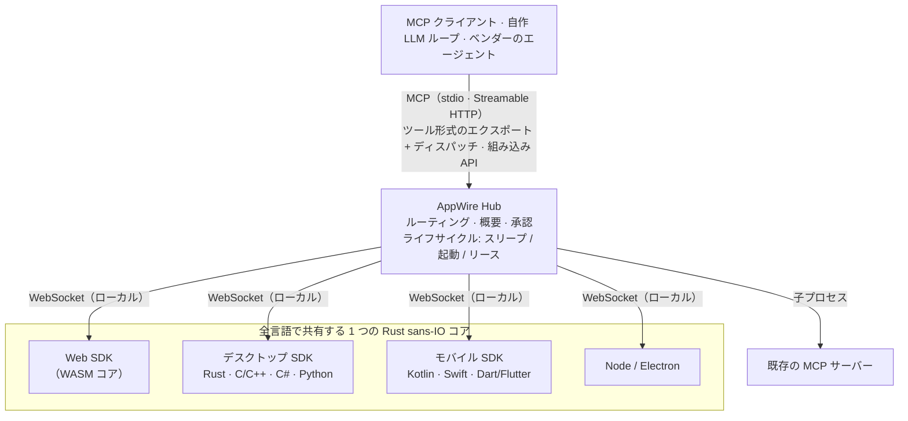

# AppWire — あらゆるアプリを AI エージェント向けの MCP ツールに

[](#ライセンス)
[](https://modelcontextprotocol.io)
[](https://github.com/stareing/appwire)

[English](../README.md) · [简体中文](README.zh-CN.md) · [繁體中文](README.zh-TW.md) · **日本語** · [한국어](README.ko.md) · [Español](README.es.md) · [Português (Brasil)](README.pt-BR.md) · [Français](README.fr.md) · [Deutsch](README.de.md) · [Русский](README.ru.md) · [Italiano](README.it.md)

**AppWire は、Web・デスクトップ・モバイルアプリの実際の操作を AI エージェントから呼び出せるツールとして公開する、
オープンソースの [MCP（Model Context Protocol）](https://modelcontextprotocol.io) SDK とローカルハブです。**
Claude、ChatGPT、Gemini、Claude Code、あるいは自作の LLM ループから利用できます。ツールは、すでに処理を
担っているコードのすぐ隣（React フック、HTML 属性、ドキュメントコメント、Kotlin / Swift の関数）で宣言するだけで、
あらゆる MCP クライアントから呼び出せるようになります。アプリごとに MCP サーバーを書く必要はありません。
画面のスクレイピングも、computer use も、ブラウザ自動化も不要です。

- **プラットフォームごとに 1 つの SDK、共通の Rust コア:** React、素の HTML、Node、Electron、Tauri、Rust、C/C++、
  C#（WPF、WinUI）、Kotlin / Android、Swift（iOS、macOS）、Python（Qt、Tk）、Dart / Flutter。
- **端末上のすべてのアプリを 1 つのハブで:** MCP（stdio、Streamable HTTP）で通信し、OpenAI・Anthropic・Gemini の
  ツール呼び出し（function calling）形式でもエクスポートできます。自作のエージェントへの組み込みも可能です。
- **標準を取り込み、標準を出力:** WebMCP、Apple App Intents、Android AppFunctions、Windows App Actions を
  読み込み・生成でき、既存の MCP サーバーも集約できます。
- **デフォルトで安全:** ツールごとにリスクレベルを設定でき、決済や破壊的な操作には人による承認が必要です。

> **すべてはツールである。**
> アプリは能力であり、インターフェースは宣言であり、呼び出しは起動である。

> 本プロジェクトは開発中 **app-mcp** という仮称で進められていたため、パッケージ名・crate 名・バイナリ名
> （`@app-mcp/*`、`app-mcp-*`、`app-mcp-host`）は現在もその名前を使っています。

## 目次

[コード例](#コード例) · [インストール](#インストール) · [試してみる](#試してみる) ·
[プラットフォーム](#対応プラットフォームとパッケージ) · [仕組み](#仕組み) ·
[比較](#他の手法との比較) · [設計思想](#設計思想) · [FAQ](#よくある質問) ·
[ドキュメント](#ドキュメント)

## コード例

**React** — コンポーネントがマウントされている間だけ存在するツール

```tsx
useTool('cart.checkout', {
  description: '現在のカートを決済する',
  risk: 'payment',
  input: z.object({ addressId: z.string() }),
  handler: ({ addressId }) => checkout(addressId),
})
```

**素の HTML** — JavaScript は不要

```html
<button data-mcp-tool="cart.clear" data-mcp-desc="カートを空にする">クリア</button>
```

**ドキュメントコメント**（`@app-mcp/build` を使用）— コンパイル時にツールを生成

```ts
/** 都市ごとの配送日数を見積もる。 @mcp */
export function deliveryEstimate(city: string, express?: boolean) { … }
```

**自作の LLM ループ**（組み込み Hub、Node）— 1 回の呼び出しで全アプリのツールをエクスポート

```ts
const hub = await Hub.start({})
const tools = hub.exportTools('anthropic')            // ほかに 'openai-chat'、'openai-responses'、'gemini'、'mcp'
const results = await handleAnthropicToolUses(hub, response.content)
```

## インストール

各パッケージは最初のリリースで公開予定です。それまでは [試してみる](#試してみる) の手順でソースからビルドしてください。

```bash
# Web
npm install @app-mcp/web @app-mcp/react        # ほかに: @app-mcp/dom、@app-mcp/store、@app-mcp/build
# Node / Electron
npm install @app-mcp/node @app-mcp/electron
# Node 製エージェントにハブを組み込む（LangChain.js、Vercel AI SDK、OpenAI / Anthropic SDK）
npm install @app-mcp/hub
# Rust / Tauri v2
cargo add app-mcp-native                       # Tauri: tauri-plugin-app-mcp + @app-mcp/tauri
# ローカルハブ（Claude Code、Claude Desktop、Cursor などの MCP クライアント向け MCP サーバー）
cargo install app-mcp-host
```

C/C++、C#、Kotlin、Swift、Python、Dart 向けのネイティブ SDK は [`sdks/`](../sdks) と
[`bindings/`](../bindings) にあり、それぞれにビルド手順が付属しています。

## 試してみる

```bash
# Host をビルドして常駐サービスとして起動（1 つのプロセスがすべての MCP クライアントに対応）
cargo build -p app-mcp-host
target/debug/app-mcp-host serve            # または: app-mcp-host service install（ログイン時に自動起動）
target/debug/app-mcp-host status           # 1 行のサマリー
target/debug/app-mcp-host doctor           # 問題があれば: 各項目の診断結果と対処法を表示

# デモショップを起動し、ブラウザで開く
pnpm --filter @app-mcp/example-shop dev
```

Host はすべてを 1 つのポート `127.0.0.1:7717` で提供します。Web アプリは `/app`（WebSocket）に接続し、
MCP クライアントは Streamable HTTP で `http://127.0.0.1:7717/mcp` を使い、`/healthz` は Host の識別情報を返します。
ネイティブアプリはユーザーごとのローカルソケット（Unix ドメインソケット / Windows 名前付きパイプ）経由で接続し、
このソケットはローカルソケット上で HTTP を話すエージェント向けに MCP も提供します。ロックファイルによって
ユーザーごとに Host は 1 つに保たれ、実際のエンドポイントは `~/.app-mcp/run/endpoints.json` に記録されます。

このリポジトリの `.mcp.json` は Claude Code をこのエンドポイントに向けるよう設定されています。セッションを再起動し、
デモページを開いて、Claude にショップの操作を頼んでみてください。ほかの MCP クライアントも同じ方法で使えます。

```json
{ "mcpServers": { "appwire": { "type": "http", "url": "http://127.0.0.1:7717/mcp" } } }
```

接続できないときは `app-mcp-host doctor` を実行してください。Host、ロック、ローカルソケットの権限、
ポートを占有しているプロセス、Windows の除外ポート範囲、トークンモード、`adb reverse`、各アプリの状態と
直近のエラーをチェックします。SDK の状態には機械可読なエラーコードが付きます（`spec/protocol.md` §10）。
設定、アクセストークン、その他の MCP クライアントについては [`crates/host/README.md`](../crates/host/README.md) を参照してください。

## 対応プラットフォームとパッケージ

| 対象 | パッケージ | 備考 |
|---|---|---|
| Web | `@app-mcp/web`、`@app-mcp/react`、`@app-mcp/dom`、`@app-mcp/store`、`@app-mcp/build` | WASM コア、WebMCP ポリフィル / ブリッジ、HTML 属性、Zustand / Redux / Pinia、コンパイル時 `@mcp` |
| Node / Electron | `@app-mcp/node`、`@app-mcp/electron` | メインプロセス + レンダラーのブリッジ |
| Rust（Tauri、egui など） | `crates/native` | 直接依存 |
| Tauri v2 | `crates/tauri-plugin`、`@app-mcp/tauri` | プラグイン: Rust のツール + Tauri IPC 経由の WebView ページ（`@app-mcp/web` はそのまま） |
| C / C++ | `bindings/c`、`sdks/cpp` | 安定した C ABI（`app_mcp.h`） |
| C#（WPF、WinUI） | `sdks/dotnet` | P/Invoke、単一インスタンスとプロトコルアクティベーションのヘルパー |
| Kotlin / Android | `sdks/kotlin` | コルーチン、`WakeReceiver` + 優先実行（expedited）WorkManager |
| Swift（iOS、macOS） | `sdks/swift` | async/await、SwiftUI ライフサイクル修飾子 |
| Python | `sdks/python` | 同期または asyncio ハンドラー、Qt / Tk ディスパッチャー、D-Bus による起動 |
| Dart / Flutter | `sdks/dart` | dart:ffi、`AppLifecycleListener` との統合 |
| ネイティブインテント | `crates/codegen` | App Intents、AppFunctions、Windows App Actions と型付きインターフェースを生成 |
| エージェント / ベンダー | `crates/hub`、`@app-mcp/hub`、`bindings/hub-c`、`bindings/hub-uniffi` | Rust、Node、C/C#、Kotlin、Swift、Python 向けの組み込み可能な Hub |

## 仕組み



- **アプリ側 SDK** はツールとリソースを登録します。プロトコルは単一の Rust コア（`crates/core`）が実装しているため、
  どの言語でも挙動は同じです。
- **Hub**（`crates/hub`）はアプリと上流の MCP サーバーを集約し、呼び出しを適切なインスタンスへルーティングし、
  最初の接触時にアプリの簡潔な概要を添え、承認を強制し、スリープ中のアプリを起動します。
  `app-mcp-host` はそのコマンドラインフロントエンドです。
- **静的マニフェスト**（`app-mcp.json`）により、アプリが起動していなくても Hub はそのツールを一覧表示し、アプリを起動できます。

## 他の手法との比較

| 手法 | モデルから見えるもの | アプリ未起動時に動作 | プラットフォーム | 承認 |
|---|---|---|---|---|
| Computer use / 画面操作エージェント | スクリーンショット、ピクセル | いいえ | デスクトップ | 組み込みなし |
| ブラウザ自動化（例: Playwright MCP） | DOM / アクセシビリティツリー | いいえ | Web | 組み込みなし |
| アプリごとに手書きした MCP サーバー | ツール（アプリとは別に保守） | 実装次第 | サーバーごとに 1 つ | サーバーごと |
| WebMCP | ページが宣言したツール | いいえ | ブラウザのみ | ブラウザのプロンプト |
| App Intents / AppFunctions / App Actions | システムインテント | はい | それぞれ 1 つの OS | OS レベル |
| **AppWire** | **アプリ自身のコードで宣言されたツール** | **はい（マニフェスト + 起動）** | **Web、デスクトップ、モバイル** | **ツールごとのリスクレベル** |

AppWire はこれらの標準を置き換えるものではありません。WebMCP、App Intents、AppFunctions、Windows App Actions を
読み込み・生成でき、既存の MCP サーバーも同じ Hub の背後に集約できます。

## 設計思想

Unix は「*すべてはファイルである*」と言います。デバイスもパイプもプロセスも、`open`、`read`、`write` という
1 つのインターフェースを共有します。プラグインシステムは「*すべてはプラグインである*」と言います。機能はホストに読み込まれるコードです。

AppWire は「**すべてはツールである**」と言います。ボタン、フォーム、メニューコマンド、ストアのアクション、OS の機能、
既存の MCP サーバー——いずれも同じ形で表現されます。名前、入力スキーマ、リスクレベル、そしてハンドラーです。
モデルに必要な動詞は **一覧（list）、呼び出し（call）、読み取り（read）** の 3 つだけです。

プラグインはコードをホストの*中へ*移します。ツールはその逆です。コードはアプリに残り、アプリが自分にできることを宣言し、
モデルがそれを組み合わせて実行します。

### 8 つの原則

1. **操作がある場所で宣言する。** 能力は、それがすでに存在する場所で宣言します——React フック、HTML 属性、
   ドキュメントコメント、状態ストア、ネイティブの `ToolSpec`。別途説明を保守する必要はなく、コードが変われば
   ツールも変わります。
2. **解析せず、宣言する。** スクリーンショットも、DOM のスクレイピングも、どのボタンが押せるかの推測もしません。
   アプリが自分にできることを示し、モデルが受け取るのはピクセルではなく意図です。UI の解析
   （`@app-mcp/inspect`）はオプトインのフォールバックにすぎません。
3. **ツールはインターフェースとともに生まれ、消える。** タブを開けばツールが現れ、閉じれば消えます。カートが空なら
   `checkout` はありません。モデルには常に「*いま*できること」だけが見えます。
4. **使わないときは眠り、呼ばれたら起きる。** アイドル状態のアプリは接続を切ってスレッドを解放し、プロセスを
   メモリに常駐させ続けることはありません。必要になれば、Hub が各プラットフォームのネイティブな起動手段で
   アプリを起こし、1 往復で再開します。接続は手段であって、負担ではありません。
5. **1 つのハブで、あらゆるエンドポイントへ。** 1 つの Hub が Web・デスクトップ・モバイルのアプリに対応し、MCP、
   OpenAI、Anthropic、Gemini のツール形式を話します。ベンダー独自のエージェントに直接組み込むこともできます。
   一度統合すれば、どこでも使えます。
6. **互換性があるから、上位互換になる。** WebMCP、App Intents、AppFunctions、Windows App Actions はいずれも
   読み込みも生成もできます。標準と競合するのではなく、標準どうしをつなぎます。
7. **説明は認可ではない。** 概要はアプリが何のためのものかをモデルに伝えるだけで、何の権限も与えません。
   何を実行するかはリスクレベルと承認が決め、主導権は常に人間にあります。
8. **根本で直す。** 問題は、それが発生した層で解決します。転送プロセスやラッパースクリプト、モンキーパッチ、
   フォールバック変換でごまかすことはしません。

## よくある質問

**React アプリを MCP サーバーにするには？**
`@app-mcp/react` を追加し、公開したい操作を `useTool` で包んで、`app-mcp-host` を起動します。
ページはローカルの Hub に接続し、コンポーネントがマウントされている間、Hub に接続しているすべての MCP クライアントから
ツールが見えるようになります。素のページなら、代わりに `@app-mcp/dom` の `data-mcp-*` 属性を使えます。

**Claude（あるいは ChatGPT、Gemini、Cursor）にデスクトップアプリやモバイルアプリを操作させるには？**
お使いのプラットフォーム向けの SDK（Electron、Tauri、C#、Kotlin、Swift、Python、Flutter など）でツールを登録し、
MCP クライアントの接続先を `http://127.0.0.1:7717/mcp` にします。Android アプリは開発中、`adb reverse` 経由で
Hub に接続します。

**アプリごとに MCP サーバーを書く必要はありますか？**
いいえ。アプリは 1 つのローカル Hub に登録し、その Hub がすべてのクライアントと通信する唯一の MCP サーバーになります。
既存の MCP サーバーも、上流として同じ Hub の背後に追加できます。

**MCP を使わずに、自作のエージェントで使えますか？**
はい。Hub を組み込み（Rust、Node、C/C#、Kotlin、Swift、Python）、ツールを OpenAI・Anthropic・Gemini 形式で
エクスポートし、モデルのツール呼び出しを Hub 経由でディスパッチします。
[`spec/hub-api.md`](../spec/hub-api.md) を参照してください。

**computer use やブラウザ自動化とは何が違うのですか？**
それらの手法では、モデルが画面を読み取り、どこをクリックすべきかを推測します。AppWire ではアプリが型付きの
入力スキーマで自らの操作を宣言するため、呼び出しは正確かつ高速で、ウィンドウが隠れていても動作します。
アプリが起動していなくても、必要に応じて起動されます。

**モデルにアプリの操作を呼び出させても安全ですか？**
すべてのツールにはリスクレベル（`read`、`write`、`destructive`、`payment`、`os-sensitive`）があり、リスクのある
呼び出しには Hub での人による承認が必要です。また、アプリの概要がそれ自体で権限を与えることはありません。

**WebMCP に対応していますか？**
はい。`@app-mcp/web/webmcp` は WebMCP の `modelContext` API をポリフィルとして実装してブリッジするため、
標準に沿って書かれたページも Hub 経由で公開されます。

## ドキュメント

| ドキュメント | 内容 |
|---|---|
| [`spec/protocol.md`](../spec/protocol.md) | SDK ↔ Hub プロトコル（正式仕様） |
| [`spec/manifest.md`](../spec/manifest.md) | 静的マニフェスト `app-mcp.json` |
| [`spec/lifecycle.md`](../spec/lifecycle.md) | アプリのライフサイクル: スリープ、起動、リース、高速再開 |
| [`spec/hub-api.md`](../spec/hub-api.md) | 組み込み可能な Hub の API と各言語バインディング |
| [`crates/host/README.md`](../crates/host/README.md) | Host の設定、アクセストークン、MCP クライアント |
| [`llms.txt`](../llms.txt) | LLM と AI 検索向けのプロジェクト概要 |
| [`app-mcp-plan.md`](../app-mcp-plan.md) | 設計全体とロードマップ（中国語） |
| [`TASKS.md`](../TASKS.md) | 現在の進捗状況（中国語） |

他の言語: [English](../README.md) · [简体中文](README.zh-CN.md) · [繁體中文](README.zh-TW.md) · [한국어](README.ko.md) · [Español](README.es.md) · [Português (Brasil)](README.pt-BR.md) · [Français](README.fr.md) · [Deutsch](README.de.md) · [Русский](README.ru.md) · [Italiano](README.it.md)

## ステータス

プロトタイプ（マイルストーン M1–M2）。プロトコル、コア、Hub、全言語の SDK は実装済みで、Linux と Windows で
テストされており、Android 実機でも動作を確認しています。Apple プラットフォームは Linux 上でのみ検証しています。
API は今後変更される可能性があります。Issue やプルリクエストを歓迎します。

## ライセンス

[Apache License 2.0](../LICENSE-APACHE) または [MIT](../LICENSE-MIT) のいずれかを選択して利用できます。
