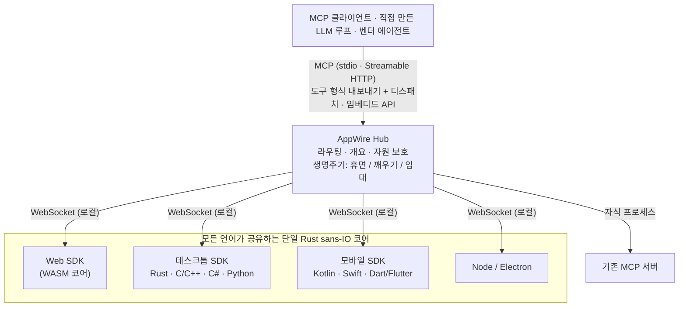

<p align="center">
  <picture>
    <source media="(prefers-color-scheme: dark)" srcset="assets/logo/appwire-logo-dark.png">
    
  </picture>
</p>

# AppWire — 어떤 앱이든 AI 에이전트용 MCP 도구로

[](#라이선스)
[](https://modelcontextprotocol.io)
[](https://github.com/stareing/appwire)

[English](../README.md) · [简体中文](README.zh-CN.md) · [繁體中文](README.zh-TW.md) · [日本語](README.ja.md) · **한국어** · [Español](README.es.md) · [Português (Brasil)](README.pt-BR.md) · [Français](README.fr.md) · [Deutsch](README.de.md) · [Русский](README.ru.md) · [Italiano](README.it.md)

**AppWire는 웹·데스크톱·모바일 앱의 실제 동작을 AI 에이전트가 호출할 수 있는 도구로 노출하는 오픈소스
[MCP(Model Context Protocol)](https://modelcontextprotocol.io) SDK이자 로컬 허브입니다.** Claude, ChatGPT,
Gemini, Claude Code는 물론 직접 만든 LLM 루프에서도 사용할 수 있습니다. 이미 그 일을 하고 있는 코드 바로 옆
(React hook, HTML 속성, 문서 주석, Kotlin·Swift 함수)에 도구를 선언하면 어떤 MCP 클라이언트든 그 도구를
호출할 수 있습니다. 화면 스크래핑도, computer use도, 브라우저 자동화도 필요 없습니다.

- **플랫폼마다 SDK 하나, 공통 Rust 코어 하나:** React, 순수 HTML, Node, Electron, Tauri, Rust, C/C++,
  C#(WPF, WinUI), Kotlin/Android, Swift(iOS, macOS), Python(Qt, Tk), Dart/Flutter.
- **기기 안의 모든 앱을 하나의 허브로:** MCP(stdio, Streamable HTTP)로 동작하는 MCP 서버이면서 OpenAI,
  Anthropic, Gemini의 도구 호출(function calling) 형식으로 내보내거나, 직접 만든 에이전트에 임베드할 수 있습니다.
- **표준을 읽고, 표준을 만든다:** WebMCP, Apple App Intents, Android AppFunctions, Windows App Actions를
  읽어 들이고 생성하며, 기존 MCP 서버도 한데 모읍니다.
- **설명은 권한이 아니다:** 앱은 각 도구가 무엇을 하는지 선언하고(표준 MCP 도구 어노테이션: 읽기 전용, 파괴적,
  멱등, 오픈 월드), 호출 실행 여부는 에이전트가 정하며, 결제 같은 고위험 단계는 앱이 자체 UI에서 확인합니다.
  AppWire는 선언을 있는 그대로 전달하고 앱과 기기를 보호합니다(호출 빈도 제한, 깨우기 횟수 상한, 크기 상한).

> **모든 것은 도구다.**
> 앱은 능력이고, 인터페이스는 선언이며, 호출은 깨우기다.

> 이 프로젝트는 **app-mcp**라는 작업명으로 개발되었으며, 패키지·크레이트·실행 파일 이름
> (`@app-mcp/*`, `app-mcp-*`, `app-mcp-host`)은 지금도 이 이름을 씁니다.

## 목차

[용도](#용도와-활용-사례) · [빠른 시작](#빠른-시작) · [간단한 예시](#간단한-예시) · [설치](#설치) · [사용해 보기](#사용해-보기) ·
[플랫폼과 패키지](#플랫폼과-패키지) · [동작 방식](#동작-방식) · [책임 범위](#책임-범위) ·
[비교](#다른-방식과의-비교) · [철학](#철학) · [자주 묻는 질문](#자주-묻는-질문) ·
[문서](#문서)

## 용도와 활용 사례

AppWire를 쓰면 AI 어시스턴트가 기기의 앱을 앱 스스로 하는 방식대로 조작합니다. 화면을 보고 어디를 누를지 추측하는 대신, 앱
고유의 동작을 타입이 지정된 입력, 사용자의 기존 로그인 상태, 앱 자체의 검증과 함께 호출합니다. 앱은 자기 코드에서 무엇을 할 수
있는지 한 번만 선언하면 됩니다. 그러면 그 기기의 어떤 에이전트든(데스크톱 어시스턴트, 휴대폰 내장 어시스턴트, 자동차 음성
어시스턴트, 직접 만든 LLM 루프) 그 동작을 찾고, 호출하고, 결과를 읽고, 앱이 실행 중이 아니면 깨울 수 있습니다. 같은 선언이
음성·채팅·자동화에 모두 쓰이므로, 한 번의 연동으로 사람이 기기와 소통하는 모든 방식을 지원합니다.

| 기기 | 에이전트가 할 수 있는 일(예시) | 앱 연동 방법 | 현황 |
|---|---|---|---|
| **컴퓨터** — Windows, macOS, Linux | "이 보고서를 PDF로 내보내서 새 메일에 첨부해 줘", Claude Code·Cursor·Claude Desktop에서 데스크톱 앱과 웹 앱을 나란히 조작 | Electron, Tauri, C#(WPF, WinUI), Python(Qt, Tk), C/C++, Rust, 웹 페이지는 브라우저를 통해 | Linux와 Windows에서 테스트, Apple 플랫폼은 Linux에서만 검증 |
| **휴대폰** — Android, iOS, HarmonyOS NEXT | "지난주 장 본 것 다시 주문해 줘", "오후 3시 회의를 옮기고 참석자에게 알려 줘" — 기기 어시스턴트가 앱 동작을 호출하고 백그라운드에서 앱을 깨움 | Kotlin, Swift, Dart/Flutter, ArkTS, 어시스턴트가 Hub를 내장 | Android는 실기기 테스트, iOS와 HarmonyOS는 빌드와 단위 테스트만 했고 실기기는 미검증 |
| **태블릿** — iPadOS, Android, Windows | 분할 화면의 각 창에 보이는 내용에 대해 동작, 한 앱의 메모로 다른 앱의 양식 채우기 | 휴대폰·컴퓨터와 같은 SDK, 도구가 현재 화면을 따라감 | 휴대폰·컴퓨터와 동일 |
| **자동차 스마트 콕핏** — Android Automotive OS, HarmonyOS 콕핏, Linux/Qt 헤드 유닛 | "가장 가까운 빈 충전기로 안내하고 드라이브 플레이리스트 틀어 줘" — 음성 어시스턴트가 내비게이션·충전·미디어 앱을 직접 호출하므로 운전 중 화면을 만질 필요가 없음 | Kotlin(Android Automotive), ArkTS(HarmonyOS), C/C++ 또는 Python(Qt), 콕핏 어시스턴트가 Hub를 내장(Rust, C, Kotlin) | 휴대폰·Linux와 같은 SDK, 차량 시스템에서는 미검증 |
| **어시스턴트·기기 제조사** | 한 번의 연동으로 기기의 모든 호환 앱을 자사 어시스턴트에 OpenAI·Anthropic·Gemini·MCP 도구 형식으로 제공 | Hub 내장: Rust, Node, C/C#, Kotlin, Swift, Python | [상태](#상태) 참고 |

예시는 앱이 노출할 수 있는 것을 보여 줄 뿐 내장 기능이 아닙니다. 상호작용을 각본이 아닌 '깊은' 것으로 만드는 요소는
다음과 같습니다.

- **시각이 아니라 정확하게:** 에이전트는 앱의 실제 동작을 타입이 지정된 스키마로 호출합니다. 스크린샷·좌표·OCR을 쓰지 않으므로
  창이 숨겨져 있거나, 화면이 꺼져 있거나, 운전자가 앞을 보고 있어도 동작합니다.
- **항상 호출할 수 있지만 항상 실행 중은 아님:** 도구는 앱의 매니페스트에서 나열되고, 호출될 때만 플랫폼 고유의 활성화 방식으로
  앱을 깨웁니다. 유휴 앱은 자원을 반납합니다.
- **지금의 맥락을 앎:** 도구가 화면과 앱 상태에 따라 나타나고 사라지므로, 어시스턴트는 지금 할 수 있는 일만 봅니다.
- **앱을 넘나들며:** 한 요청에서 여러 앱의 도구를 조합할 수 있습니다. 각 결과는 동작이 끝났는지, 아니면 앱에서 대기 중인지
  (예: 사용자의 결제 확인 대기) 알려 줍니다.
- **통제권은 사용자에게:** 먼저 물을지는 에이전트가 정하고, 고위험 단계는 앱이 자체 화면에서 확인하며, 사용자는 어떤 앱이나
  도구든 숨기거나 차단할 수 있습니다(`app-mcp-host policy`).

## 빠른 시작

이 컴퓨터에서 AppWire를 지원하는 앱에 AI 에이전트를 연결합니다.

```bash
npx appwire-cli setup        # 또는: uvx appwire-cli setup
npx appwire-cli uninstall    # 나중에 setup이 한 일을 모두 되돌릴 때
```

`setup`은 현재 사용자용으로 AppWire Host(`app-mcp-host`)를 설치합니다. 바이너리를 패키지 매니저 캐시에서
`~/.app-mcp/bin`으로 복사하고, 로그인 시 자동 시작을 등록하고, 찾은 에이전트(Claude Code, Codex, Gemini CLI, Cursor,
VS Code)의 MCP 설정에 추가합니다(Windsurf와 Claude Desktop은 직접 추가할 항목을 출력합니다). 수정하는 파일은 모두
백업하고, 내용이 다른 같은 이름의 항목은 `--force`를 주지 않으면 덮어쓰지 않으며, 마지막에 `doctor`로 자체 점검합니다.
여러 번 실행해도 안전하고, `--dry-run`으로 계획을 먼저 볼 수 있습니다. 로컬 에이전트에는 액세스 토큰이 필요 없습니다.
에이전트를 다시 시작하고 AppWire를 지원하는 앱을 열면 도구가 나타납니다. 패키지를 전역 설치하면
(`npm install -g appwire-cli` 또는 `uv tool install appwire-cli`) 명령 이름은 `appwire`입니다.

npm과 PyPI의 `appwire-cli` 패키지는 첫 릴리스와 함께 배포됩니다. 그전까지는 소스에서 빌드하세요:
`cargo build -p app-mcp-host` 후 `target/debug/app-mcp-host setup`을 실행하거나 [사용해 보기](#사용해-보기)를 따르세요.

## 간단한 예시

**React** — 컴포넌트가 마운트되어 있는 동안에만 존재하는 도구

```tsx
useTool('cart.checkout', {
  description: '현재 장바구니를 결제합니다',
  risk: 'payment',
  input: z.object({ addressId: z.string() }),
  handler: ({ addressId }) => checkout(addressId),
})
```

**순수 HTML** — JavaScript가 필요 없음

```html
<button data-mcp-tool="cart.clear" data-mcp-desc="장바구니 비우기">비우기</button>
```

**문서 주석**(`@app-mcp/build` 사용) — 컴파일 시점에 도구 생성

```ts
/** 도시별 예상 배송일을 계산합니다. @mcp */
export function deliveryEstimate(city: string, express?: boolean) { … }
```

**직접 만든 LLM 루프**(임베디드 Hub, Node) — 호출 한 번으로 모든 앱의 도구를 내보내기

```ts
const hub = await Hub.start({})
const tools = hub.exportTools('anthropic')            // 또는 'openai-chat', 'openai-responses', 'gemini', 'mcp'
const results = await handleAnthropicToolUses(hub, response.content)
```

## 설치

패키지는 첫 릴리스와 함께 배포됩니다. 그전까지는 [사용해 보기](#사용해-보기)에 나온 대로 소스에서
빌드하세요.

```bash
# Web
npm install @app-mcp/web @app-mcp/react        # 그 밖에: @app-mcp/dom, @app-mcp/store, @app-mcp/build
# Node / Electron
npm install @app-mcp/node @app-mcp/electron
# Node 에이전트에 허브 임베드 (LangChain.js, Vercel AI SDK, OpenAI / Anthropic SDK)
npm install @app-mcp/hub
# Rust / Tauri v2
cargo add app-mcp-native                       # Tauri: tauri-plugin-app-mcp + @app-mcp/tauri
# 로컬 허브 (Claude Code, Claude Desktop, Cursor 등 MCP 클라이언트용 MCP 서버)
cargo install app-mcp-host
```

C/C++, C#, Kotlin, Swift, Python, Dart용 네이티브 SDK는 [`sdks/`](../sdks)와
[`bindings/`](../bindings) 아래에 있으며, 각각 별도의 빌드 안내가 있습니다.

## 사용해 보기

```bash
# Host를 빌드해 상주 서비스로 실행 (프로세스 하나가 모든 MCP 클라이언트를 처리)
cargo build -p app-mcp-host
target/debug/app-mcp-host serve            # 또는: app-mcp-host service install  (로그인 시 자동 시작)
target/debug/app-mcp-host status           # 한 줄 요약
target/debug/app-mcp-host doctor           # 문제가 있나요? 항목별로 진단 결과와 해결 방법을 알려 줌

# 데모 쇼핑몰을 실행한 뒤 브라우저에서 열기
pnpm --filter @app-mcp/example-shop dev
```

Host는 `127.0.0.1:7717` 포트 하나로 모든 것을 처리합니다. 웹 앱은 `/app`(WebSocket)으로 연결하고,
MCP 클라이언트는 `http://127.0.0.1:7717/mcp`에서 Streamable HTTP를 사용하며, `/healthz`는 Host의
식별 정보를 알려 줍니다. 네이티브 앱은 사용자별 로컬 소켓(Unix 도메인 소켓 / Windows 네임드 파이프)으로
연결하는데, 이 소켓은 로컬 소켓 위에서 HTTP를 쓰는 에이전트를 위해 MCP도 제공합니다. 락 파일로 사용자당
Host가 하나만 실행되도록 보장하고, 실제 엔드포인트는 `~/.app-mcp/run/endpoints.json`에 기록됩니다.

이 저장소의 `.mcp.json`은 Claude Code가 이 엔드포인트에 연결하도록 설정되어 있습니다. 세션을 다시 시작하고
데모 페이지를 연 다음, Claude에게 쇼핑몰을 조작해 달라고 요청해 보세요. 다른 MCP 클라이언트도 같은 방식으로
연결됩니다.

```json
{ "mcpServers": { "appwire": { "type": "http", "url": "http://127.0.0.1:7717/mcp" } } }
```

연결이 되지 않으면 `app-mcp-host doctor`가 Host, 락, 로컬 소켓 권한, 어떤 프로세스가 포트를 점유하고 있는지,
Windows 제외 포트 범위, 토큰 모드, `adb reverse`, 그리고 각 앱의 상태와 마지막 오류를 점검합니다. SDK 상태에는
기계가 읽을 수 있는 오류 코드가 포함됩니다(`spec/protocol.md` §10). 설정, 액세스 토큰, 그 밖의 MCP 클라이언트는
[`crates/host/README.md`](../crates/host/README.md)를 참고하세요.

## 플랫폼과 패키지

| 대상 | 패키지 | 비고 |
|---|---|---|
| Web | `@app-mcp/web`, `@app-mcp/react`, `@app-mcp/dom`, `@app-mcp/store`, `@app-mcp/build` | WASM 코어; WebMCP 폴리필/브리지; HTML 속성; Zustand / Redux / Pinia; 컴파일 타임 `@mcp` |
| Node / Electron | `@app-mcp/node`, `@app-mcp/electron` | 메인 프로세스 + 렌더러 브리지 |
| Rust (Tauri, egui 등) | `crates/native` | 직접 의존성으로 사용 |
| Tauri v2 | `crates/tauri-plugin`, `@app-mcp/tauri` | 플러그인: Rust 도구 + Tauri IPC를 통한 웹뷰 페이지 (`@app-mcp/web`은 그대로) |
| C / C++ | `bindings/c`, `sdks/cpp` | 안정적인 C ABI (`app_mcp.h`) |
| C# (WPF, WinUI) | `sdks/dotnet` | P/Invoke; 단일 인스턴스 및 프로토콜 활성화 헬퍼 |
| Kotlin / Android | `sdks/kotlin` | 코루틴; `WakeReceiver` + 신속 처리(expedited) WorkManager |
| Swift (iOS, macOS) | `sdks/swift` | async/await; SwiftUI 생명주기 modifier |
| Python | `sdks/python` | 동기 또는 asyncio 핸들러; Qt / Tk 디스패처; D-Bus 깨우기 |
| Dart / Flutter | `sdks/dart` | dart:ffi; `AppLifecycleListener` 통합 |
| 네이티브 인텐트 | `crates/codegen` | App Intents, AppFunctions, Windows App Actions와 타입 인터페이스 생성 |
| 에이전트 / 벤더 | `crates/hub`, `@app-mcp/hub`, `bindings/hub-c`, `bindings/hub-uniffi` | Rust, Node, C/C#, Kotlin, Swift, Python용 임베드 가능한 Hub |

## 동작 방식



- **앱 SDK**는 도구와 리소스를 등록합니다. 프로토콜은 하나의 Rust 코어(`crates/core`)가 구현하므로 어떤
  언어에서든 동작이 같습니다.
- **Hub**(`crates/hub`)는 앱과 업스트림 MCP 서버를 한데 모으고, 호출을 알맞은 인스턴스로 라우팅하며, 처음
  연결할 때 짧은 앱 개요를 붙이고, 각 도구의 선언을 바꾸지 않고 전달하며, 휴면 중인 앱을 깨웁니다. 호출을 실행해도
  되는지는 결정하지 않습니다. 그것은 에이전트의 몫입니다(Hub를 임베드하는 벤더는 선택적인 `ApprovalHandler` 콜백으로
  자체 확인 UI를 연결할 수 있습니다). `app-mcp-host`는 그 커맨드라인 프런트엔드입니다.
- **정적 매니페스트**(`app-mcp.json`) 덕분에 Hub는 앱이 실행 중이 아닐 때도 그 앱의 도구 목록을 보여 주고 앱을
  깨울 수 있습니다.

## 책임 범위

AppWire는 AI 에이전트와 앱을 잇는 통로이며, 정책이 아니라 메커니즘을 제공합니다. 앱이 선언한 것(도구, 입력·출력 스키마, MCP 도구 어노테이션, 콘텐츠 어노테이션, 결과 상태)을 그대로 어떤 에이전트든 호출할 수 있는 도구로 바꿉니다. 앱을 찾고, 각 호출을 올바른 인스턴스로 라우팅하며, 잠든 앱을 필요할 때 깨웁니다. 취소, 타임아웃, 분류된 오류, 그리고 작업이 완료되었는지 대기 중인지 알려 주는 결과로 통로 자체의 정확성을 지키고, 호출 빈도·깨우기 횟수·데이터 크기 상한으로 앱과 기기를 보호합니다. 사용자나 벤더가 작성한 숨김·거부 규칙을 실행할 뿐 스스로는 아무것도 판단하지 않습니다. 호출을 실행할지, 사용자에게 물을지는 에이전트가 정합니다. 결제 같은 고위험 작업의 최종 확인은 앱이 자체 화면에서 합니다. 모델 선택, 프롬프트 구성, 에이전트 기억, 화면 읽기는 범위 밖입니다.

## 다른 방식과의 비교

| 방식 | 모델이 보는 것 | 앱이 꺼져 있어도 동작 | 플랫폼 |
|---|---|---|---|
| Computer use / 화면 기반 에이전트 | 스크린샷, 픽셀 | 아니요 | 데스크톱 |
| 브라우저 자동화 (예: Playwright MCP) | DOM / 접근성 트리 | 아니요 | 웹 |
| 앱마다 직접 작성한 MCP 서버 | 도구 (앱과 별도로 유지보수) | 구현에 따라 다름 | 서버마다 하나 |
| WebMCP | 페이지가 선언한 도구 | 아니요 | 브라우저 전용 |
| App Intents / AppFunctions / App Actions | 시스템 인텐트 | 예 | 각각 OS 하나 |
| **AppWire** | **앱 자체 코드에 선언된 도구** | **예 (매니페스트 + 깨우기)** | **웹, 데스크톱, 모바일** |

AppWire는 이 표준들을 대체하지 않습니다. WebMCP, App Intents, AppFunctions, Windows App Actions를 읽고
생성할 수 있으며, 기존 MCP 서버도 같은 Hub 뒤에 모아 둘 수 있습니다.

## 철학

Unix는 *모든 것은 파일*이라고 말합니다. 장치, 파이프, 프로세스가 `open`, `read`, `write`라는 하나의
인터페이스를 공유합니다. 플러그인 시스템은 *모든 것은 플러그인*이라고 말합니다. 기능은 호스트에 로드되는
코드입니다.

AppWire는 **모든 것은 도구**라고 말합니다. 버튼, 폼, 메뉴 명령, 스토어 액션, OS 기능, 기존 MCP 서버 — 모두
같은 방식으로 표현됩니다. 이름, 입력 스키마, 위험 등급, 핸들러. 모델에게 필요한 동사는 세 가지뿐입니다.
**나열하기, 호출하기, 읽기**.

플러그인은 코드를 호스트 *안으로* 옮깁니다. 도구는 그 반대입니다. 코드는 앱에 그대로 남고, 앱은 자신이 할 수
있는 일을 선언하며, 오케스트레이션은 모델이 맡습니다.

### 아홉 가지 원칙

1. **동작이 있는 곳에서 선언한다.** 기능은 이미 존재하는 그 자리에서 선언합니다 — React hook, HTML 속성,
   문서 주석, 상태 스토어, 네이티브 `ToolSpec`. 따로 관리할 두 번째 설명은 없습니다. 코드가 바뀌면 도구도
   바뀝니다.
2. **파싱하지 말고 선언한다.** 스크린샷도, DOM 스크래핑도, 어떤 버튼을 누를 수 있는지 추측하는 일도 없습니다.
   앱이 스스로 할 수 있는 일을 밝히고, 모델은 픽셀이 아닌 의도를 받습니다. UI 검사(`@app-mcp/inspect`)는
   명시적으로 켜야 하는 대체 수단일 뿐입니다.
3. **도구는 인터페이스와 함께 생기고 사라진다.** 탭을 열면 그 도구가 나타나고, 닫으면 사라집니다. 빈
   장바구니에는 `checkout`이 없습니다. 모델은 언제나 *지금* 할 수 있는 일만 봅니다.
4. **부르면 오고, 끝나면 간다.** 목표는 '항상 실행 중'이 아니라 '항상 호출 가능'입니다. 도구를 찾을 때는
   앱을 실행하지 않습니다. 도구는 매니페스트와 마지막 스냅숏에서 나열됩니다. 호출될 때만 플랫폼 고유의 활성화
   방식으로 깨우고, 일이 끝나면 연결과 스레드를 반환하고 프로세스를 OS에 돌려줍니다. 프로세스를 메모리에 붙잡아
   두지 않고, 앱마다 상주 데몬을 두지 않으며, 프로세스 수명 주기는 AppWire가 아니라 OS가 관리합니다.
   연결은 수단일 뿐, 결코 부담이 아닙니다.
5. **허브 하나로 모든 엔드포인트를.** 하나의 Hub가 웹, 데스크톱, 모바일 앱을 모두 처리하고 MCP, OpenAI,
   Anthropic, Gemini 도구 형식을 지원하며, 벤더의 자체 에이전트에 직접 임베드할 수도 있습니다. 한 번 연동하면
   어디서나 쓸 수 있습니다.
6. **호환되기에 상위 집합이다.** WebMCP, App Intents, AppFunctions, Windows App Actions를 모두 읽어 들이고
   생성할 수 있습니다. 우리는 표준과 경쟁하지 않고, 표준을 서로 잇습니다.
7. **설명은 권한이 아니다.** 개요는 앱이 무엇을 위한 것인지, 도구 어노테이션은 그 도구가 무엇을 하는지 알려 줄 뿐,
   어느 쪽도 권한을 주지 않습니다. 호출 실행 여부는 에이전트와 그 사용자가 정하고, 결제 같은 고위험 작업의 최종 확인은
   앱이 자체 UI와 자체 검증으로 합니다. AppWire는 선언을 충실히 전달하고 앱과 기기를 보호합니다.
8. **근원에서 고친다.** 문제는 그 문제가 생긴 계층에서 해결합니다. 전달용 프로세스, 래퍼 스크립트, 몽키패치,
   대체 변환으로 덮어 두지 않습니다.
9. **AI의 모든 동작은 사용자에게 보이고, 되돌릴 수 있다고 선언된 것은 되돌릴 수 있다.** 에이전트가 사용자의 앱에서
   무엇을 했는지 사용자는 언제나 볼 수 있어야 하고, 앱이 되돌릴 수 있다고 선언한 작업은 취소할 수 있어야 합니다.
   "할 수 있다"만으로는 부족하고, 보이고 고칠 수 있어야 합니다.

## 자주 묻는 질문

**React 앱을 MCP 서버로 만들려면 어떻게 하나요?**
`@app-mcp/react`를 추가하고, 노출할 동작을 `useTool`로 감싼 뒤 `app-mcp-host`를 실행하세요. 페이지가 로컬
Hub에 연결되고, 컴포넌트가 마운트되어 있는 동안 Hub에 연결된 모든 MCP 클라이언트가 그 도구를 볼 수 있습니다.
순수 페이지라면 대신 `@app-mcp/dom`과 `data-mcp-*` 속성을 쓰면 됩니다.

**Claude(또는 ChatGPT, Gemini, Cursor)가 데스크톱이나 모바일 앱을 조작하게 하려면 어떻게 하나요?**
사용하는 플랫폼의 SDK(Electron, Tauri, C#, Kotlin, Swift, Python, Flutter 등)로 도구를 등록하고, MCP
클라이언트가 `http://127.0.0.1:7717/mcp`에 연결하도록 설정하세요. Android 앱은 개발 중에 `adb reverse`를
통해 Hub에 연결합니다.

**앱마다 MCP 서버를 따로 작성해야 하나요?**
아니요. 앱은 하나의 로컬 Hub에 등록되고, 그 Hub가 모든 클라이언트가 상대하는 유일한 MCP 서버가 됩니다. 기존
MCP 서버도 같은 Hub 뒤에 업스트림으로 추가할 수 있습니다.

**MCP 없이 직접 만든 에이전트에서도 쓸 수 있나요?**
네. Hub를 임베드하고(Rust, Node, C/C#, Kotlin, Swift, Python), OpenAI, Anthropic 또는 Gemini 형식으로 도구를
내보낸 다음, 모델의 도구 호출을 Hub를 통해 다시 디스패치하면 됩니다.
[`spec/hub-api.md`](../spec/hub-api.md)를 참고하세요.

**computer use나 브라우저 자동화와는 무엇이 다른가요?**
그런 방식은 모델이 화면을 읽고 어디를 클릭할지 추측하게 만듭니다. AppWire는 앱이 타입이 지정된 입력 스키마로
자신의 동작을 선언하므로, 호출이 정확하고 빠르며 창이 가려져 있어도 동작합니다 — 앱이 아예 실행 중이 아니어도
마찬가지입니다(필요할 때 깨웁니다).

**모델이 앱 동작을 호출하게 해도 안전한가요?**
그 판단은 AppWire가 대신하지 않습니다. 각 도구는 자신이 무엇을 하는지 선언하고(표준 MCP 도구 어노테이션: 읽기 전용,
파괴적, 멱등, 오픈 월드), AppWire는 그 선언을 그대로 에이전트에 넘깁니다. 호출을 바로 실행할지 먼저 사용자에게 확인할지는
에이전트(Claude Code, Cursor, 직접 만든 루프)가 자체 권한 설정으로 정합니다. 결제 같은 고위험 단계는 앱 안에서 앱 자체의
UI와 검증(비밀번호, 3-D Secure, 생체 인증)으로 확인합니다. 앱 개요 자체는 어떤 권한도 부여하지 않습니다. Hub 자신의 일은
호출 빈도 제한, 깨우기 횟수 상한, 크기 상한으로 앱과 기기를 보호하는 것입니다.

**WebMCP와 함께 쓸 수 있나요?**
네. `@app-mcp/web/webmcp`는 WebMCP `modelContext` API를 폴리필로 구현하고 브리지하므로, 표준에 맞춰 작성한
페이지도 Hub를 통해 노출됩니다.

## 문서

| 문서 | 내용 |
|---|---|
| [`spec/protocol.md`](../spec/protocol.md) | SDK ↔ Hub 프로토콜 (공식 기준) |
| [`spec/manifest.md`](../spec/manifest.md) | 정적 매니페스트 `app-mcp.json` |
| [`spec/lifecycle.md`](../spec/lifecycle.md) | 앱 생명주기: 휴면, 깨우기, 임대, 빠른 재개 |
| [`spec/hub-api.md`](../spec/hub-api.md) | 임베드 가능한 Hub API와 바인딩 |
| [`crates/host/README.md`](../crates/host/README.md) | Host 설정, 액세스 토큰, MCP 클라이언트 |
| [`llms.txt`](../llms.txt) | LLM과 AI 검색을 위한 프로젝트 요약 |
| [`app-mcp-plan.md`](../app-mcp-plan.md) | 전체 설계와 로드맵 (중국어) |
| [`TASKS.md`](../TASKS.md) | 현재 진행 상황 (중국어) |

다른 언어: [English](../README.md) · [简体中文](README.zh-CN.md) · [繁體中文](README.zh-TW.md) · [日本語](README.ja.md) · [Español](README.es.md) · [Português (Brasil)](README.pt-BR.md) · [Français](README.fr.md) · [Deutsch](README.de.md) · [Русский](README.ru.md) · [Italiano](README.it.md)

## 상태

프로토타입 단계(마일스톤 M1–M2)입니다. 프로토콜, 코어, Hub, 모든 언어 SDK가 구현되어 Linux와 Windows에서
테스트를 마쳤고, Android 실기기에서도 실행해 보았습니다. Apple 플랫폼은 아직 Linux에서만 검증했습니다. API는
바뀔 수 있습니다. 이슈와 풀 리퀘스트를 환영합니다.

## 라이선스

[Apache License 2.0](../LICENSE-APACHE) 또는 [MIT](../LICENSE-MIT) 중 원하는 쪽을 선택해 사용할 수 있습니다.
