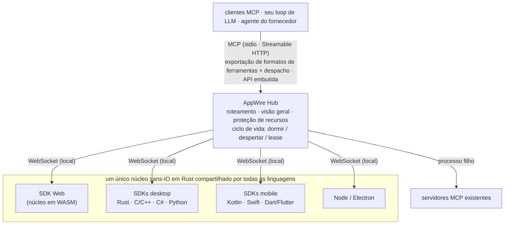

<p align="center">
  <picture>
    <source media="(prefers-color-scheme: dark)" srcset="assets/logo/appwire-logo-dark.png">
    
  </picture>
</p>

# AppWire — transforme qualquer app em ferramentas MCP para agentes de IA

[](#licença)
[](https://modelcontextprotocol.io)
[](https://github.com/stareing/appwire)

[English](../README.md) · [简体中文](README.zh-CN.md) · [繁體中文](README.zh-TW.md) · [日本語](README.ja.md) · [한국어](README.ko.md) · [Español](README.es.md) · **Português (Brasil)** · [Français](README.fr.md) · [Deutsch](README.de.md) · [Русский](README.ru.md) · [Italiano](README.it.md)

**AppWire é um SDK e hub local de código aberto para o [MCP (Model Context Protocol)](https://modelcontextprotocol.io)
que expõe as ações reais de apps web, desktop e mobile como ferramentas para agentes de IA** —
Claude, ChatGPT, Gemini, Claude Code ou o seu próprio loop de LLM. Declare uma ferramenta ao lado do
código que já faz o trabalho (um hook do React, um atributo HTML, um comentário de documentação, uma
função em Kotlin ou Swift) e qualquer cliente MCP poderá chamá-la — sem escrever um servidor MCP para
cada app. Nada de screen scraping, computer use ou automação de navegador.

- **Um SDK por plataforma, um único núcleo em Rust:** React, HTML puro, Node, Electron, Tauri, Rust, C/C++,
  C# (WPF, WinUI), Kotlin/Android, Swift (iOS, macOS), Python (Qt, Tk), Dart/Flutter.
- **Um hub para todos os apps do dispositivo:** fala MCP (stdio, Streamable HTTP) e exporta nos formatos
  de chamada de ferramentas (function calling) da OpenAI, Anthropic e Gemini, ou pode ser embutido no seu
  próprio agente.
- **Padrões na entrada, padrões na saída:** consome e gera WebMCP, Apple App Intents, Android
  AppFunctions e Windows App Actions; agrega servidores MCP existentes.
- **Descrição não é autorização:** os apps declaram o que cada ferramenta faz (anotações padrão de ferramentas MCP:
  somente leitura, destrutiva, idempotente, mundo aberto); o seu agente decide se uma chamada é executada, e o app
  confirma etapas de alto risco, como um pagamento, na própria interface. O AppWire repassa as declarações fielmente
  e protege os apps e o dispositivo (limites de taxa, de despertares e de tamanho).

> **Tudo é uma ferramenta.**
> Apps são capacidades. Interfaces são declarações. Uma chamada é um despertar.

> O projeto foi desenvolvido com o nome provisório **app-mcp**; os nomes de pacotes, crates e binários
> (`@app-mcp/*`, `app-mcp-*`, `app-mcp-host`) ainda o utilizam.

## Sumário

[Exemplos rápidos](#exemplos-rápidos) · [Instalação](#instalação) · [Experimente](#experimente) ·
[Plataformas](#plataformas-e-pacotes) · [Como funciona](#como-funciona) ·
[Comparação](#comparação-com-outras-abordagens) · [Filosofia](#filosofia) · [FAQ](#perguntas-frequentes) ·
[Documentação](#documentação)

## Exemplos rápidos

**React** — uma ferramenta que só existe enquanto o componente está montado

```tsx
useTool('cart.checkout', {
  description: 'Finalizar a compra do carrinho atual',
  risk: 'payment',
  input: z.object({ addressId: z.string() }),
  handler: ({ addressId }) => checkout(addressId),
})
```

**HTML puro** — sem precisar de JavaScript

```html
<button data-mcp-tool="cart.clear" data-mcp-desc="Esvaziar o carrinho">Limpar</button>
```

**Um comentário de documentação** (com `@app-mcp/build`) — ferramentas geradas em tempo de compilação

```ts
/** Estima o prazo de entrega em dias para uma cidade. @mcp */
export function deliveryEstimate(city: string, express?: boolean) { … }
```

**Seu próprio loop de LLM** (Hub embutido, Node) — uma única chamada para exportar as ferramentas de todos os apps

```ts
const hub = await Hub.start({})
const tools = hub.exportTools('anthropic')            // ou 'openai-chat', 'openai-responses', 'gemini', 'mcp'
const results = await handleAnthropicToolUses(hub, response.content)
```

## Instalação

Os pacotes serão publicados na primeira release; até lá, compile a partir do código-fonte como mostrado em
[Experimente](#experimente).

```bash
# Web
npm install @app-mcp/web @app-mcp/react        # também: @app-mcp/dom, @app-mcp/store, @app-mcp/build
# Node / Electron
npm install @app-mcp/node @app-mcp/electron
# Embutir o hub em um agente Node (LangChain.js, Vercel AI SDK, OpenAI / Anthropic SDK)
npm install @app-mcp/hub
# Rust / Tauri v2
cargo add app-mcp-native                       # Tauri: tauri-plugin-app-mcp + @app-mcp/tauri
# O hub local (servidor MCP para Claude Code, Claude Desktop, Cursor e outros clientes MCP)
cargo install app-mcp-host
```

Os SDKs nativos para C/C++, C#, Kotlin, Swift, Python e Dart ficam em [`sdks/`](../sdks) e
[`bindings/`](../bindings); cada um tem suas próprias instruções de build.

## Experimente

```bash
# compile o Host e execute-o como serviço residente (um único processo atende todos os clientes MCP)
cargo build -p app-mcp-host
target/debug/app-mcp-host serve            # ou: app-mcp-host service install  (iniciar no login)
target/debug/app-mcp-host status           # resumo em uma linha
target/debug/app-mcp-host doctor           # algo errado? cada verificação dá um veredito e uma correção

# execute a loja de demonstração e abra-a no navegador
pnpm --filter @app-mcp/example-shop dev
```

O Host serve tudo em uma única porta, `127.0.0.1:7717`: apps web se conectam a `/app` (WebSocket),
clientes MCP usam Streamable HTTP em `http://127.0.0.1:7717/mcp` e `/healthz` informa a identidade
do Host. Apps nativos se conectam por um socket local por usuário (Unix domain socket / named pipe do
Windows), que também serve MCP para agentes que falam HTTP sobre sockets locais. Um arquivo de lock
garante um único Host por usuário, e os endpoints efetivos ficam registrados em `~/.app-mcp/run/endpoints.json`.

O `.mcp.json` deste repositório aponta o Claude Code para esse endpoint; reinicie a sessão, abra a
página de demonstração e peça ao Claude para operar a loja. Qualquer outro cliente MCP funciona da mesma forma:

```json
{ "mcpServers": { "appwire": { "type": "http", "url": "http://127.0.0.1:7717/mcp" } } }
```

Quando algo não conecta, `app-mcp-host doctor` verifica o Host, o lock, as permissões do socket local,
qual processo está ocupando a porta, as faixas de portas excluídas do Windows, o modo do token,
o `adb reverse` e o estado e o último erro de cada app; os estados do SDK trazem códigos de erro legíveis
por máquina (`spec/protocol.md` §10). Veja [`crates/host/README.md`](../crates/host/README.md) para
configuração, token de acesso e outros clientes MCP.

## Plataformas e pacotes

| Onde | Pacote | Observações |
|---|---|---|
| Web | `@app-mcp/web`, `@app-mcp/react`, `@app-mcp/dom`, `@app-mcp/store`, `@app-mcp/build` | núcleo em WASM; polyfill/bridge de WebMCP; atributos HTML; Zustand / Redux / Pinia; `@mcp` em tempo de compilação |
| Node / Electron | `@app-mcp/node`, `@app-mcp/electron` | processo principal + bridge para o renderer |
| Rust (Tauri, egui…) | `crates/native` | dependência direta |
| Tauri v2 | `crates/tauri-plugin`, `@app-mcp/tauri` | plugin: ferramentas em Rust + páginas da webview via Tauri IPC (`@app-mcp/web` sem alterações) |
| C / C++ | `bindings/c`, `sdks/cpp` | C ABI estável (`app_mcp.h`) |
| C# (WPF, WinUI) | `sdks/dotnet` | P/Invoke; helpers de instância única e ativação por protocolo |
| Kotlin / Android | `sdks/kotlin` | coroutines; `WakeReceiver` + WorkManager expedited |
| Swift (iOS, macOS) | `sdks/swift` | async/await; modificador de ciclo de vida do SwiftUI |
| Python | `sdks/python` | handlers síncronos ou asyncio; dispatchers para Qt / Tk; despertar via D-Bus |
| Dart / Flutter | `sdks/dart` | dart:ffi; integração com `AppLifecycleListener` |
| Intents nativos | `crates/codegen` | gera App Intents, AppFunctions, Windows App Actions e interfaces tipadas |
| Agentes / fornecedores | `crates/hub`, `@app-mcp/hub`, `bindings/hub-c`, `bindings/hub-uniffi` | Hub embutível para Rust, Node, C/C#, Kotlin, Swift, Python |

## Como funciona



- **Os SDKs de app** registram ferramentas e recursos; um único núcleo em Rust (`crates/core`) implementa o
  protocolo, então o comportamento é idêntico em todas as linguagens.
- **O Hub** (`crates/hub`) agrega apps e servidores MCP upstream, roteia as chamadas para a instância certa,
  anexa uma breve visão geral do app no primeiro contato, repassa sem alterações o que cada ferramenta declara
  e desperta apps que estão dormindo. Ele não decide se uma chamada pode ser executada: isso cabe ao agente (um
  fornecedor que embute o Hub pode conectar sua própria interface de confirmação pelo callback opcional
  `ApprovalHandler`). O `app-mcp-host` é a sua interface de linha de comando.
- **Manifestos estáticos** (`app-mcp.json`) permitem que o Hub liste as ferramentas de um app e o desperte
  mesmo quando o app não está em execução.

## Comparação com outras abordagens

| Abordagem | O que o modelo vê | Funciona com o app fechado | Plataformas |
|---|---|---|---|
| Computer use / agentes de tela | capturas de tela, pixels | não | desktop |
| Automação de navegador (ex.: Playwright MCP) | DOM / árvore de acessibilidade | não | web |
| Um servidor MCP escrito à mão para cada app | ferramentas, mantidas separadamente do app | depende | uma por servidor |
| WebMCP | ferramentas declaradas pela página | não | só navegador |
| App Intents / AppFunctions / App Actions | intents do sistema | sim | um SO cada |
| **AppWire** | **ferramentas declaradas no próprio código do app** | **sim (manifesto + despertar)** | **web, desktop, mobile** |

O AppWire não substitui esses padrões: ele lê e gera WebMCP, App Intents, AppFunctions e Windows App
Actions, e pode agregar servidores MCP existentes por trás do mesmo Hub.

## Filosofia

O Unix diz que *tudo é um arquivo*: dispositivos, pipes e processos compartilham uma única interface —
`open`, `read`, `write`. Sistemas de plugins dizem que *tudo é um plugin*: funcionalidades são código
carregado em um host.

O AppWire diz que **tudo é uma ferramenta**. Um botão, um formulário, um comando de menu, uma action de
store, uma capacidade do SO, um servidor MCP existente — cada um é expresso da mesma forma: um nome, um
schema de entrada, um nível de risco e um handler. Um modelo precisa de apenas três verbos:
**listar, chamar, ler** (list, call, read).

Um plugin leva o código *para dentro* do host. Uma ferramenta é o oposto: o código fica no app, o app
declara o que sabe fazer e o modelo orquestra.

### Nove princípios

1. **Declare onde a ação vive.** As capacidades são declaradas onde já estão — um hook do React, um
   atributo HTML, um comentário de documentação, uma store de estado, um `ToolSpec` nativo. Nenhuma
   segunda descrição para manter; quando o código muda, a ferramenta muda.
2. **Declare, não interprete.** Nada de capturas de tela, scraping do DOM ou adivinhar qual botão é
   clicável. O app informa o que sabe fazer; o modelo recebe intenção, não pixels. A inspeção de UI
   (`@app-mcp/inspect`) é apenas um fallback opcional (opt-in).
3. **As ferramentas nascem e morrem com a interface.** Abra uma aba e as ferramentas dela aparecem;
   feche-a e elas somem; um carrinho vazio não tem `checkout`. O modelo sempre vê o que pode ser feito *agora*.
4. **Dormir quando ocioso, despertar quando chamado.** Apps ociosos encerram a conexão e liberam threads;
   nada prende um processo na memória. Quando necessário, o Hub desperta o app pelo mecanismo de ativação
   nativo da plataforma e retoma em uma única ida e volta. A conexão é um meio, nunca um fardo.
5. **Um hub, todos os endpoints.** Um único Hub atende apps web, desktop e mobile e fala os formatos de
   ferramentas do MCP, OpenAI, Anthropic e Gemini — ou é embutido diretamente no próprio agente de um
   fornecedor. Integre uma vez, use em qualquer lugar.
6. **Compatível e, portanto, um superconjunto.** WebMCP, App Intents, AppFunctions e Windows App Actions
   podem ser consumidos e gerados. Não competimos com os padrões; nós os conectamos.
7. **Descrição não é autorização.** Uma visão geral diz ao modelo para que serve um app, e as anotações de uma
   ferramenta dizem o que ela faz; nenhuma das duas concede nada. Quem decide se uma chamada é executada são o
   agente e o seu usuário; a confirmação final de uma ação de alto risco, como um pagamento, cabe ao app, na
   própria interface e com a própria verificação. O AppWire repassa as declarações fielmente e protege os apps e
   o dispositivo.
8. **Corrija na origem.** Resolva o problema na camada onde ele surge. Nada de processos de
   encaminhamento, scripts wrapper, monkeypatches ou conversões de fallback para disfarçá-lo.
9. **Toda ação da IA é visível; o que é declarado reversível pode ser desfeito.** Quem tem os apps operados por
   um agente sempre consegue ver o que ele fez, e uma ação que o app declara reversível pode ser desfeita. Não
   basta poder agir: o usuário precisa poder ver e corrigir.

## Perguntas frequentes

**Como transformo meu app React em um servidor MCP?**
Adicione `@app-mcp/react`, envolva as ações que quer expor com `useTool` e execute o `app-mcp-host`.
A página se conecta ao Hub local, e todo cliente MCP conectado ao Hub vê as ferramentas enquanto o
componente estiver montado. Páginas simples podem usar os atributos `data-mcp-*` com `@app-mcp/dom`.

**Como deixo o Claude (ou ChatGPT, Gemini, Cursor) controlar um app desktop ou mobile?**
Registre ferramentas com o SDK da sua plataforma (Electron, Tauri, C#, Kotlin, Swift, Python,
Flutter…) e aponte o cliente MCP para `http://127.0.0.1:7717/mcp`. Durante o desenvolvimento, apps
Android chegam ao Hub via `adb reverse`.

**Preciso escrever um servidor MCP separado para cada app?**
Não. Os apps se registram em um único Hub local, e o Hub é o único servidor MCP com que todos os
clientes conversam. Servidores MCP existentes podem ser adicionados como upstreams por trás do mesmo Hub.

**Posso usar sem MCP, no meu próprio agente?**
Sim. Embuta o Hub (Rust, Node, C/C#, Kotlin, Swift, Python), exporte as ferramentas no formato da
OpenAI, Anthropic ou Gemini e despache as chamadas de ferramentas do modelo de volta pelo Hub. Veja
[`spec/hub-api.md`](../spec/hub-api.md).

**Qual a diferença em relação a computer use ou automação de navegador?**
Essas abordagens fazem o modelo ler a tela e adivinhar onde clicar. No AppWire, o app declara suas
ações com schemas de entrada tipados, então as chamadas são precisas, rápidas e funcionam com a janela
oculta — ou mesmo quando o app nem está em execução (ele é despertado sob demanda).

**É seguro deixar um modelo chamar ações de um app?**
O AppWire deixa essa decisão onde ela pertence. Cada ferramenta declara o que faz (como anotações padrão de
ferramentas MCP: somente leitura, destrutiva, idempotente, mundo aberto) e o AppWire entrega essas declarações ao
agente sem alterações; o agente (Claude Code, Cursor ou o seu próprio loop) decide, com as próprias configurações
de permissão, se uma chamada é executada ou precisa da sua confirmação. Etapas de alto risco, como um pagamento,
são confirmadas dentro do app, com a interface e a verificação dele (senha, 3-D Secure, biometria). A visão geral
de um app nunca concede permissões. O papel do próprio Hub é proteger os apps e o dispositivo com limites de
taxa, de despertares e de tamanho.

**Funciona com WebMCP?**
Sim. `@app-mcp/web/webmcp` implementa a API `modelContext` do WebMCP como polyfill e faz a ponte com
ela, de modo que páginas escritas seguindo o padrão também são expostas pelo Hub.

## Documentação

| Documento | Conteúdo |
|---|---|
| [`spec/protocol.md`](../spec/protocol.md) | protocolo SDK ↔ Hub (referência oficial) |
| [`spec/manifest.md`](../spec/manifest.md) | manifesto estático `app-mcp.json` |
| [`spec/lifecycle.md`](../spec/lifecycle.md) | ciclo de vida do app: dormir, despertar, lease, retomada rápida |
| [`spec/hub-api.md`](../spec/hub-api.md) | API do Hub embutível e bindings |
| [`crates/host/README.md`](../crates/host/README.md) | configuração do Host, token de acesso, clientes MCP |
| [`llms.txt`](../llms.txt) | resumo do projeto para LLMs e buscas com IA |
| [`app-mcp-plan.md`](../app-mcp-plan.md) | design completo e roadmap (em chinês) |
| [`TASKS.md`](../TASKS.md) | status atual (em chinês) |

Outros idiomas: [English](../README.md) · [简体中文](README.zh-CN.md) · [繁體中文](README.zh-TW.md) · [日本語](README.ja.md) · [한국어](README.ko.md) · [Español](README.es.md) · [Français](README.fr.md) · [Deutsch](README.de.md) · [Русский](README.ru.md) · [Italiano](README.it.md)

## Status

Protótipo (marcos M1–M2). O protocolo, o núcleo, o Hub e todos os SDKs de linguagem estão implementados e
testados no Linux e no Windows, com execução em um dispositivo Android; as plataformas Apple foram
verificadas apenas no Linux. As APIs ainda podem mudar. Issues e pull requests são bem-vindos.

## Licença

Licenciado sob a [Apache License 2.0](../LICENSE-APACHE) ou a [MIT](../LICENSE-MIT), à sua escolha.
