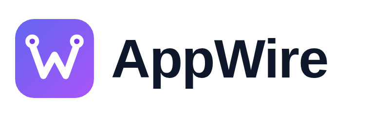
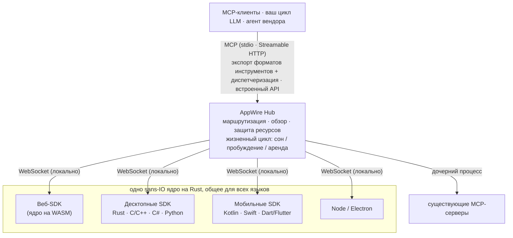

<p align="center">
  <picture>
    <source media="(prefers-color-scheme: dark)" srcset="assets/logo/appwire-logo-dark.png">
    
  </picture>
</p>

# AppWire — любое приложение как набор MCP-инструментов для ИИ-агентов

[](#лицензия)
[](https://modelcontextprotocol.io)
[](https://github.com/stareing/appwire)

[English](../README.md) · [简体中文](README.zh-CN.md) · [繁體中文](README.zh-TW.md) · [日本語](README.ja.md) · [한국어](README.ko.md) · [Español](README.es.md) · [Português (Brasil)](README.pt-BR.md) · [Français](README.fr.md) · [Deutsch](README.de.md) · **Русский** · [Italiano](README.it.md)

**AppWire — это SDK с открытым исходным кодом для [MCP (Model Context Protocol)](https://modelcontextprotocol.io)
и локальный хаб, которые открывают ИИ-агентам реальные действия веб-, десктопных и мобильных приложений
в виде инструментов** — для Claude, ChatGPT, Gemini, Claude Code или вашего собственного цикла LLM.
Объявите инструмент рядом с кодом, который уже выполняет работу (React-хук, HTML-атрибут, doc-комментарий,
функция на Kotlin или Swift), и его сможет вызвать любой MCP-клиент. Не нужно писать отдельный MCP-сервер
для каждого приложения. Никакого парсинга экрана, computer use или автоматизации браузера.

- **Один SDK на платформу, одно ядро на Rust:** React, обычный HTML, Node, Electron, Tauri, Rust, C/C++,
  C# (WPF, WinUI), Kotlin/Android, Swift (iOS, macOS), Python (Qt, Tk), Dart/Flutter.
- **Один хаб для всех приложений на устройстве:** работает как MCP-сервер (stdio, Streamable HTTP) и экспортирует
  инструменты в форматах вызова инструментов (function calling) OpenAI, Anthropic и Gemini, а также встраивается
  в ваш собственный агент.
- **Стандарты на входе и на выходе:** читает и генерирует WebMCP, Apple App Intents, Android
  AppFunctions и Windows App Actions; объединяет существующие MCP-серверы.
- **Описание — не разрешение:** приложения объявляют, что делает каждый инструмент (стандартные аннотации
  инструментов MCP: только чтение, разрушающий, идемпотентный, открытый мир); выполнять ли вызов, решает ваш агент,
  а шаги высокого риска, например оплату, приложение подтверждает в собственном интерфейсе. AppWire точно передаёт
  объявления и защищает приложения и устройство (ограничения частоты, числа пробуждений и размера).

> **Всё есть инструмент.**
> Приложения — это возможности. Интерфейсы — это объявления. Вызов — это пробуждение.

> Проект разрабатывался под рабочим названием **app-mcp**; имена пакетов, crate и бинарных файлов
> (`@app-mcp/*`, `app-mcp-*`, `app-mcp-host`) по-прежнему его используют.

## Содержание

[Для чего](#для-чего-нужен-appwire) · [Быстрый старт](#быстрый-старт) · [Краткий обзор](#краткий-обзор) · [Установка](#установка) · [Попробовать](#попробовать) ·
[Платформы](#платформы-и-пакеты) · [Как это работает](#как-это-работает) · [Зона ответственности](#зона-ответственности) ·
[Сравнение](#сравнение-с-другими-подходами) · [Философия](#философия) · [FAQ](#частые-вопросы) ·
[Документация](#документация)

## Для чего нужен AppWire

AppWire позволяет ИИ-ассистенту управлять приложениями на устройстве так, как это делают сами
приложения, — через их собственные действия, с типизированными входными данными, уже выполненным входом
пользователя и проверками самого приложения, — а не смотреть на экран и угадывать, куда нажать.
Приложение один раз объявляет в своём коде, что оно умеет. После этого любой агент на устройстве —
ассистент на компьютере, встроенный ассистент телефона, голосовой ассистент автомобиля или ваш
собственный цикл LLM — может найти эти действия, вызвать их, прочитать результаты и разбудить
приложение, если оно не запущено. Одно и то же объявление служит голосу, чату и автоматизации, поэтому
одна интеграция охватывает все способы общения людей со своими устройствами.

| Устройство | Что может сделать агент (примеры) | Как подключаются приложения | Состояние |
|---|---|---|---|
| **Компьютер** — Windows, macOS, Linux | «Экспортируй этот отчёт в PDF и приложи к новому письму»; управлять настольными и веб-приложениями бок о бок из Claude Code, Cursor или Claude Desktop | Electron, Tauri, C# (WPF, WinUI), Python (Qt, Tk), C/C++, Rust; веб-страницы через браузер | протестировано на Linux и Windows; платформы Apple проверены только на Linux |
| **Телефон** — Android, iOS, HarmonyOS NEXT | «Повтори заказ продуктов с прошлой недели»; «перенеси встречу в 15:00 и предупреди участников» — ассистент устройства вызывает действия приложений и будит их в фоне | Kotlin, Swift, Dart/Flutter, ArkTS; ассистент встраивает Hub | Android протестирован на устройстве; iOS и HarmonyOS собраны и покрыты модульными тестами, на устройстве пока не проверены |
| **Планшет** — iPadOS, Android, Windows | действовать с тем, что показано в каждой половине разделённого экрана; заполнять форму в одном приложении по заметкам из другого | те же SDK, что для телефона и компьютера; инструменты следуют за видимым экраном | как для телефона и компьютера |
| **Умный кокпит автомобиля** — Android Automotive OS, кокпиты HarmonyOS, головные устройства на Linux/Qt | «Проложи маршрут к ближайшей свободной зарядке и включи мой плейлист для поездки» — голосовой ассистент напрямую вызывает приложения навигации, зарядки и медиа, без касаний экрана за рулём | Kotlin (Android Automotive), ArkTS (HarmonyOS), C/C++ или Python (Qt); ассистент кокпита встраивает Hub (Rust, C, Kotlin) | те же SDK, что для телефона и Linux; на автомобильных системах пока не проверено |
| **Производители ассистентов и устройств** | одной интеграцией дать своему ассистенту все совместимые приложения устройства в виде инструментов OpenAI, Anthropic, Gemini или MCP | встроить Hub: Rust, Node, C/C#, Kotlin, Swift, Python | см. [Статус](#статус) |

Примеры показывают, что приложения могут предоставить; это не встроенные функции. Что делает
взаимодействие глубоким, а не сценарным:

- **Точно, а не визуально:** агент вызывает настоящее действие приложения с типизированной схемой — без
  скриншотов, координат и OCR, — поэтому всё работает при скрытом окне, выключенном экране или когда
  водитель смотрит на дорогу.
- **Всегда доступно, но не всегда запущено:** инструменты перечисляются по манифесту приложения, а само
  приложение будится штатным механизмом активации платформы только при вызове; простаивающие приложения
  возвращают ресурсы.
- **Учитывает текущий контекст:** инструменты появляются и исчезают вместе с экраном и состоянием
  приложения, поэтому ассистент видит только то, что можно сделать сейчас.
- **Между приложениями:** один запрос может сочетать инструменты нескольких приложений; каждый
  результат сообщает, выполнено ли действие или ещё ожидает в приложении (например, подтверждения
  оплаты пользователем).
- **Пользователь сохраняет контроль:** агент решает, спрашивать ли заранее, приложение подтверждает
  рискованные шаги в своём интерфейсе, а пользователь может скрыть или запретить любое приложение или
  инструмент (`app-mcp-host policy`).

## Быстрый старт

Подключите своих ИИ-агентов к приложениям с AppWire на этом компьютере:

```bash
npx appwire-cli setup        # или: uvx appwire-cli setup
npx appwire-cli uninstall    # позже — отменить всё, что сделал setup
```

`setup` устанавливает AppWire Host (`app-mcp-host`) для текущего пользователя: копирует бинарный файл из кэша
менеджера пакетов в `~/.app-mcp/bin`, регистрирует автозапуск при входе в систему и добавляет Host в конфигурацию
MCP найденных агентов — Claude Code, Codex, Gemini CLI, Cursor и VS Code (для Windsurf и Claude Desktop выводит
запись, которую нужно добавить вручную). Каждый изменяемый файл сохраняется в резервную копию, существующая
запись с другим содержимым заменяется только с `--force`, в конце выполняется самопроверка `doctor`, команду можно
безопасно запускать повторно; `--dry-run` сначала показывает план. Локальным агентам токен доступа не нужен.
Перезапустите агента, откройте приложение с AppWire — и его инструменты появятся. После глобальной установки
пакета (`npm install -g appwire-cli` или `uv tool install appwire-cli`) команда называется `appwire`.

Пакеты `appwire-cli` в npm и PyPI публикуются с первым релизом. До этого соберите из исходников —
`cargo build -p app-mcp-host`, затем `target/debug/app-mcp-host setup` — или следуйте разделу
[Попробовать](#попробовать).

## Краткий обзор

**React** — инструмент, который существует только пока компонент смонтирован

```tsx
useTool('cart.checkout', {
  description: 'Оформить заказ для текущей корзины',
  risk: 'payment',
  input: z.object({ addressId: z.string() }),
  handler: ({ addressId }) => checkout(addressId),
})
```

**Обычный HTML** — JavaScript не нужен

```html
<button data-mcp-tool="cart.clear" data-mcp-desc="Очистить корзину">Очистить</button>
```

**Doc-комментарий** (с `@app-mcp/build`) — инструменты генерируются на этапе компиляции

```ts
/** Оценить срок доставки в город (в днях). @mcp */
export function deliveryEstimate(city: string, express?: boolean) { … }
```

**Ваш собственный цикл LLM** (встроенный Hub, Node) — один вызов экспортирует инструменты всех приложений

```ts
const hub = await Hub.start({})
const tools = hub.exportTools('anthropic')            // или 'openai-chat', 'openai-responses', 'gemini', 'mcp'
const results = await handleAnthropicToolUses(hub, response.content)
```

## Установка

Пакеты будут опубликованы с первым релизом; до тех пор собирайте из исходников, как описано в разделе
[Попробовать](#попробовать).

```bash
# Веб
npm install @app-mcp/web @app-mcp/react        # а также: @app-mcp/dom, @app-mcp/store, @app-mcp/build
# Node / Electron
npm install @app-mcp/node @app-mcp/electron
# Встроить хаб в агент на Node (LangChain.js, Vercel AI SDK, OpenAI / Anthropic SDK)
npm install @app-mcp/hub
# Rust / Tauri v2
cargo add app-mcp-native                       # Tauri: tauri-plugin-app-mcp + @app-mcp/tauri
# Локальный хаб (MCP-сервер для Claude Code, Claude Desktop, Cursor и других MCP-клиентов)
cargo install app-mcp-host
```

Нативные SDK для C/C++, C#, Kotlin, Swift, Python и Dart находятся в [`sdks/`](../sdks) и
[`bindings/`](../bindings); у каждого есть собственные инструкции по сборке.

## Попробовать

```bash
# собрать Host и запустить его как фоновую службу (один процесс обслуживает все MCP-клиенты)
cargo build -p app-mcp-host
target/debug/app-mcp-host serve            # или: app-mcp-host service install  (запуск при входе в систему)
target/debug/app-mcp-host status           # сводка в одну строку
target/debug/app-mcp-host doctor           # что-то не так? каждая проверка выдаёт вердикт и способ исправления

# запустить демо-магазин и открыть его в браузере
pnpm --filter @app-mcp/example-shop dev
```

Host обслуживает всё на одном порту, `127.0.0.1:7717`: веб-приложения подключаются к `/app` (WebSocket),
MCP-клиенты используют Streamable HTTP по адресу `http://127.0.0.1:7717/mcp`, а `/healthz` сообщает, что это за Host.
Нативные приложения подключаются через локальный сокет, отдельный для каждого пользователя (Unix domain socket /
именованный канал Windows); он также обслуживает MCP для агентов, которые работают по HTTP поверх локальных сокетов.
Файл блокировки гарантирует один Host на пользователя, а фактические адреса записываются в
`~/.app-mcp/run/endpoints.json`.

Файл `.mcp.json` в этом репозитории направляет Claude Code на этот адрес; перезапустите сессию, откройте
демо-страницу и попросите Claude поработать с магазином. Любой другой MCP-клиент подключается так же:

```json
{ "mcpServers": { "appwire": { "type": "http", "url": "http://127.0.0.1:7717/mcp" } } }
```

Если подключиться не удаётся, `app-mcp-host doctor` проверит Host, блокировку, права доступа к локальному сокету,
какой процесс занимает порт, исключённые диапазоны портов Windows, режим токена, `adb reverse`, а также
состояние и последнюю ошибку каждого приложения; состояния SDK содержат машиночитаемые коды ошибок
(`spec/protocol.md` §10). О настройке, токене доступа и других MCP-клиентах см.
[`crates/host/README.md`](../crates/host/README.md).

## Платформы и пакеты

| Где | Пакет | Примечания |
|---|---|---|
| Веб | `@app-mcp/web`, `@app-mcp/react`, `@app-mcp/dom`, `@app-mcp/store`, `@app-mcp/build` | ядро на WASM; полифил/мост WebMCP; HTML-атрибуты; Zustand / Redux / Pinia; `@mcp` на этапе компиляции |
| Node / Electron | `@app-mcp/node`, `@app-mcp/electron` | главный процесс + мост для renderer |
| Rust (Tauri, egui…) | `crates/native` | прямая зависимость |
| Tauri v2 | `crates/tauri-plugin`, `@app-mcp/tauri` | плагин: инструменты на Rust + страницы webview через Tauri IPC (`@app-mcp/web` без изменений) |
| C / C++ | `bindings/c`, `sdks/cpp` | стабильный C ABI (`app_mcp.h`) |
| C# (WPF, WinUI) | `sdks/dotnet` | P/Invoke; хелперы для single-instance и активации по протоколу |
| Kotlin / Android | `sdks/kotlin` | корутины; `WakeReceiver` + expedited-задачи WorkManager |
| Swift (iOS, macOS) | `sdks/swift` | async/await; модификатор жизненного цикла SwiftUI |
| Python | `sdks/python` | синхронные или asyncio-обработчики; диспетчеры Qt / Tk; пробуждение через D-Bus |
| Dart / Flutter | `sdks/dart` | dart:ffi; интеграция с `AppLifecycleListener` |
| Нативные интенты | `crates/codegen` | генерирует App Intents, AppFunctions, Windows App Actions и типизированные интерфейсы |
| Агенты / вендоры | `crates/hub`, `@app-mcp/hub`, `bindings/hub-c`, `bindings/hub-uniffi` | встраиваемый Hub для Rust, Node, C/C#, Kotlin, Swift, Python |

## Как это работает



- **SDK приложений** регистрируют инструменты и ресурсы; протокол реализует единое ядро на Rust (`crates/core`),
  поэтому поведение одинаково во всех языках.
- **Hub** (`crates/hub`) объединяет приложения и вышестоящие MCP-серверы, направляет вызовы нужному
  экземпляру, при первом обращении прикладывает краткий обзор приложения, без изменений передаёт объявления
  каждого инструмента и будит спящие приложения. Можно ли выполнять вызов, он не решает: это задача агента
  (поставщик, встраивающий Hub, может подключить собственный интерфейс подтверждения через необязательный
  обратный вызов `ApprovalHandler`). `app-mcp-host` — его интерфейс командной строки.
- **Статические манифесты** (`app-mcp.json`) позволяют Hub показывать инструменты приложения и будить его,
  даже когда приложение не запущено.

## Зона ответственности

AppWire — это канал между ИИ-агентами и приложениями: он даёт механизм, а не политику. Он превращает то, что объявило приложение, — инструменты, схемы входа и выхода, аннотации инструментов MCP, аннотации содержимого и статус результата — в инструменты, которые может вызвать любой агент, передавая эти объявления без изменений; находит приложения, направляет каждый вызов нужному экземпляру и по требованию будит спящие приложения; обеспечивает корректность самого канала за счёт отмены, тайм-аутов, классифицированных ошибок и результатов, которые сообщают, выполнено ли действие или ещё ожидает; защищает приложения и устройство ограничениями на частоту вызовов, число пробуждений и размер данных; и применяет правила скрытия и запрета, написанные пользователем или вендором, не вынося собственных суждений. Он не решает, выполнять ли вызов и нужно ли спрашивать пользователя, — это задача агента; окончательное подтверждение рискованного шага, например оплаты, остаётся за приложением, в его собственном интерфейсе; а выбор моделей, построение промптов, память агента и чтение экрана находятся вне его зоны ответственности.

## Сравнение с другими подходами

| Подход | Что видит модель | Работает, когда приложение закрыто | Платформы |
|---|---|---|---|
| Computer use / экранные агенты | скриншоты, пиксели | нет | десктоп |
| Автоматизация браузера (например, Playwright MCP) | DOM / дерево доступности | нет | веб |
| Отдельный MCP-сервер, написанный вручную для каждого приложения | инструменты, поддерживаемые отдельно от приложения | зависит от реализации | по одной на сервер |
| WebMCP | инструменты, объявленные страницей | нет | только браузер |
| App Intents / AppFunctions / App Actions | системные интенты | да | по одной ОС |
| **AppWire** | **инструменты, объявленные в коде самого приложения** | **да (манифест + пробуждение)** | **веб, десктоп, мобильные** |

AppWire не заменяет эти стандарты: он читает и генерирует WebMCP, App Intents, AppFunctions
и Windows App Actions и может объединять существующие MCP-серверы за тем же Hub.

## Философия

Unix говорит: *всё есть файл* — устройства, каналы и процессы используют один интерфейс: `open`, `read`,
`write`. Системы плагинов говорят: *всё есть плагин* — функциональность — это код, загружаемый в хост.

AppWire говорит: **всё есть инструмент**. Кнопка, форма, команда меню, действие в сторе, возможность ОС,
существующий MCP-сервер — всё выражается одинаково: имя, схема входных данных, уровень риска
и обработчик. Модели нужны всего три глагола: **list, call, read** (перечислить, вызвать, прочитать).

Плагин переносит код *в* хост. Инструмент — наоборот: код остаётся в приложении, приложение
объявляет, что оно умеет, а модель всем этим управляет.

### Девять принципов

1. **Объявляйте там, где живёт действие.** Возможности объявляются там, где они уже есть: React-хук,
   HTML-атрибут, doc-комментарий, стор состояния, нативный `ToolSpec`. Не нужно поддерживать второе
   описание: меняется код — меняется и инструмент.
2. **Объявлять, а не распознавать.** Никаких скриншотов, парсинга DOM и догадок, какая кнопка кликабельна.
   Приложение само сообщает, что умеет; модель получает намерение, а не пиксели. Анализ UI
   (`@app-mcp/inspect`) — лишь запасной вариант, который включается явно.
3. **Инструменты живут и умирают вместе с интерфейсом.** Открыли вкладку — её инструменты появились; закрыли —
   исчезли; у пустой корзины нет `checkout`. Модель всегда видит то, что можно сделать *сейчас*.
4. **Пришёл по зову, ушёл по завершении.** Цель — быть *всегда доступным для вызова*, а не *всегда запущенным*.
   Поиск инструментов не запускает приложение: они перечисляются из манифеста и последнего снимка. Вызов будит
   приложение нативным механизмом активации платформы; когда работа сделана, соединение и потоки освобождаются,
   а процесс возвращается операционной системе. Ничто не удерживает процесс в памяти, никакой демон для каждого
   приложения его не подменяет, а жизненным циклом процесса управляет ОС, а не AppWire. Соединение — средство,
   а не обуза.
5. **Один хаб — все конечные точки.** Один Hub обслуживает веб-, десктопные и мобильные приложения и говорит
   на форматах инструментов MCP, OpenAI, Anthropic и Gemini — или встраивается прямо в собственный агент вендора.
   Интегрируйте один раз — используйте везде.
6. **Совместимость, а значит — надмножество.** WebMCP, App Intents, AppFunctions и Windows App Actions
   можно как читать, так и генерировать. Мы не конкурируем со стандартами, а связываем их.
7. **Описание — не разрешение.** Обзор сообщает модели, для чего нужно приложение, а аннотации инструмента —
   что он делает; ни то ни другое не даёт никаких прав. Выполнять ли вызов, решают агент и его пользователь;
   окончательное подтверждение действия высокого риска, например оплаты, остаётся за приложением — в его
   собственном интерфейсе и с его собственной проверкой. AppWire точно передаёт объявления и защищает приложения
   и устройство.
8. **Исправляйте у источника.** Решайте проблему на том уровне, где она возникает. Никаких промежуточных
   процессов-пересыльщиков, скриптов-обёрток, monkeypatch-ей и запасных преобразований, чтобы её замаскировать.
9. **Каждое действие ИИ видно пользователю; объявленное отменяемым можно отменить.** Человек, чьими приложениями
   управляет агент, всегда может увидеть, что тот сделал, а действие, которое приложение объявило обратимым, можно
   отменить. Мало уметь действовать: пользователь должен видеть и исправлять.

## Частые вопросы

**Как превратить React-приложение в MCP-сервер?**
Добавьте `@app-mcp/react`, оберните действия, которые хотите открыть, в `useTool` и запустите `app-mcp-host`.
Страница подключается к локальному Hub, и каждый подключённый к нему MCP-клиент видит инструменты, пока
компонент смонтирован. Для обычных страниц вместо этого можно использовать атрибуты `data-mcp-*` с `@app-mcp/dom`.

**Как дать Claude (или ChatGPT, Gemini, Cursor) управлять десктопным или мобильным приложением?**
Зарегистрируйте инструменты через SDK для вашей платформы (Electron, Tauri, C#, Kotlin, Swift, Python,
Flutter…) и укажите MCP-клиенту адрес `http://127.0.0.1:7717/mcp`. Во время разработки Android-приложения
подключаются к Hub через `adb reverse`.

**Нужно ли писать отдельный MCP-сервер для каждого приложения?**
Нет. Приложения регистрируются в одном локальном Hub, и этот Hub — единственный MCP-сервер, с которым общаются
все клиенты. Существующие MCP-серверы можно подключить к тому же Hub как вышестоящие.

**Можно ли использовать это без MCP, в собственном агенте?**
Да. Встройте Hub (Rust, Node, C/C#, Kotlin, Swift, Python), экспортируйте инструменты в формате OpenAI, Anthropic или
Gemini и передавайте вызовы инструментов от модели обратно через Hub. См.
[`spec/hub-api.md`](../spec/hub-api.md).

**Чем это отличается от computer use или автоматизации браузера?**
В тех подходах модель читает экран и угадывает, куда кликнуть. В AppWire приложение само
объявляет свои действия с типизированными схемами входных данных, поэтому вызовы точны, быстры и работают, даже когда
окно скрыто — или когда приложение вообще не запущено (оно пробуждается по требованию).

**Безопасно ли разрешать модели вызывать действия приложения?**
AppWire оставляет это решение тем, кому оно принадлежит. Каждый инструмент объявляет, что он делает (в виде
стандартных аннотаций инструментов MCP: только чтение, разрушающий, идемпотентный, открытый мир), и AppWire
передаёт эти объявления агенту без изменений; агент (Claude Code, Cursor или ваш собственный цикл) по своим
настройкам разрешений решает, выполнить вызов сразу или сначала спросить вас. Шаги высокого риска, например оплата,
подтверждаются внутри приложения, его собственным интерфейсом и проверкой (пароль, 3-D Secure, биометрия). Обзор
приложения никогда не даёт прав. Собственная задача Hub — защищать приложения и устройство ограничениями частоты,
числа пробуждений и размера.

**Работает ли это с WebMCP?**
Да. `@app-mcp/web/webmcp` реализует API `modelContext` из WebMCP в виде полифила и связывает его с Hub,
так что страницы, написанные по этому стандарту, тоже доступны через Hub.

## Документация

| Документ | Содержание |
|---|---|
| [`spec/protocol.md`](../spec/protocol.md) | протокол SDK ↔ Hub (основная спецификация) |
| [`spec/manifest.md`](../spec/manifest.md) | статический манифест `app-mcp.json` |
| [`spec/lifecycle.md`](../spec/lifecycle.md) | жизненный цикл приложения: сон, пробуждение, аренда, быстрое возобновление |
| [`spec/hub-api.md`](../spec/hub-api.md) | API встраиваемого Hub и привязки |
| [`crates/host/README.md`](../crates/host/README.md) | настройка Host, токен доступа, MCP-клиенты |
| [`llms.txt`](../llms.txt) | описание проекта для LLM и ИИ-поиска |
| [`app-mcp-plan.md`](../app-mcp-plan.md) | полный дизайн и дорожная карта (на китайском) |
| [`TASKS.md`](../TASKS.md) | текущий статус (на китайском) |

Другие языки: [English](../README.md) · [简体中文](README.zh-CN.md) · [繁體中文](README.zh-TW.md) · [日本語](README.ja.md) · [한국어](README.ko.md) · [Español](README.es.md) · [Português (Brasil)](README.pt-BR.md) · [Français](README.fr.md) · [Deutsch](README.de.md) · [Italiano](README.it.md)

## Статус

Прототип (этапы M1–M2). Протокол, ядро, Hub и SDK для всех языков реализованы и протестированы
на Linux и Windows, проведён запуск на Android-устройстве; платформы Apple проверены только на Linux.
API ещё может меняться. Issues и pull requests приветствуются.

## Лицензия

Распространяется на ваш выбор под лицензией [Apache License 2.0](../LICENSE-APACHE) или [MIT](../LICENSE-MIT).
