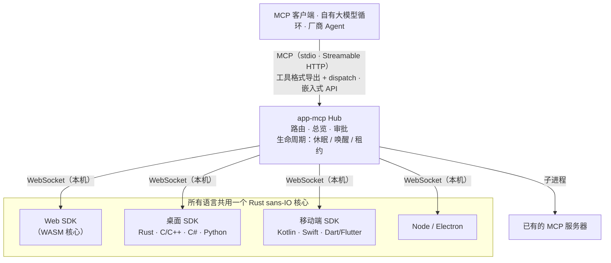

# app-mcp

[English](../README.md) · **简体中文**

> **万物皆工具。**
> App 即能力，界面即声明，调用即唤醒。

app-mcp 让任何 App——网页、桌面、手机——把自己真实的业务动作以 [MCP](https://modelcontextprotocol.io)
工具的形式交给 AI 模型：不改变人的使用方式，也不需要模型去"看屏幕"。一个 Hub 把本机所有 App
接到任意 Agent：Claude Code 等 MCP 客户端、你自己的大模型循环，或设备厂商内置的助手。

## 理念

Unix 说"一切皆文件"：设备、管道、进程都用 `open / read / write` 同一套接口。
"万物皆插件"说：功能以插件的形式装进宿主。

app-mcp 说"**万物皆工具**"：按钮、表单、菜单命令、状态库动作、系统能力、已有的 MCP 服务器，
都以同一种形式表达——名称、参数格式、风险等级、处理函数。模型只需要三个动词：**列出、调用、读取**。

插件是把代码装进宿主；工具则相反——代码留在 App 里，App 声明自己能做什么，由模型来编排。

### 八条原则

1. **在动作所在处声明**：能力就写在它本来所在的地方——React hook、HTML 属性、函数注释、状态库、
   原生 `ToolSpec`。不另外维护一份描述；代码变了，工具跟着变。
2. **声明，而非解析**：不截图、不爬 DOM、不猜哪个按钮能点。App 自己说能做什么，模型拿到的是意图而不是像素。
   界面解析（`@app-mcp/inspect`）只作为默认关闭的兜底。
3. **工具随界面生灭**：打开页签，工具出现；关掉，工具消失；购物车为空，就没有"结算"。
   模型看到的永远是此刻真正能做的事。
4. **不用即睡，用时即醒**：空闲就断开连接、释放线程，不强占进程常驻；需要时由 Hub 用各平台原生方式唤醒，
   一次往返即可恢复。连接是手段，不是负担。
5. **一个枢纽，万端接入**：一个 Hub 同时服务网页、桌面、手机上的 App，对外讲 MCP、OpenAI、Anthropic、
   Gemini 的工具格式，也能直接嵌进厂商自己的 Agent。一次接入，处处可用。
6. **兼容即超集**：WebMCP、App Intents、AppFunctions、Windows App Actions 都能读入，也都能生成。
   不与标准竞争，只负责把它们连起来。
7. **描述不等于授权**：总览告诉模型这个 App 是做什么的，但不赋予任何权限。能否执行由风险等级与审批决定，
   人始终握有确认权。
8. **从源头解决**：问题出在哪一层，就改哪一层；不用转发进程、包装脚本、补丁替换或兜底转换去掩盖它。

## 工作方式



- **App 端 SDK** 注册工具与资源；协议由同一个 Rust 核心（`crates/core`）实现，各语言行为一致。
- **Hub**（`crates/hub`）聚合 App 与上游 MCP 服务器，把调用路由到正确的实例，首次接触时附带简短的 App 总览，
  执行审批，并唤醒休眠的 App。`app-mcp-host` 是它的命令行入口。
- **静态清单**（`app-mcp.json`）让 Hub 在 App 未运行时也能列出其工具并唤醒它。

## 示例

**React**

```tsx
useTool('cart.checkout', {
  description: '结算当前购物车',
  risk: 'payment',
  input: z.object({ addressId: z.string() }),
  handler: ({ addressId }) => checkout(addressId),
})
```

**纯 HTML**

```html
<button data-mcp-tool="cart.clear" data-mcp-desc="清空购物车">清空</button>
```

**函数注释**（配合 `@app-mcp/build`）

```ts
/** 估算某城市的配送天数。 @mcp */
export function deliveryEstimate(city: string, express?: boolean) { … }
```

**自有大模型循环**（嵌入式 Hub，Node）

```ts
const hub = await Hub.start({})
const tools = hub.exportTools('anthropic')            // 交给模型
const results = await handleAnthropicToolUses(hub, response.content)
```

## 平台与包

| 平台 | 包 | 说明 |
|---|---|---|
| Web | `@app-mcp/web`、`@app-mcp/react`、`@app-mcp/dom`、`@app-mcp/store`、`@app-mcp/build` | WASM 核心；WebMCP 兼容；HTML 属性；Zustand / Redux / Pinia；编译期 `@mcp` |
| Node / Electron | `@app-mcp/node`、`@app-mcp/electron` | 主进程 + 渲染进程桥接 |
| Rust（Tauri、egui 等） | `crates/native` | 直接依赖 |
| C / C++ | `bindings/c`、`sdks/cpp` | 稳定 C ABI（`app_mcp.h`） |
| C#（WPF、WinUI） | `sdks/dotnet` | P/Invoke；单实例与协议激活辅助 |
| Kotlin / Android | `sdks/kotlin` | 协程；`WakeReceiver` + 加急 WorkManager |
| Swift（iOS、macOS） | `sdks/swift` | async/await；SwiftUI 生命周期修饰器 |
| Python | `sdks/python` | 同步或 asyncio；Qt / Tk 调度；D-Bus 唤醒 |
| Dart / Flutter | `sdks/dart` | dart:ffi；`AppLifecycleListener` 集成 |
| 系统原生意图 | `crates/codegen` | 生成 App Intents、AppFunctions、Windows App Actions 与类型化接口 |
| Agent / 厂商 | `crates/hub`、`@app-mcp/hub`、`bindings/hub-c`、`bindings/hub-uniffi` | 可嵌入的 Hub：Rust、Node、C/C#、Kotlin、Swift、Python |

## 试用

```bash
# 构建 Host 并以常驻服务运行（一个进程服务所有 MCP 客户端）
cargo build -p app-mcp-host
target/debug/app-mcp-host serve            # 或：app-mcp-host service install（登录自启）

# 启动示例商城，然后在浏览器中打开
pnpm --filter @app-mcp/example-shop dev
```

Host 在 `127.0.0.1:7717`（WebSocket）接收网页 App、在当前用户专属的本地套接字（Unix 域套接字 / Windows 命名管道）接收原生 App，并在 `http://127.0.0.1:7718/mcp` 以 Streamable HTTP 提供 MCP。
仓库的 `.mcp.json` 已让 Claude Code 连接该端点：重启会话、打开示例页面，就可以让 Claude 操作商城。
配置文件、访问令牌与其他 MCP 客户端见 [`crates/host/README.md`](../crates/host/README.md)。

## 文档

| 文档 | 内容 |
|---|---|
| [`spec/protocol.md`](../spec/protocol.md) | SDK ↔ Hub 协议（权威） |
| [`spec/manifest.md`](../spec/manifest.md) | 静态清单 `app-mcp.json` |
| [`spec/lifecycle.md`](../spec/lifecycle.md) | App 生命周期：休眠、唤醒、租约、快速恢复 |
| [`spec/hub-api.md`](../spec/hub-api.md) | 可嵌入 Hub 的 API 与各语言绑定 |
| [`app-mcp-plan.md`](../app-mcp-plan.md) | 完整设计与路线图 |
| [`TASKS.md`](../TASKS.md) | 当前进度 |

## 状态

原型阶段（M1–M2）。协议、核心、Hub 与全部语言 SDK 已实现，并在 Linux 与 Windows 上通过测试，
Android 已真机验证；Apple 平台目前只在 Linux 上验证。API 仍可能变化。

## 许可

可任选 [Apache License 2.0](../LICENSE-APACHE) 或 [MIT](../LICENSE-MIT)。
