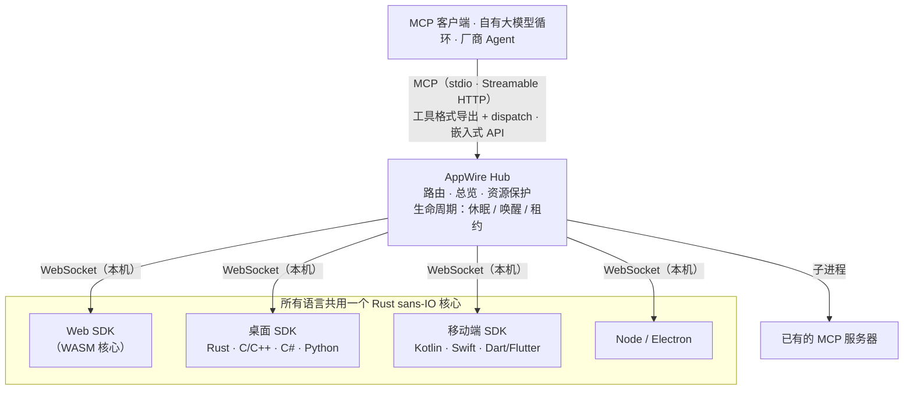

<p align="center">
  <picture>
    <source media="(prefers-color-scheme: dark)" srcset="assets/logo/appwire-logo-dark.png">
    
  </picture>
</p>

# AppWire — 把任何 App 变成 AI Agent 可调用的 MCP 工具

[](#许可)
[](https://modelcontextprotocol.io)
[](https://github.com/stareing/appwire)

[English](../README.md) · **简体中文** · [繁體中文](README.zh-TW.md) · [日本語](README.ja.md) · [한국어](README.ko.md) · [Español](README.es.md) · [Português (Brasil)](README.pt-BR.md) · [Français](README.fr.md) · [Deutsch](README.de.md) · [Русский](README.ru.md) · [Italiano](README.it.md)

**AppWire 是一个开源的 [MCP（Model Context Protocol）](https://modelcontextprotocol.io) SDK 与本机 Hub，
把网页、桌面、手机 App 中真实的业务动作暴露为 AI Agent 可调用的工具**——Claude、ChatGPT、Gemini、
Claude Code 或你自己的大模型循环都能用。工具就声明在已经干活的代码旁边（React hook、HTML 属性、
函数注释、Kotlin / Swift 函数），任何 MCP 客户端都能调用。不截屏、不靠 computer use、不做浏览器自动化。

- **每个平台一个 SDK，共用一个 Rust 核心**：React、纯 HTML、Node、Electron、Tauri、Rust、C/C++、
  C#（WPF、WinUI）、Kotlin / Android、Swift（iOS、macOS）、Python（Qt、Tk）、Dart / Flutter。
- **一个 Hub 接入本机所有 App**：对外提供 MCP（stdio、Streamable HTTP），也能导出 OpenAI、Anthropic、
  Gemini 的工具调用（function calling）格式，或直接嵌入你自己的 Agent。
- **标准进，标准出**：读入并生成 WebMCP、Apple App Intents、Android AppFunctions、Windows App Actions；
  聚合已有的 MCP 服务器。
- **描述不等于授权**：App 声明每个工具做什么（标准 MCP 工具注解：只读、破坏性、幂等、开放世界）；
  是否执行由你的 Agent 决定，支付等高风险步骤由 App 在自己的界面中确认。AppWire 如实传递声明，
  并保护 App 与设备（限流、唤醒上限、大小上限）。

> **万物皆工具。**
> App 即能力，界面即声明，调用即唤醒。

> 项目开发期间的工作名是 **app-mcp**；包名、crate 名与可执行程序名（`@app-mcp/*`、`app-mcp-*`、
> `app-mcp-host`）仍沿用它。

## 目录

[用途与场景](#用途与场景) · [快速开始](#快速开始) · [示例](#示例) · [安装](#安装) · [试用](#试用) · [平台与包](#平台与包) · [工作方式](#工作方式) · [职责范围](#职责范围) ·
[对比](#与其他方案的对比) · [理念](#理念) · [常见问题](#常见问题) · [文档](#文档)

## 用途与场景

AppWire 让 AI 助手像 App 自己那样操作设备上的 App——调用 App 本身的动作，带类型化的参数，沿用用户已有的登录状态和
App 自己的校验——而不是看着屏幕猜该点哪里。App 只需在自己的代码里声明一次能做什么，设备上的任何 Agent——桌面助手、
手机自带的助手、汽车的语音助手或你自己的 LLM 循环——就能发现这些动作、调用它们、读取结果，并在 App 未运行时把它唤醒。
同一份声明同时服务语音、对话和自动化，一次接入覆盖人与设备交流的所有方式。

| 设备 | Agent 在这里能做什么（示例） | App 如何接入 | 现状 |
|---|---|---|---|
| **电脑**：Windows、macOS、Linux | "把这份报告导出为 PDF，附到一封新邮件里"；在 Claude Code、Cursor 或 Claude Desktop 中同时操作桌面 App 和网页 App | Electron、Tauri、C#（WPF、WinUI）、Python（Qt、Tk）、C/C++、Rust；网页经浏览器接入 | 已在 Linux 和 Windows 上测试；Apple 平台仅在 Linux 上验证 |
| **手机**：Android、iOS、HarmonyOS NEXT | "把上周的菜再买一遍"；"把下午 3 点的会议改期并通知参会人"——手机助手直接调用 App 动作，在后台唤醒 App | Kotlin、Swift、Dart/Flutter、ArkTS；助手内嵌 Hub | Android 已真机测试；iOS 与鸿蒙已构建并通过单元测试，尚未真机验证 |
| **平板**：iPadOS、Android、Windows | 针对分屏中每一侧当前显示的内容操作；用一个 App 里的笔记填写另一个 App 的表单 | 与手机、电脑相同的 SDK；工具随当前界面变化 | 同手机、电脑 |
| **汽车智能座舱**：Android Automotive OS、鸿蒙座舱、Linux/Qt 车机 | "导航到最近的空闲充电桩，再放我的驾驶歌单"——语音助手直接调用导航、充电和媒体 App，驾驶中无需触碰屏幕 | Kotlin（Android Automotive）、ArkTS（鸿蒙）、C/C++ 或 Python（Qt）；座舱助手内嵌 Hub（Rust、C、Kotlin） | 与手机、Linux 使用同一套 SDK；尚未在车载系统上验证 |
| **助手与设备厂商** | 一次接入，就能把设备上所有兼容的 App 交给自家助手，以 OpenAI、Anthropic、Gemini 或 MCP 工具格式提供 | 内嵌 Hub：Rust、Node、C/C#、Kotlin、Swift、Python | 见[状态](#状态) |

示例说明的是 App 可以暴露什么，不是内置功能。让交互"深入"而不是脚本化的，是这几点：

- **精确，而非视觉**：Agent 调用 App 真实的动作和类型化 schema，不截图、不按坐标、不做 OCR，所以窗口隐藏、屏幕关闭或驾驶员
  目视前方时同样可用。
- **随时可调用，而不是一直在运行**：工具从 App 的清单中列出，只有被调用时才经平台原生激活唤醒 App；空闲的 App 归还资源。
- **感知当前情境**：工具随界面和 App 状态出现、消失，助手只看到此刻能做的事。
- **跨 App 协同**：一个请求可以组合多个 App 的工具；每个结果都说明动作已完成，还是仍在 App 中等待（例如等用户确认付款）。
- **用户始终掌控**：是否先询问由 Agent 决定，高风险步骤由 App 在自己的界面中确认，用户还可以隐藏或禁止任何 App 或工具
  （`app-mcp-host policy`）。

## 快速开始

把你的 AI Agent 接到本机所有接入了 AppWire 的 App：

```bash
npx appwire-cli setup        # 或：uvx appwire-cli setup
npx appwire-cli uninstall    # 以后撤销 setup 所做的一切
```

`setup` 为当前用户安装 AppWire Host（`app-mcp-host`）：把二进制从包管理器缓存复制到 `~/.app-mcp/bin`，注册登录自启，
并写入检测到的 Agent 的 MCP 配置——Claude Code、Codex、Gemini CLI、Cursor、VS Code（Windsurf 与 Claude Desktop 只打印需手动添加的条目）。
它会备份每个要修改的文件，已有不同的同名条目时不覆盖（加 `--force` 才替换），最后运行 `doctor` 自检，可以重复执行；`--dry-run` 先查看计划。
本机 Agent 不需要访问令牌。重启 Agent、打开接入了 AppWire 的 App，工具就会出现。全局安装（`npm install -g appwire-cli` 或
`uv tool install appwire-cli`）后命令为 `appwire`。

npm 与 PyPI 上的 `appwire-cli` 包随首个版本发布。在此之前请从源码构建：`cargo build -p app-mcp-host`，再运行
`target/debug/app-mcp-host setup`，或按[试用](#试用)操作。

## 示例

**React**

```tsx
useTool('cart.checkout', {
  description: '结算当前购物车',
  risk: 'payment',
  input: z.object({ addressId: z.string() }),
  handler: ({ addressId }) => checkout(addressId),
})
```

**纯 HTML**

```html
<button data-mcp-tool="cart.clear" data-mcp-desc="清空购物车">清空</button>
```

**函数注释**（配合 `@app-mcp/build`）

```ts
/** 估算某城市的配送天数。 @mcp */
export function deliveryEstimate(city: string, express?: boolean) { … }
```

**自有大模型循环**（嵌入式 Hub，Node）

```ts
const hub = await Hub.start({})
const tools = hub.exportTools('anthropic')            // 交给模型；也可 'openai-chat'、'openai-responses'、'gemini'、'mcp'
const results = await handleAnthropicToolUses(hub, response.content)
```

## 安装

各包随首个版本发布；在此之前请按[试用](#试用)从源码构建。

```bash
# Web
npm install @app-mcp/web @app-mcp/react        # 另有：@app-mcp/dom、@app-mcp/store、@app-mcp/build
# Node / Electron
npm install @app-mcp/node @app-mcp/electron
# 把 Hub 嵌入 Node 端 Agent（LangChain.js、Vercel AI SDK、OpenAI / Anthropic SDK）
npm install @app-mcp/hub
# Rust / Tauri v2
cargo add app-mcp-native                       # Tauri：tauri-plugin-app-mcp + @app-mcp/tauri
# 本机 Hub（供 Claude Code、Claude Desktop、Cursor 等 MCP 客户端连接的 MCP 服务器）
cargo install app-mcp-host
```

C/C++、C#、Kotlin、Swift、Python、Dart 的原生 SDK 在 [`sdks/`](../sdks) 与 [`bindings/`](../bindings) 下，各自带构建说明。

## 试用

```bash
# 构建 Host 并以常驻服务运行（一个进程服务所有 MCP 客户端）
cargo build -p app-mcp-host
target/debug/app-mcp-host serve            # 或：app-mcp-host service install（登录自启）
target/debug/app-mcp-host status           # 一行摘要
target/debug/app-mcp-host doctor           # 连不上时：逐项检查，给出结论与修复建议

# 启动示例商城，然后在浏览器中打开
pnpm --filter @app-mcp/example-shop dev
```

Host 只用一个端口 `127.0.0.1:7717`：网页 App 连接 `/app`（WebSocket），MCP 客户端以 Streamable HTTP 连接 `http://127.0.0.1:7717/mcp`，`/healthz` 给出 Host 身份；原生 App 经当前用户专属的本地套接字（Unix 域套接字 / Windows 命名管道）连接，该套接字同样提供 MCP，供支持本地套接字的 Agent 使用。单实例锁保证每个用户只有一个 Host，实际监听位置记录在 `~/.app-mcp/run/endpoints.json`。
仓库的 `.mcp.json` 已让 Claude Code 连接该端点：重启会话、打开示例页面，就可以让 Claude 操作商城。其他 MCP 客户端同理：

```json
{ "mcpServers": { "appwire": { "type": "http", "url": "http://127.0.0.1:7717/mcp" } } }
```

连不上时运行 `app-mcp-host doctor`：检查 Host、单实例锁、本地套接字权限、端口被哪个进程占用、Windows 排除端口段、令牌模式、`adb reverse`，以及各 App 的状态与最近错误；SDK 的连接状态带机器可读的错误码（`spec/protocol.md` 第 10 节）。
配置文件、访问令牌与其他 MCP 客户端见 [`crates/host/README.md`](../crates/host/README.md)。

## 平台与包

| 平台 | 包 | 说明 |
|---|---|---|
| Web | `@app-mcp/web`、`@app-mcp/react`、`@app-mcp/dom`、`@app-mcp/store`、`@app-mcp/build` | WASM 核心；WebMCP 兼容；HTML 属性；Zustand / Redux / Pinia；编译期 `@mcp` |
| Node / Electron | `@app-mcp/node`、`@app-mcp/electron` | 主进程 + 渲染进程桥接 |
| Rust（Tauri、egui 等） | `crates/native` | 直接依赖 |
| Tauri v2 | `crates/tauri-plugin`、`@app-mcp/tauri` | 插件：Rust 工具 + WebView 页面经 Tauri IPC 登记（`@app-mcp/web` 用法不变） |
| C / C++ | `bindings/c`、`sdks/cpp` | 稳定 C ABI（`app_mcp.h`） |
| C#（WPF、WinUI） | `sdks/dotnet` | P/Invoke；单实例与协议激活辅助 |
| Kotlin / Android | `sdks/kotlin` | 协程；`WakeReceiver` + 加急 WorkManager |
| Swift（iOS、macOS） | `sdks/swift` | async/await；SwiftUI 生命周期修饰器 |
| Python | `sdks/python` | 同步或 asyncio；Qt / Tk 调度；D-Bus 唤醒 |
| Dart / Flutter | `sdks/dart` | dart:ffi；`AppLifecycleListener` 集成 |
| 鸿蒙 HarmonyOS NEXT（ArkTS） | `sdks/harmony`（`@app-mcp/harmony`）、`bindings/harmony` | Node-API 原生模块（与 `@app-mcp/node` 同一份绑定源码）；应用前后台与 `Want` 唤醒 |
| 系统原生意图 | `crates/codegen` | 生成 App Intents、AppFunctions、Windows App Actions、鸿蒙意图框架（InsightIntent）与类型化接口 |
| Agent / 厂商 | `crates/hub`、`@app-mcp/hub`、`bindings/hub-c`、`bindings/hub-uniffi` | 可嵌入的 Hub：Rust、Node、C/C#、Kotlin、Swift、Python |

## 工作方式



- **App 端 SDK** 注册工具与资源；协议由同一个 Rust 核心（`crates/core`）实现，各语言行为一致。
- **Hub**（`crates/hub`）聚合 App 与上游 MCP 服务器，把调用路由到正确的实例，首次接触时附带简短的 App 总览，
  原样传递各工具的声明，并唤醒休眠的 App。它不决定调用能否执行，这是 Agent 的职责（嵌入 Hub 的厂商可以通过
  可选的 `ApprovalHandler` 回调接入自己的确认界面）。`app-mcp-host` 是它的命令行入口。
- **静态清单**（`app-mcp.json`）让 Hub 在 App 未运行时也能列出其工具并唤醒它。

## 职责范围

AppWire 是 AI Agent 与 App 之间的通道：只提供机制，不制定策略。它把 App 的声明——工具、输入与输出 schema、MCP 工具注解、内容标注和结果状态——原样转成任何 Agent 都能调用的工具；发现 App、把每次调用路由到正确的实例，并按需唤醒休眠的 App；用取消、超时、分类错误以及说明操作已完成还是待完成的结果，保证通道本身的正确性；用调用频率、唤醒次数和数据大小上限保护 App 与设备；执行用户或厂商写下的隐藏与拒绝规则，自身不做任何判断。是否执行某次调用、要不要询问用户，由 Agent 决定；付款等高风险操作的最终确认由 App 在自己的界面中完成；选择模型、编排提示词、保存 Agent 记忆和读取屏幕都不在它的职责范围内。

## 与其他方案的对比

| 方案 | 模型看到的 | App 未运行时可用 | 平台 |
|---|---|---|---|
| Computer use / 截屏类 Agent | 截图、像素 | 否 | 桌面 |
| 浏览器自动化（如 Playwright MCP） | DOM / 无障碍树 | 否 | 网页 |
| 每个 App 手写一个 MCP 服务器 | 工具，但与 App 代码分开维护 | 视实现而定 | 每个服务器一个 |
| WebMCP | 页面声明的工具 | 否 | 仅浏览器 |
| App Intents / AppFunctions / App Actions | 系统意图 | 是 | 各自一个操作系统 |
| **AppWire** | **App 自己代码里声明的工具** | **是（清单 + 唤醒）** | **网页、桌面、手机** |

AppWire 不取代这些标准：它能读入并生成 WebMCP、App Intents、AppFunctions、Windows App Actions，
也能把已有的 MCP 服务器聚合到同一个 Hub 之后。

## 理念

Unix 说"一切皆文件"：设备、管道、进程都用 `open / read / write` 同一套接口。
"万物皆插件"说：功能以插件的形式装进宿主。

AppWire 说"**万物皆工具**"：按钮、表单、菜单命令、状态库动作、系统能力、已有的 MCP 服务器，
都以同一种形式表达——名称、参数格式、风险等级、处理函数。模型只需要三个动词：**列出、调用、读取**。

插件是把代码装进宿主；工具则相反——代码留在 App 里，App 声明自己能做什么，由模型来编排。

### 九条原则

1. **在动作所在处声明**：能力就写在它本来所在的地方——React hook、HTML 属性、函数注释、状态库、
   原生 `ToolSpec`。不另外维护一份描述；代码变了，工具跟着变。
2. **声明，而非解析**：不截图、不爬 DOM、不猜哪个按钮能点。App 自己说能做什么，模型拿到的是意图而不是像素。
   界面解析（`@app-mcp/inspect`）只作为默认关闭的兜底。
3. **工具随界面生灭**：打开页签，工具出现；关掉，工具消失；购物车为空，就没有"结算"。
   模型看到的永远是此刻真正能做的事。
4. **召之即来，挥之即去**：目标是"永远可调用"，而不是"永远在运行"。发现工具不启动 App——工具从清单和上次快照列出；
   调用时才经各平台原生激活方式唤醒，事情办完即释放连接与线程，把进程交还系统。不强占进程常驻，不为每个 App
   另起常驻服务，进程生命周期归操作系统而不是 AppWire。连接是手段，不是负担。
5. **一个枢纽，万端接入**：一个 Hub 同时服务网页、桌面、手机上的 App，对外讲 MCP、OpenAI、Anthropic、
   Gemini 的工具格式，也能直接嵌进厂商自己的 Agent。一次接入，处处可用。
6. **兼容即超集**：WebMCP、App Intents、AppFunctions、Windows App Actions 都能读入，也都能生成。
   不与标准竞争，只负责把它们连起来。
7. **描述不等于授权**：总览告诉模型这个 App 是做什么的，工具注解说明它做什么，两者都不赋予任何权限。
   调用能否执行由 Agent 与它的用户决定；支付等高风险操作的最终确认归 App，在 App 自己的界面中以它自己的验证完成。
   AppWire 如实传递声明，并保护 App 与设备。
8. **从源头解决**：问题出在哪一层，就改哪一层；不用转发进程、包装脚本、补丁替换或兜底转换去掩盖它。
9. **AI 的每次操作用户都看得见；声明了可撤销的就能撤回**：Agent 在用户的 App 里做了什么，用户始终看得到；
   App 声明为可撤销的操作可以撤回。只是"能做"还不够，还要看得见、改得回。

## 常见问题

**怎么把 React 应用变成 MCP 服务器？**
加上 `@app-mcp/react`，用 `useTool` 包住要暴露的动作，运行 `app-mcp-host`。页面会连到本机 Hub，
组件挂载期间，连接 Hub 的所有 MCP 客户端都能看到这些工具。纯页面可以改用 `@app-mcp/dom` 的 `data-mcp-*` 属性。

**怎么让 Claude（或 ChatGPT、Gemini、Cursor）操作桌面或手机 App？**
用对应平台的 SDK（Electron、Tauri、C#、Kotlin、Swift、Python、Flutter 等）注册工具，让 MCP 客户端连接
`http://127.0.0.1:7717/mcp`。Android App 在开发阶段经 `adb reverse` 连到 Hub。

**每个 App 都要单独写一个 MCP 服务器吗？**
不用。App 都登记到同一个本机 Hub，Hub 就是所有客户端面对的唯一 MCP 服务器；已有的 MCP 服务器也可以作为上游挂在它后面。

**不用 MCP，能在自己的 Agent 里用吗？**
可以。嵌入 Hub（Rust、Node、C/C#、Kotlin、Swift、Python），以 OpenAI、Anthropic 或 Gemini 格式导出工具，
再把模型的工具调用经 Hub 分发回去。见 [`spec/hub-api.md`](../spec/hub-api.md)。

**和 computer use、浏览器自动化有什么不同？**
那些方案让模型读屏幕、猜该点哪里。AppWire 由 App 用带类型的输入格式声明自己的动作，调用精确、快速，
窗口被遮挡时也能用——App 没在运行时也能按需唤醒。

**让模型调用 App 的动作安全吗？**
这件事不由 AppWire 替你决定。每个工具声明自己做什么（以标准 MCP 工具注解表达：只读、破坏性、幂等、开放世界），
AppWire 把这些声明原样交给 Agent；由 Agent（Claude Code、Cursor 或你自己的循环）按它自己的权限设置决定调用
直接执行还是先请你确认。支付等高风险步骤在 App 内、以 App 自己的界面与验证（支付密码、3-D Secure、生物识别）确认。
App 总览本身不授予任何权限。Hub 自己的职责是保护 App 与设备：限流、唤醒上限、大小上限。

**支持 WebMCP 吗？**
支持。`@app-mcp/web/webmcp` 以 polyfill 形式实现 WebMCP 的 `modelContext` API 并做桥接，
按标准写的页面同样经 Hub 暴露。

## 文档

| 文档 | 内容 |
|---|---|
| [`spec/protocol.md`](../spec/protocol.md) | SDK ↔ Hub 协议（权威） |
| [`spec/manifest.md`](../spec/manifest.md) | 静态清单 `app-mcp.json` |
| [`spec/lifecycle.md`](../spec/lifecycle.md) | App 生命周期：休眠、唤醒、租约、快速恢复 |
| [`spec/hub-api.md`](../spec/hub-api.md) | 可嵌入 Hub 的 API 与各语言绑定 |
| [`crates/host/README.md`](../crates/host/README.md) | Host 配置、访问令牌、MCP 客户端 |
| [`llms.txt`](../llms.txt) | 面向大模型与 AI 搜索的项目摘要 |
| [`app-mcp-plan.md`](../app-mcp-plan.md) | 完整设计与路线图 |
| [`TASKS.md`](../TASKS.md) | 当前进度 |

## 状态

原型阶段（M1–M2）。协议、核心、Hub 与全部语言 SDK 已实现，并在 Linux 与 Windows 上通过测试，
Android 已真机验证；Apple 平台目前只在 Linux 上验证。API 仍可能变化。欢迎提 Issue 与 PR。

## 许可

可任选 [Apache License 2.0](../LICENSE-APACHE) 或 [MIT](../LICENSE-MIT)。
