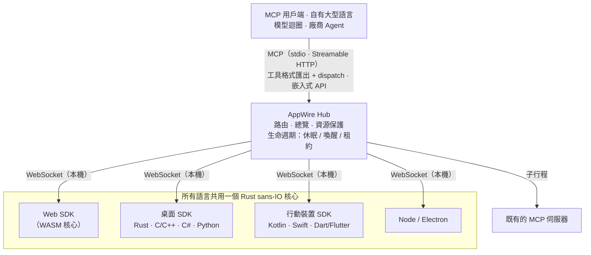

<p align="center">
  <picture>
    <source media="(prefers-color-scheme: dark)" srcset="assets/logo/appwire-logo-dark.png">
    
  </picture>
</p>

# AppWire — 把任何 App 變成 AI Agent 可呼叫的 MCP 工具

[](#授權)
[](https://modelcontextprotocol.io)
[](https://github.com/stareing/appwire)

[English](../README.md) · [简体中文](README.zh-CN.md) · **繁體中文** · [日本語](README.ja.md) · [한국어](README.ko.md) · [Español](README.es.md) · [Português (Brasil)](README.pt-BR.md) · [Français](README.fr.md) · [Deutsch](README.de.md) · [Русский](README.ru.md) · [Italiano](README.it.md)

**AppWire 是一個開源的 [MCP（Model Context Protocol）](https://modelcontextprotocol.io) SDK 與本機 Hub，
把網頁、桌面、手機 App 中真實的業務動作公開為 AI Agent 可呼叫的工具**——Claude、ChatGPT、Gemini、
Claude Code 或你自己的大型語言模型迴圈都能用。工具就宣告在已經在做事的程式碼旁邊（React hook、HTML 屬性、
函式註解、Kotlin / Swift 函式），任何 MCP 用戶端都能呼叫。不截圖、不靠 computer use、不做瀏覽器自動化。

- **每個平台一個 SDK，共用一個 Rust 核心**：React、純 HTML、Node、Electron、Tauri、Rust、C/C++、
  C#（WPF、WinUI）、Kotlin / Android、Swift（iOS、macOS）、Python（Qt、Tk）、Dart / Flutter。
- **一個 Hub 接入本機所有 App**：對外提供 MCP（stdio、Streamable HTTP），也能匯出 OpenAI、Anthropic、
  Gemini 的工具呼叫（function calling）格式，或直接嵌入你自己的 Agent。
- **標準進，標準出**：讀入並產生 WebMCP、Apple App Intents、Android AppFunctions、Windows App Actions；
  彙整既有的 MCP 伺服器。
- **描述不等於授權**：App 宣告每個工具做什麼（標準 MCP 工具註解：唯讀、破壞性、冪等、開放世界）；
  是否執行由你的 Agent 決定，付款等高風險步驟由 App 在自己的介面中確認。AppWire 如實傳遞宣告，
  並保護 App 與裝置（限流、喚醒上限、大小上限）。

> **萬物皆工具。**
> App 即能力，介面即宣告，呼叫即喚醒。

> 專案開發期間的工作名稱是 **app-mcp**；套件名稱、crate 名稱與執行檔名稱（`@app-mcp/*`、`app-mcp-*`、
> `app-mcp-host`）仍沿用它。

## 目錄

[範例](#範例) · [安裝](#安裝) · [試用](#試用) · [平台與套件](#平台與套件) · [運作方式](#運作方式) ·
[比較](#與其他方案的比較) · [理念](#理念) · [常見問題](#常見問題) · [文件](#文件)

## 範例

**React**

```tsx
useTool('cart.checkout', {
  description: '結帳目前的購物車',
  risk: 'payment',
  input: z.object({ addressId: z.string() }),
  handler: ({ addressId }) => checkout(addressId),
})
```

**純 HTML**

```html
<button data-mcp-tool="cart.clear" data-mcp-desc="清空購物車">清空</button>
```

**函式註解**（搭配 `@app-mcp/build`）

```ts
/** 估算某城市的配送天數。 @mcp */
export function deliveryEstimate(city: string, express?: boolean) { … }
```

**自有大型語言模型迴圈**（嵌入式 Hub，Node）

```ts
const hub = await Hub.start({})
const tools = hub.exportTools('anthropic')            // 交給模型；也可用 'openai-chat'、'openai-responses'、'gemini'、'mcp'
const results = await handleAnthropicToolUses(hub, response.content)
```

## 安裝

各套件隨第一個版本發布；在此之前請依[試用](#試用)從原始碼建置。

```bash
# Web
npm install @app-mcp/web @app-mcp/react        # 另有：@app-mcp/dom、@app-mcp/store、@app-mcp/build
# Node / Electron
npm install @app-mcp/node @app-mcp/electron
# 把 Hub 嵌入 Node 端 Agent（LangChain.js、Vercel AI SDK、OpenAI / Anthropic SDK）
npm install @app-mcp/hub
# Rust / Tauri v2
cargo add app-mcp-native                       # Tauri：tauri-plugin-app-mcp + @app-mcp/tauri
# 本機 Hub（供 Claude Code、Claude Desktop、Cursor 等 MCP 用戶端連線的 MCP 伺服器）
cargo install app-mcp-host
```

C/C++、C#、Kotlin、Swift、Python、Dart 的原生 SDK 位於 [`sdks/`](../sdks) 與 [`bindings/`](../bindings) 下，各自附有建置說明。

## 試用

```bash
# 建置 Host 並以常駐服務執行（一個行程服務所有 MCP 用戶端）
cargo build -p app-mcp-host
target/debug/app-mcp-host serve            # 或：app-mcp-host service install（登入時自動啟動）
target/debug/app-mcp-host status           # 一行摘要
target/debug/app-mcp-host doctor           # 連不上時：逐項檢查，給出結論與修復建議

# 啟動範例商店，然後在瀏覽器中開啟
pnpm --filter @app-mcp/example-shop dev
```

Host 只用一個連接埠 `127.0.0.1:7717`：網頁 App 連線 `/app`（WebSocket），MCP 用戶端以 Streamable HTTP 連線 `http://127.0.0.1:7717/mcp`，`/healthz` 提供 Host 身分；原生 App 經由目前使用者專屬的本機通訊端（Unix 網域通訊端 / Windows 具名管道）連線，該通訊端同樣提供 MCP，供支援本機通訊端的 Agent 使用。單一執行個體鎖確保每個使用者只有一個 Host，實際監聽位置記錄在 `~/.app-mcp/run/endpoints.json`。
儲存庫的 `.mcp.json` 已讓 Claude Code 連線到該端點：重新啟動工作階段、開啟範例頁面，就可以讓 Claude 操作商店。其他 MCP 用戶端同理：

```json
{ "mcpServers": { "appwire": { "type": "http", "url": "http://127.0.0.1:7717/mcp" } } }
```

連不上時執行 `app-mcp-host doctor`：檢查 Host、單一執行個體鎖、本機通訊端權限、連接埠被哪個行程占用、Windows 排除連接埠範圍、權杖模式、`adb reverse`，以及各 App 的狀態與最近的錯誤；SDK 的連線狀態附帶機器可讀的錯誤碼（`spec/protocol.md` 第 10 節）。
設定檔、存取權杖與其他 MCP 用戶端請見 [`crates/host/README.md`](../crates/host/README.md)。

## 平台與套件

| 平台 | 套件 | 說明 |
|---|---|---|
| Web | `@app-mcp/web`、`@app-mcp/react`、`@app-mcp/dom`、`@app-mcp/store`、`@app-mcp/build` | WASM 核心；相容 WebMCP；HTML 屬性；Zustand / Redux / Pinia；編譯期 `@mcp` |
| Node / Electron | `@app-mcp/node`、`@app-mcp/electron` | 主行程 + 轉譯器行程橋接 |
| Rust（Tauri、egui 等） | `crates/native` | 直接相依 |
| Tauri v2 | `crates/tauri-plugin`、`@app-mcp/tauri` | 外掛：Rust 工具 + WebView 頁面經由 Tauri IPC 註冊（`@app-mcp/web` 用法不變） |
| C / C++ | `bindings/c`、`sdks/cpp` | 穩定的 C ABI（`app_mcp.h`） |
| C#（WPF、WinUI） | `sdks/dotnet` | P/Invoke；單一執行個體與協定啟用輔助 |
| Kotlin / Android | `sdks/kotlin` | 協程；`WakeReceiver` + 加速 WorkManager |
| Swift（iOS、macOS） | `sdks/swift` | async/await；SwiftUI 生命週期修飾器 |
| Python | `sdks/python` | 同步或 asyncio；Qt / Tk 排程；D-Bus 喚醒 |
| Dart / Flutter | `sdks/dart` | dart:ffi；`AppLifecycleListener` 整合 |
| 系統原生意圖 | `crates/codegen` | 產生 App Intents、AppFunctions、Windows App Actions 與型別化介面 |
| Agent / 廠商 | `crates/hub`、`@app-mcp/hub`、`bindings/hub-c`、`bindings/hub-uniffi` | 可嵌入的 Hub：Rust、Node、C/C#、Kotlin、Swift、Python |

## 運作方式



- **App 端 SDK** 註冊工具與資源；協定由同一個 Rust 核心（`crates/core`）實作，各語言行為一致。
- **Hub**（`crates/hub`）彙整 App 與上游 MCP 伺服器，把呼叫路由到正確的執行個體，首次接觸時附上簡短的 App 總覽，
  原樣傳遞各工具的宣告，並喚醒休眠中的 App。它不決定呼叫能否執行，這是 Agent 的職責（嵌入 Hub 的廠商可以透過
  選用的 `ApprovalHandler` 回呼接入自己的確認介面）。`app-mcp-host` 是它的命令列進入點。
- **靜態清單**（`app-mcp.json`）讓 Hub 在 App 未執行時也能列出其工具並喚醒它。

## 與其他方案的比較

| 方案 | 模型看到的 | App 未執行時可用 | 平台 |
|---|---|---|---|
| Computer use / 截圖類 Agent | 螢幕截圖、像素 | 否 | 桌面 |
| 瀏覽器自動化（如 Playwright MCP） | DOM / 無障礙樹 | 否 | 網頁 |
| 每個 App 手寫一個 MCP 伺服器 | 工具，但與 App 程式碼分開維護 | 視實作而定 | 每個伺服器一個 |
| WebMCP | 頁面宣告的工具 | 否 | 僅瀏覽器 |
| App Intents / AppFunctions / App Actions | 系統意圖 | 是 | 各自一個作業系統 |
| **AppWire** | **App 自己程式碼裡宣告的工具** | **是（清單 + 喚醒）** | **網頁、桌面、手機** |

AppWire 不取代這些標準：它能讀入並產生 WebMCP、App Intents、AppFunctions、Windows App Actions，
也能把既有的 MCP 伺服器彙整到同一個 Hub 之後。

## 理念

Unix 說「一切皆檔案」：裝置、管線、行程都用 `open / read / write` 同一套介面。
「萬物皆外掛」說：功能以外掛的形式裝進宿主。

AppWire 說「**萬物皆工具**」：按鈕、表單、選單命令、狀態庫動作、系統能力、既有的 MCP 伺服器，
都以同一種形式表達——名稱、參數格式、風險等級、處理函式。模型只需要三個動詞：**列出、呼叫、讀取**。

外掛是把程式碼裝進宿主；工具則相反——程式碼留在 App 裡，App 宣告自己能做什麼，由模型來編排。

### 九項原則

1. **在動作所在處宣告**：能力就寫在它本來所在的地方——React hook、HTML 屬性、函式註解、狀態庫、
   原生 `ToolSpec`。不另外維護一份描述；程式碼變了，工具跟著變。
2. **宣告，而非解析**：不截圖、不爬 DOM、不猜哪個按鈕能點。App 自己說能做什麼，模型拿到的是意圖而不是像素。
   介面解析（`@app-mcp/inspect`）只作為預設關閉的備援。
3. **工具隨介面生滅**：開啟分頁，工具出現；關閉，工具消失；購物車為空，就沒有「結帳」。
   模型看到的永遠是此刻真正能做的事。
4. **不用即睡，用時即醒**：閒置就中斷連線、釋放執行緒，不強占行程常駐；需要時由 Hub 以各平台原生方式喚醒，
   一次往返即可恢復。連線是手段，不是負擔。
5. **一個樞紐，萬端接入**：一個 Hub 同時服務網頁、桌面、手機上的 App，對外支援 MCP、OpenAI、Anthropic、
   Gemini 的工具格式，也能直接嵌入廠商自己的 Agent。一次接入，處處可用。
6. **相容即超集**：WebMCP、App Intents、AppFunctions、Windows App Actions 都能讀入，也都能產生。
   不與標準競爭，只負責把它們串起來。
7. **描述不等於授權**：總覽告訴模型這個 App 是做什麼的，工具註解說明它做什麼，兩者都不賦予任何權限。
   呼叫能否執行由 Agent 與它的使用者決定；付款等高風險操作的最終確認歸 App，在 App 自己的介面中以它自己的驗證完成。
   AppWire 如實傳遞宣告，並保護 App 與裝置。
8. **從根源解決**：問題出在哪一層，就改哪一層；不用轉送行程、包裝指令碼、修補替換或備援轉換去掩蓋它。
9. **AI 的每次操作使用者都看得見；宣告了可復原的就能撤回**：Agent 在使用者的 App 裡做了什麼，使用者始終看得到；
   App 宣告為可復原的操作可以撤回。只是「能做」還不夠，還要看得見、改得回。

## 常見問題

**怎麼把 React 應用程式變成 MCP 伺服器？**
加上 `@app-mcp/react`，用 `useTool` 包住要公開的動作，執行 `app-mcp-host`。頁面會連線到本機 Hub，
元件掛載期間，連線到 Hub 的所有 MCP 用戶端都能看到這些工具。純頁面可以改用 `@app-mcp/dom` 的 `data-mcp-*` 屬性。

**怎麼讓 Claude（或 ChatGPT、Gemini、Cursor）操作桌面或手機 App？**
用對應平台的 SDK（Electron、Tauri、C#、Kotlin、Swift、Python、Flutter 等）註冊工具，讓 MCP 用戶端連線到
`http://127.0.0.1:7717/mcp`。Android App 在開發階段經由 `adb reverse` 連線到 Hub。

**每個 App 都要單獨寫一個 MCP 伺服器嗎？**
不用。App 都註冊到同一個本機 Hub，Hub 就是所有用戶端面對的唯一 MCP 伺服器；既有的 MCP 伺服器也可以作為上游掛在它後面。

**不用 MCP，能在自己的 Agent 裡用嗎？**
可以。嵌入 Hub（Rust、Node、C/C#、Kotlin、Swift、Python），以 OpenAI、Anthropic 或 Gemini 格式匯出工具，
再把模型的工具呼叫經由 Hub 分派回去。請見 [`spec/hub-api.md`](../spec/hub-api.md)。

**和 computer use、瀏覽器自動化有什麼不同？**
那些方案讓模型讀螢幕、猜該點哪裡。AppWire 由 App 以帶型別的輸入格式宣告自己的動作，呼叫精確、快速，
視窗被遮住時也能用——App 沒在執行時也能依需求喚醒。

**讓模型呼叫 App 的動作安全嗎？**
這件事不由 AppWire 替你決定。每個工具宣告自己做什麼（以標準 MCP 工具註解表達：唯讀、破壞性、冪等、開放世界），
AppWire 把這些宣告原樣交給 Agent；由 Agent（Claude Code、Cursor 或你自己的迴圈）依它自己的權限設定決定呼叫
直接執行還是先請你確認。付款等高風險步驟在 App 內、以 App 自己的介面與驗證（付款密碼、3-D Secure、生物辨識）確認。
App 總覽本身不授予任何權限。Hub 自己的職責是保護 App 與裝置：限流、喚醒上限、大小上限。

**支援 WebMCP 嗎？**
支援。`@app-mcp/web/webmcp` 以 polyfill 形式實作 WebMCP 的 `modelContext` API 並進行橋接，
依標準撰寫的頁面同樣經由 Hub 公開。

## 文件

| 文件 | 內容 |
|---|---|
| [`spec/protocol.md`](../spec/protocol.md) | SDK ↔ Hub 協定（權威） |
| [`spec/manifest.md`](../spec/manifest.md) | 靜態清單 `app-mcp.json` |
| [`spec/lifecycle.md`](../spec/lifecycle.md) | App 生命週期：休眠、喚醒、租約、快速恢復 |
| [`spec/hub-api.md`](../spec/hub-api.md) | 可嵌入 Hub 的 API 與各語言繫結 |
| [`crates/host/README.md`](../crates/host/README.md) | Host 設定、存取權杖、MCP 用戶端 |
| [`llms.txt`](../llms.txt) | 給大型語言模型與 AI 搜尋的專案摘要 |
| [`app-mcp-plan.md`](../app-mcp-plan.md) | 完整設計與路線圖（簡體中文） |
| [`TASKS.md`](../TASKS.md) | 目前進度（簡體中文） |

## 狀態

原型階段（M1–M2）。協定、核心、Hub 與全部語言 SDK 皆已實作，並在 Linux 與 Windows 上通過測試，
Android 已在實機上驗證；Apple 平台目前只在 Linux 上驗證。API 仍可能變動。歡迎提出 Issue 與 PR。

## 授權

可任選 [Apache License 2.0](../LICENSE-APACHE) 或 [MIT](../LICENSE-MIT)。
