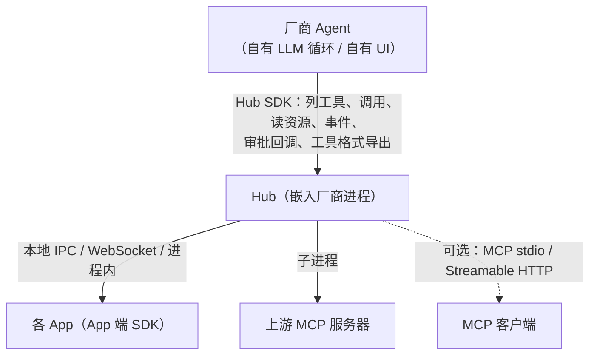

# Hub SDK（Agent 端）接口规范

版本：草案 v0.1（2026-09-30）。本文件是 `crates/hub` 及其各语言绑定之间的契约（权威）。

## 1. 定位

App 端 SDK（`crates/core` 等）让 **App** 暴露工具；Hub SDK 让 **Agent / 助手厂商**
（手机厂商语音助手、车机、PC 助手、IDE、自研 Agent 框架）把"连接本机所有 App"的能力直接嵌进自己的产品，
而不必运行独立的 `app-mcp-host` 进程、也不必走 MCP：



`app-mcp-host` 可执行程序改为 Hub 之上的薄壳：命令行解析 + `Hub::serve_stdio` / `serve_http_with`。
推荐的接入方式是常驻的 `app-mcp-host serve`（一个进程、多个 MCP HTTP 会话共享 App 连接，见 3.6 与 `crates/host/README.md`）。
MCP 只是 Hub 的一种"对外出口"，与格式导出（第 5 节）并列。

## 2. 分层与包

| 包 | 内容 |
|---|---|
| `crates/hub`（`app-mcp-hub`） | Hub 库：注册表、路由、总览、App 连接服务、上游聚合、MCP 出口、格式导出、策略回调。由 `crates/host` 的实现迁移而来 |
| `crates/host`（`app-mcp-host`） | 可执行程序，只含 `main.rs`（命令行）与集成测试 |
| `bindings/hub-c` | C ABI，头文件 `include/app_mcp_hub.h` → C / C++ / C# / Dart |
| `bindings/hub-uniffi` | uniffi → Kotlin（Android 厂商）/ Swift / Python；Kotlin 为 JVM jar `sdks/kotlin/app-mcp-hub` + Android AAR `sdks/kotlin/app-mcp-hub-android`（四 ABI `.so`，R8 规则随 jar 发布） |
| `bindings/hub-node` | napi-rs → npm `@app-mcp/hub`（Electron 助手、Node Agent 框架） |

Hub 自带 tokio 多线程运行时（绑定层创建），Rust 用户可在自有运行时中直接使用 async API。

## 3. Rust API（`app_mcp_hub`）

```rust
pub struct HubConfig {
    // 原 HostConfig 全部字段（manifests、allow_origins、各超时、upstreams）
    pub listen: Option<String>,             // HTTP 服务（/app、/healthz、可选 /mcp），默认 127.0.0.1:7717；None = 不开（3.6）
    pub listen_alternates: Vec<String>,     // listen 被占用时依次尝试，默认 127.0.0.1:7737、127.0.0.1:7757
    pub http: HttpOptions,                  // 令牌（只作用于 /mcp）、allow_remote
    pub mcp_http: bool,                     // listen 与 IPC 端点上是否提供 /mcp，默认 false（3.6、3.8）
    pub run_dir: Option<PathBuf>,           // 单实例锁 + 登记文件目录，默认 None（3.6）
    pub ipc_endpoint: Option<String>,       // 本地 IPC 端点，默认平台默认端点；None = 不开（3.8）
    pub approval: ApprovalPolicy,           // 见 3.3
    pub limits: LimitPolicy,                // 资源保护：限流与大小上限（3.11）
    pub output_validation: OutputValidation, // 结果与 outputSchema 不符时 Off / Log（默认）/ Reject（3.11）
    pub policy: PolicyConfig,               // 策略规则（hide / deny），默认无规则（3.13）
}

impl Hub {
    pub async fn start(config: HubConfig) -> io::Result<Hub>;
    pub fn listen_addr(&self) -> Option<SocketAddr>;          // 实际监听地址（3.6）
    pub fn ipc_endpoint(&self) -> Option<&str>;               // 3.8
    pub fn identity(&self) -> &HostIdentity;                  // service / version / user / pid
    pub fn endpoint_registry(&self) -> EndpointRegistry;      // 登记文件内容（spec/protocol.md 1.7）
    pub async fn shutdown(self);

    // ---- 查询（同步，读快照）----
    pub fn apps(&self) -> Vec<AppInfo>;                       // 含上游（kind = Upstream）
    pub fn tools(&self, filter: &ToolFilter) -> Vec<HubTool>;
    pub fn resources(&self) -> Vec<HubResource>;
    pub fn overview(&self, app_id: &str) -> Option<AppOverviewInfo>;
    pub fn status(&self) -> HubStatus;                        // 运行状态、最近错误、SDK 上报（3.9）

    // ---- 操作 ----
    pub async fn call_tool(&self, req: CallRequest) -> Result<CallOutcome, HubError>;
    pub async fn call_tool_with_progress(&self, req: CallRequest,
        progress: mpsc::UnboundedSender<ProgressUpdate>) -> Result<CallOutcome, HubError>;   // 3.12
    pub fn cancel_call(&self, call_id: &str);
    pub async fn read_resource(&self, uri: &str) -> Result<ResourceContent, HubError>;
    pub fn subscribe(&self, uri: &str) -> Result<(), HubError>;
    pub fn unsubscribe(&self, uri: &str);
    pub fn select_instance(&self, app_id: &str, instance_id: Option<&str>);

    // ---- 事件 ----
    pub fn events(&self) -> tokio::sync::broadcast::Receiver<HubEvent>;

    // ---- 策略回调 ----
    pub fn set_approval_handler(&self, h: Arc<dyn ApprovalHandler>);
    pub fn set_pairing_handler(&self, h: Arc<dyn PairingHandler>);
    pub fn set_policy(&self, p: PolicyConfig) -> Result<(), HubError>; // 3.13
    pub fn policy(&self) -> PolicyStatus;                               // 3.13

    // ---- 对外出口 ----
    pub fn mcp_session(&self) -> McpSession;                  // rmcp ServerHandler
    pub async fn serve_stdio(&self) -> anyhow::Result<()>;
    pub async fn serve_http(&self, addr: &str, allow_remote: bool) -> io::Result<SocketAddr>; // 额外监听器
    pub async fn serve_http_with(&self, addr: &str, options: HttpOptions) -> io::Result<SocketAddr>; // 3.6

    // ---- 工具格式导出（第 5 节）----
    pub fn export_tools(&self, format: ToolFormat, filter: &ToolFilter) -> serde_json::Value;
    pub async fn dispatch(&self, format: ToolFormat, tool_call: serde_json::Value)
        -> serde_json::Value;                                   // 返回该格式的"工具结果"消息
}
```

### 3.1 数据类型

```rust
pub struct AppInfo {
    pub app_id: String, pub name: String, pub kind: AppKind,   // App | Upstream
    pub summary: Option<String>,
    pub connected: bool, pub instances: Vec<InstanceInfo>,
    pub selected_instance: Option<String>,
}
pub struct InstanceInfo { pub instance_id: String, pub client_kind: String,
    pub visibility: Visibility, pub focused: bool, pub last_active_ms: u64,
    pub pid: Option<u32>,    // pid：经本地 IPC 连接的实例进程号（3.8）
    pub connection_id: Option<String> }   // Hub 分配的连接 ID（3.9）；休眠实例为 None

pub struct HubTool {
    pub name: String,            // 全名 "<appId>.<tool>"，与 MCP 出口一致
    pub app_id: String, pub tool: String,
    pub title: Option<String>, pub description: String,
    pub input_schema: Value, pub risk: Risk, pub activation: Activation,
    pub availability: Availability,   // Available | Disconnected | NotRegistered | Dormant
    pub annotations: ToolAnnotations, // Agent 实际看到的 MCP 注解（声明优先，缺少的按 risk 推导；上游原样，spec/protocol.md 3.2）
    pub output_schema: Option<Value>, // App 声明的结果 schema（原样；MCP 出口按需包装）
}
// HubResource 另有 annotations: Option<ContentAnnotations>（App 对资源内容的标注，原样）
pub struct ToolFilter {
    pub apps: Option<Vec<String>>,          // None = 全部
    pub max_risk: Option<Risk>,             // 只要不高于此风险的工具
    pub only_available: bool,               // 默认 false（静态工具也列出，调用时按需唤醒）
    pub include_builtin: bool,              // apps.list / apps.select / apps.overview（渐进暴露时另有 apps.tools），默认 true
    pub session: Option<String>,            // 渐进暴露按此会话计算（3.7）；None = 默认会话
}

pub struct CallRequest {
    pub name: String,                // 全名
    pub arguments: Value,
    pub instance_id: Option<String>, // 指定实例；None 按路由规则
    pub timeout: Option<Duration>,
    pub call_id: Option<String>,     // 供 cancel_call；None 自动生成。以同一 call_id 重试时 App 只执行一次（spec/protocol.md 3.3）
    pub session: Option<String>,     // 厂商会话 ID：用于"首次接触附带总览"按会话计算；None = 默认会话
}
pub struct CallOutcome {
    pub call_id: String,
    pub result: Result<Value, ToolError>,     // ToolError 含 kind / message / details
    pub state_hints: Vec<String>,
    pub instance_id: Option<String>,
    pub overview: Option<AppOverviewInfo>,    // 该会话首次接触此 App 时附带（spec/protocol.md §7）
    pub status: ResultStatus,                 // done（缺省）| pending | partial | noop（spec/protocol.md 3.2）
    pub state_resource: Option<String>,       // pending 时的状态资源 URI（app-mcp://<appId>/<名>）
    pub summary: Option<String>,              // App 给出的一句结论
    pub annotations: Option<ContentAnnotations>, // App 对结果内容的标注（原样）
}

pub enum HubEvent {
    AppConnected { app_id: String, instance_id: String },
    AppDisconnected { app_id: String, instance_id: String },
    ToolsChanged,                                  // 已合并（list_changed_debounce）
    ResourcesChanged,
    ResourceUpdated { uri: String },
    VisibilityChanged { app_id: String, instance_id: String, visibility: Visibility },
    UpstreamState { name: String, connected: bool, error: Option<String> },
    AppDormant { app_id: String, instance_id: String },          // 3.5
    AppWaking { app_id: String, instance_id: Option<String> },   // 3.5；None = 冷启动
    AppDiagnostic { app_id: String, instance_id: String, code: String, message: String, count: u32 }, // SDK 上报（3.9）
}
```

`HubError`：`ToolError` 的包装（同一套错误码，spec/protocol.md §4）。

### 3.2 调用语义

与 MCP 出口完全一致（MCP 出口改为调用 `Hub::call_tool` 实现，不再有第二份逻辑）：
schema 校验 → 策略审批（3.3）→ 路由（selected → focused → 最近活跃 → 最早）→
只有休眠实例注册了该工具（或 App 未运行而清单声明了 `wake`）时先唤醒（3.5）；无法唤醒的静态工具且 App 未连接时返回
`APP_DISCONNECTED`（details 含 `launchUrl`）→ 转发、超时、取消。

App 工具与上游工具在路由 / 审批之前先过资源保护（3.11）：参数大小 → 限流；结果到达后检查结果大小。App 工具的结果再按
`output_validation` 核对 `outputSchema`；上游工具的结果只检查大小、不核对 `outputSchema`（上游 MCP 服务器自己负责其 schema，
结果原样转发）。内置工具 `apps.*` 不受限。

**MCP 出口的工具与结果**（spec/protocol.md 3.2 为唯一定义，此处只列映射）：`tools/list` 的 `annotations` = `HubTool.annotations`，
`outputSchema` = 声明的 schema（根类型非 object 时包装为 `{result}`）；成功结果的内容块依次为：状态说明（`status` 非 `done`）→
`summary` → 返回值 JSON（无返回值、无摘要且 `done` 时为"已完成"）→ 资源变化提示（`stateHints`），App 的内容标注只加在
摘要与返回值块上；`structuredContent` 按 `outputSchema` 决定（无返回值时不填）；`status` 非 `done` 时 `_meta` 带
`app-mcp/status` 与 `app-mcp/stateResource`（键名前缀暂定，第 19 项 R4 核实 MCP `_meta` 命名约定后可能调整）。
资源列表的 `annotations` 为 App 声明的内容注解。Hub API（`CallOutcome`）给出同样的信息：`result` 为原始 `data`（无返回值为 `null`），
另有 `status`、`state_resource`、`summary`、`annotations` 字段。

### 3.3 策略回调（厂商 UI 接管确认）

```rust
pub struct ApprovalPolicy { pub require_at_or_above: Option<Risk> }  // 默认 None：不审批（与现 Host 一致）

#[async_trait]
pub trait ApprovalHandler: Send + Sync {
    /// 返回 false → 调用以 USER_REJECTED 结束。超时（response_timeout）视为拒绝。
    async fn approve(&self, req: ApprovalRequest) -> bool;
}
pub struct ApprovalRequest { pub call_id: String, pub app_id: String, pub app_name: String,
    pub tool: String, pub title: Option<String>, pub description: String,
    pub risk: Risk, pub arguments: Value, pub session: Option<String>,
    pub annotations: ToolAnnotations }      // 与 HubTool.annotations 相同，供厂商按声明决定是否确认

#[async_trait]
pub trait PairingHandler: Send + Sync {
    /// 未知 App（无清单、非本机 Origin 白名单）首次连接时询问；默认实现：拒绝非白名单 Origin、接受其他。
    async fn pair(&self, req: PairingRequest) -> bool;
}
pub struct PairingRequest { pub app_id: String, pub app_name: String,
    pub origin: Option<String>, pub client_kind: String }
```

绑定层把 async trait 映射为"同步回调 + 完成句柄"：外部语言的回调在 Hub 线程上被同步调用、立即返回，
结果稍后在任意线程经句柄回传；回调线程上不要求外部语言有事件循环 / 协程上下文。

- C：`am_hub_approval_cb` + `am_hub_approval_complete(handle, bool)`（配对、唤醒同理）。
- uniffi（Kotlin / Swift / Python）：
  `ApprovalHandler.on_request(req, responder: ApprovalResponder)` → `responder.complete(bool)`；
  `PairingHandler.on_request(req, responder: PairingResponder)` → `responder.complete(bool)`；
  `HubWaker.wake(req, responder: WakeResponder)` → `responder.succeed()` / `responder.fail(kind, reason)`。
  只有第一次完成生效（返回是否生效）；句柄未完成即被释放、回调抛出异常 → 拒绝（唤醒为 `LAUNCH_FAILED`）。
  各语言封装把句柄适配为惯用 API：Kotlin `suspend` handler（在 Hub 的协程作用域、可指定 `CoroutineContext`
  如 `Dispatchers.Main` 中执行）、Swift `async` handler（新 `Task`，需要主线程时标注 `@MainActor`）、
  Python 同步函数（线程池 / `dispatcher`）或 `async def`（设置时的事件循环，无循环时 `asyncio.run`）。

### 3.4 实现补充（v0.1 实现，与上文并存）

- `Hub::call_tool`：工具层面的失败（参数不合法、用户拒绝、超时、App 报错、工具不存在但 App 已知等）放在
  `Ok(CallOutcome).result`；只有名称无法解析（不含 `.`，或 appId / 上游名未知）时返回 `Err(HubError)`。
- `CallRequest.instance_id` 为严格指定：实例不存在或未注册该工具 → `TOOL_NOT_FOUND`。
  `CallRequest.timeout` 同时作为 SDK 侧 `timeoutMs` 的上限。
- `select_instance` 的选择为全局默认（所有会话共用），会话内 `apps.select` 的选择优先；`AppInfo.selected_instance` 反映全局选择。
- 补充字段 / 方法：`ApprovalPolicy.timeout: Option<Duration>`（缺省 `response_timeout`）、
  `HubConfig.pairing_timeout`（默认 120s）、`InstanceInfo.title`、`PairingRequest.instance_id`、
  `AppOverviewInfo`（含注入文本 `text`）、`ResourceContent { uri, mime_type, text, blob }`、
  `HubResource`、`Hub::reset_session(session)`、`Hub::dispatch_in_session(format, call, session)`。
- 风险顺序：read < write < destructive < payment < os-sensitive（协议列举顺序）。
- 审批：策略要求审批但未设置 `ApprovalHandler` → `USER_REJECTED`。MCP 出口的 `ApprovalRequest.session` 为 `mcp:<n>`。
  上游工具的风险取自 annotations（`readOnlyHint` → read，`destructiveHint` → destructive，否则 write）。
- 配对：设置 `PairingHandler` 后，无静态清单或 Origin 不在白名单的 App 握手返回 `pending`，
  handler 结果经 `app/pairingResult` 通知；同意过的 (appId, Origin) 或本 Hub 发出的 token 重连时不再询问。
- `dispatch`：OpenAI `id` / `call_id`、Anthropic `id`、Gemini `id` 同时作为 callId（可 `cancel_call`）。
  `Mcp` 格式也接受完整 JSON-RPC `tools/call` 请求。Gemini 的 `functionResponse.response` 为 `{output}` 或 `{error}`；
  无参数的工具不带 `parameters`；`oneOf` → `anyOf`、`const` → `enum`、`type: [T, "null"]` → `nullable`。
- `attach_local` 返回 `Result<LocalAppChannel, HubError>`，本期总是 `UNSUPPORTED_PROTOCOL`。
- 所有公开数据类型实现 serde（camelCase）；`HubEvent` 以 `{"type": "appConnected", ...}` 形式序列化；
  `CallOutcome.result` 序列化为 `{"ok": …}` / `{"error": {kind, message, details}}`；`Duration` 以毫秒数表示。

### 3.6 HTTP 服务：合并端口、单实例、多会话、令牌、健康检查

一个 HTTP/1.1 服务按路径分流（spec/protocol.md 1.3），同一个路由（`crates/hub/src/http_server.rs` 的 `Router`）
既服务 `listen` 的回环 TCP，也服务本地 IPC 端点（`mcp_http` 同时作用于两者，IPC 上的 `/mcp` 不校验令牌，见 3.8）：

| 路径 | 内容 | 校验 |
|---|---|---|
| `/app`（及兼容期的 `/`） | WebSocket 升级 → App 连接 | `Origin` 在 `app/hello` 时按允许列表 / `PairingHandler` 处理（不在 HTTP 层 403） |
| `/mcp` | MCP Streamable HTTP（`mcp_http` 或额外监听器） | `Origin` 允许列表（403）→ 令牌（401） |
| `/healthz` | `GET` → `Health` JSON | `Origin` 允许列表（403），不需要令牌 |
| `/status` | `GET` → `HubStatus` JSON（3.9） | `Origin` 允许列表（403）→ IPC 直接允许；TCP 必须带有效令牌，未配置令牌时 403 |
| `/policy` | `POST`（请求体为 `PolicyConfig` JSON，≤ 1 MiB）→ `{ok, rules?, error?}`；替换策略规则（3.13） | 同 `/status`；规则不合法时 400，之前的规则继续生效 |

```rust
pub struct HttpOptions {
    pub allow_remote: bool,                  // 允许非回环地址并关闭 Host 头校验
    pub token: Option<String>,               // 本地访问令牌（只作用于 /mcp）；None = 不校验
    pub require_token_without_origin: bool,  // 不带 Origin 的请求是否也必须带令牌
}
pub struct Health {                          // serde camelCase
    #[serde(flatten)] identity: HostIdentity,      // service: "app-mcp", version, user, pid
    listen: Option<String>, ipc_endpoint: Option<String>,
    app_path: "/app", mcp_path: Option<String>,    // 本监听器未开 MCP 时为 None
    token_required_for_browsers: bool,
}
```

- **监听**：`listen` 默认 `127.0.0.1:7717`；`AddrInUse` 时依次绑定 `listen_alternates`（默认 7737、7757，与网页 SDK
  依次握手的端口一致；显式指定 `listen` 时应清空——`app-mcp-host` 与各绑定在显式给出 `listen` 时都清空），
  全部失败返回 `AddrInUse`（消息列出尝试过的地址）。非回环地址需要 `http.allow_remote`，否则 `PermissionDenied`。
  端口 0 由系统分配，`Hub::listen_addr()` 给出实际地址。
- **单实例与登记文件**（spec/protocol.md 1.5、1.7）：`run_dir` 为 `Some` 时，`Hub::start` 在任何绑定之前锁定
  `<run_dir>/hub.lock`（已被锁定 → `ResourceBusy`，消息带持有者 pid 与地址），绑定完成后原子写
  `<run_dir>/endpoints.json`（`Hub::endpoint_registry()` 的内容），`shutdown` / Drop 时删除并释放锁。
  嵌入式 Hub 默认不参与（`None`）；`app-mcp-host` 为 `<配置目录>/run`。
- **身份**：握手结果（`service` / `user` / `pid` 与 `hostVersion`）、`/healthz`、登记文件共用 `Hub::identity()`。
- **额外监听器**：`serve_http_with(addr, options)` 另开一个提供同样路径的 HTTP 服务（总是提供 `/mcp`），用于额外的地址，
  如 `app-mcp-host` 兼容期内显式配置的旧 MCP 端口 7718。可多次调用。
- **多会话**：每个 `Mcp-Session-Id` 对应一个独立的 `McpSession`（会话键 `mcp:<n>`）：`apps.select` 选择、
  “已附带总览版本”、资源订阅按会话保存；App 连接、注册表、上游在所有会话间共享。会话结束（DELETE 或断开）时清理其状态。
  服务器主动通知（`tools/list_changed` 等）经各会话的 GET SSE 流发送。
- 校验顺序（`/mcp`、`/healthz`）：`Origin`（与 App 连接相同的允许列表，不通过 403）→ 路径 → 令牌（仅 `/mcp`）。
  令牌规则：`Authorization: Bearer <令牌>`；带 `Origin` 的请求必须携带；不带 `Origin` 的请求在
  `require_token_without_origin` 时必须携带；携带了错误令牌一律 401（带 `WWW-Authenticate: Bearer`）；空令牌视为未携带。常量时间比较。
  `/app` 非升级请求 426，未知路径 404。
- `/healthz` 不需要令牌（仍受 Origin 校验），供 `app-mcp-host service status` 等确认实例（与登记文件的 pid 一致）、
  以及端口被占用时说明占用者。
- Windows：Hub 启动的子进程（唤醒命令、上游）带 `CREATE_NO_WINDOW`，嵌入无控制台进程时不弹窗。

绑定（`ws_addr` → `listen` 为不兼容改名，没有旧名别名）：C 配置 JSON `listen`（省略 = 默认地址含备选端口；显式地址或
`null` = 只绑该地址 / 不开）、`mcpHttp`、`runDir`，`am_hub_ws_addr` → `am_hub_listen_addr`（`AM_HUB_API_VERSION 3`）；
Node 配置 `listen` / `mcpHttp` / `runDir`，`Hub.wsAddr` → `Hub.listenAddr`（`@app-mcp/hub` 的 `wsUrl` 为 `ws://<listenAddr>/app`）；
uniffi `HubConfig.listen` / `enable_listen` / `mcp_http` / `run_dir`，`ws_addr()` → `listen_addr()`；
C# `HubOptions.Listen` / `DisableListen` / `McpHttp` / `RunDir`，`AppMcpHub.ListenAddress`；
Kotlin / Swift `listenAddr`、Python `listen_addr`（配置参数 `listen` / `enableListen`，Python `enable_listen`）。

### 3.5 生命周期配合：休眠、唤醒、租约（spec/lifecycle.md §9）

**休眠**：SDK 发送 `app/sleep` 时，若本实例有已路由但未完成的调用 / 资源读取，或有等待该实例回连的唤醒，
Hub 返回 `{accepted: false, retryAfterMs: 1000}`；否则生成恢复令牌（128 位随机），把实例从已连接列表移入
**休眠记录**（保留工具 / 资源快照、SDK 上报的 `toolsHash` 与 `wake`），返回 `{accepted: true, resumeToken}`，
发 `HubEvent::AppDormant`，**不**发 `ToolsChanged` / MCP `list_changed`。

- 工具仍列出：只由休眠实例提供的工具 `availability = Dormant`（MCP 描述不加前缀）；资源仍列出（`available = true`，读取时唤醒）。
  `ToolFilter.only_available` 只保留 `Available`，因此不含 `Dormant`。
- `AppInfo.dormant_instances: Vec<InstanceInfo>`（新增字段）列出休眠实例；`connected` 只看已连接实例。
  `apps.list` 每个 App 增加 `dormant`（无已连接实例且有休眠实例）与 `dormantInstances`（`instanceId`、`sleptAt`、`wake`、`tools` 等）。
- 休眠记录保留 `HubConfig.dormant_ttl`（默认 24 小时）；同一 appId 以**新的**实例 ID 连接时（`dormant_replaced_by_new_instance`，默认开）
  移除该 App 的全部休眠记录。记录被移除时发 `AppDisconnected` 与列表变化。

**快速恢复**：`app/hello` 带 `resumeToken` + `toolsHash`，且令牌与该实例的休眠记录一致、`toolsHash` 等于
`app_mcp_protocol::tools_hash(快照)` → `HelloResult.toolsCurrent = true`，Hub 直接沿用快照；否则 `false`（SDK 完整同步）。
恢复令牌一次性：同一实例 ID 回连即消耗休眠记录。需要 `PairingHandler` 重新确认配对的握手不做快速恢复。

**唤醒**：调用 / 读资源时，若没有已连接实例提供该工具 / 资源，而休眠实例的快照中有（选定实例优先，其次最近活跃），
或 App 未运行而清单为当前平台（或 `web`）**显式**声明了 `wake`：

1. 用快照（或清单）中的定义做 schema 校验与审批（拒绝则不唤醒）；
2. 生成一次性 `wakeToken`（128 位随机，`HubConfig.wake_token_ttl` 默认 60 秒），发 `HubEvent::AppWaking`，调用当前 `Waker`；
   同一目标已在唤醒中的并发调用共用一次唤醒；
3. 等待回连：`app/ready` 时 `launchToken` 等于令牌、或实例 ID 与被唤醒的休眠实例相同、或（冷启动时）该 App 的任何实例就绪；
   `HubConfig.wake_timeout`（默认 15 秒）内未回连 → `APP_NOT_RESPONDING`；`Waker` 报错 → 该错误（通常 `LAUNCH_FAILED`）；
4. 按路由（优先回连的实例）派发，不再重复审批。

唤醒描述的解析：休眠时上报的 `wake`（`kind: none` 视为未上报）→ 清单 `wake.<平台>` → 清单 `wake.web`；
`HubConfig.wake_from_launch = true` 时再由清单 `launch.<平台>`（`uri` / `aumid` / `bundle` → `apple-event` / `dbus`）与 `launch.web` 推导。
默认不从 `launch` 推导（避免调用静态工具时自动打开浏览器 / 程序），此时行为与之前相同（`APP_DISCONNECTED` + `launchUrl`）。

```rust
#[async_trait]
pub trait Waker: Send + Sync {
    /// 按描述激活 App；Ok 表示已发出激活，回连由 Hub 等待。
    async fn wake(&self, req: WakeRequest) -> Result<(), HubError>;
}
pub struct WakeRequest {
    pub app_id: String,
    pub instance_id: Option<String>,     // None = 冷启动
    pub descriptor: WakeDescriptor,      // app_mcp_protocol::WakeDescriptor（hub 重新导出）
    pub token: String,                   // 32 个十六进制字符
    pub activation_arg: String,          // "app-mcp-wake:<token>"
}
impl Hub { pub fn set_waker(&self, w: Arc<dyn Waker>); }
```

默认实现 `SystemWaker`（`SystemWaker::action(&req)` 只生成动作不执行：`WakeAction::Command` 或 Windows 的
`WakeAction::ActivateApplication`）：命令用 `tokio::process` 执行固定程序、逐个传参，
不经 shell 拼接；令牌、scheme、AUMID、bundle id、D-Bus 名称、URL 都先校验字符集；子进程 stdio 全部重定向到空设备。

| kind | Windows | macOS | Linux |
|---|---|---|---|
| `uri` | `cmd.exe /d /c start "" <scheme>://app-mcp/wake?token=<t>` | `open -g <uri>` | `xdg-open <uri>` |
| `aumid` | `IApplicationActivationManager::ActivateApplication(<aumid>, "app-mcp-wake:<t>", AO_NONE)`（COM，不启动子进程；参数经 UWP `LaunchActivatedEventArgs.Arguments` / 打包桌面应用的命令行送达，App 已运行时交给现有实例） | — | — |
| `apple-event` | — | `open -g -b <bundle> --args app-mcp-wake:<t>`（参数仅在冷启动时送达） | — |
| `dbus` | — | — | `gdbus call --session --dest <name> --object-path </name/路径> --method org.freedesktop.Application.ActivateAction app-mcp-wake "[<'<t>'>]" "{}"` |
| `web-url` | `rundll32.exe url.dll,FileProtocolHandler <url>#app-mcp-wake=<t>` | `open <url>#…` | `xdg-open <url>#…` |
| `android-intent` | 不支持（`LAUNCH_FAILED`）：Android 上的 Hub 由厂商实现 `Waker` 发送显式广播 | | |
| `none` | `LAUNCH_FAILED` | | |

**唤醒器配置**（`HubConfig.waker: WakerConfig`；`app-mcp-host` 配置 `lifecycle.waker` / 命令行 `--waker`）：

| 值（JSON） | 行为 |
|---|---|
| `"system"`（默认） | `SystemWaker`（上表） |
| `"none"` | 不唤醒：休眠实例 / 未运行 App 的调用与资源读取直接返回 `APP_DISCONNECTED`（`details.launchUrl` 为清单 `launch.web`），不生成令牌、不发 `AppWaking`、不询问审批。休眠仍被接受（工具保持列出） |
| `{"exec": [program, ...args]}` | `ExecWaker`：执行 `program args…`（逐个传参，**不经 shell**）；`WakeRequest` 序列化为一行 camelCase JSON（`{"appId","instanceId","descriptor":{"kind","target","background"},"token","activationArg"}`）写入其 stdin 后关闭；stdout 丢弃，stderr 收集。退出码 0 = 已发出激活（随后等待回连），非 0 → `LAUNCH_FAILED`（附 stderr）；10 秒未退出视为已发出。`exec` 为空时 `Hub::start` 报错 |

`Hub::set_waker` 设置的实现覆盖配置（包括 `none`）。`ExecWaker` 适合厂商脚本、测试替身和平台上没有内置实现的激活方式。

**租约**：MCP 会话或 API 会话每次调用某实例（请求已送达）完成后，Hub 发送 `app/lease { ttlMs }`
（`0` 关闭租约：`HubConfig.lease_ttl = 0`）。MCP 会话关闭、`Hub::reset_session` 时向该会话租约过的实例发送
`ttlMs: 0`；若其他会话对同一实例仍有未到期租约，随后补发剩余时长。

**自适应租约**（4e B2，spec/lifecycle.md 第 13 节；`HubConfig.lease: LeasePolicy`，默认开启）：

```rust
pub struct LeasePolicy {        // Default：adaptive true, window 20, margin 5 s, min 5 s, max 60 s, idle_revoke 30 s
    pub adaptive: bool,         // false = 每次固定 lease_ttl，只在会话结束时收回（4e 之前的行为）
    pub window: u32,            // 统计最近 N 个间隔（≥ 1）
    pub margin: Duration, pub min: Duration, pub max: Duration,   // min ≤ max
    pub idle_revoke: Duration,  // 0 = 不因请求流空闲收回
}
impl LeasePolicy { pub fn validate(&self) -> Result<(), String> }   // Hub::start 调用，不合法 → InvalidInput
pub struct LeaseOverrides {     // JSON 形式（camelCase，未知字段报错）：adaptive / window / marginMs / minMs / maxMs / idleRevokeMs
    pub fn apply(&self, p: &mut LeasePolicy); pub fn merge(&mut self, other: &LeaseOverrides);
}
```

- **间隔样本**：按（会话键, appId）统计：上一次调用完成（发租约）到下一次调用开始的时长。大于 `max` 的间隔视为一轮对话后的停顿，
  不计入。窗口保留最近 `window` 个。
- **租约时长**：样本 ≥ 3 个时 = clamp(p90（最近秩法）+ `margin`, `min`, `max`)；否则用 `lease_ttl`（无历史时的保守默认值）。
- **收回**：会话结束（MCP 会话关闭、`reset_session`）收回其全部租约并删除其统计；**请求流空闲**——会话没有进行中的请求（MCP 的
  `tools/list`、`tools/call`、`resources/list`、`resources/read`、`resources/subscribe`，Hub API 的调用 / 读取）且距最近一次请求活动
  （开始或结束）已达 `idle_revoke`——收回该会话以**默认值**发出、仍未到期的租约（`ttlMs: 0`，其他会话的未到期租约随后补发）。
  自适应租约本身就是对下一次调用的预测，按时到期，不提前收回（收回默认值部分后随 `ttlMs: 0` 补发其剩余时长）。
  SDK 取较大截止时刻（spec/lifecycle.md 4.2），样本凑满后发出的较短自适应租约不会缩短先前的默认值租约，因此 Hub 按（会话, 实例）
  分别记默认值与自适应租约的最晚截止，空闲收回看前者。没有待收回的会话时 Hub 不设定时器。
- **内存上界**：（会话, App）统计与会话活动表各最多 1024 项，超出时淘汰最久未活动（会话：且无进行中请求）的一项。
- **观测**：`HubStatus.lease: Option<LeaseStatus>`（3.9）。

**新增配置**（`HubConfig`）：`lease_ttl`、`wake_timeout`、`wake_token_ttl`、`dormant_ttl`、

**新增配置**（`HubConfig`）：`lease_ttl`、`wake_timeout`、`wake_token_ttl`、`dormant_ttl`、
`dormant_replaced_by_new_instance`、`wake_from_launch`、`waker`。`app-mcp-host` 对应命令行：`--lease-ms`、`--wake-timeout-ms`、
`--wake-from-launch`、`--waker system|none|<JSON>`。

**功耗相关配置（4e，spec/lifecycle.md 第 11–12 节）**：

| `HubConfig` 字段 | 默认 | 含义 | `app-mcp-host` 命令行 / 配置文件（`lifecycle` 下） | hub-c / hub-node JSON |
|---|---|---|---|---|
| `wake_token_ttl` | 60 s | 唤醒令牌有效期（4.4） | `--wake-token-ttl-ms` / `wakeTokenTtlMs` | `wakeTokenTtlMs` |
| `wake_rate_limit: u32` | `DEFAULT_WAKE_RATE_LIMIT` = 6 | 每 App 每 60 秒滑动窗口内最多实际发出的唤醒激活次数；`0` 不限 | `--wake-rate-limit` / `wakeRateLimit` | `wakeRateLimit` |
| `legacy_heartbeat: bool` | `false` | 回退到旧心跳：忽略 SDK 的 `heartbeatMs` 声明，对所有连接发 `ping` 并按无消息断开 | `--legacy-heartbeat` / `legacyHeartbeat` | `legacyHeartbeat` |
| `lease: LeasePolicy` | 见上 | 自适应租约（B2） | `--fixed-lease`、`--lease-window`、`--lease-margin-ms`、`--lease-min-ms`、`--lease-max-ms`、`--lease-idle-revoke-ms` / `lease: {adaptive, window, marginMs, minMs, maxMs, idleRevokeMs}` | `lease`（同左对象；hub-c 不合法 → `AM_HUB_ERR_INVALID_CONFIG`） |

- **心跳（A3）**：握手后按 `app/hello.heartbeatMs` 决定——缺省（旧 SDK）或 `legacy_heartbeat`：每 `ping_interval` 发 `ping`，
  `idle_timeout` / `hidden_idle_timeout` 内无消息断开（原行为）；`0`（本地传输）：不发 `ping`、不做无消息断开，靠连接断开
  （EOF）感知，半开连接由调用的 `response_timeout` 发现；`> 0`：不发 `ping`，无消息断开取 `max(按可见性的配置值, 3 × heartbeatMs)`。
  握手前、等待配对确认期间与多路复用连接级空闲规则不变。
- **唤醒速率上限（O4）**：只对真正要发出激活的唤醒计数（加入已有等待、目标已就绪 / 握手中不计；激活任务开始前已被认领的撤销计数）。
  超出时不激活、不登记等待，调用以工具错误 `LAUNCH_FAILED` 结束，`data` 为 `{ appId, code: "WAKE_RATE_LIMITED", retryAfterMs }`，
  并记为该 App 的最近错误（`code = WAKE_RATE_LIMITED`，spec/protocol.md 10.1）。
- **资源订阅（B3，spec/lifecycle.md 第 13 节）**：实例休眠时 MCP 侧订阅关系保留；实例回连 `app/ready` 后对仍被订阅的资源重新发送
  `resources/subscribe`（同步时已发过的不重复）；读取只由休眠实例提供的资源先唤醒（受 `wake_rate_limit` 约束）。
  App 端是否因订阅保持在线由资源的 `realtime` 声明决定（SDK 侧），Hub 不因订阅拒绝 `app/sleep`。
- 其他绑定：hub-uniffi `HubConfig.wake_rate_limit: u32?`、`legacy_heartbeat: bool?`、`lease: LeaseConfig?`（字段同 JSON，`*_ms: u64?`，
  不合法 → `HubError::InvalidConfig`）；C# `HubOptions.WakeRateLimit`、`LegacyHeartbeat`、`Lease`（`LeaseOptions`：`Adaptive`、`Window`、
  `Margin` / `Min` / `Max` / `IdleRevoke` 为 `TimeSpan?`）；`@app-mcp/hub` `HubConfig.wakeRateLimit`、`legacyHeartbeat`、`lease: LeaseConfig`。

`Hub::reset_waker()`（补充方法）撤销 `set_waker`，恢复按 `HubConfig.waker` 构造的实现；各绑定清除自定义唤醒回调
（C `cb = NULL`、Node / uniffi `setWaker(null)`）时调用它，因此配置为 `none` / `exec` 时清除回调后仍按配置执行。

### 3.7 工具渐进暴露

App / 工具很多时，一次列出全部工具会占满模型上下文。Hub 支持只列出“入口”，模型按需展开：

```rust
pub enum ToolExposure { All, Progressive, Auto }   // serde："all" / "progressive" / "auto"
pub struct HubConfig {
    pub tool_exposure: ToolExposure,               // 默认 Auto
    pub tool_exposure_threshold: usize,            // 默认 40（DEFAULT_TOOL_EXPOSURE_THRESHOLD）
    // …
}
pub const TOOL_APPS_TOOLS: &str = "apps.tools";    // app_mcp_hub::mcp
```

- **是否生效**：`All` 从不；`Progressive` 总是；`Auto` 在 App 工具（注册表列出的，含静态、休眠）与上游工具总数
  **大于** `tool_exposure_threshold` 时生效。每次列出时重新判断（App 连接 / 断开会使结果变化，已有 `ToolsChanged` 覆盖）。
- **生效时的列表**（MCP `tools/list`、`Hub::tools`、`Hub::export_tools`）：内置工具 `apps.list`、`apps.select`、`apps.overview`、
  `apps.tools`，加上**会话已列出的 App** 的全部工具。会话已列出的 App =
  本会话调用过 `apps.tools` 的 App ∪ 本会话调用过其工具的 App（含上游；无论结果成功与否）∪ 本会话 `apps.select` 选定实例的 App ∪
  `Hub::select_instance` 全局选定实例的 App。
- **未生效时**：列表与之前完全相同（不含 `apps.tools`）；已列出的 App 仍照常记录，切换为生效时沿用。
- **会话**：MCP 出口为 `mcp:<n>`；Hub API 由 `ToolFilter.session`（列表 / 导出）与 `CallRequest.session` /
  `dispatch_in_session` 的 `session`（调用）决定，二者用同一 ID 即对应同一会话。`reset_session` / MCP 会话结束时清除。
- **`ToolFilter.apps` 显式给出时**不受渐进暴露影响（列出这些 App 的全部工具），供厂商 UI 使用。
- **`apps.tools`**（`{appId}`，只读）：返回 `{appId, tools: HubTool[], message}`（`HubTool` 为 3.1 的 camelCase 形态，
  含 `inputSchema`）；appId 未知 → `TOOL_NOT_FOUND`。任何模式下都可调用。
- **通知**：会话已列出的 App 因 `apps.tools` / 调用 / `apps.select` 新增时，MCP 出口只向**该会话**发送
  `notifications/tools/list_changed`（不发 `HubEvent::ToolsChanged`）；`Hub::select_instance` 新增 / 移除全局选择且渐进暴露生效时
  按普通列表变化处理（合并后发 `ToolsChanged` 与所有会话的 `list_changed`）。Hub API 调用方在每轮对话重新 `export_tools` 即可。
- **路由不变**：未列出但存在的工具按全名（或导出名）仍可调用；导出名按全部工具（含 `apps.tools`）计算，展开前后稳定。
- **`instructions`**：MCP `initialize` 时渐进暴露已生效，则在 7.2 的文本末尾追加一句说明（先调用 `apps.tools`，也可按全名直接调用）。

配置入口：`app-mcp-host` 配置文件 `tools: {exposure, threshold}`、命令行 `--tool-exposure auto|progressive|all`、
`--tool-exposure-threshold <N>`；C / Node 配置 JSON `toolExposure`、`toolExposureThreshold`（同时新增 `waker`：`"system"` /
`"none"` / `{"exec": [...]}`）；uniffi `HubConfig.tool_exposure: ToolExposure?`、`tool_exposure_threshold: u32?`、
`waker: WakerConfig?`（`System` / `Disabled` / `Exec { argv }`，`Disabled` 即 `"none"`）、`ToolFilter.session`。

### 3.8 本地 IPC 传输

原生 App 默认经本地 IPC（Unix 域套接字 / Windows 命名管道）连接 Hub，网页只能用回环 TCP WebSocket。
端点格式、默认位置、连接鉴权与单实例语义见 spec/protocol.md 第 1 节；两种传输上的消息完全相同。

- `HubConfig.ipc_endpoint: Option<String>`：`unix:<绝对路径>` / `pipe:\\.\pipe\<名称>`，默认
  `app_mcp_protocol::endpoint::default_ipc_endpoint()`（Android / iOS 为 `None`）；`None` = 不开。
  不是 IPC 形式、或本平台不支持时 `Hub::start` 返回 `InvalidInput`；端点已有 Hub 监听时返回 `AddrInUse`。
  Unix 套接字路径超过 `sockaddr_un.sun_path` 上限（`app_mcp_protocol::endpoint::MAX_UNIX_SOCKET_PATH_BYTES`，Linux 107 / macOS 103 字节）
  时在建目录之前返回 `InvalidInput`，错误内含 `ConnectionIssue { code: IPC_PATH_TOO_LONG, .. }`（`err.get_ref()` 可 downcast；
  `Display` 为 `[IPC_PATH_TOO_LONG] …（N 字节，本平台上限 M 字节）：<路径>。建议：…`）。
  与 `listen` 一样，默认值会占用本机唯一的端点：同机器上的第二个 Hub（含测试）应改用其他端点或设为 `None`。
- `Hub::ipc_endpoint()`：实际监听的端点字符串，可直接作为原生 SDK 的 `host_url`。
- `InstanceInfo.pid: Option<u32>`：IPC 连接的对端进程号（操作系统提供）；TCP 连接与休眠实例为 `None`。
  JSON 中为 `pid`，缺省时省略。

绑定：C 配置 JSON `ipcEndpoint`（缺省 = 平台默认端点，`null` = 不开）+ `am_hub_ipc_endpoint`（头文件 v4）；
Node 配置 `ipcEndpoint`（同上）+ `Hub.ipcEndpoint`；uniffi `HubConfig.ipc_endpoint: String?` + `enable_ipc: bool`（默认 `true`）+
`AppMcpHub.ipc_endpoint()` + `InstanceInfo.pid: u32?`；C# `HubOptions.IpcEndpoint` / `DisableIpc` + `AppMcpHub.IpcEndpoint`；
Kotlin `Hub.ipcEndpoint`、Swift `Hub.ipcEndpoint`、Python `Hub.ipc_endpoint`。
`app-mcp-host`：配置文件 `ipcEndpoint`（`"none"` 关闭）、命令行 `--ipc-endpoint <ENDPOINT|none>`。`/healthz` 带 `ipcEndpoint`。

**MCP over IPC**：`mcp_http` 为 `true` 时 IPC 端点上同样提供 `/mcp`（同一个 `Router`，spec/protocol.md 1.3），供厂商 Agent /
支持本地套接字的 MCP 客户端使用。IPC 上不校验令牌（连接级鉴权已确认对端是同一用户，同一用户本可读取令牌文件）；
客户端应核对监听方是同一用户（Unix `SO_PEERCRED` / Windows 管道所有者 SID）。示例：`crates/hub/tests/mcp_ipc.rs`——
Unix 用 rmcp 的 `UnixSocketHttpClient` + `StreamableHttpClientTransport::with_client`（URL `http://localhost/mcp`）完成
initialize → tools/list → tools/call；Windows 用 hyper 客户端经命名管道发 `initialize`。不提供 stdio→HTTP 转发程序。

### 3.9 诊断：运行状态、连接 ID、错误码

```rust
impl Hub { pub fn status(&self) -> HubStatus; }        // GET /status 返回同样的 JSON（camelCase）
pub struct HubStatus {
    #[serde(flatten)] identity: HostIdentity,          // service / version / user / pid
    listen: Option<String>, ipc_endpoint: Option<String>, started_at_ms: u64,
    mcp_http: bool, auth: AuthStatus,                  // { token_configured, token_required_without_origin }
    mcp_sessions: usize,
    apps: Vec<AppStatus>,                              // 按 appId 排序，含上游
    reports: Vec<DiagnosticReport>,                    // 最近 32 条 SDK 上报（MAX_REPORTS），旧的在前
    lease: Option<LeaseStatus>,                        // 4e B2：租约策略与统计（旧 Host 无此字段 → None）
    limits: Option<LimitOverrides>,                    // 第 14 项：资源保护策略（3.11；旧 Host → None）
    output_validation: Option<OutputValidation>,       // 第 19 项 R2（3.11；旧 Host → None）
}
pub struct LeaseStatus { mode: String,                 // adaptive | fixed | off（lease_ttl = 0）
    default_ms, min_ms, max_ms, margin_ms: u64, window: u32, idle_revoke_ms: u64,
    adaptive_grants, default_grants, revoked_session_end, revoked_idle: u64,
    pairs: Vec<LeasePairStatus> }                      // { session, app_id, samples: u32, next_ttl_ms: u64, adaptive: bool }
pub struct AppStatus { app_id, name, kind: AppKind, state: AppState,   // connected | waking | dormant | disconnected
    instances: Vec<InstanceStatus>,                    // InstanceInfo（flatten）+ state: connected | dormant | waking
                                                       //   + power: Option<InstancePower>（4e，见下）
    last_error: Option<LastError>,                     // { code: Option<String>, message, at_ms }
    wakes: u64,                                        // 4e：Hub 启动以来为该 App 实际发出的唤醒激活次数（含冷启动）
    rate_limited: u64, too_large: u64,                 // 第 14 项：启动以来因限流 / 大小上限被拒绝的次数（3.11）
    tools: Vec<ToolDeclaration> }                      // 第 14 项 S5：各工具的 risk 与注解（声明原样 + 实际生效），旧 Host 为空
pub struct InstancePower {                             // 4e 功耗观测（spec/lifecycle.md 第 12 节），JSON 字段可选新增
    reconnects: u64,                                   // 同一 instanceId 完成握手的次数 - 1（Hub 启动以来）
    wakes: u64,                                        // 以该休眠实例为目标实际发出的唤醒激活次数
    online_secs: u64,                                  // 累计在线秒数（含当前连接）
    heartbeats: u64,                                   // Hub 发出的 ping + 收到 SDK 的 ping
    heartbeat_ms: Option<u64>,                         // SDK 声明（app/hello.heartbeatMs）；None = 旧 SDK
    lifecycle_mode: Option<LifecycleMode>,             // SDK 声明（app/hello.lifecycleMode）
    awake_reasons: Vec<AwakeReason> }                  // 已连接实例当前不能休眠的原因：persistent | call | lease | subscription | wake-pending
                                                       // subscription 只计声明 realtime 的资源的订阅（4e B3）
pub struct DiagnosticReport { app_id, instance_id, connection_id, code, message, count: u32, received_at_ms: u64 }
```

- **最近错误**（`last_error`）：握手被拒（带 spec/protocol.md 10.1 的错误码）、配对被拒、唤醒失败 / 超时（工具错误类别，如
  `APP_NOT_RESPONDING`）；上游为进程错误。只因握手被拒出现过的 appId 也列出（`disconnected`）。appId 不合法的握手不记录。
- **SDK 上报**：SDK 的 `app/diagnostic` 通知（spec/protocol.md 10.2）记入 `reports`，同时发 `HubEvent::AppDiagnostic` 并记 warn 日志。
- **连接 ID**：Hub 启动时生成 6 位十六进制标记，每条 App 连接（多路复用时每个通道）的 ID 为 `<标记>-<序号>`，经
  `HelloResult.connectionId` 返回 SDK，`InstanceInfo.connection_id` 与日志字段 `cid` 中相同；MCP 会话为 `mcp-<序号>`。
- **拒绝错误码**：握手被拒时 `HelloResult.code`（`PROTOCOL_INCOMPATIBLE` / `ORIGIN_NOT_ALLOWED` / `INVALID_HELLO` / `REJECTED`），
  配对被拒时 `PairingResultParams.code = PAIRING_REJECTED`。
- **功耗观测**：按 `(appId, instanceId)` 计数，跨重连与休眠保留，Hub 重启清零；最多 1024 个实例（超出时淘汰最久未活动的离线实例），
  休眠记录过期 / 被新实例替换时移除。`awake_reasons` 只含 Hub 可见的原因——App 的 `hold()` 只有 SDK 知道，不在其中。
  `app-mcp-host doctor` 的「App 实例」检查逐实例显示（文本一行摘要，`--json` 在 `details` 中原样给出）。hub-c（JSON）与
  hub-node / `@app-mcp/hub`（`InstanceStatus.power?`、`AppStatus.wakes?`、`HubStatus.lease?`）带上这些字段；hub-uniffi
  `InstanceStatus.power: InstancePower?`（`LifecycleMode`、`AwakeReason` 枚举）、`AppStatus.wakes`、`HubStatus.lease: LeaseStatus?`；C#
  `InstanceStatusInfo.Power`（`InstancePowerInfo`，原因字符串见 `HubAwakeReasons`）、`AppStatusInfo.Wakes`、`HubStatusInfo.Lease`
  （`LeaseStatusInfo`）。`app-mcp-host doctor` 另有「租约」检查（策略、发出 / 收回次数、各（会话, App）下一次租约）。
- `app-mcp-host doctor` / `status` 经本地 IPC（核对监听方用户后）读 `/status`；IPC 关闭时改用 TCP + 令牌。

绑定：

| 绑定 | `status()` | `InstanceInfo.connection_id` | `AppDiagnostic` 事件 |
|---|---|---|---|
| hub-c | `am_hub_status_json`（HubStatus JSON，与 `/status` 相同） | JSON `connectionId` | `{"type":"appDiagnostic","appId","instanceId","code","message","count"}` |
| hub-node / `@app-mcp/hub` | `hub.status(): HubStatus`（TS 类型） | `connectionId?` | 同上（`HubEvent` 联合） |
| C#（`AppMcp.Hub`，基于 hub-c） | `Status()`（`HubStatusInfo`）/ `GetStatus()`（`JsonElement`） | `ConnectionId` | `HubEventTypes.AppDiagnostic` |
| hub-uniffi（Kotlin / Swift / Python） | `status()` → `HubStatus` 记录（已停止时 `HubError::Shutdown`） | `connection_id` 字段 | 专门变体 `HubEvent::AppDiagnostic { app_id, instance_id, code, message, count }` |

uniffi 的 `HubStatus` 把 `identity` 展开为 `service` / `version` / `user` / `pid` 四个字段，`InstanceStatus` 为 `{ info: InstanceInfo, state }`
（JSON 中 `info` 为 flatten），`mcp_sessions` 为 `u64`；其余字段与 JSON 一一对应。

### 3.10 cargo features（能力裁剪）

`app-mcp-hub` 默认 `["mcp-server", "upstream", "schema-validation"]`，与此前行为、公开 API 完全一致。关闭某项时 `HubConfig`
字段与方法签名保留（各绑定源码不需改动），用到该能力时返回明确错误；检查在 `Hub::start` 开头（`features` 模块，常量
`features::{MCP_SERVER, UPSTREAM, SCHEMA_VALIDATION}`）。

| feature | 内容 | 关闭时 |
|---|---|---|
| `mcp-server` | MCP 出口：`/mcp`（Streamable HTTP）、`serve_http(_with)`、`serve_stdio`、`McpSession` | `mcp_http = true` / `serve_http(_with)` → `ErrorKind::Unsupported`（说明缺哪个 feature）；`/mcp` 404；`mcp` 模块、`McpSession`、`Hub::mcp_session`、`Hub::serve_stdio` 不编译 |
| `upstream` | 上游聚合：以子进程启动其他 MCP 服务器并汇入工具 | `upstreams` 非空 → `Unsupported`；`UpstreamConfig` 与配置解析保留 |
| `schema-validation` | 调用前按 inputSchema 校验参数（jsonschema） | `schema::check` 返回 `SchemaCheck::Unchecked`，参数原样交给 App（由 App 的处理函数报参数错误；与 spec/protocol.md 第 6 节"Host 校验参数"不同） |

各绑定把 `ErrorKind::Unsupported` 映射为**专门的错误类别**（不与其他 I/O 错误混在一起；说明文字含缺少的 feature 名，重试无效）：

| 绑定 | 类别 | 其他启动 / 绑定错误 |
|---|---|---|
| hub-uniffi（Kotlin / Swift / Python） | `HubError::Unsupported { detail }`（Kotlin `dev.appmcp.hub.ffi.HubException.Unsupported`——嵌套类别不能经 `dev.appmcp.hub.HubException` typealias 访问；Swift `.Unsupported(detail:)`；Python `HubError.Unsupported`） | `Io { detail }` |
| hub-c | `AM_HUB_ERR_UNSUPPORTED = 10`（`am_hub_start`、`am_hub_serve_http`；说明经 `am_hub_last_error_message`） | `AM_HUB_ERR_IO` |
| hub-node / `@app-mcp/hub` | `HubError.kind` / `code` = `'UNSUPPORTED'`（`BindingErrorCode`） | `'START_FAILED'` |

这些类别为新增（2026-10-01）：此前同类错误分别报 `Io` / `AM_HUB_ERR_IO` / `START_FAILED`。`AM_HUB_API_VERSION` 不变（只新增枚举值）。

HTTP 服务（`/app`、`/healthz`、`/status`）与本地 IPC 始终编译：移动端 App 也经 `ws://127.0.0.1:7717/app` 连接 Hub。
rmcp 的 `server` / `client` 始终开启（模型类型与 `Peer`）。

`bindings/hub-uniffi` 的组合：默认 `["cli", "desktop"]`（`desktop` = 全部能力，jar / wheel / Swift 包用）；`mobile` = 不含上述三项。
`scripts/generate.sh --android` 用 `--no-default-features --features mobile,schema-validation`（保留 Hub 侧参数校验），
`--android-features <list>` 可改（体积优先用 `mobile`，去掉校验）。各组合导出的 uniffi 接口相同。arm64（mobile-release）：完整 8.98 MB（gzip 3.26）、
`mobile,schema-validation` 6.66 MB（2.52）、`mobile` 3.92 MB（1.56）。

### 3.11 资源保护：限流与大小上限（第 14 项 S3 / S4）

保护 App 与设备（调用频率、数据大小）是本库职责；是否确认、是否放行不是（docs/plans/14-safety.md 第 1 节）。超出时返回明确错误，
不静默丢弃、不截断。错误码（`RATE_LIMITED` -32016、`PAYLOAD_TOO_LARGE` -32017）与 `data` 字段的唯一定义见 spec/protocol.md 第 4 节。

| `HubConfig` 字段 | 默认 | 含义 | `app-mcp-host` 命令行 / 配置文件 | hub-c / hub-node JSON |
|---|---|---|---|---|
| `limits.tool_rate: RateLimit` | 每分钟 120 次、突发 30 | 每（App, 工具）的令牌桶：每分钟补充 `per_minute` 个，最多攒 `burst` 个；`per_minute = 0` 不限 | `--tool-rate-limit`、`--tool-rate-burst` / `limits.toolRatePerMinute`、`toolRateBurst` | `limits.toolRatePerMinute`、`toolRateBurst` |
| `limits.app_rate: RateLimit` | 每分钟 600 次、突发 60 | 每 App（所有工具合计）的令牌桶 | `--app-rate-limit`、`--app-rate-burst` / `limits.appRatePerMinute`、`appRateBurst` | 同左 |
| `limits.max_arguments_bytes: u64` | 1 MiB | 调用参数序列化后的字节上限；0 不限 | `--max-arguments-bytes` / `limits.maxArgumentsBytes` | 同左 |
| `limits.max_result_bytes: u64` | 4 MiB | App 回给 Hub 的整个结果（含 `summary`）序列化后的字节上限；上游结果同样适用；0 不限 | `--max-result-bytes` / `limits.maxResultBytes` | 同左 |
| `limits.max_resource_bytes: u64` | 4 MiB | 资源内容（文本 / base64）的字节上限；0 不限 | `--max-resource-bytes` / `limits.maxResourceBytes` | 同左 |
| `output_validation: OutputValidation` | `Log` | App 工具的结果与声明的 `outputSchema` 不符时（上游工具不核对）：`Off` 不校验 / `Log` 只记 warn 日志、照常返回 / `Reject` 调用以 `HANDLER_ERROR` 结束（`details.outputSchemaError`）。无返回值不校验；未启用 `schema-validation` 时不校验 | `--output-validation off\|log\|reject` / `tools.outputValidation` | `outputValidation` |

- JSON 形式 `LimitOverrides`（`{toolRatePerMinute, toolRateBurst, appRatePerMinute, appRateBurst, maxArgumentsBytes, maxResultBytes,
  maxResourceBytes}`，缺省字段取默认，未知字段报错）为各绑定与配置文件共用；`per_minute > 0` 而 `burst = 0` 时 `Hub::start` 返回
  `InvalidInput`（host：配置无效；hub-c：`AM_HUB_ERR_INVALID_CONFIG`）。默认值宽松：只拦失控循环与异常数据，均低于 WebSocket
  单条消息 64 MiB 的上限（tungstenite 默认，超过时连接被断开而不是返回错误）。
- 检查顺序：参数大小 → 两级限流（两级都有令牌才各扣一个；任一级不足都不扣，`retryAfterMs` 取较长的等待）→ 路由 / 审批 / 唤醒
  （被限流的调用不会唤醒 App、不会触发审批）→ 转发 → 结果大小 → `outputSchema` 核对（只对 App 工具；上游工具的结果只检查大小）。`result` 超限时调用可能已在 App 内执行（错误信息如实说明）。
- 计数：`AppStatus.rate_limited` / `too_large`（Hub 启动以来被拒绝的次数）；`HubStatus.limits`（`LimitOverrides`，全部字段给出）与
  `HubStatus.output_validation`。令牌桶表最多 4096 个、计数表最多 1024 个 App（超出时淘汰，见 `crates/hub/src/limits.rs`）。
- `app-mcp-host doctor`：「资源保护」检查显示策略与各 App 被拒绝次数（有拒绝时为注意）；「工具声明」检查逐个列出每个工具的
  `risk` 与 Agent 实际看到的注解（`readOnlyHint` / `destructiveHint` / `idempotentHint` / `openWorldHint` / `title`，注明是声明的还是按
  `risk` 推导的、是否有 `outputSchema`），`--json` 的 `details` 原样给出 `AppStatus.tools`（`ToolDeclaration { name, risk, annotations?, effective, output_schema }`）。

### 3.12 进度与取消（第 16 项 O2）

App 报告进度的消息与 SDK 行为见 spec/protocol.md 3.3（唯一定义）；Hub 侧只做转发与保护 Agent：

- **接收方**：MCP 出口——`tools/call` 请求带 `_meta.progressToken` 时，进度以 `notifications/progress { progressToken, progress,
  total?, message? }` 发给该会话（rmcp `Peer::notify_progress`）；Hub API——`Hub::call_tool_with_progress` 的 `progress` 通道收到
  `ProgressUpdate { progress, total, message }`。没有接收方时（普通 `call_tool`、MCP 请求不带 token）进度被丢弃。上游 MCP 服务器的进度不转发。
- **合并**：`HubConfig::progress_interval`（默认 250 ms；`app-mcp-host` 配置文件 `tools.progressIntervalMs`）——两次转发至少间隔该时长，
  间隔内只保留最新一条、到期再发；0 = 不合并。任何情况下不递增的进度都丢弃（MCP 要求递增），`message` 截断到 200 字符
  （`crates/hub/src/progress.rs`）。调用结束时未发出的进度丢弃。
- **路由**：只接受被路由到该调用的那条 App 连接发来的 `tools/progress`，其他连接以同一 `callId` 发来的进度忽略（记 warn 日志）。
- **取消**：MCP `notifications/cancelled`（rmcp 取消请求的 `CancellationToken`）与 `Hub::cancel_call` 共用一条路径：等待审批 / 唤醒中
  直接结束；已转发给 App 时发送 `tools/cancel`，SDK 取消 handler（各语言的取消信号 / 监听），调用以 `CANCELLED` 结束。

### 3.13 策略挂点（第 16 项 P2、第 18 项 L5）

类比 LSM：本库只提供**执行点**，不内置任何判断；规则由用户（常驻 Host）或厂商（嵌入式 Hub）写。**没有规则时所有执行点直接放行，
行为与没有策略时完全一致**。按 Agent 区分的规则依赖 Agent 任务对象（docs/plans/16-agent-os.md P1），尚未支持。
实现：`crates/hub/src/policy.rs`（纯数据与匹配）。

**执行点**（`PolicyHook`）：

| 执行点 | 位置 | 使用的动作 |
|---|---|---|
| `list` | MCP `tools/list`、`resources/list`、`instructions` 中的 App 简介；`apps.list` / `apps.tools` / `apps.overview`；Hub API `apps()` / `tools()` / `export_tools()` / `resources()` / `overview()` | `hide` |
| `call` | 名称解析之后，资源保护（3.11）、审批（3.3）、唤醒之前；App 工具与上游工具（内置 `apps.*` 不受影响） | `hide`、`deny` |
| `wake` | 调用 / 资源读取需要唤醒休眠或未运行的 App 时，发起唤醒之前（3.5） | `deny` |
| `handle` | 数据句柄访问（第 17 项）：只定义执行点，尚未接入；规则写 `handle` 时校验报错 | — |

**动作**：

- `hide`：App / 工具不出现在任何列表中；调用按不存在处理（App 整体隐藏 = appId 未知：Hub API `Err(TOOL_NOT_FOUND)`；工具隐藏 =
  结果中的 `TOOL_NOT_FOUND`），资源读取 / 订阅按 `RESOURCE_NOT_FOUND`，隐藏 App 的资源变化不再通知；`apps.select` 隐藏的 App 与没有该实例相同。
  错误信息与真正不存在时相同，不提及规则。`hide` **只能全局生效**（MCP 2026-07-28 要求列表不得按连接变化）。
  `/status`、`doctor`、`HubEvent` 仍包含被隐藏的 App（诊断用）。App 提供的总览正文按原样给出（本库不改写 App 的文字）。
- `deny`：可见，在 `hooks` 指定的执行点拒绝，返回 `POLICY_DENIED`（错误码与 `data` 的唯一定义见 spec/protocol.md 第 4 节；只附命中规则的
  `id`，不附规则内容）。被拒绝的调用不转发、不唤醒、不触发审批、不消耗限流令牌。

**规则**（`PolicyConfig`，`HubConfig.policy`、`Hub::set_policy`、`<home>/policy.json`、各绑定共用的 JSON 形式，未知字段报错）：

```json
{ "rules": [
  { "id": "hide-notes", "action": "hide", "app": "notes" },
  { "id": "no-admin",   "action": "hide", "app": "shop", "tool": "admin.*" },
  { "id": "no-destroy", "action": "deny", "app": "*", "annotations": { "destructiveHint": true } },
  { "id": "no-wake-music", "action": "deny", "app": "music", "hooks": ["wake"] }
] }
```

| 字段 | 含义 |
|---|---|
| `id` | `[A-Za-z0-9_.-]{1,64}`，规则集中唯一 |
| `action` | `hide` / `deny` |
| `app` | appId（或上游名）：精确名，或以 `*` 结尾的前缀（`shop*`）；`*` 匹配全部。`*` 只能在末尾 |
| `tool` | 可选，工具局部名（不含 appId），规则同 `app` |
| `annotations` | 可选，`readOnlyHint` / `destructiveHint` / `idempotentHint` / `openWorldHint` 的布尔值（至少一项）：每项都与工具的注解（`HubTool.annotations`，Agent 实际看到的）相等才命中；工具**没有声明**该项时不命中（本库不按 MCP 缺省值推断）。这是用户的规则引用 App 的声明，本库不推断风险、不改写声明 |
| `hooks` | 只用于 `deny`：`call` / `wake` 的非空子集，缺省 `["call"]`。`hide` 不能写 |

- 作用范围：`tool` 与 `annotations` 都缺省 → 整个 App（`hide` 时连同资源、`apps.list` 中的条目；不针对具体工具的唤醒——资源读取——只匹配这类规则）；
  否则只作用于匹配的工具（`apps.list` 中实例的 `tools` 与 `staticToolCount` 同样去掉被隐藏的工具）。
- 匹配顺序：按规则顺序，`hide` 先于 `deny`；`deny` 取第一条命中的规则。规则最多 `MAX_POLICY_RULES`（1024）条。
- `Hub::start`：规则不合法 → `InvalidInput`。`Hub::set_policy`：不合法 → `INVALID_INPUT`，**之前的规则继续生效**，错误记入
  `PolicyStatus.last_error`；成功时命中计数清零，并按工具 / 资源列表变化通知（`ToolsChanged` / `ResourcesChanged`、MCP `list_changed`）。
- 状态：`Hub::policy()` / `HubStatus.policy`：`PolicyStatus { rules: [PolicyRule + hits], loaded_at_ms, last_error? }`。`hits` = 该规则拒绝或按不存在处理的
  调用 / 唤醒 / 资源读取次数（列表过滤不计）。
- 厂商回调：`ApprovalHandler`（3.3）保留，是调用执行点上的回调形态（在规则之后、转发之前）；不新增其他回调。

**常驻 Host**：规则文件 `<home>/policy.json`（`PolicyConfig` JSON）。

- 启动（`serve` / `stdio`）时加载；文件不存在 = 无规则；文件不合法时**拒绝启动**（不在规则失效的情况下静默放行）。
- `app-mcp-host policy reload`：把文件原文交给运行中的 Host（`POST /policy`，经本地 IPC 或 TCP + 令牌）；不合法时 Host 保留之前的规则，
  命令退出码 1；Host 未运行时退出码 3。`policy validate [FILE]` 只校验；`policy show [--json]` 显示文件与生效规则、命中次数、最近的重载错误；
  `policy hide <app> [--tool T] [--id ID]`、`policy deny <app> [--tool T] [--wake] [--id ID]`、`policy remove <id>` 编辑文件（临时文件 + rename）
  并在 Host 运行时立即重载。按注解匹配等完整写法直接编辑文件后 `reload`。
- `doctor`「策略规则」检查：生效规则与命中次数；规则文件不合法、最近一次重载失败为错误；文件与生效规则不一致（未重载）为注意。
- Host 不支持调用外部程序做判断（避免执行任意进程）；需要时由厂商嵌入 Hub 并用 `ApprovalHandler`。

**绑定**：hub-c 配置 JSON `policy` 与 `am_hub_set_policy(hub, policy_json)`；hub-node 配置 `policy` 与 `setPolicy`；uniffi `HubConfig.policy`、
`Hub.set_policy`；各语言封装同名（`Policy` / `SetPolicy`、`policy` / `set_policy`）。生效规则与命中次数在各绑定的状态（`HubStatus.policy`）中。

## 4. 进程内 App（可选，M2）

`Hub::attach_local(hello) -> LocalAppChannel`：厂商自带的系统 App 与 Hub 同进程时，
不走 WebSocket，直接交换协议消息（`app_mcp_protocol::Message`）。本期只预留签名，可不实现。

## 5. 工具格式导出与分派

厂商自有 LLM 循环时不需要 MCP：

| `ToolFormat` | `export_tools` 输出 | `dispatch` 输入 → 输出 |
|---|---|---|
| `Mcp` | `[{name, title, description, inputSchema, annotations, outputSchema?}]`（`annotations` = `HubTool.annotations`；`outputSchema` 同 MCP 出口） | `{name, arguments}` → MCP `CallToolResult` JSON |
| `OpenAiChat` | `[{type:"function", function:{name, description, parameters}}]` | `{id, type:"function", function:{name, arguments:"<json 字符串>"}}` → `{role:"tool", tool_call_id, content}` |
| `OpenAiResponses` | `[{type:"function", name, description, parameters}]` | `{type:"function_call", call_id, name, arguments}` → `{type:"function_call_output", call_id, output}` |
| `Anthropic` | `[{name, description, input_schema}]` | `{type:"tool_use", id, name, input}` → `{type:"tool_result", tool_use_id, content, is_error?}` |
| `Gemini` | `{functionDeclarations:[{name, description, parameters}]}` | `{name, args}`（functionCall）→ `{functionResponse:{name, response}}` |

**名称编码**：OpenAI / Anthropic 名称只允许 `[a-zA-Z0-9_-]{1,64}`，不能含 `.`。
导出名 = 全名把 `.` 换成 `__`；若冲突或超长，截断并追加 `_<4 位十六进制哈希>`。
Hub 保存双向映射，`dispatch` 同时接受导出名与全名。`Mcp`、`Gemini` 也使用同一导出名以保持一致（Gemini 实测不接受部分字符时不致出错）。

**Schema 适配**：OpenAI strict 模式不在本期；导出原样 JSON Schema，只去掉 `$schema`。
Gemini 不支持的关键字（`additionalProperties`、`$ref` 等）在 `Gemini` 格式中剔除。

**结果内容**：成功 → JSON 文本（与 MCP 出口一致，含 `stateHints`；首次接触附带总览文本）；
失败 → `is_error` / 错误文本 `<KIND>: <message>`（如 `USER_REJECTED: …`），与 MCP 出口一致。

**描述增强**：导出时在描述末尾追加 `（风险：payment）` 之类标记，仅当 risk 不是 read/write。

## 6. C ABI 要点（`bindings/hub-c/include/app_mcp_hub.h`）

- 前缀 `am_hub_`；`AM_HUB_API_VERSION 3`（v3：`am_hub_listen_addr`、配置 `listen`）；与 `app_mcp.h` 相同的字符串所有权规则（回调中字符串由接收方 `am_string_free`）。
- 所有复杂结构以 JSON 字符串传递（`am_hub_tools_json(hub, format, filter_json)`、`am_hub_call(hub, request_json, cb, user_data)`），避免 ABI 膨胀。
- 事件：`am_hub_set_event_cb(hub, cb(event_json, user_data))`。
- 回调在 Hub 的分发线程上执行，不在调用方线程。

## 7. 测试要求

- Hub 单元测试 + 迁移后的 Host 全部集成测试保持通过（MCP 出口行为不变）。
- 每种 `ToolFormat` 的导出与 `dispatch` 往返测试（对 fake App 实例）。
- 审批：拒绝 → `USER_REJECTED`；超时 → 拒绝；低于阈值不询问。
- 策略（3.13）：`hide` 的 App / 工具不在任何列表中、调用按不存在；`deny` → `POLICY_DENIED`（只附规则 id）；不合法的规则不生效且保留旧规则；无规则时行为不变。
- 会话维度的总览首次附带：两个 `session` 各附带一次。
- 绑定：各语言用 `app-mcp-native` 的 App 端 SDK（或 `fake_app`）连上嵌入式 Hub，完成列工具 + 调用 + 事件 + 审批。
