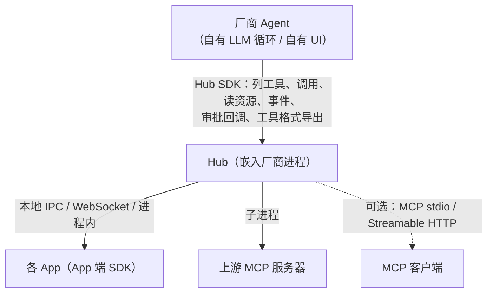

# Hub SDK（Agent 端）接口规范

版本：草案 v0.1（2026-09-30）。本文件是 `crates/hub` 及其各语言绑定之间的契约（权威）。

## 1. 定位

App 端 SDK（`crates/core` 等）让 **App** 暴露工具；Hub SDK 让 **Agent / 助手厂商**
（手机厂商语音助手、车机、PC 助手、IDE、自研 Agent 框架）把"连接本机所有 App"的能力直接嵌进自己的产品，
而不必运行独立的 `app-mcp-host` 进程、也不必走 MCP：



`app-mcp-host` 可执行程序改为 Hub 之上的薄壳：命令行解析 + `Hub::serve_stdio` / `serve_http_with`。
推荐的接入方式是常驻的 `app-mcp-host serve`（一个进程、多个 MCP HTTP 会话共享 App 连接，见 3.6 与 `crates/host/README.md`）。
MCP 只是 Hub 的一种"对外出口"，与格式导出（第 5 节）并列。

## 2. 分层与包

| 包 | 内容 |
|---|---|
| `crates/hub`（`app-mcp-hub`） | Hub 库：注册表、路由、总览、App 连接服务、上游聚合、MCP 出口、格式导出、策略回调。由 `crates/host` 的实现迁移而来 |
| `crates/host`（`app-mcp-host`） | 可执行程序，只含 `main.rs`（命令行）与集成测试 |
| `bindings/hub-c` | C ABI，头文件 `include/app_mcp_hub.h` → C / C++ / C# / Dart |
| `bindings/hub-uniffi` | uniffi → Kotlin（Android 厂商）/ Swift / Python |
| `bindings/hub-node` | napi-rs → npm `@app-mcp/hub`（Electron 助手、Node Agent 框架） |

Hub 自带 tokio 多线程运行时（绑定层创建），Rust 用户可在自有运行时中直接使用 async API。

## 3. Rust API（`app_mcp_hub`）

```rust
pub struct HubConfig {
    // 原 HostConfig 全部字段（ws_addr、manifests、allow_origins、各超时、upstreams）
    pub ws_addr: Option<String>,            // None = 不开 WebSocket 服务（仅进程内 / 上游）
    pub ipc_endpoint: Option<String>,       // 本地 IPC 端点，默认平台默认端点；None = 不开（3.8）
    pub approval: ApprovalPolicy,           // 见 3.3
}

impl Hub {
    pub async fn start(config: HubConfig) -> io::Result<Hub>;
    pub fn ws_addr(&self) -> Option<SocketAddr>;
    pub fn ipc_endpoint(&self) -> Option<&str>;               // 3.8
    pub async fn shutdown(self);

    // ---- 查询（同步，读快照）----
    pub fn apps(&self) -> Vec<AppInfo>;                       // 含上游（kind = Upstream）
    pub fn tools(&self, filter: &ToolFilter) -> Vec<HubTool>;
    pub fn resources(&self) -> Vec<HubResource>;
    pub fn overview(&self, app_id: &str) -> Option<AppOverviewInfo>;

    // ---- 操作 ----
    pub async fn call_tool(&self, req: CallRequest) -> Result<CallOutcome, HubError>;
    pub fn cancel_call(&self, call_id: &str);
    pub async fn read_resource(&self, uri: &str) -> Result<ResourceContent, HubError>;
    pub fn subscribe(&self, uri: &str) -> Result<(), HubError>;
    pub fn unsubscribe(&self, uri: &str);
    pub fn select_instance(&self, app_id: &str, instance_id: Option<&str>);

    // ---- 事件 ----
    pub fn events(&self) -> tokio::sync::broadcast::Receiver<HubEvent>;

    // ---- 策略回调 ----
    pub fn set_approval_handler(&self, h: Arc<dyn ApprovalHandler>);
    pub fn set_pairing_handler(&self, h: Arc<dyn PairingHandler>);

    // ---- 对外出口 ----
    pub fn mcp_session(&self) -> McpSession;                  // rmcp ServerHandler
    pub async fn serve_stdio(&self) -> anyhow::Result<()>;
    pub async fn serve_http(&self, addr: &str, allow_remote: bool) -> io::Result<SocketAddr>;
    pub async fn serve_http_with(&self, addr: &str, options: HttpOptions) -> io::Result<SocketAddr>; // 3.6

    // ---- 工具格式导出（第 5 节）----
    pub fn export_tools(&self, format: ToolFormat, filter: &ToolFilter) -> serde_json::Value;
    pub async fn dispatch(&self, format: ToolFormat, tool_call: serde_json::Value)
        -> serde_json::Value;                                   // 返回该格式的"工具结果"消息
}
```

### 3.1 数据类型

```rust
pub struct AppInfo {
    pub app_id: String, pub name: String, pub kind: AppKind,   // App | Upstream
    pub summary: Option<String>,
    pub connected: bool, pub instances: Vec<InstanceInfo>,
    pub selected_instance: Option<String>,
}
pub struct InstanceInfo { pub instance_id: String, pub client_kind: String,
    pub visibility: Visibility, pub focused: bool, pub last_active_ms: u64,
    pub pid: Option<u32> }   // pid：经本地 IPC 连接的实例进程号（3.8）

pub struct HubTool {
    pub name: String,            // 全名 "<appId>.<tool>"，与 MCP 出口一致
    pub app_id: String, pub tool: String,
    pub title: Option<String>, pub description: String,
    pub input_schema: Value, pub risk: Risk, pub activation: Activation,
    pub availability: Availability,   // Available | Disconnected | NotRegistered | Dormant
}
pub struct ToolFilter {
    pub apps: Option<Vec<String>>,          // None = 全部
    pub max_risk: Option<Risk>,             // 只要不高于此风险的工具
    pub only_available: bool,               // 默认 false（静态工具也列出，调用时按需唤醒）
    pub include_builtin: bool,              // apps.list / apps.select / apps.overview（渐进暴露时另有 apps.tools），默认 true
    pub session: Option<String>,            // 渐进暴露按此会话计算（3.7）；None = 默认会话
}

pub struct CallRequest {
    pub name: String,                // 全名
    pub arguments: Value,
    pub instance_id: Option<String>, // 指定实例；None 按路由规则
    pub timeout: Option<Duration>,
    pub call_id: Option<String>,     // 供 cancel_call；None 自动生成
    pub session: Option<String>,     // 厂商会话 ID：用于"首次接触附带总览"按会话计算；None = 默认会话
}
pub struct CallOutcome {
    pub call_id: String,
    pub result: Result<Value, ToolError>,     // ToolError 含 kind / message / details
    pub state_hints: Vec<String>,
    pub instance_id: Option<String>,
    pub overview: Option<AppOverviewInfo>,    // 该会话首次接触此 App 时附带（spec/protocol.md §7）
}

pub enum HubEvent {
    AppConnected { app_id: String, instance_id: String },
    AppDisconnected { app_id: String, instance_id: String },
    ToolsChanged,                                  // 已合并（list_changed_debounce）
    ResourcesChanged,
    ResourceUpdated { uri: String },
    VisibilityChanged { app_id: String, instance_id: String, visibility: Visibility },
    UpstreamState { name: String, connected: bool, error: Option<String> },
    AppDormant { app_id: String, instance_id: String },          // 3.5
    AppWaking { app_id: String, instance_id: Option<String> },   // 3.5；None = 冷启动
}
```

`HubError`：`ToolError` 的包装（同一套错误码，spec/protocol.md §4）。

### 3.2 调用语义

与 MCP 出口完全一致（MCP 出口改为调用 `Hub::call_tool` 实现，不再有第二份逻辑）：
schema 校验 → 策略审批（3.3）→ 路由（selected → focused → 最近活跃 → 最早）→
只有休眠实例注册了该工具（或 App 未运行而清单声明了 `wake`）时先唤醒（3.5）；无法唤醒的静态工具且 App 未连接时返回
`APP_DISCONNECTED`（details 含 `launchUrl`）→ 转发、超时、取消。

### 3.3 策略回调（厂商 UI 接管确认）

```rust
pub struct ApprovalPolicy { pub require_at_or_above: Option<Risk> }  // 默认 None：不审批（与现 Host 一致）

#[async_trait]
pub trait ApprovalHandler: Send + Sync {
    /// 返回 false → 调用以 USER_REJECTED 结束。超时（response_timeout）视为拒绝。
    async fn approve(&self, req: ApprovalRequest) -> bool;
}
pub struct ApprovalRequest { pub call_id: String, pub app_id: String, pub app_name: String,
    pub tool: String, pub title: Option<String>, pub description: String,
    pub risk: Risk, pub arguments: Value, pub session: Option<String> }

#[async_trait]
pub trait PairingHandler: Send + Sync {
    /// 未知 App（无清单、非本机 Origin 白名单）首次连接时询问；默认实现：拒绝非白名单 Origin、接受其他。
    async fn pair(&self, req: PairingRequest) -> bool;
}
pub struct PairingRequest { pub app_id: String, pub app_name: String,
    pub origin: Option<String>, pub client_kind: String }
```

绑定层把 async trait 映射为"同步回调 + 完成句柄"：外部语言的回调在 Hub 线程上被同步调用、立即返回，
结果稍后在任意线程经句柄回传；回调线程上不要求外部语言有事件循环 / 协程上下文。

- C：`am_hub_approval_cb` + `am_hub_approval_complete(handle, bool)`（配对、唤醒同理）。
- uniffi（Kotlin / Swift / Python）：
  `ApprovalHandler.on_request(req, responder: ApprovalResponder)` → `responder.complete(bool)`；
  `PairingHandler.on_request(req, responder: PairingResponder)` → `responder.complete(bool)`；
  `HubWaker.wake(req, responder: WakeResponder)` → `responder.succeed()` / `responder.fail(kind, reason)`。
  只有第一次完成生效（返回是否生效）；句柄未完成即被释放、回调抛出异常 → 拒绝（唤醒为 `LAUNCH_FAILED`）。
  各语言封装把句柄适配为惯用 API：Kotlin `suspend` handler（在 Hub 的协程作用域、可指定 `CoroutineContext`
  如 `Dispatchers.Main` 中执行）、Swift `async` handler（新 `Task`，需要主线程时标注 `@MainActor`）、
  Python 同步函数（线程池 / `dispatcher`）或 `async def`（设置时的事件循环，无循环时 `asyncio.run`）。

### 3.4 实现补充（v0.1 实现，与上文并存）

- `Hub::call_tool`：工具层面的失败（参数不合法、用户拒绝、超时、App 报错、工具不存在但 App 已知等）放在
  `Ok(CallOutcome).result`；只有名称无法解析（不含 `.`，或 appId / 上游名未知）时返回 `Err(HubError)`。
- `CallRequest.instance_id` 为严格指定：实例不存在或未注册该工具 → `TOOL_NOT_FOUND`。
  `CallRequest.timeout` 同时作为 SDK 侧 `timeoutMs` 的上限。
- `select_instance` 的选择为全局默认（所有会话共用），会话内 `apps.select` 的选择优先；`AppInfo.selected_instance` 反映全局选择。
- 补充字段 / 方法：`ApprovalPolicy.timeout: Option<Duration>`（缺省 `response_timeout`）、
  `HubConfig.pairing_timeout`（默认 120s）、`InstanceInfo.title`、`PairingRequest.instance_id`、
  `AppOverviewInfo`（含注入文本 `text`）、`ResourceContent { uri, mime_type, text, blob }`、
  `HubResource`、`Hub::reset_session(session)`、`Hub::dispatch_in_session(format, call, session)`。
- 风险顺序：read < write < destructive < payment < os-sensitive（协议列举顺序）。
- 审批：策略要求审批但未设置 `ApprovalHandler` → `USER_REJECTED`。MCP 出口的 `ApprovalRequest.session` 为 `mcp:<n>`。
  上游工具的风险取自 annotations（`readOnlyHint` → read，`destructiveHint` → destructive，否则 write）。
- 配对：设置 `PairingHandler` 后，无静态清单或 Origin 不在白名单的 App 握手返回 `pending`，
  handler 结果经 `app/pairingResult` 通知；同意过的 (appId, Origin) 或本 Hub 发出的 token 重连时不再询问。
- `dispatch`：OpenAI `id` / `call_id`、Anthropic `id`、Gemini `id` 同时作为 callId（可 `cancel_call`）。
  `Mcp` 格式也接受完整 JSON-RPC `tools/call` 请求。Gemini 的 `functionResponse.response` 为 `{output}` 或 `{error}`；
  无参数的工具不带 `parameters`；`oneOf` → `anyOf`、`const` → `enum`、`type: [T, "null"]` → `nullable`。
- `attach_local` 返回 `Result<LocalAppChannel, HubError>`，本期总是 `UNSUPPORTED_PROTOCOL`。
- 所有公开数据类型实现 serde（camelCase）；`HubEvent` 以 `{"type": "appConnected", ...}` 形式序列化；
  `CallOutcome.result` 序列化为 `{"ok": …}` / `{"error": {kind, message, details}}`；`Duration` 以毫秒数表示。

### 3.6 Streamable HTTP 出口：多会话、令牌、健康检查

```rust
pub struct HttpOptions {
    pub allow_remote: bool,                  // 允许非回环地址并关闭 Host 头校验
    pub token: Option<String>,               // 本地访问令牌；None = 不校验
    pub require_token_without_origin: bool,  // 不带 Origin 的请求是否也必须带令牌
}
pub struct Health { service: "app-mcp", version, pid, ws_addr: Option<String>, mcp_path: "/mcp",
                    token_required_for_browsers: bool }   // serde camelCase
```

- 路径：`/mcp`（MCP，rmcp `StreamableHttpService`，有状态会话）、`GET /healthz`（返回 `Health` JSON），其余 404。
- **多会话**：每个 `Mcp-Session-Id` 对应一个独立的 `McpSession`（会话键 `mcp:<n>`）：`apps.select` 选择、
  “已附带总览版本”、资源订阅按会话保存；App 连接、注册表、上游在所有会话间共享。会话结束（DELETE 或断开）时清理其状态。
  服务器主动通知（`tools/list_changed` 等）经各会话的 GET SSE 流发送。同一 Hub 可多次调用 `serve_http_with`（多个监听地址）。
- 校验顺序：`Origin`（与 WebSocket 侧相同的允许列表，不通过 403）→ 路径 → 令牌（仅 `/mcp`）。
  令牌规则：`Authorization: Bearer <令牌>`；带 `Origin` 的请求必须携带；不带 `Origin` 的请求在
  `require_token_without_origin` 时必须携带；携带了错误令牌一律 401（带 `WWW-Authenticate: Bearer`）；空令牌视为未携带。常量时间比较。
- `/healthz` 不需要令牌（仍受 Origin 校验），供单实例探测：`app-mcp-host serve` 端口被占用时据此判断“已在运行”（退出码 0）还是“被其他程序占用”（报错）。
- Windows：Hub 启动的子进程（唤醒命令、上游）带 `CREATE_NO_WINDOW`，嵌入无控制台进程时不弹窗。

### 3.5 生命周期配合：休眠、唤醒、租约（spec/lifecycle.md §9）

**休眠**：SDK 发送 `app/sleep` 时，若本实例有已路由但未完成的调用 / 资源读取，或有等待该实例回连的唤醒，
Hub 返回 `{accepted: false, retryAfterMs: 1000}`；否则生成恢复令牌（128 位随机），把实例从已连接列表移入
**休眠记录**（保留工具 / 资源快照、SDK 上报的 `toolsHash` 与 `wake`），返回 `{accepted: true, resumeToken}`，
发 `HubEvent::AppDormant`，**不**发 `ToolsChanged` / MCP `list_changed`。

- 工具仍列出：只由休眠实例提供的工具 `availability = Dormant`（MCP 描述不加前缀）；资源仍列出（`available = true`，读取时唤醒）。
  `ToolFilter.only_available` 只保留 `Available`，因此不含 `Dormant`。
- `AppInfo.dormant_instances: Vec<InstanceInfo>`（新增字段）列出休眠实例；`connected` 只看已连接实例。
  `apps.list` 每个 App 增加 `dormant`（无已连接实例且有休眠实例）与 `dormantInstances`（`instanceId`、`sleptAt`、`wake`、`tools` 等）。
- 休眠记录保留 `HubConfig.dormant_ttl`（默认 24 小时）；同一 appId 以**新的**实例 ID 连接时（`dormant_replaced_by_new_instance`，默认开）
  移除该 App 的全部休眠记录。记录被移除时发 `AppDisconnected` 与列表变化。

**快速恢复**：`app/hello` 带 `resumeToken` + `toolsHash`，且令牌与该实例的休眠记录一致、`toolsHash` 等于
`app_mcp_protocol::tools_hash(快照)` → `HelloResult.toolsCurrent = true`，Hub 直接沿用快照；否则 `false`（SDK 完整同步）。
恢复令牌一次性：同一实例 ID 回连即消耗休眠记录。需要 `PairingHandler` 重新确认配对的握手不做快速恢复。

**唤醒**：调用 / 读资源时，若没有已连接实例提供该工具 / 资源，而休眠实例的快照中有（选定实例优先，其次最近活跃），
或 App 未运行而清单为当前平台（或 `web`）**显式**声明了 `wake`：

1. 用快照（或清单）中的定义做 schema 校验与审批（拒绝则不唤醒）；
2. 生成一次性 `wakeToken`（128 位随机，`HubConfig.wake_token_ttl` 默认 60 秒），发 `HubEvent::AppWaking`，调用当前 `Waker`；
   同一目标已在唤醒中的并发调用共用一次唤醒；
3. 等待回连：`app/ready` 时 `launchToken` 等于令牌、或实例 ID 与被唤醒的休眠实例相同、或（冷启动时）该 App 的任何实例就绪；
   `HubConfig.wake_timeout`（默认 15 秒）内未回连 → `APP_NOT_RESPONDING`；`Waker` 报错 → 该错误（通常 `LAUNCH_FAILED`）；
4. 按路由（优先回连的实例）派发，不再重复审批。

唤醒描述的解析：休眠时上报的 `wake`（`kind: none` 视为未上报）→ 清单 `wake.<平台>` → 清单 `wake.web`；
`HubConfig.wake_from_launch = true` 时再由清单 `launch.<平台>`（`uri` / `aumid` / `bundle` → `apple-event` / `dbus`）与 `launch.web` 推导。
默认不从 `launch` 推导（避免调用静态工具时自动打开浏览器 / 程序），此时行为与之前相同（`APP_DISCONNECTED` + `launchUrl`）。

```rust
#[async_trait]
pub trait Waker: Send + Sync {
    /// 按描述激活 App；Ok 表示已发出激活，回连由 Hub 等待。
    async fn wake(&self, req: WakeRequest) -> Result<(), HubError>;
}
pub struct WakeRequest {
    pub app_id: String,
    pub instance_id: Option<String>,     // None = 冷启动
    pub descriptor: WakeDescriptor,      // app_mcp_protocol::WakeDescriptor（hub 重新导出）
    pub token: String,                   // 32 个十六进制字符
    pub activation_arg: String,          // "app-mcp-wake:<token>"
}
impl Hub { pub fn set_waker(&self, w: Arc<dyn Waker>); }
```

默认实现 `SystemWaker`（`SystemWaker::action(&req)` 只生成动作不执行：`WakeAction::Command` 或 Windows 的
`WakeAction::ActivateApplication`）：命令用 `tokio::process` 执行固定程序、逐个传参，
不经 shell 拼接；令牌、scheme、AUMID、bundle id、D-Bus 名称、URL 都先校验字符集；子进程 stdio 全部重定向到空设备。

| kind | Windows | macOS | Linux |
|---|---|---|---|
| `uri` | `cmd.exe /d /c start "" <scheme>://app-mcp/wake?token=<t>` | `open -g <uri>` | `xdg-open <uri>` |
| `aumid` | `IApplicationActivationManager::ActivateApplication(<aumid>, "app-mcp-wake:<t>", AO_NONE)`（COM，不启动子进程；参数经 UWP `LaunchActivatedEventArgs.Arguments` / 打包桌面应用的命令行送达，App 已运行时交给现有实例） | — | — |
| `apple-event` | — | `open -g -b <bundle> --args app-mcp-wake:<t>`（参数仅在冷启动时送达） | — |
| `dbus` | — | — | `gdbus call --session --dest <name> --object-path </name/路径> --method org.freedesktop.Application.ActivateAction app-mcp-wake "[<'<t>'>]" "{}"` |
| `web-url` | `rundll32.exe url.dll,FileProtocolHandler <url>#app-mcp-wake=<t>` | `open <url>#…` | `xdg-open <url>#…` |
| `android-intent` | 不支持（`LAUNCH_FAILED`）：Android 上的 Hub 由厂商实现 `Waker` 发送显式广播 | | |
| `none` | `LAUNCH_FAILED` | | |

**唤醒器配置**（`HubConfig.waker: WakerConfig`；`app-mcp-host` 配置 `lifecycle.waker` / 命令行 `--waker`）：

| 值（JSON） | 行为 |
|---|---|
| `"system"`（默认） | `SystemWaker`（上表） |
| `"none"` | 不唤醒：休眠实例 / 未运行 App 的调用与资源读取直接返回 `APP_DISCONNECTED`（`details.launchUrl` 为清单 `launch.web`），不生成令牌、不发 `AppWaking`、不询问审批。休眠仍被接受（工具保持列出） |
| `{"exec": [program, ...args]}` | `ExecWaker`：执行 `program args…`（逐个传参，**不经 shell**）；`WakeRequest` 序列化为一行 camelCase JSON（`{"appId","instanceId","descriptor":{"kind","target","background"},"token","activationArg"}`）写入其 stdin 后关闭；stdout 丢弃，stderr 收集。退出码 0 = 已发出激活（随后等待回连），非 0 → `LAUNCH_FAILED`（附 stderr）；10 秒未退出视为已发出。`exec` 为空时 `Hub::start` 报错 |

`Hub::set_waker` 设置的实现覆盖配置（包括 `none`）。`ExecWaker` 适合厂商脚本、测试替身和平台上没有内置实现的激活方式。

**租约**：MCP 会话或 API 会话每次调用某实例（请求已送达）完成后，Hub 发送 `app/lease { ttlMs }`
（`HubConfig.lease_ttl`，默认 60 秒；`0` 关闭）。MCP 会话关闭、`Hub::reset_session` 时向该会话租约过的实例发送
`ttlMs: 0`；若其他会话对同一实例仍有未到期租约，随后补发剩余时长。

**新增配置**（`HubConfig`）：`lease_ttl`、`wake_timeout`、`wake_token_ttl`、`dormant_ttl`、
`dormant_replaced_by_new_instance`、`wake_from_launch`、`waker`。`app-mcp-host` 对应命令行：`--lease-ms`、`--wake-timeout-ms`、
`--wake-from-launch`、`--waker system|none|<JSON>`。

`Hub::reset_waker()`（补充方法）撤销 `set_waker`，恢复按 `HubConfig.waker` 构造的实现；各绑定清除自定义唤醒回调
（C `cb = NULL`、Node / uniffi `setWaker(null)`）时调用它，因此配置为 `none` / `exec` 时清除回调后仍按配置执行。

### 3.7 工具渐进暴露

App / 工具很多时，一次列出全部工具会占满模型上下文。Hub 支持只列出“入口”，模型按需展开：

```rust
pub enum ToolExposure { All, Progressive, Auto }   // serde："all" / "progressive" / "auto"
pub struct HubConfig {
    pub tool_exposure: ToolExposure,               // 默认 Auto
    pub tool_exposure_threshold: usize,            // 默认 40（DEFAULT_TOOL_EXPOSURE_THRESHOLD）
    // …
}
pub const TOOL_APPS_TOOLS: &str = "apps.tools";    // app_mcp_hub::mcp
```

- **是否生效**：`All` 从不；`Progressive` 总是；`Auto` 在 App 工具（注册表列出的，含静态、休眠）与上游工具总数
  **大于** `tool_exposure_threshold` 时生效。每次列出时重新判断（App 连接 / 断开会使结果变化，已有 `ToolsChanged` 覆盖）。
- **生效时的列表**（MCP `tools/list`、`Hub::tools`、`Hub::export_tools`）：内置工具 `apps.list`、`apps.select`、`apps.overview`、
  `apps.tools`，加上**会话已列出的 App** 的全部工具。会话已列出的 App =
  本会话调用过 `apps.tools` 的 App ∪ 本会话调用过其工具的 App（含上游；无论结果成功与否）∪ 本会话 `apps.select` 选定实例的 App ∪
  `Hub::select_instance` 全局选定实例的 App。
- **未生效时**：列表与之前完全相同（不含 `apps.tools`）；已列出的 App 仍照常记录，切换为生效时沿用。
- **会话**：MCP 出口为 `mcp:<n>`；Hub API 由 `ToolFilter.session`（列表 / 导出）与 `CallRequest.session` /
  `dispatch_in_session` 的 `session`（调用）决定，二者用同一 ID 即对应同一会话。`reset_session` / MCP 会话结束时清除。
- **`ToolFilter.apps` 显式给出时**不受渐进暴露影响（列出这些 App 的全部工具），供厂商 UI 使用。
- **`apps.tools`**（`{appId}`，只读）：返回 `{appId, tools: HubTool[], message}`（`HubTool` 为 3.1 的 camelCase 形态，
  含 `inputSchema`）；appId 未知 → `TOOL_NOT_FOUND`。任何模式下都可调用。
- **通知**：会话已列出的 App 因 `apps.tools` / 调用 / `apps.select` 新增时，MCP 出口只向**该会话**发送
  `notifications/tools/list_changed`（不发 `HubEvent::ToolsChanged`）；`Hub::select_instance` 新增 / 移除全局选择且渐进暴露生效时
  按普通列表变化处理（合并后发 `ToolsChanged` 与所有会话的 `list_changed`）。Hub API 调用方在每轮对话重新 `export_tools` 即可。
- **路由不变**：未列出但存在的工具按全名（或导出名）仍可调用；导出名按全部工具（含 `apps.tools`）计算，展开前后稳定。
- **`instructions`**：MCP `initialize` 时渐进暴露已生效，则在 7.2 的文本末尾追加一句说明（先调用 `apps.tools`，也可按全名直接调用）。

配置入口：`app-mcp-host` 配置文件 `tools: {exposure, threshold}`、命令行 `--tool-exposure auto|progressive|all`、
`--tool-exposure-threshold <N>`；C / Node 配置 JSON `toolExposure`、`toolExposureThreshold`（同时新增 `waker`：`"system"` /
`"none"` / `{"exec": [...]}`）；uniffi `HubConfig.tool_exposure: ToolExposure?`、`tool_exposure_threshold: u32?`、
`waker: WakerConfig?`（`System` / `Disabled` / `Exec { argv }`，`Disabled` 即 `"none"`）、`ToolFilter.session`。

### 3.8 本地 IPC 传输

原生 App 默认经本地 IPC（Unix 域套接字 / Windows 命名管道）连接 Hub，网页只能用回环 TCP WebSocket。
端点格式、默认位置、连接鉴权与单实例语义见 spec/protocol.md 第 1 节；两种传输上的消息完全相同。

- `HubConfig.ipc_endpoint: Option<String>`：`unix:<绝对路径>` / `pipe:\\.\pipe\<名称>`，默认
  `app_mcp_protocol::endpoint::default_ipc_endpoint()`（Android / iOS 为 `None`）；`None` = 不开。
  不是 IPC 形式、或本平台不支持时 `Hub::start` 返回 `InvalidInput`；端点已有 Hub 监听时返回 `AddrInUse`。
  与 `ws_addr` 一样，默认值会占用本机唯一的端点：同机器上的第二个 Hub（含测试）应改用其他端点或设为 `None`。
- `Hub::ipc_endpoint()`：实际监听的端点字符串，可直接作为原生 SDK 的 `host_url`。
- `InstanceInfo.pid: Option<u32>`：IPC 连接的对端进程号（操作系统提供）；TCP 连接与休眠实例为 `None`。
  JSON 中为 `pid`，缺省时省略。

绑定：C 配置 JSON `ipcEndpoint`（缺省 = 平台默认端点，`null` = 不开）+ `am_hub_ipc_endpoint`（头文件 v4）；
Node 配置 `ipcEndpoint`（同上）+ `Hub.ipcEndpoint`；uniffi `HubConfig.ipc_endpoint: String?` + `enable_ipc: bool`（默认 `true`）+
`AppMcpHub.ipc_endpoint()` + `InstanceInfo.pid: u32?`；C# `HubOptions.IpcEndpoint` / `DisableIpc` + `AppMcpHub.IpcEndpoint`；
Kotlin `Hub.ipcEndpoint`、Swift `Hub.ipcEndpoint`、Python `Hub.ipc_endpoint`。
`app-mcp-host`：配置文件 `ipcEndpoint`（`"none"` 关闭）、命令行 `--ipc-endpoint <ENDPOINT|none>`。`/healthz` 不变。

## 4. 进程内 App（可选，M2）

`Hub::attach_local(hello) -> LocalAppChannel`：厂商自带的系统 App 与 Hub 同进程时，
不走 WebSocket，直接交换协议消息（`app_mcp_protocol::Message`）。本期只预留签名，可不实现。

## 5. 工具格式导出与分派

厂商自有 LLM 循环时不需要 MCP：

| `ToolFormat` | `export_tools` 输出 | `dispatch` 输入 → 输出 |
|---|---|---|
| `Mcp` | `[{name, title, description, inputSchema, annotations}]` | `{name, arguments}` → MCP `CallToolResult` JSON |
| `OpenAiChat` | `[{type:"function", function:{name, description, parameters}}]` | `{id, type:"function", function:{name, arguments:"<json 字符串>"}}` → `{role:"tool", tool_call_id, content}` |
| `OpenAiResponses` | `[{type:"function", name, description, parameters}]` | `{type:"function_call", call_id, name, arguments}` → `{type:"function_call_output", call_id, output}` |
| `Anthropic` | `[{name, description, input_schema}]` | `{type:"tool_use", id, name, input}` → `{type:"tool_result", tool_use_id, content, is_error?}` |
| `Gemini` | `{functionDeclarations:[{name, description, parameters}]}` | `{name, args}`（functionCall）→ `{functionResponse:{name, response}}` |

**名称编码**：OpenAI / Anthropic 名称只允许 `[a-zA-Z0-9_-]{1,64}`，不能含 `.`。
导出名 = 全名把 `.` 换成 `__`；若冲突或超长，截断并追加 `_<4 位十六进制哈希>`。
Hub 保存双向映射，`dispatch` 同时接受导出名与全名。`Mcp`、`Gemini` 也使用同一导出名以保持一致（Gemini 实测不接受部分字符时不致出错）。

**Schema 适配**：OpenAI strict 模式不在本期；导出原样 JSON Schema，只去掉 `$schema`。
Gemini 不支持的关键字（`additionalProperties`、`$ref` 等）在 `Gemini` 格式中剔除。

**结果内容**：成功 → JSON 文本（与 MCP 出口一致，含 `stateHints`；首次接触附带总览文本）；
失败 → `is_error` / 错误文本 `<KIND>: <message>`（如 `USER_REJECTED: …`），与 MCP 出口一致。

**描述增强**：导出时在描述末尾追加 `（风险：payment）` 之类标记，仅当 risk 不是 read/write。

## 6. C ABI 要点（`bindings/hub-c/include/app_mcp_hub.h`）

- 前缀 `am_hub_`；`AM_HUB_API_VERSION 1`；与 `app_mcp.h` 相同的字符串所有权规则（回调中字符串由接收方 `am_string_free`）。
- 所有复杂结构以 JSON 字符串传递（`am_hub_tools_json(hub, format, filter_json)`、`am_hub_call(hub, request_json, cb, user_data)`），避免 ABI 膨胀。
- 事件：`am_hub_set_event_cb(hub, cb(event_json, user_data))`。
- 回调在 Hub 的分发线程上执行，不在调用方线程。

## 7. 测试要求

- Hub 单元测试 + 迁移后的 Host 全部集成测试保持通过（MCP 出口行为不变）。
- 每种 `ToolFormat` 的导出与 `dispatch` 往返测试（对 fake App 实例）。
- 审批：拒绝 → `USER_REJECTED`；超时 → 拒绝；低于阈值不询问。
- 会话维度的总览首次附带：两个 `session` 各附带一次。
- 绑定：各语言用 `app-mcp-native` 的 App 端 SDK（或 `fake_app`）连上嵌入式 Hub，完成列工具 + 调用 + 事件 + 审批。
