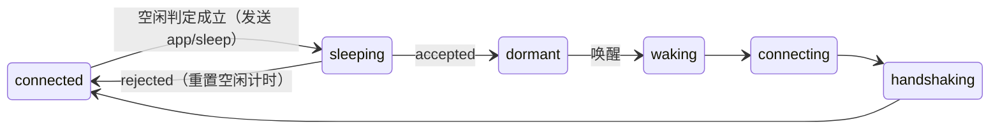

# App 端生命周期控制规范

版本：草案 v0.1（2026-09-30）。本文件是 App 端 SDK（`crates/core`、`crates/native`、各语言封装、`@app-mcp/web`）
生命周期行为的契约（权威）。消息格式的最终定义合入 `spec/protocol.md`。

## 1. 目标

默认的"启动即连接、一直在线"会让每个 App 常驻一条 WebSocket、一个心跳定时器、原生侧一个 tokio 线程和一个分发线程；
移动端还会阻止进程被系统回收。目标：

1. **任务完成即释放**：没有进行中的调用、没有有效租约时，关闭连接、停心跳、释放运行时线程。
2. **不强占进程驻留**：因唤醒而冷启动的进程，任务结束后可以按策略退出；SDK 不持有前台服务、唤醒锁、后台任务断言。
3. **可主动唤醒**：Host 需要时通过操作系统原生激活机制把 App 拉起 / 叫醒，App 回连后完成调用，再次休眠。
4. **唤醒要快**：休眠前留下恢复令牌与工具摘要，回连时跳过完整 `tools/sync`。

## 2. 状态

在现有 `ConnectionState` 上新增：

| 状态 | 含义 |
|---|---|
| `dormant` | 已与 Host 完成 `app/sleep` 握手后主动断开；不重连、无定时器（原生：运行时线程已停止或挂起）。等待唤醒或 App 主动 `wake()` |
| `waking` | 收到唤醒（OS 激活参数、`wake()`、页面重新可见）后正在回连；之后进入 `handshaking` |



`sleeping` 为内部过渡态，对外仍报告 `connected`。`dormant` 与 `stopped` 的区别：`dormant` 的工具注册表保留、可随时唤醒。

## 3. 策略（`LifecyclePolicy`，SDK 配置项）

| 字段 | 默认 | 含义 |
|---|---|---|
| `mode` | `persistent`（兼容现状）；移动端封装默认 `idle` | `persistent` / `idle` / `on-demand`（见下） |
| `idleTimeoutMs` | 60000 | 空闲多久进入休眠（`idle`）|
| `hiddenIdleTimeoutMs` | 15000 | 可见性为 `hidden` / `frozen` 时使用的更短空闲时间 |
| `graceMs` | 10000 | `on-demand` 模式下任务完成后保留连接的时间（便于模型连续调用）|
| `residency` | `keep` | 进程驻留：`keep`（只断连接）/ `exit-when-idle`（仅当本进程由唤醒冷启动时，休眠后回调 `onIdleExit`，由 App 决定是否退出）/ `exit-always`（无界面的辅助进程）|
| `wake` | 由封装按平台填充 | 本实例的唤醒描述（第 5 节），随 `app/sleep` 上报 |
| `hostAbsentRetries` | 3 | `idle` / `on-demand` 下连续多少次"Host 不在"后转 `dormant`（第 11 节 A2）；0 = 一直重连 |
| `mergeWindowMs` | 2000 | 调用 / 资源读取完成后的合并窗口：本连接处理过调用后，空闲时长取 min(它, 上面按模式与可见性的时长)（第 13 节 B1） |
| `sleepOnBackground` | `false`（核心）；移动端封装默认 `true` | 进入后台（可见 → 隐藏 / 冻结）且无调用 / 持有时立即休眠，不等租约；不可见时建立的连接只认自适应租约（第 13 节 B4） |
| `legacyTimers` | `false` | 回退到 4e 之前的定时器行为（第 11、13 节） |

模式：
- **`persistent`**：现有行为，不休眠。
- **`idle`**：启动时连接；满足空闲条件后休眠；唤醒后回连，处理完再按空闲规则休眠。
- **`on-demand`**：启动时**不连接**，只保证 Host 能从清单 / 上次的休眠记录知道如何唤醒；被唤醒或 App 调用 `connectNow()` 时连接，任务完成后经过合并窗口（`mergeWindowMs`，第 13 节 B1）休眠；连上后一直没有调用则经过 `graceMs` 休眠。适合手机、托盘常驻工具、无界面辅助进程。

**空闲条件**（全部满足才开始计时，任一变化重置计时）：
- 没有进行中或排队的调用、资源读取、导航（`app/navigate`，spec/protocol.md 3.4）；
- 租约不是空闲条件，而是休眠时刻的下限：休眠时刻 = max(空闲起点 + 空闲时长, 租约到期)（第 11 节 A1；收到租约重新开始计时）；
- Host 没有订阅本实例声明了 `realtime` 的资源（第 13 节 B3；普通资源的订阅不阻止休眠，`legacyTimers` 时任何订阅都阻止）；
- 本实例未被 App 标记为 `hold()`（App 可临时阻止休眠，返回释放句柄）。

**可见性与休眠 / 回连**（`idle` / `on-demand`）：
- 可见性**不是**空闲条件：界面可见（前台）时同样会休眠，只是用 `idleTimeoutMs`（`on-demand` 为 `graceMs`）；隐藏 / 冻结时取它与
  `hiddenIdleTimeoutMs` 的较小值。可见性变化重新开始计时。需要"前台一直在线"的 App 用 `persistent`、`hold()` 或调大 `idleTimeoutMs`。
- 休眠后**仍然可见不会触发回连**：`dormant` 只在以下事件时回连——可见性从隐藏 / 冻结**变为**可见（封装层以 `visible` 原因
  `wake`；Android 为进程回到前台 `ON_START`）、App 调用 `wake()` / `connectNow()`、OS 激活参数（`handleWake`，Host 路由调用时发出）、
  休眠握手进行中收到上述任一唤醒或 `hold()`（休眠完成后立即回连）。
- 已连接且不在休眠握手中时收到唤醒令牌（如前台广播、Android 被强制停止后 WorkManager 重新排入的旧唤醒任务）：只重新开始空闲计时，
  令牌丢弃——Host 按实例 ID 认领现有连接，令牌不再有用途；不得因此在下一次休眠后立即回连。
- 平台封装在唤醒入口先看连接状态，不为无用唤醒付出进程 / 后台任务开销（Android 见第 5 节）：连接已建立或正在建立
  （已连接、连接中、握手中、等待配对、回连中）时把令牌直接交给客户端（由核心按上条处理），不排后台任务、不等待休眠；
  本机收到唤醒后超过令牌有效期（4.4）才开始处理的唤醒直接丢弃，不创建 / 唤醒客户端。`backoff` 不算"正在建立"：
  令牌让客户端立即重连。

## 4. 协议新增（合入 spec/protocol.md）

### 4.1 `app/sleep`（SDK → Host，请求）

```jsonc
{ "reason": "idle" | "grace" | "background" | "app",
  "wake": WakeDescriptor,           // 第 5 节
  "toolsHash": "…" }               // 当前工具 + 资源定义的摘要（第 6 节）
→ { "accepted": true, "resumeToken": "…" }
→ { "accepted": false, "retryAfterMs": 5000 }   // Host 有待派发给本实例的调用等
```

`reason`：`idle` / `grace` 为空闲计时到期（`on-demand` 为 `grace`，其余为 `idle`；隐藏 / 冻结只缩短计时，
不改变原因）；`background` 为进入后台时立即休眠（bfcache、移动端进后台，由封装层显式请求，或 `sleepOnBackground` 自动发起，第 13 节 B4）；`app` 为 App 主动请求。

`accepted` 后 SDK 关闭连接，进入 `dormant`；Host 把实例标记为休眠（保留工具快照，路由时视为可唤醒），
**不按断开处理**：工具不从列表中消失、不发 `list_changed`。

### 4.2 `app/lease`（Host → SDK，通知）

`{ "ttlMs": 60000, "adaptive"?: true }`：Host 预计还会调用本实例（如 MCP 会话仍活跃、模型刚调用过），在 ttl 内不要休眠。`ttlMs: 0` 取消租约（两种都取消）。
Host 可在每次调用完成后发送；SDK 取当前租约与新值的较大截止时刻。`adaptive: true` 表示租约来自 Hub 按调用间隔的统计（第 13 节 B2），
缺省为默认值租约（无历史时的保守值、固定租约、旧 Host）；SDK 分别记两种租约的截止，后台连接只认前者（第 13 节 B4）。

### 4.3 握手扩展

`app/hello` 新增可选字段 `resumeToken`、`toolsHash`、`wakeReason`（`"os-activation" | "app" | "visible" | "cold-start"`）；
Host 的 `HelloResult` 新增可选 `toolsCurrent: bool`。
`toolsCurrent = true` 时 SDK **跳过** `tools/sync` / `resources/sync`（Host 沿用休眠前快照），直接 `app/visibility` → `app/ready`。
令牌无效或摘要不一致时 Host 返回 `toolsCurrent: false`，SDK 走完整同步。

### 4.4 唤醒令牌

Host 唤醒时生成一次性 `wakeToken`（≥128 位随机，60 秒有效），通过激活参数传给 App；
SDK 回连时在 `app/hello.launchToken` 中携带（沿用现有字段），Host 据此把挂起的调用派发给这个实例。

- 有效期：Hub 配置 `HubConfig.wake_token_ttl`（默认 60 秒）。令牌格式与激活参数不携带签发时间 / 有效期，SDK 不解析令牌；
  需要本地判断过期的封装（Android `WakeWorker`）以本机收到唤醒的时刻计时，上限默认同为 60 秒（Host 改了有效期时同步调整）。
- 一次性：唤醒被认领（第 9 节）即从 Host 的等待表移除，令牌随之作废。
- 过期 / 已作废 / 未知的令牌：握手照常成功，按普通连接处理（不认领任何唤醒、不报错）。

## 5. 唤醒描述（WakeDescriptor）与各平台实现

```jsonc
{ "kind": "uri" | "aumid" | "apple-event" | "dbus" | "android-intent" | "web-url" | "none",
  "target": "…",               // 各 kind 的定位信息
  "background": true }         // 能否不把窗口带到前台就唤醒
```

未上报时 Host 回退到清单 `launch`（spec/manifest.md）。各平台封装负责：①填充描述；②接收激活并调用 `client.handleWake(args)`；③按 `residency` 处理进程。

| 平台 | 唤醒方式（Host 侧动作） | App 侧接收 | 后台唤醒 | 进程驻留 |
|---|---|---|---|---|
| Windows（WinUI / WPF / Win32） | `aumid`：`IApplicationActivationManager::ActivateApplication(aumid, "app-mcp-wake:<token>")`；未打包应用用 `uri`：`<scheme>:app-mcp/wake?token=` | 单实例重定向（`AppInstance.FindOrRegisterForKey` / 命名管道）把参数交给已运行实例 → `handleWake` | 否（激活会前置窗口；`background:false`）；托盘 / 无窗口进程为 `true` | 休眠后释放运行时；`exit-when-idle` 由 App 决定 |
| macOS（SwiftUI / AppKit） | `uri` 或 `apple-event`：`open -g <scheme>://app-mcp/wake?token=`（`-g` 不激活）| `onOpenURL` / `NSAppleEventManager` → `handleWake` | 是 | 同上；App Nap 期间休眠态无定时器，不被打断 |
| Linux（GTK / Qt） | `dbus`：`org.freedesktop.Application.ActivateAction("app-mcp-wake", [token])`（D-Bus 可激活服务会自动拉起进程）；否则 `uri` | GApplication action / Qt D-Bus adaptor → `handleWake` | 是 | 同上 |
| Android（Kotlin / Flutter） | `android-intent`：显式广播 `dev.appmcp.action.WAKE` 到 App 的 `WakeReceiver`（token 为 extra）| `WakeReceiver` 立即 `goAsync()` 并以 **加急 WorkManager 任务** 回连处理（绕开 Android 12+ 后台启动前台服务限制）；有界面或连接已建立 / 正在建立时直接交给运行中的客户端、不排任务；任务开始时连接已在则交出令牌后立即结束，距收到广播超过令牌有效期则丢弃 | 是 | 不持有前台服务 / WakeLock；任务完成即休眠，进程交给系统回收 |
| iOS（Swift / Flutter） | `uri`：`<scheme>://app-mcp/wake?token=`（系统会把 App 带到前台）| `onOpenURL` / `scene(_:openURLContexts:)` → `handleWake` | 否（iOS 无后台唤醒；后台调用走 App Intents，见 codegen）| 进入后台即休眠（`hidden` → `hiddenIdleTimeoutMs`，iOS 封装默认 0）|
| Web | `web-url`：没有可达连接时由 Host 打开 / 聚焦 URL（带 `#app-mcp-wake=<token>`）| 页面加载或 `visibilitychange` → 可见时回连；URL 中的令牌由 SDK 读取后从地址栏移除 | 否 | 标签页隐藏 `hiddenIdleTimeoutMs` 后休眠；bfcache（`pagehide persisted`）前立即 `app/sleep`；`pageshow` 恢复。多个标签页经 SharedWorker 共用一条连接时（spec/protocol.md 第 9 节），休眠只关闭本标签页的通道，所有标签页都休眠时连接随之关闭 |
| Electron / Tauri | 主进程常驻时同原生桌面；主进程由 `uri` 拉起 | 主进程 `second-instance` / `open-url` → `handleWake` | 视窗口是否显示 | 同原生 |

多实例：Host 优先唤醒**最近活跃的休眠实例**；若实例的唤醒描述不可用，退回清单 `launch` 冷启动新实例。

## 6. 工具摘要（toolsHash）

`sha256(规范化 JSON(按名称排序的 tools/sync 与 resources/sync 参数))` 的前 16 个十六进制字符。
规范化：对象键排序、无空白。核心库计算，所有语言一致（一致性测试用同一组固定向量）。

## 7. 资源释放要求（验收）

- 休眠态：无打开的 socket；无运行中的定时器（核心 `poll_timeout()` 返回 `None`）。
- 原生运行时：休眠时停止 tokio 运行时线程（或挂起到无定时器的 park）；分发线程阻塞等待，不轮询；唤醒时重建。
- Web：休眠态无 WebSocket、无 `setTimeout` / `setInterval`；WASM 实例保留（重建代价高）。
- 移动端封装：不申请前台服务、WakeLock、`beginBackgroundTask`。
- 核心新增测试：空闲计时的每个重置条件、租约、`app/sleep` 被拒后的重试、`toolsCurrent` 快速恢复、休眠中注册变更（回连时 `toolsHash` 不一致 → 完整同步）。

## 8. 公开 API（各语言按惯用写法映射）

```
config.lifecycle = { mode, idleTimeoutMs, hiddenIdleTimeoutMs, graceMs, residency, wake,
                     hostAbsentRetries, legacyTimers, mergeWindowMs, sleepOnBackground }
resource.realtime: bool                      // 资源声明需实时推送（第 13 节 B3），缺省 false
client.handleWake(args: string) -> bool      // 传入 OS 激活参数 / URL；不是本 SDK 的唤醒返回 false
client.wake()                                // App 主动回连（如用户打开相关界面）
client.sleep()                               // App 主动请求休眠（等同 reason = "app"）
client.hold() -> Release                     // 临时阻止休眠（如 App 在做长任务、想保持会话）
client.connectNow()                          // on-demand 模式下主动连接
listener.onIdleExit()                        // residency 允许时，休眠完成后回调；App 自行决定是否退出进程
ConnectionState += dormant, waking
```

## 9. Host 侧最小配合（在 `crates/hub` 实现）

- 休眠实例：保留工具快照，`apps.list` 中显示 `dormant`；工具仍列出，可用性标记为可唤醒。
- 路由到休眠实例：生成 `wakeToken` → 按唤醒描述激活 → 等待带令牌的回连（默认 15 秒，超时 `APP_NOT_RESPONDING`）→ 派发。
- 唤醒去重：
  - 目标实例已连接并就绪时不唤醒，直接派发；已连接但握手未完成时不激活，等它的 `app/ready`（在等待表加锁后复查，
    覆盖路由决定唤醒之后、审批期间实例先回连的情况）。
  - 同一目标（同一 App 的同一休眠实例，或同一 App 的冷启动）已有唤醒在等待时，后来的调用加入等待，不再激活；多次待派调用
    合并为一次唤醒。
  - 激活任务开始前唤醒已被认领时不再激活。
- 唤醒的认领（实例 `app/ready` 时，满足任一）：带有效令牌；同一实例 ID（可见回连、App 主动 `wake()` 先于激活到达，
  不带令牌也算）；冷启动唤醒中该 App 的任何实例；被唤醒的休眠实例已没有记录（被新实例 ID 替换 / 过期）时该 App 的任何实例。
  认领后令牌作废（4.4）。
- 租约：MCP 会话每次调用某 App 后发送 `app/lease { ttlMs: 60000 }`；会话关闭时 `ttlMs: 0`。
- 存活判断按 SDK 的心跳声明（第 11 节 A3）；唤醒速率上限与观测见第 12 节。
- 休眠实例的空闲超时不适用；实例记录保留 24 小时或直到 App 下次以新实例 ID 连接。
- 实例记录跨 Host 重启保留（4f G11）：Host（`app-mcp-host`）把休眠记录持久化到 `<home>/state/dormant/<appId>.json`，启动时读回，
  重启前休眠的 App 仍列出、可唤醒、可快速恢复（恢复令牌与 `toolsHash` 一并保存）；24 小时按休眠时刻计，跨重启不重新计时。
  Host 退出（含被强制结束）时仍在线、且在 `app/hello.wake` 中声明了唤醒描述的实例同样保存（就绪时写出、断开时删除），重启后按休眠实例
  列出并可唤醒；它没有恢复令牌，回连时完整同步，保留期从最近一次写出起算。
  只保存声明（工具 / 资源定义、唤醒描述、页面目录中上报过的页面工具），不含调用数据。嵌入 Hub 的厂商经 `HubConfig.state_dir`
  选择开启（缺省不读写文件），格式、上限与损坏文件的处理见 spec/hub-api.md 3.5「持久化」。
- 导航（第 4c 项，spec/hub-api.md 3.14）与唤醒同构：调用页面目录中、当前未注册的工具时，App 没有连接则先按本节唤醒，再发
  `app/navigate` 并等待目标工具注册；导航回复与等待合计受唤醒超时（`HubConfig::wake_timeout`）约束，调用取消随时结束等待；
  导航期间目标连接的 `app/sleep` 被拒绝（同进行中的调用）。

## 10. 两个落点：注册侧与连接侧

生命周期只落在 App 端的两个位置，平台封装只提供"信号"和"入口"，不各自实现状态机。

### 10.1 连接侧（App 端 Host 客户端：`crates/core` + `crates/native` / Web 驱动层）

唯一的生命周期控制器。负责：空闲判定、`app/sleep`、租约、休眠 / 唤醒 / 快速恢复、运行时线程释放、`IdleExit`。
平台封装只做两件事：① 上报可见性（前后台、隐藏、冻结）；② 把 OS 激活参数交给 `handleWake`。
可见性也决定导航请求在后台是否立即以 `USER_ACTION_REQUIRED`（`foreground`）回复（`navigateInBackground`，spec/protocol.md 3.4「后台与前台」）。

### 10.2 注册侧（工具 / 资源声明：React `useTool`、`data-mcp-*`、`@mcp` 注释、状态库适配、原生 `ToolSpec`、静态清单）

1. **注册与连接解耦**：注册表只存在核心里，休眠不清空；休眠期间的注册 / 更新 / 注销**不触发唤醒**，只更新 `toolsHash`，回连时由摘要不一致触发完整同步。
2. **静态注册兜底唤醒**：`app-mcp.json` 新增 `wake` 字段（与 WakeDescriptor 同构），由 `@app-mcp/build` / `crates/codegen` / 各平台模板生成。App 从未启动或进程已退出时，Host 仍可从清单列出工具并唤醒。
3. **惰性 handler**（`on-demand` 冷启动提速）：允许只声明元数据、handler 在首次调用时加载——Web：`tool(name, { ...meta, load: () => import('./checkout') })`；原生：`ToolSpec` + 工厂闭包。冷启动唤醒只初始化被调用的那个模块。
4. **调用自动持有**：调用进行中视为非空闲（无需手动 `hold()`）；handler 内部发起的长任务可通过 `context.hold()` 延长。
5. **注册侧不感知连接状态**：框架适配（React / Vue / 状态库 / DOM 属性）无需任何改动即可在休眠 / 唤醒之间保持工具有效。

## 11. 功耗规则（4e 第一部分）

分析与决策记录见 `docs/plans/4e-lifecycle-power.md`；本节是行为契约。新规则默认开启，`lifecycle.legacyTimers = true`
一次性恢复下面 A1–A3 的旧行为（各绑定同名字段：Rust `LifecyclePolicy::legacy_timers`、C `AmClientOptions.legacy_timers`、
uniffi `LifecyclePolicy.legacyTimers`、JS `lifecycle.legacyTimers`）。

### A1 租约与空闲计时并行

休眠时刻 = max(空闲起点 + 空闲时长, 租约到期)。收到 `app/lease` 重新开始空闲计时（起点 = 收到时刻）。前台 `idle`（空闲 60 s）
一次调用后（Host 发 60 s 租约）在线约 60 s，旧行为（租约到期后才开始计空闲）约 120 s。休眠被拒后的重试时刻仍不早于租约到期。

### A2 Host 不在时停止无限重试

- `idle` / `on-demand` 下连续 `hostAbsentRetries`（默认 3）次以"Host 不在"建立连接失败 → 进入 `dormant`（不发 `app/sleep`，
  无定时器、无连接），并给出警告日志。"Host 不在"的码由 `ConnectionErrorCode::means_host_absent` 唯一定义，目前只有
  `HOST_NOT_RUNNING`（连接被拒绝、套接字 / 管道不存在；转发远端无监听者时的"接受后即关闭"；网页连接打开前失败且非浏览器拦截）。
  `CONNECT_TIMEOUT`、`IPC_PERMISSION_DENIED` 等可能是 Host 卡住或配置问题，不计入；其他码打断"连续"，成功握手清零。
- 之后与休眠相同，只在以下事件回连：可见性从隐藏变为可见、App `wake()` / `connectNow()`、OS 激活（Host 唤醒）。
- `persistent` 不受影响（照旧退避重连，最长 30 s 一次）；`hostAbsentRetries = 0` 或 `legacyTimers` 时一直重连。
- 默认 3 的理由：网页依次尝试 7717 / 7737 / 7757 三个候选端口，3 次正好各试一遍；原生 0.5 s + 1 s 退避，约 1.5 s 内放弃。
  经 `adb reverse` 时每次尝试约 2 s 才失败，约 5 s 放弃。

### A3 心跳按传输

传输类别由驱动层按端点判定后告知核心（`ClientConfig::transport`；核心保持 sans-IO）：

| 传输 | 判定 | `heartbeat: auto` 时 SDK | Host |
|---|---|---|---|
| `ipc` | `unix:` / `pipe:` 端点 | 不发心跳 | 不发 `ping`，握手后不做无消息断开 |
| `loopback` | 桌面平台上回环主机（`localhost`、`127.0.0.0/8`、`::1`）的 `ws://` / `wss://`；网页到回环地址（含 SharedWorker 共享连接） | 不发心跳 | 同上 |
| `remote` | 其他主机；**沙箱平台（Android / iOS / 鸿蒙）上的回环地址** | 每 `intervalMs`（15 s）单向 `ping` | 不发 `ping`；无消息断开超时 = max(45 s / 隐藏 180 s, 3 × 心跳间隔) |
| 未知 | 驱动层未告知 | 同 `remote` | 同 `remote` |

- 判定规则的唯一实现：原生 `app_mcp_protocol::Endpoint::transport_kind`；网页 `packages/web/src/host-transport.ts`（网页无 IPC、
  不知道是否经转发，手机浏览器经 `adb reverse` 访问回环时用 `heartbeat: 'always'`）。
- `adb reverse` 归为远程的理由：设备上看是本机回环，实际跨 USB 到另一台机器。实测 Hub 被杀时 App 约 0.15 s 收到断开（EOF 能传过来），
  但 USB 拔出、电脑休眠、adb 服务重启等远端变化能否及时送达未验证（已知的未知），按远程保守处理；代价是 SDK 单向心跳约每 15 s 1 ms
  （魅族实测，原双向约 2 ms）。在设备上嵌入 Hub 的场景可设 `heartbeat: off`。
- SDK 在 `app/hello.heartbeatMs` 声明：不发为 `0`，发为间隔；`legacyTimers` 时不带（Host 按旧规则：发 `ping` + 45 s / 180 s 无消息断开）。
  旧 Host 不认识该字段，照旧发 `ping`，SDK 照常回复，连接不受影响。Host 配置 `legacy_heartbeat = true` 时对所有连接用旧规则。
- `heartbeat` 策略：`auto`（默认）/ `always` / `off`（Rust `HeartbeatPolicy::mode` / `NativeConfig::heartbeat`、C `AmClientOptions.heartbeat`、
  uniffi `ClientConfig.heartbeat`、JS `heartbeat`）。
- 本地传输无心跳时，Host 不能因"无消息"断开活着的空闲连接：握手完成后只按连接断开（EOF / RST / 关闭帧）处理；对端进程被冻结时连接保持
  （Flyme 冻结后台进程期间实测连接保持），发给它的调用按调用超时（`response_timeout`）失败，不影响连接；对端进程退出时操作系统关闭
  套接字，毫秒级感知（Linux IPC 1.4–2.2 ms、回环 TCP 1.7–3.2 ms）。半开连接（系统未关闭套接字的极端情况）由下次派发调用的超时发现。
- 冻结保护（远程心跳）：心跳响应截止时刻之后又过了一整个超时才被调度，视为本进程被冻结 / 挂起，不判心跳超时，重新发 `ping` 计时。

### 功耗回归测试（O2）

`crates/core/tests/power.rs` 用确定性时钟模拟驱动层，断言：本地传输空闲 1 小时 0 次定时器、0 次心跳、1 次连接；远程 1 小时心跳 ≤ 240 次；
Host 不在时 `idle` / `on-demand` 1 小时内连接发起 = 3 次后无定时器；前台调用后在线 60 s（期间 1 次定时器）；回退开关恢复旧数值。

## 12. Host 侧观测与唤醒速率上限

### O1 观测

`Hub::status()` / `GET /status` / `app-mcp-host doctor` 为每个实例给出（兼容新增，字段名见 spec/hub-api.md）：回连次数（Hub 启动以来同一
实例 ID 的连接次数 − 1）、唤醒次数（以该休眠实例为目标的实际激活次数）、累计在线秒数（含当前连接）、心跳次数（Hub 发出的 `ping` +
收到 SDK 的 `ping`）、SDK 声明的 `heartbeatMs` 与 `lifecycleMode`，以及已连接实例当前不能休眠的原因中 Host 可见的部分：
`persistent`（SDK 声明的模式）、`call`（有进行中的调用 / 读取）、`lease`（有未到期租约）、`subscription`（Host 订阅了其资源）、
`wake-pending`（有等待它回连的唤醒）。App 的 `hold()` 只有 SDK 知道，不在其中（未上报）。每个 App 另给出全部实际激活次数。

### O4 唤醒速率上限

- 每个 App 在任意 60 s 窗口内最多实际激活 `HubConfig.wake_rate_limit` 次（默认 6；0 = 不限；`app-mcp-host --wake-rate-limit`）。
  只计真正发出的激活：加入已有等待、目标已就绪 / 握手中时不计。
- 超出时不激活、不登记等待，调用以工具错误 `LAUNCH_FAILED` 结束，`data` 带 `code: "WAKE_RATE_LIMITED"`（spec/protocol.md 10.1）、
  `appId`、`retryAfterMs`（窗口中最早一次激活滑出的剩余时间），并记为该 App 的最近错误。
- 默认 6 的理由：一次唤醒约 5.6 ms SDK 线程 / 约 19 ms 进程 CPU（魅族实测）；正常调用经唤醒去重与 60 s 租约合并后每分钟至多约 1 次唤醒，
  6 次给 `on-demand` 10 s 宽限下的间歇调用留余量，同时把唤醒 / 休眠循环限制在约 0.1 s CPU / 分钟。


## 13. 按需在线规则（4e 第二部分）

本节是行为契约；`lifecycle.legacyTimers = true` 同样一次性关闭 B1、B3、B4（恢复第 11 节之前的行为）。B2（Hub 自适应租约）
是 Hub 侧规则，见 spec/hub-api.md 与本节"Hub 侧配合"。

### B1 App 端只留合并窗口

- 本连接上处理过调用或资源读取（收到 `tools/invoke` / `resources/read`，含返回错误的）之后，空闲时长取
  min(`mergeWindowMs`, 第 3 节按模式与可见性的空闲时长)；休眠时刻仍为 max(空闲起点 + 空闲时长, 租约到期)（A1）。
  也就是说，调用之后是否继续在线**只由 Hub 的租约决定**，App 端只多留一个很短的合并窗口。
- 连上后一直没有调用 / 读取（启动连接、页面重新可见回连、App 主动 `wake()`）：仍按 `idleTimeoutMs`（`on-demand` 为 `graceMs`）。
  "处理过调用"随连接结束而清除（每次连接重新计）。
- 默认 2000 ms 的理由：窗口只用来合并"调用完成后立即跟着到达"的消息——Hub 调用完成后发出的 `app/lease`、对 `stateHints`
  资源的读取、同一轮内并行工具调用的后续派发；本机传输上这些在毫秒级到达，`adb reverse` 等转发每次约数百毫秒，2 s 留出余量。
  模型在两次调用之间的思考间隔（秒到数十秒）不该由 App 猜测，而由 Hub 按调用历史给租约（B2）。窗口越长不带来正确性收益，
  只延长在线：一次回连约 5.6 ms SDK CPU（魅族实测）与约 40 s 在线心跳相当，2 s 在线的代价远小于一次回连。
- `mergeWindowMs ≥ idleTimeoutMs` 时等同于旧行为（调用后仍按空闲时长）。
- 平台默认（由各平台封装设置，核心不区分平台）：手机（Android / iOS / 鸿蒙 / Flutter）与托盘常驻程序默认 `on-demand`
  + `sleepOnBackground: true`；桌面窗口程序与网页默认 `idle` + 2 s 合并窗口。

### B3 资源订阅不再强制在线

- 协议：`ResourceInfo.realtime?: boolean`（缺省 `false`，spec/protocol.md 第 3 节；静态清单 `resources[].realtime` 同构，
  spec/manifest.md）。声明 `realtime` 的资源被订阅时阻止休眠（空闲条件、B4 都看它）；未声明的资源的订阅**不阻止**休眠。
  `realtime` 只在为 `true` 时序列化，未声明的资源的 `toolsHash` 不变。
- SDK 记住"Host 已订阅"的资源跨越连接：连接断开（休眠、断线）时把当时的订阅集合留作"待恢复订阅"；未连接期间这些资源发生变化时
  标记为"已变化"。Host 回连后重新订阅（`resources/subscribe`）时，SDK 回复 `{}` 后对"已变化"的资源立即发送 `resources/updated`
  （仍受节流约束），然后清除标记。连上后 Host 没有重新订阅的资源不再跟踪（下次断开时按新的订阅集合重记）。
- 休眠（`dormant`）期间声明了 `realtime` 的待恢复订阅资源发生变化：SDK 以原因 `app` 回连推送（App 在变化时回连推送）。
  未声明的资源不回连，变化在下次连接（Host 唤醒调用 / 读取、页面重新可见等）时由上一条送达，或模型下次读取时拉取到最新内容。
- `realtime` 用于"模型在等待变化"的场景（如等待订单状态变化）；普通状态（购物车、列表）不声明——每次变化都回连的功耗高于在线。

**Hub 侧配合**（`crates/hub` 实现，本节为契约）：

1. 实例休眠（`app/sleep` 被接受）时保留该实例的资源订阅（MCP 会话的订阅关系不变），不向 MCP 客户端报告任何变化。
2. 实例回连并 `app/ready` 后，对其所有仍被订阅的资源重新发送 `resources/subscribe`（含因断线而不是休眠断开的情况——这一条
   沿用 spec/protocol.md 5.4"订阅集合在断线后清空，由 Host 重新订阅"）。
3. 对休眠实例的资源读取（`resources/read`）与工具调用相同：唤醒后派发（不要因为实例休眠就返回资源不存在）。
4. 观测（第 12 节 O1）的 `subscription` 原因只计声明了 `realtime` 的资源的订阅（旧 SDK 不声明，按普通资源计）。

### B4 后台立即休眠

- `sleepOnBackground = true` 且模式为 `idle` / `on-demand` 时，可见性从 `visible` **变为** `hidden` / `frozen`（进入后台）：
  - 已连接：本连接标记为"后台休眠"——只要空闲条件（第 3 节，不含租约）成立就立即以原因 `background` 发送 `app/sleep`，
    **不等租约、不计空闲时长**；进入后台时有调用 / 读取 / 持有 / 实时订阅在进行，则在它们结束后立即休眠。
  - `backoff`（且没有待用的唤醒令牌）：停止重连，进入 `dormant`。
  - 其他状态（连接中、握手中）不处理，连上后按普通规则。
- 回到可见、Host 拒绝这次休眠（`accepted: false`）或连接结束时清除"后台休眠"标记，之后按普通规则（B1 / A1）。
- 不等租约的理由：移动端后台进程很快会被冻结（Flyme 约 62 s），被冻结但仍连着的实例收到的调用只能超时失败；休眠后 Host 改为唤醒，
  调用可以完成。核心默认 `false`（核心不知道平台；网页标签页频繁切换、bfcache 已单独处理）；移动端封装默认 `true`。
- App 显式 `sleep_with_reason(Background)` 不受本节影响（不看空闲条件，第 8 节）。

**后台连接**（4f G1）：`sleepOnBackground = true` 且模式为 `idle` / `on-demand` 时，**握手完成时**可见性为 `hidden` / `frozen` 的连接
（OS 激活在后台唤醒、隐藏中 `realtime` 资源变化回连推送、后台冷启动等）为后台连接：

- 休眠时刻 = max(空闲起点 + 空闲时长, **自适应**租约到期)——只认 `app/lease.adaptive = true` 的租约，默认值租约只记下、不推迟休眠、
  不重新开始空闲计时。处理过调用后空闲时长照常为合并窗口（B1），因此没有调用历史时一次调用后约 `mergeWindowMs` 即休眠，
  原因按模式（`grace` / `idle`，不是 `background`：不是"进入后台"）。
- 回到可见清除标记（之前记下的默认值租约随即生效），之后按普通规则；之后再进入后台按上面的"进入后台"规则。
- 分工：SDK 知道握手时的可见性与 `sleepOnBackground`，由 SDK 判定；Hub 只在 `app/lease` 上标明租约种类（`adaptive`），照常按
  B2 发送 / 收回，不感知连接是否在后台（收回后补发时两种租约分别补发）。旧 Host 不带 `adaptive`：后台连接只留合并窗口。
- 理由：默认值租约是 Hub 没有调用历史时的猜测；后台被唤醒的进程很快会被系统冻结（Flyme 约 62 s），在线等这个猜测只耗电，
  被冻结后收到的调用还会超时失败。实测（4f）Android 后台唤醒处理一次调用后在线约 32 s（至请求流空闲收回默认值租约），
  改为约 2 s；自适应租约是按真实调用间隔的预测，仍然生效。
- 封装层须在握手前上报可见性：后台冷启动的进程（如 Android 由唤醒广播拉起、没有界面）创建客户端时就设为 `hidden`。

## 14. 调用去重与休眠（第 16 项 N7a）

SDK 的调用去重表（spec/protocol.md 3.3）属于客户端、不属于连接：断线、休眠（`Dormant`）、唤醒回连后保留，进程退出即清空。
休眠中的进程被冷启动唤醒时表为空，同一 `callId` 会再次执行；需要跨进程幂等的写操作由 App 自己按业务键判断。
