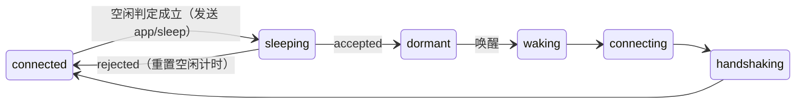

# App 端生命周期控制规范

版本：草案 v0.1（2026-09-30）。本文件是 App 端 SDK（`crates/core`、`crates/native`、各语言封装、`@app-mcp/web`）
生命周期行为的契约（权威）。消息格式的最终定义合入 `spec/protocol.md`。

## 1. 目标

默认的"启动即连接、一直在线"会让每个 App 常驻一条 WebSocket、一个心跳定时器、原生侧一个 tokio 线程和一个分发线程；
移动端还会阻止进程被系统回收。目标：

1. **任务完成即释放**：没有进行中的调用、没有有效租约时，关闭连接、停心跳、释放运行时线程。
2. **不强占进程驻留**：因唤醒而冷启动的进程，任务结束后可以按策略退出；SDK 不持有前台服务、唤醒锁、后台任务断言。
3. **可主动唤醒**：Host 需要时通过操作系统原生激活机制把 App 拉起 / 叫醒，App 回连后完成调用，再次休眠。
4. **唤醒要快**：休眠前留下恢复令牌与工具摘要，回连时跳过完整 `tools/sync`。

## 2. 状态

在现有 `ConnectionState` 上新增：

| 状态 | 含义 |
|---|---|
| `dormant` | 已与 Host 完成 `app/sleep` 握手后主动断开；不重连、无定时器（原生：运行时线程已停止或挂起）。等待唤醒或 App 主动 `wake()` |
| `waking` | 收到唤醒（OS 激活参数、`wake()`、页面重新可见）后正在回连；之后进入 `handshaking` |



`sleeping` 为内部过渡态，对外仍报告 `connected`。`dormant` 与 `stopped` 的区别：`dormant` 的工具注册表保留、可随时唤醒。

## 3. 策略（`LifecyclePolicy`，SDK 配置项）

| 字段 | 默认 | 含义 |
|---|---|---|
| `mode` | `persistent`（兼容现状）；移动端封装默认 `idle` | `persistent` / `idle` / `on-demand`（见下） |
| `idleTimeoutMs` | 60000 | 空闲多久进入休眠（`idle`）|
| `hiddenIdleTimeoutMs` | 15000 | 可见性为 `hidden` / `frozen` 时使用的更短空闲时间 |
| `graceMs` | 10000 | `on-demand` 模式下任务完成后保留连接的时间（便于模型连续调用）|
| `residency` | `keep` | 进程驻留：`keep`（只断连接）/ `exit-when-idle`（仅当本进程由唤醒冷启动时，休眠后回调 `onIdleExit`，由 App 决定是否退出）/ `exit-always`（无界面的辅助进程）|
| `wake` | 由封装按平台填充 | 本实例的唤醒描述（第 5 节），随 `app/sleep` 上报 |

模式：
- **`persistent`**：现有行为，不休眠。
- **`idle`**：启动时连接；满足空闲条件后休眠；唤醒后回连，处理完再按空闲规则休眠。
- **`on-demand`**：启动时**不连接**，只保证 Host 能从清单 / 上次的休眠记录知道如何唤醒；被唤醒或 App 调用 `connectNow()` 时连接，任务完成后经过 `graceMs` 休眠。适合手机、托盘常驻工具、无界面辅助进程。

**空闲条件**（全部满足才开始计时，任一变化重置计时）：
- 没有进行中或排队的调用、资源读取；
- Host 没有有效租约（`app/lease`，第 4 节）；
- Host 没有订阅本实例的任何资源（有订阅说明模型在关注变化）；
- 本实例未被 App 标记为 `hold()`（App 可临时阻止休眠，返回释放句柄）。

**可见性与休眠 / 回连**（`idle` / `on-demand`）：
- 可见性**不是**空闲条件：界面可见（前台）时同样会休眠，只是用 `idleTimeoutMs`（`on-demand` 为 `graceMs`）；隐藏 / 冻结时取它与
  `hiddenIdleTimeoutMs` 的较小值。可见性变化重新开始计时。需要"前台一直在线"的 App 用 `persistent`、`hold()` 或调大 `idleTimeoutMs`。
- 休眠后**仍然可见不会触发回连**：`dormant` 只在以下事件时回连——可见性从隐藏 / 冻结**变为**可见（封装层以 `visible` 原因
  `wake`；Android 为进程回到前台 `ON_START`）、App 调用 `wake()` / `connectNow()`、OS 激活参数（`handleWake`，Host 路由调用时发出）、
  休眠握手进行中收到上述任一唤醒或 `hold()`（休眠完成后立即回连）。
- 已连接且不在休眠握手中时收到唤醒令牌（如前台广播、Android 被强制停止后 WorkManager 重新排入的旧唤醒任务）：只重新开始空闲计时，
  令牌丢弃——Host 按实例 ID 认领现有连接，令牌不再有用途；不得因此在下一次休眠后立即回连。

## 4. 协议新增（合入 spec/protocol.md）

### 4.1 `app/sleep`（SDK → Host，请求）

```jsonc
{ "reason": "idle" | "grace" | "background" | "app",
  "wake": WakeDescriptor,           // 第 5 节
  "toolsHash": "…" }               // 当前工具 + 资源定义的摘要（第 6 节）
→ { "accepted": true, "resumeToken": "…" }
→ { "accepted": false, "retryAfterMs": 5000 }   // Host 有待派发给本实例的调用等
```

`reason`：`idle` / `grace` 为空闲计时到期（`on-demand` 为 `grace`，其余为 `idle`；隐藏 / 冻结只缩短计时，
不改变原因）；`background` 为进入后台时立即休眠（bfcache、移动端进后台，由封装层显式请求）；`app` 为 App 主动请求。

`accepted` 后 SDK 关闭连接，进入 `dormant`；Host 把实例标记为休眠（保留工具快照，路由时视为可唤醒），
**不按断开处理**：工具不从列表中消失、不发 `list_changed`。

### 4.2 `app/lease`（Host → SDK，通知）

`{ "ttlMs": 60000 }`：Host 预计还会调用本实例（如 MCP 会话仍活跃、模型刚调用过），在 ttl 内不要休眠。`ttlMs: 0` 取消租约。
Host 可在每次调用完成后发送；SDK 取当前租约与新值的较大截止时刻。

### 4.3 握手扩展

`app/hello` 新增可选字段 `resumeToken`、`toolsHash`、`wakeReason`（`"os-activation" | "app" | "visible" | "cold-start"`）；
Host 的 `HelloResult` 新增可选 `toolsCurrent: bool`。
`toolsCurrent = true` 时 SDK **跳过** `tools/sync` / `resources/sync`（Host 沿用休眠前快照），直接 `app/visibility` → `app/ready`。
令牌无效或摘要不一致时 Host 返回 `toolsCurrent: false`，SDK 走完整同步。

### 4.4 唤醒令牌

Host 唤醒时生成一次性 `wakeToken`（≥128 位随机，60 秒有效），通过激活参数传给 App；
SDK 回连时在 `app/hello.launchToken` 中携带（沿用现有字段），Host 据此把挂起的调用派发给这个实例。

## 5. 唤醒描述（WakeDescriptor）与各平台实现

```jsonc
{ "kind": "uri" | "aumid" | "apple-event" | "dbus" | "android-intent" | "web-url" | "none",
  "target": "…",               // 各 kind 的定位信息
  "background": true }         // 能否不把窗口带到前台就唤醒
```

未上报时 Host 回退到清单 `launch`（spec/manifest.md）。各平台封装负责：①填充描述；②接收激活并调用 `client.handleWake(args)`；③按 `residency` 处理进程。

| 平台 | 唤醒方式（Host 侧动作） | App 侧接收 | 后台唤醒 | 进程驻留 |
|---|---|---|---|---|
| Windows（WinUI / WPF / Win32） | `aumid`：`IApplicationActivationManager::ActivateApplication(aumid, "app-mcp-wake:<token>")`；未打包应用用 `uri`：`<scheme>:app-mcp/wake?token=` | 单实例重定向（`AppInstance.FindOrRegisterForKey` / 命名管道）把参数交给已运行实例 → `handleWake` | 否（激活会前置窗口；`background:false`）；托盘 / 无窗口进程为 `true` | 休眠后释放运行时；`exit-when-idle` 由 App 决定 |
| macOS（SwiftUI / AppKit） | `uri` 或 `apple-event`：`open -g <scheme>://app-mcp/wake?token=`（`-g` 不激活）| `onOpenURL` / `NSAppleEventManager` → `handleWake` | 是 | 同上；App Nap 期间休眠态无定时器，不被打断 |
| Linux（GTK / Qt） | `dbus`：`org.freedesktop.Application.ActivateAction("app-mcp-wake", [token])`（D-Bus 可激活服务会自动拉起进程）；否则 `uri` | GApplication action / Qt D-Bus adaptor → `handleWake` | 是 | 同上 |
| Android（Kotlin / Flutter） | `android-intent`：显式广播 `dev.appmcp.action.WAKE` 到 App 的 `WakeReceiver`（token 为 extra）| `WakeReceiver` 立即 `goAsync()` 并以 **加急 WorkManager 任务** 回连处理（绕开 Android 12+ 后台启动前台服务限制）；有界面时交给前台实例 | 是 | 不持有前台服务 / WakeLock；任务完成即休眠，进程交给系统回收 |
| iOS（Swift / Flutter） | `uri`：`<scheme>://app-mcp/wake?token=`（系统会把 App 带到前台）| `onOpenURL` / `scene(_:openURLContexts:)` → `handleWake` | 否（iOS 无后台唤醒；后台调用走 App Intents，见 codegen）| 进入后台即休眠（`hidden` → `hiddenIdleTimeoutMs`，iOS 封装默认 0）|
| Web | `web-url`：没有可达连接时由 Host 打开 / 聚焦 URL（带 `#app-mcp-wake=<token>`）| 页面加载或 `visibilitychange` → 可见时回连；URL 中的令牌由 SDK 读取后从地址栏移除 | 否 | 标签页隐藏 `hiddenIdleTimeoutMs` 后休眠；bfcache（`pagehide persisted`）前立即 `app/sleep`；`pageshow` 恢复。多个标签页经 SharedWorker 共用一条连接时（spec/protocol.md 第 9 节），休眠只关闭本标签页的通道，所有标签页都休眠时连接随之关闭 |
| Electron / Tauri | 主进程常驻时同原生桌面；主进程由 `uri` 拉起 | 主进程 `second-instance` / `open-url` → `handleWake` | 视窗口是否显示 | 同原生 |

多实例：Host 优先唤醒**最近活跃的休眠实例**；若实例的唤醒描述不可用，退回清单 `launch` 冷启动新实例。

## 6. 工具摘要（toolsHash）

`sha256(规范化 JSON(按名称排序的 tools/sync 与 resources/sync 参数))` 的前 16 个十六进制字符。
规范化：对象键排序、无空白。核心库计算，所有语言一致（一致性测试用同一组固定向量）。

## 7. 资源释放要求（验收）

- 休眠态：无打开的 socket；无运行中的定时器（核心 `poll_timeout()` 返回 `None`）。
- 原生运行时：休眠时停止 tokio 运行时线程（或挂起到无定时器的 park）；分发线程阻塞等待，不轮询；唤醒时重建。
- Web：休眠态无 WebSocket、无 `setTimeout` / `setInterval`；WASM 实例保留（重建代价高）。
- 移动端封装：不申请前台服务、WakeLock、`beginBackgroundTask`。
- 核心新增测试：空闲计时的每个重置条件、租约、`app/sleep` 被拒后的重试、`toolsCurrent` 快速恢复、休眠中注册变更（回连时 `toolsHash` 不一致 → 完整同步）。

## 8. 公开 API（各语言按惯用写法映射）

```
config.lifecycle = { mode, idleTimeoutMs, hiddenIdleTimeoutMs, graceMs, residency, wake }
client.handleWake(args: string) -> bool      // 传入 OS 激活参数 / URL；不是本 SDK 的唤醒返回 false
client.wake()                                // App 主动回连（如用户打开相关界面）
client.sleep()                               // App 主动请求休眠（等同 reason = "app"）
client.hold() -> Release                     // 临时阻止休眠（如 App 在做长任务、想保持会话）
client.connectNow()                          // on-demand 模式下主动连接
listener.onIdleExit()                        // residency 允许时，休眠完成后回调；App 自行决定是否退出进程
ConnectionState += dormant, waking
```

## 9. Host 侧最小配合（在 `crates/hub` 实现）

- 休眠实例：保留工具快照，`apps.list` 中显示 `dormant`；工具仍列出，可用性标记为可唤醒。
- 路由到休眠实例：生成 `wakeToken` → 按唤醒描述激活 → 等待带令牌的回连（默认 15 秒，超时 `APP_NOT_RESPONDING`）→ 派发。
- 租约：MCP 会话每次调用某 App 后发送 `app/lease { ttlMs: 60000 }`；会话关闭时 `ttlMs: 0`。
- 休眠实例的空闲超时不适用；实例记录保留 24 小时或直到 App 下次以新实例 ID 连接。

## 10. 两个落点：注册侧与连接侧

生命周期只落在 App 端的两个位置，平台封装只提供"信号"和"入口"，不各自实现状态机。

### 10.1 连接侧（App 端 Host 客户端：`crates/core` + `crates/native` / Web 驱动层）

唯一的生命周期控制器。负责：空闲判定、`app/sleep`、租约、休眠 / 唤醒 / 快速恢复、运行时线程释放、`IdleExit`。
平台封装只做两件事：① 上报可见性（前后台、隐藏、冻结）；② 把 OS 激活参数交给 `handleWake`。

### 10.2 注册侧（工具 / 资源声明：React `useTool`、`data-mcp-*`、`@mcp` 注释、状态库适配、原生 `ToolSpec`、静态清单）

1. **注册与连接解耦**：注册表只存在核心里，休眠不清空；休眠期间的注册 / 更新 / 注销**不触发唤醒**，只更新 `toolsHash`，回连时由摘要不一致触发完整同步。
2. **静态注册兜底唤醒**：`app-mcp.json` 新增 `wake` 字段（与 WakeDescriptor 同构），由 `@app-mcp/build` / `crates/codegen` / 各平台模板生成。App 从未启动或进程已退出时，Host 仍可从清单列出工具并唤醒。
3. **惰性 handler**（`on-demand` 冷启动提速）：允许只声明元数据、handler 在首次调用时加载——Web：`tool(name, { ...meta, load: () => import('./checkout') })`；原生：`ToolSpec` + 工厂闭包。冷启动唤醒只初始化被调用的那个模块。
4. **调用自动持有**：调用进行中视为非空闲（无需手动 `hold()`）；handler 内部发起的长任务可通过 `context.hold()` 延长。
5. **注册侧不感知连接状态**：框架适配（React / Vue / 状态库 / DOM 属性）无需任何改动即可在休眠 / 唤醒之间保持工具有效。
