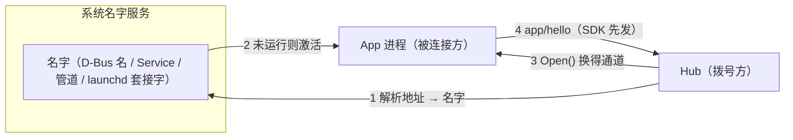
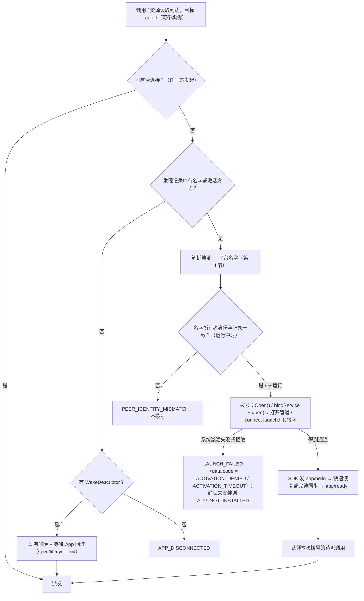
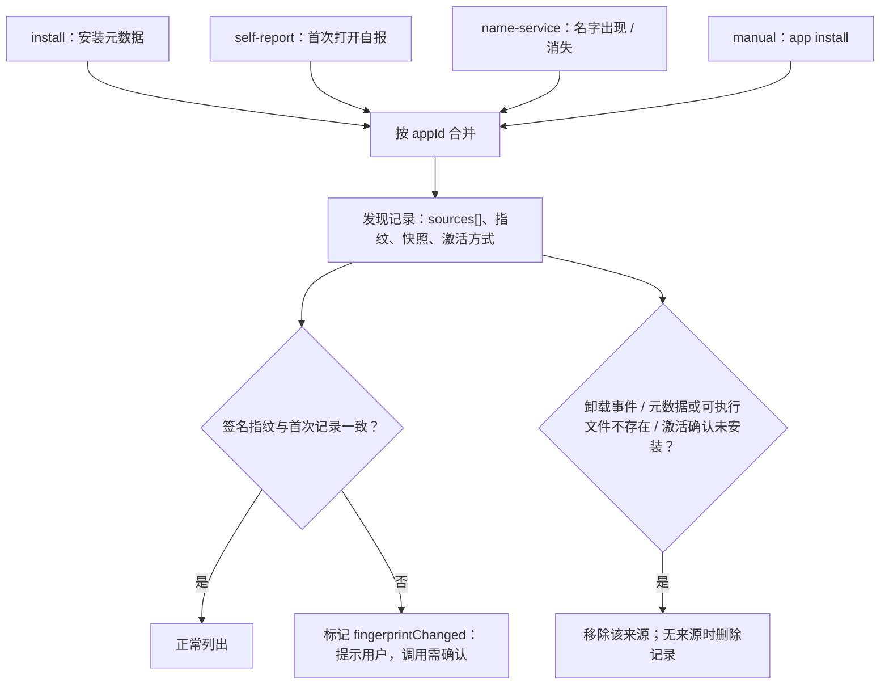
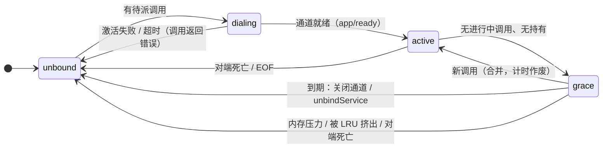

# 按名寻址与系统名字服务规范

版本：草案 v0.1（2026-10-01）。本文件是"Hub 如何按名字找到 App、建立连接、发现 App、更新目录、结束与回收连接"的
**权威契约**（任务来源：TASKS.md 4d；设计背景：`docs/plans/4e-lifecycle-power.md` P2）。

边界（不在本文件重复定义）：

| 内容 | 权威位置 |
|---|---|
| JSON-RPC 消息、握手、帧、连接级错误码表 | `spec/protocol.md` |
| 休眠 / 唤醒状态机、租约、`toolsHash`、WakeDescriptor | `spec/lifecycle.md` |
| 静态清单 `app-mcp.json` | `spec/manifest.md` |
| Hub API 与各语言绑定 | `spec/hub-api.md` |

本文件只替换"找到对方"这一层：**协议消息与 sans-IO 核心不变**。本文件中标注"待实现时加入 spec/protocol.md / spec/hub-api.md"
的条目是 4d 实施时要合入那些文件的增量，在合入之前以本文件为准、不视为已实现。

## 目录

1. 术语
2. 地址
3. 连接方向与角色
4. 各平台名字映射
5. 发现
6. 更新
7. 结束与回收
8. Android 功耗约束
9. 多 Hub 共存与旧路径兼容
10. 安全
11. 调试
12. 错误码（新增，待合入）
13. 事实 / 未知 / 风险
14. 实现状态

## 1. 术语

| 术语 | 含义 |
|---|---|
| 名字 | 系统名字服务中代表一个 App（或其一个实例）的条目：D-Bus 总线名、Android Service 组件、命名管道名、launchd 作业的按需套接字 |
| 地址 | 与平台无关的 App 身份 `appmcp://<appId>[/<instance>]`（第 2 节），由 Hub 映射为当前平台的名字 |
| 拨号 | Hub 按地址打开一条到 App 的通道（第 3 节） |
| 激活 | 名字的所有者进程未运行时，由系统在拨号时拉起它（D-Bus 激活、`bindService`、launchd 按需启动、COM / 协议激活） |
| 通道 | 拨号得到的一条字节流（socketpair 的一端、命名管道、launchd 套接字上的连接），其上跑与现有传输相同的帧与消息 |
| App 登记文件 | App 安装 / 首次运行时写下的元数据文件（第 5.3 节）。**不同于** spec/protocol.md 1.7 的 Host 登记文件 `endpoints.json` |
| 发现记录 | Hub 本地为每个 appId 保存的合并结果（来源、时间、签名指纹、快照，第 5.4 节） |
| 活引用 | 能让 App 进程保持运行或被唤醒的东西：绑定、连接、fd、跨进程回调对象、定时器、WakeLock |
| 宽限 | 最后一次调用完成后仍保持通道的时间，用于合并连续调用（第 7.2 节） |

## 2. 地址

### 2.1 语法

```
address  = "appmcp://" app-id [ "/" instance ]
app-id   = %x61-7A *62( %x61-7A / DIGIT / "-" )      ; [a-z][a-z0-9-]{0,62}
instance = %x61-7A *31( %x61-7A / DIGIT / "-" )      ; [a-z][a-z0-9-]{0,31}
```

- `app-id` 与 `HelloParams.appId`、清单 `appId` 的规则相同（spec/protocol.md 第 3 节；实现 `app_mcp_protocol::is_valid_app_id`）。
- `instance` 是**登记实例名**：App 为一个窗口 / 进程在名字服务中登记的短名（如 `main`、`w2`）。它不等于握手中的
  `instanceId`（后者每个进程 / 标签页唯一、可以很长）；Hub 在通道握手成功后记录"地址 ↔ instanceId"的对应。
  字符集限制为小写字母开头、只含小写字母 / 数字 / `-`，使它能无歧义地映射到 D-Bus 名元素（不能以数字开头）、
  对象路径元素和大小写不敏感的命名管道名。
- 只有上面这一种规范形式：scheme 必须是小写 `appmcp`，不允许用户信息、端口、查询串、片段、尾部 `/`、百分号编码、
  大写字母。解析器对任何其他形式**显式失败**（配置错误 / `INVALID_ADDRESS`，第 12 节），不做规范化猜测。
- 省略 `instance` 的地址指 App 的**默认名字**：唯一可被系统激活的名字。实例名字只在该实例运行期间存在，不能激活。

### 2.2 保留名

- `app-id` 不能是保留名 `apps`、`os`、`ax`、`host`（`app_mcp_manifest::RESERVED_APP_IDS`，单一定义处），也不能与该 Hub
  配置的上游 MCP 服务器名称相同（与握手校验一致，spec/protocol.md 10.1 `INVALID_HELLO`）。
- `instance` 保留 `default`（指默认名字本身，不能作为登记实例名）。

### 2.3 与"统一调用链接"的关系

`app-mcp-plan.md` 10.4 规划过 `appmcp://<appId>/<toolName>?args=…&sig=…` 形式的给人点击的调用链接（尚未实现，代码中无
`appmcp://` 处理）。两者的第一个路径段语义冲突。本规范规定：**`appmcp://` 的第一个路径段是登记实例名**；本地址是 Hub
内部与诊断输出用的标识，4d 不向操作系统注册 `appmcp:` URI 协议。调用链接如果实施，须改用不冲突的形式（另一个 scheme
或查询参数），见第 13.2 节 U-17。

## 3. 连接方向与角色



- **操作系统层的发起方是 Hub**：App 在系统名字服务登记名字，不常驻、不重连 Hub；Hub 在需要时拨号。Hub 与 App 的
  启动顺序无关，多个 Hub 可以共存（第 9 节）。
- **协议层角色不变**：通道建立后仍由 SDK 先发 `app/hello`，Hub 仍是"Host"一方，消息、握手、配对、快速恢复、
  `tools/sync`、调用全部按 spec/protocol.md；核心（`crates/core`）是同一个状态机，只新增一个"被连接方"驱动
  （接受一条已建立的通道后从 `Connecting → Handshaking` 开始跑现有核心；任务来源 TASKS 4d-B）。
- **帧不变**：通道上与本地 IPC 一样跑 HTTP/1.1 + WebSocket（spec/protocol.md 1.2），**SDK 仍是 WebSocket 客户端**
  （发送到 `ws://localhost/app` 的升级请求），Hub 仍是服务端。也就是说：OS 层"谁拨号"反转，WebSocket 与 JSON-RPC 的角色
  不反转——这样 SDK 核心、Hub 的消息处理、超时与关闭逻辑仍只有一份实现。网页经扩展的通道例外（第 4.6 节）。
- **心跳**：通道是本地传输，存活由系统对端死亡通知与 EOF 判断（第 7.5 节），两端不发 `ping`（与 spec/lifecycle.md 中本地
  传输去心跳的规则一致）。
- **认领**：Hub 拨号是为了派发某些待派调用；在**它自己拨出的通道**上就绪的实例直接认领这些调用，不需要 `wakeToken`。
  SDK 在该通道的 `app/hello` 中填 `wakeReason: "os-activation"`（沿用现有取值）。
- **生命周期映射**（细则见第 7 节）：

  | 现有概念（spec/lifecycle.md） | 按名寻址下 |
  |---|---|
  | 休眠（`dormant`） | Hub 关闭通道；名字保留；Hub 保留快照 |
  | 唤醒 | Hub 拨号；进程未运行时由系统激活 |
  | `wakeToken` / WakeDescriptor | 降为**后备**：只用于不支持激活的平台 / App（Windows 未打包 App 的协议激活、网页 `web-url`、旧 SDK） |
  | 租约（`app/lease`） | 仍由 Hub 计算，决定**何时关闭通道**（第 7.2 节） |
  | App 端空闲计时 | Hub 发起的通道上不运行：关闭时机只由 Hub 决定；App 可用 `app/sleep { reason: "app" }` 请 Hub 提前关闭 |

### 3.1 地址解析与拨号流程



- 带实例的地址只解析到运行中的实例名字；实例不存在时**不**退回默认名字（显式失败 `NAME_NOT_FOUND`），由调用方决定是否改用无实例地址。
- 同一 App 已有拨号在进行时，后来的调用加入等待，不重复拨号（与 spec/lifecycle.md 唤醒去重同构）。

## 4. 各平台名字映射

### 4.0 总表

| 平台 | 名字 | 拨号 → 通道 | 激活 | 发现 | 支持 |
|---|---|---|---|---|---|
| Linux（桌面） | 会话总线名 `dev.appmcp.App.<id>`、实例 `dev.appmcp.App.<id>.<inst>`；对象路径 `/dev/appmcp/App[/<inst>]` | 方法 `dev.appmcp.App1.Open() → h`（socketpair 一端） | D-Bus 服务激活（`.service` 文件） | `ListActivatableNames` / `ListNames` + `NameOwnerChanged` + XDG 登记 | 是 |
| Android | 导出的绑定式 Service，Intent 动作 `dev.appmcp.TOOLS` | `bindService` → `IBinder` → `open(instance) → ParcelFileDescriptor`（socketpair 一端） | `bindService(BIND_AUTO_CREATE)` | `queryIntentServices` + `<meta-data>` 清单资源 + 包变更 | 是 |
| Windows | 命名管道 `\\.\pipe\appmcp-<SID>-<id>[.<inst>]` | Hub 作为管道客户端打开 | 未打包：协议激活后等待管道出现；打包：待验证（U-07），确认前同未打包 | App 登记文件（`%LOCALAPPDATA%\app-mcp\apps\`）+ 打包 App 扩展目录 | 是 |
| macOS | launchd 用户 Agent `dev.appmcp.App.<id>` 的按需 Unix 套接字（`Sockets`，路径写在登记文件 `activation.target`） | Hub `connect` 该套接字，连接即通道 | launchd 按需启动（连接到来时） | App 登记文件（`~/Library/Application Support/app-mcp/apps/`）+ `~/Library/LaunchAgents` | 仅非沙盒；沙盒不支持（4.4） |
| iOS | 无 | — | — | — | **不支持**：第三方 App 不能调用其他 App 的 App Intents；App 能力经 codegen 的 App Intents 交给系统入口（4.5） |
| 网页 | 扩展已知的标签页 | 页面 → content script → 扩展 service worker → Native Messaging → Hub | `web-url`（WakeDescriptor 后备） | 扩展枚举已打开且加载了 SDK 的标签页 | 是（方向不反转，见 4.6） |
| 鸿蒙 | 暂无 | — | — | — | 4d 不覆盖，沿用现有 WebSocket 路径 |

`<id>`、`<inst>` 在 D-Bus 名与对象路径中按 4.1 的转义规则写出；其他平台原样使用。

### 4.1 Linux：D-Bus 会话总线

- **名字**：默认名字 `dev.appmcp.App.<id>`；实例名字 `dev.appmcp.App.<id>.<inst>`（同一进程可以拥有多个名字；
  另开进程的实例各自拥有自己的实例名字）。元素数量区分二者：`appId` 与 `instance` 都不含 `.`。
- **转义**：`appId` / `instance` 中的 `-` 写为 `_`（二者字符集都不含 `_`，映射可逆）。理由：对象路径元素只允许
  `[A-Za-z0-9_]`；总线名虽允许 `-` 但规范不推荐并建议换成 `_`（F-20）；Desktop Entry 规范的对象路径推导同样把 `-` 写成 `_`。
  例：`appmcp://my-shop/w2` → 名字 `dev.appmcp.App.my_shop.w2`、路径 `/dev/appmcp/App/w2`。总线名总长 ≤ 255：
  前缀 15 + appId 63 + `.` + instance 32 = 111，不会超限。
- **接口**：`dev.appmcp.App1`（接口名带主版本号，演进时新增 `App2`，旧接口保留一个弃用周期）。
  - `Open() → (h channel)`：App 创建 socketpair，返回一端（UNIX_FD），自己保留另一端并在其上以"被连接方"驱动跑核心；
    消息走 fd，**不经总线转发**。默认路径上的 `Open()` 选择默认实例（进程内的主实例），实例路径上的选择对应实例。
  - 每次 `Open()` 创建新通道；同一 Hub 的旧通道不复用。
- **激活**：`$XDG_DATA_HOME/dbus-1/services/dev.appmcp.App.<id>.service`（或 `$XDG_DATA_DIRS` 下的同名文件，由包管理器安装），
  `Name=dev.appmcp.App.<id>`、`Exec=<程序> --app-mcp-activation`；文件名与 `Name` 一致。由 `app-mcp-host app install` / codegen /
  打包模板生成，开发者不手写。写入后调用 `org.freedesktop.DBus.ReloadConfig`（dbus-broker 是否自动发现新文件未见文档，F-21 / U-05）。
  不使用 `$XDG_RUNTIME_DIR/dbus-1/services`（该目录不被监视）。实例名字不写激活文件。向未运行的可激活名字发方法调用即触发激活
  （不带 `NO_AUTO_START`）。
- **调用方身份**：App 在 `Open()` 中用 `GetConnectionUnixUser`（或 `GetConnectionCredentials`）查询调用方的 uid，
  与自身不同则返回 D-Bus 错误 `org.freedesktop.DBus.Error.AccessDenied`；Hub 拨号前用 `GetConnectionCredentials` 查询名字所有者的
  uid 与进程号，uid 不同则不拨（`PEER_IDENTITY_MISMATCH`），进程号用于取可执行文件路径（`/proc/<pid>/exe`）并与登记文件核对。
  默认会话总线策略允许同一用户的任何连接拥有任何名字（先到先得），**名字本身不证明身份**（10.3）。
- **`Open()` 的错误**（App 侧返回、Hub 侧映射为第 12 节的码）：调用方不是同一用户 → `AccessDenied`（`BIND_PERMISSION_DENIED`）；
  App 已有连接 → `LimitsExceeded`，说明以 `CHANNEL_LIMIT` 开头（`CHANNEL_LIMIT`）。总线自身的错误：`ServiceUnknown` / `NameHasNoOwner`
  （没有所有者也没有激活文件）、`Spawn.ExecFailed` / `Spawn.FileInvalid` / `Spawn.ServiceNotFound`（激活文件指向的程序不存在或文件无效）
  → `NAME_NOT_FOUND`（调用 `APP_NOT_INSTALLED`）；`NoReply` / 超时 → `ACTIVATION_TIMEOUT`；其余 `Spawn.*` 等 → `ACTIVATION_DENIED`。
- **激活启动的进程**：`Exec` 追加的 `--app-mcp-activation` 让 SDK 把本进程视为"由唤醒冷启动"（`Residency::ExitWhenIdle` 在通道关闭后
  发出 idle-exit）；SDK 连接总线时优先用激活方给出的 `DBUS_STARTER_ADDRESS`。
- **接入**：Rust（`crates/native` 的 `NameServer` 实现）、Python（GApplication / dbus 库）、Qt、C / C++。

### 4.2 Android：绑定式 Service

- **名字**：App 清单中导出的 Service（SDK 提供 `dev.appmcp.android.ToolsService`，经清单合并加入），intent-filter 动作
  `dev.appmcp.TOOLS`；`<meta-data android:name="dev.appmcp.manifest" android:resource="@raw/app_mcp"/>` 指向构建期生成的
  静态清单（App 在自己的清单中为该 Service 补上，与库的声明合并）。appId 由该清单给出（不由包名推导），Hub 核对"包名 ↔ appId ↔ 签名指纹"（第 10.3 节）。
  不需要按名寻址的 App 以 `tools:node="remove"` 去掉该 Service。
- **拨号**：Hub `bindService(显式 Intent(动作 + 包名 + 组件), flags)`（flags 见第 8 节；`bindService` 必须用显式组件）→
  `onServiceConnected(IBinder)` → 调用一次 `open(String instance) → ParcelFileDescriptor`：App 以
  `ParcelFileDescriptor.createSocketPair()` 创建一对、一端交给本进程的原生客户端（`NativeClient::accept_channel`）、另一端返回，
  消息走 fd 上的同一帧格式（HTTP/1.1 + WebSocket，SDK 为客户端，第 3 节）。
- **Binder 线协议**（不用 AIDL 生成类，避免同一 App 同时含 App 端与 Hub 端库时类重复；实现 `sdks/kotlin/app-mcp-binder`）：
  接口描述符 `dev.appmcp.IAppTools/1`（主版本在描述符中，第 9.2 节"版本演进"）；唯一的事务 `open` = `IBinder.FIRST_CALL_TRANSACTION`。
  请求 `writeInterfaceToken(描述符)` + `writeString(instance)`（可空，空 = 默认名字）；成功回复 `writeNoException()` + `writeInt(1)` +
  `ParcelFileDescriptor`；失败回复 `writeException(e)`，说明以第 12 节的错误码开头（`<CODE>：<说明>`）：调用方不可信 →
  `SecurityException("HUB_NOT_TRUSTED：…")`，其余为 `IllegalStateException`（`CHANNEL_LIMIT`、`NAME_NOT_FOUND`（不存在的实例）、
  `ACTIVATION_DENIED`（SDK 未创建 / 已停止））。Hub 侧按说明前缀还原错误码；没有前缀时 `SecurityException` 记 `HUB_NOT_TRUSTED`、其余记 `ACTIVATION_DENIED`。
- **冻结**：同步 Binder 调用打到已冻结的进程会使该进程被杀、调用方得到 `RemoteException`（F-08）。因此 `open()` 只在
  `onServiceConnected` 之后调用（绑定把进程从缓存态抬起；以 `BIND_WAIVE_PRIORITY` 绑定的 Service 在其客户端都进入缓存态之前不被冻结）；
  通道建立后消息走 fd、不再经 Binder。`open()` 收到 `RemoteException` 按"激活失败"处理，不在同一次调用内反复重试（U-02）。
- **一次绑定只交换一个 fd**：不传递任何回调 Binder 对象（远端代理会把对方对象钉住、阻碍 GC）；Service 不保存客户端引用；
  每次使用前重新 `bindService`（冻结中的进程由绑定解冻），不复用旧会话的 `IBinder` 代理（拿到 fd 后即丢弃代理引用）。
- **App 端正在拨出时**：SDK 的核心同时只接受一条连接（U-16）。`open()` 时客户端恰好处于连接中 / 握手中 / 回连中（如 on-demand 进入前台后
  连 Host）时，App 端等它落定（事件驱动，最长 3 s）后再试一次；仍有连接则 `CHANNEL_LIMIT`。Hub 一侧不重试。
- **调用方身份**：`open()` 在 Binder 事务内执行，App 用 `Binder.getCallingUid()` 取 Hub 的 uid，按第 10.2 节的 Hub 信任规则
  校验后才创建通道；不通过返回 `SecurityException`（Hub 记 `HUB_NOT_TRUSTED`）。`onBind()` 不做校验（不在调用方事务内）。
- **发现**：Hub 清单声明 `<queries><intent><action android:name="dev.appmcp.TOOLS"/></intent></queries>`（Hub 端库的清单已带），用
  `queryIntentServices(Intent(dev.appmcp.TOOLS), GET_META_DATA)` 一次性枚举（只取导出且启用的 Service），经
  `PackageManager.getResourcesForApplication(目标包).openRawResource(meta-data 资源)` 读清单（PackageManager 接口，不经 App 进程，
  上限 512 KiB；"确实不启动进程"列为待真机确认，U-01）；**不申请** `QUERY_ALL_PACKAGES`。没有清单或清单 appId 不合法的 Service 跳过；
  同一 appId 由多个包声明时按包名排序只认第一个，其余记录警告（该包仍安装期间不被替换）。增量：运行期间以**动态注册**的接收器收包变更广播
  （`PACKAGE_ADDED` / `REPLACED` / `CHANGED` / `REMOVED`（非替换）/ `FULLY_REMOVED`；清单注册的接收器在 API 26+ 收不到前两者），对变化的包重新查询。
  Hub 启动时总是做一次全量查询（Hub 只在助手活跃时运行，启动查询是一次本地调用）；`getChangedPackages(sequence)` 增量未采用。
- **Hub 侧身份核对**：拨号得到 fd 后，Hub 以 socketpair 对端凭据（`SO_PEERCRED`，即创建通道的进程）的 uid 与发现时记录的目标包 uid 比对，
  不同即 `PEER_IDENTITY_MISMATCH` 并解绑（第 10.3 节）。
- **对端死亡**：App 死亡 → fd EOF（Hub 关闭通道并解绑）；Hub 死亡 → fd EOF（App 转休眠）、系统自动解除绑定。未使用 `linkToDeath`
  （需要持有 `IBinder` 代理，与"拿到 fd 即丢弃代理"冲突；fd EOF 已覆盖，第 7.5 节）。
- **旧路径**：`WakeReceiver`（广播 `dev.appmcp.action.WAKE`）+ 加急 WorkManager 唤醒保留给"没有 Android 端 Hub、Hub 在 PC
  经 `adb reverse` 连接"的场景（spec/lifecycle.md 第 5 节）。

### 4.3 Windows：每 App 每用户命名管道

- **名字**：`\\.\pipe\appmcp-<用户 SID>-<appId>`（默认）与 `\\.\pipe\appmcp-<用户 SID>-<appId>.<instance>`（实例）。
  分隔符用 `.` 而不是 TASKS 草拟的 `-`：`appId` 与 `instance` 都可含 `-`，用 `-` 会有歧义（`shop-w2` 无法区分）。管道名不区分大小写，
  地址只用小写，因此映射无歧义。前缀 `appmcp-` 与
  Host 自己的管道 `\\.\pipe\app-mcp-<SID>`（spec/protocol.md 1.3）不同，互不冲突。完整名受 256 字符上限约束，
  创建前按 `app_mcp_protocol::endpoint::check_pipe_name` 检查（超长 → `IPC_PATH_TOO_LONG`）。
- **管道属主是 App**：App 以 `FILE_FLAG_FIRST_PIPE_INSTANCE` 创建第一个实例（名字已被占用即失败并报告），安全描述符与
  spec/protocol.md 1.4 相同（只有当前用户、`PIPE_REJECT_REMOTE_CLIENTS`）。Hub 作为管道客户端打开它；通道就是这个管道连接
  （Windows 不传 fd）。
- **调用方身份**：App 用 `GetNamedPipeClientProcessId` 取 Hub 进程并核对其用户 SID；Hub 打开后核对管道所有者 SID 与服务端进程
  （`GetNamedPipeServerProcessId`）的可执行文件路径与登记文件中的 `executable` 一致（第 10.3 节）。
- **App 登记文件**：`%LOCALAPPDATA%\app-mcp\apps\<appId>.json`（格式见 5.3），记录激活方式与可执行文件。管道没有官方的枚举接口，
  Hub **只从登记文件（及打包 App 的扩展目录）得知有哪些管道**，不枚举 `\\.\pipe\`。
- **激活**：
  - 未打包 App：协议激活（登记的 URI scheme，沿用 WakeDescriptor `uri`），随后 Hub 在激活超时内等待管道出现。管道尚不存在时
    `WaitNamedPipe` 立即失败（不等待超时），因此用有界退避重试（如 50 ms 起、×2、上限 1 s），只在本次激活窗口内进行，
    不是常驻轮询；超时 → `ACTIVATION_TIMEOUT`。
  - 打包（MSIX）App：发现用 AppExtension（`AppExtensionCatalog`，打包桌面 App 可用）；激活用 COM 本地服务器（`com:ExeServer`）或
    App Service。App Service 需要包身份、未打包 Hub 能否调用二者均待验证（U-07），确认前打包 App 也走协议激活 + 登记文件。
  - 打包 App 写 `%LOCALAPPDATA%` 可能被虚拟化到包私有位置、其他进程看不到（F-23）：打包 App 不依赖自写登记文件被 Hub 读到，
    而用 AppExtension 声明，或在包清单中把 `app-mcp\apps` 排除出虚拟化。
- **接入**：C#、C++、Rust、Python；WSL 侧 Hub 经 interop 的可达性列为待验证。

实现时的决定（2026-10-02，4d-E；实现状态见 14.3）：

- **激活方式**（5.3 `activation.kind`，本段新增 `exec` 与 `aumid`）：
  - `exec`（未打包 App 的默认值，`app-mcp-host app install` 写入）：Hub 直接运行 `target`（为空时用 `executable`）并追加
    `--app-mcp-activation`（与 D-Bus `Exec` 相同，SDK 据此视为激活启动、通道关闭后发出 idle-exit），工作目录为程序所在目录、不建控制台窗口、
    不经 shell。程序不存在 → `NAME_NOT_FOUND`（调用 `APP_NOT_INSTALLED`）；激活后进程以失败状态退出 → 立即 `ACTIVATION_DENIED`，不等到超时。
  - `uri`：复用唤醒器的协议激活（`<scheme>://app-mcp/wake?token=<随机>`），令牌不登记、Hub 不据此认领；这样启动的 App 没有
    `--app-mcp-activation`，不会在空闲时自行退出。若 App 把该 URI 交给 SDK 的唤醒处理而改为拨 Hub，按 9.2 由 App 发起的连接认领本次调用。
  - `aumid`（打包 App，U-07 之前的替代）：复用唤醒器的 `IApplicationActivationManager::ActivateApplication`，参数为 `--app-mcp-activation`。
  - `none` 或其他值：不激活，只在 App 运行（管道存在）时可拨号；发现记录标为不可激活，Hub 不按名路由到它。
- **等待管道**：首次打开得到"不存在"才激活，之后按 50 ms 起、×2、上限 1 s 退避重试，总时长不超过 Hub 的唤醒超时；"所有实例忙"
  （`ERROR_PIPE_BUSY`）同样重试但不激活。带实例的地址只打开一次、不激活，不存在即 `NAME_NOT_FOUND`。
- **App 侧调用方身份**：不调用 `GetNamedPipeClientProcessId` 核对 SID，而以管道 DACL（只授予当前用户）与 `PIPE_REJECT_REMOTE_CLIENTS`
  为准——由内核执行，与 Host 自己的本地 IPC 管道（spec/protocol.md 1.4）相同。
- **Hub 侧身份**：打开后、交出通道前核对 ①管道所有者 SID 为当前用户；②服务端进程（`GetNamedPipeServerProcessId`）映像
  （`QueryFullProcessImageNameW`）与登记文件 `executable` 一致（去掉 `\\?\` 前缀、`/` 视为 `\`、不区分大小写；`app install` 写出的路径不带
  `\\?\`）。取不到映像按不一致处理；不一致即 `PEER_IDENTITY_MISMATCH`。登记中没有 `executable` 时只核对所有者。
- **拒绝通道**：Windows 没有方法错误可回，App 在该管道连接上写一行 `<CODE>：<说明>\n`（与 4.2 Binder 说明前缀相同，≤ 512 字节），
  等 Hub 读取并关闭（最长 2 s）后断开；已有连接 → `CHANNEL_LIMIT`，SDK 已停止 → `ACTIVATION_DENIED`。Hub 交出通道前读取第一段数据：以
  `GET ` 开头即 SDK 的升级请求（读到的字节原样回放给 App 连接服务），否则按拒绝行解析码（未知码 `ACTIVATION_DENIED`）；未发送任何数据即关闭
  → `ACTIVATION_DENIED`；超时 → `ACTIVATION_TIMEOUT`。
- **发现与更新**：只读登记目录；`executable` 已不存在的登记跳过（5.4）。目录变更用重叠 I/O 的 `ReadDirectoryChangesW`，由一个阻塞在
  `WaitForMultipleObjects` 上的线程等待（无定时器、不轮询；只在启用按名寻址时存在，连接器的事件流被丢弃即退出）；缓冲溢出时重新枚举（F-25）。
  文件出现 / 改动 → 安装事件，删除或失效 → 卸载事件。登记目录不存在时 Hub 创建它（以便监视）。登记目录 / 文件的属主检查（5.3 末段）未做：
  `%LOCALAPPDATA%` 默认只有本用户可写。管道不能枚举，发现记录的 `running` 恒为否（正在运行的实例由拨号得知）。
- **清单**：登记文件的 `manifest` 指向的静态清单由连接器读取（Host 不必重启即可按清单列出新登记 App 的工具），卸载事件随之撤下。

### 4.4 macOS：launchd 按需套接字

（2026-10-02，4d-F 实施时的决定：由草案的 `MachServices` + XPC 改为 launchd `Sockets`。理由见本节末"为何不用 XPC"。）

- **名字**：用户 LaunchAgent，标签 `dev.appmcp.App.<appId>`（appId 原样），`Sockets` 字典中键 `AppMcp` 声明一个 Unix 套接字：
  `SockPathName` = 套接字绝对路径、`SockPathMode` = `384`（`0600`，plist 只有十进制，F-44）；`ProgramArguments` = 程序 +
  `--app-mcp-activation`；不设 `RunAtLoad` / `KeepAlive`（缺省只按需启动，F-44）。plist 由 `app-mcp-host app install` 写入
  `~/Library/LaunchAgents/dev.appmcp.App.<appId>.plist` 并 `launchctl bootstrap gui/<uid>`（或安装程序写入；包内 Agent 经
  `SMAppService.agent(plistName:)` 注册为待验证，U-25）。生成函数 `app_mcp_protocol::naming::launchd::agent_plist`（单一定义）。
- **套接字位置**：`app install` 用 `<Host 配置目录>/run/apps/<appId>.sock`（默认 `~/.app-mcp/run/apps/`，目录 `0700`），绝对路径写入登记文件
  `activation: { "kind": "launchd", "target": "<套接字路径>" }`；Hub 只按登记文件拨号，不推导路径。路径须放得进 `sockaddr_un`
  （macOS 103 字节），超长在安装时即失败（`IPC_PATH_TOO_LONG`，可用 `--home` 缩短）。`~/Library/Application Support/…` 不用于套接字：
  加上 63 字符的 appId 容易超长。
- **实例**：一个作业只有一个套接字，不登记实例名字；带实例的地址拨号即 `NAME_NOT_FOUND`。
- **拨号 = 激活**：Hub `connect` 该路径。launchd 持有监听端，作业未运行时在连接到来时启动它，连接先排在监听队列中；作业以
  `launch_activate_socket("AppMcp")` 取得监听 fd（F-45）并 `accept`，每个连接即一条通道（帧与 4.1 相同，SDK 先发 `app/hello`）。
  激活与握手共用 Hub 的唤醒超时，超时 `ACTIVATION_TIMEOUT`。`connect` 失败：套接字不存在 → `NAME_NOT_FOUND`（作业未载入，调用报
  `APP_NOT_INSTALLED`）；无人监听（`ECONNREFUSED`，作业被卸下后的残留文件）→ `ACTIVATION_DENIED`；无权限 → `BIND_PERMISSION_DENIED`。
- **拒绝**：与 Windows 相同（4.3"拒绝"）：App 在连接上写一行 `<CODE>：<说明>\n` 后断开；Hub 在交出通道前读第一段数据区分升级请求与拒绝行。
- **身份**：Hub 拨号前核对套接字目录属于当前用户且组 / 其他用户不可写（否则 `PEER_IDENTITY_MISMATCH`，不连接）；连接后以 `getpeereid`
  核对对端为当前用户**或 root**（launchd 创建的监听端的凭据可能记为 root，U-23）；对端进程号为 1（launchd）时不记录。App 侧 `accept` 后
  核对对端 uid 与自身相同，否则直接关闭。登记 `executable` ↔ 作业程序由 `doctor` 比对 plist（不在拨号时核对，与 Linux 第一段相同）；
  Team ID / 代码签名指纹（5.4、10.3）未做。
- **App 进程**：只有 launchd 启动的作业进程能取得套接字。`launch_activate_socket` 每个进程只能成功一次（再取为 `EALREADY`），SDK 把 launchd
  交来的 fd 留在进程内、每次登记复制一份（`stop` 后再 `start` 仍可登记）；SDK 停止而进程未退出期间，Hub 的连接排队至超时
  （launchd 不会另起进程）。由 `--app-mcp-activation` 启动的进程在通道关闭后发出 idle-exit（与 4.1 相同），进程退出后 launchd 恢复监听。
- **GUI 进程（U-09 的决定）**：用户从 Finder 打开的进程不是 launchd 作业，`launch_activate_socket` 返回 `ESRCH`，SDK 记录警告、不登记名字，
  继续走 App 拨 Hub（IPC / WebSocket）路径。Hub 的路由先用已有活连接（3.1），因此 GUI 进程已连接时不会拨号；GUI 进程运行但处于休眠时，
  Hub 拨号会让 launchd 另起一个作业进程（无界面模式），两进程各自注册工具——App 需要单实例语义时自行在作业进程中转交（如 `NSDistributedNotificationCenter`
  / 打开 GUI），本库不做进程合并。
- **发现与更新**：只读登记目录 `~/Library/Application Support/app-mcp/apps/`（5.3），不连接套接字（连接即激活）。目录变化由一个阻塞在
  `kevent` 上的线程等待（`EVFILT_VNODE`：目录项增删 / 改名，无定时器、不轮询；只在启用按名寻址时存在，事件流被丢弃即以 `EVFILT_USER` 唤醒退出）；
  kqueue 不给出文件名，每次变化重新枚举（与 Windows 溢出时相同）。原地改写已有文件（不经改名）不产生通知；`app install` 以"临时文件 + 改名"写入。
- **沙盒 App**：App Group 容器内的 Unix 套接字只对**同一开发团队（Team ID）**的进程可用（F-28），第三方 Hub 无法使用；`open -g` 激活后等待
  该套接字同样受此限制。因此沙盒 App（及沙盒 Hub）**不支持按名寻址**，走现有 WakeDescriptor（`open -g`）+ App 拨 Hub 路径。
- **为何不用 XPC**（草案原方案）：① XPC 的事件处理器是 Objective-C block，Rust 侧需要 block ABI（新增依赖或手写不安全代码）加 `xpc_object_t`
  字典的引用计数管理，不安全代码面远大于一次 `launch_activate_socket` 调用；② 两者都要求按需进程是 launchd 作业（Apple 不支持 App 之间直接 XPC，
  F-27），GUI 进程问题（U-09）相同；③ `Sockets` 下 Hub 侧只需普通的 Unix 套接字 `connect`，无 FFI，连接、身份、拒绝、超时逻辑能在 Linux 上
  以真实套接字测试；④ 不需要 XPC 的 fd 传递：通道就是 launchd 套接字上的连接。代价：XPC 的 `xpc_connection_set_peer_code_signing_requirement`
  （按签名限定对端）没有对等物，同用户内以目录权限 + `getpeereid` 为准（10.1，与 Host 的本地 IPC 相同）。
- **待实机验证**：无 Mac 实机，Linux 上编译（`aarch64-apple-darwin` / `x86_64-apple-darwin` 的 `cargo clippy`）与单元测试，实机验收见 14.4。

### 4.5 iOS：不支持

**结论**：iOS 上**不提供**按名寻址，iOS 上的 Hub / Agent App 也**不能**把其他 App 的 App Intents 当作工具调用。App 的能力经 codegen
生成的 App Intents 交给**系统入口**（Siri、快捷指令等）执行；现有 `uri` 唤醒（前台）与 App 在前台时的 SDK 直连保留。核实于 2026-10-02
（F-36 至 F-43）。

- **没有名字服务**：iOS 上没有可供第三方使用的 launchd / XPC 服务接口（`xpc_connection_create_mach_service`、`SMAppService` 只在
  macOS 提供，F-30）；App 挂起后其监听套接字不处理连接（F-43），App 也不能反过来"监听、等 Hub 来连"。
- **第三方不能调用他人的 App Intents**：Apple DTS 工程师在开发者论坛 776820 中明确答复 "One application cannot invoke an app intent
  of another."（F-36）。App Intents 只由系统入口执行：Siri / Apple Intelligence、快捷指令、Spotlight、小组件与控件、操作按钮、实时活动
  （F-37），没有第三方调用方。
- **快捷指令 URL scheme 只是人工后备**：`shortcuts://run-shortcut?name=…`（及 `x-callback-url` 变体）只能按名字运行**用户自己建好**的
  快捷指令，会切到快捷指令 App，回传只有 `x-success` 的文本输出（F-38）。用户可以自建"包一层 App Intent"的快捷指令，由 Agent App 按名运行，
  但无法枚举、参数与结果都不是结构化的，需要用户逐个手工配置——**不作为 Hub 的调用通道**，只在文档中作为用户自建桥接说明。
- **不改变结论的新入口**：
  - 日本侧边按钮：`@AppIntent(schema: .assistant.activate)` + 权利 `com.apple.developer.side-button-access.allow`，只在日本、只用于
    **启动**语音对话 App（F-39）——让 Agent App 可被唤起，不让它调用其他 App；
  - 欧盟：Apple 提出的 "Trusted System Agent" 方案被欧委会否决，欧盟 Siri AI 推迟、无时间表（F-40）；
  - iOS 27 的 "Siri 扩展" / 模型委托：仅见媒体报道为代码中的私有接口、未启用，公开文档中没有（U-20）。
- **候选（不支持，只记录）**：iOS 26 的 ExtensionFoundation 是唯一公开的跨开发者进程间通信：宿主（Hub App）定义扩展点并设
  `Scope(restriction: .none)` 允许其他开发者的扩展绑定，App 随包提供绑定该扩展点的扩展（`Identifier(host:name:)`，一个扩展只能绑定一个
  扩展点），**设备主人批准**后宿主经 `AppExtensionProcess` 建立 XPC 会话（F-42）。App Store 接受度、宿主在后台时能否启动 / 使用扩展、
  扩展的内存与时间上限均未知（U-21），在这些确认之前不实现、不写入协议。
- **codegen 的 App Intents 扩展输出**（`swift-app-intents` 加 `--app-intents-extension`）：价值在**系统入口**——App 未运行时由
  App Intents 扩展进程执行 intent，不必启动 App（`AppIntentsExtension`，F-41），与 Hub 无关。intent 代码放在 App 与扩展共用的
  Swift 包（`AppIntentsPackage` + `includedPackages`）；handler 由开发者实现一次（`<Module>IntentHandlersProviding`），App 与扩展的
  `init` 各调用一次 `<Module>IntentRuntime.configure(_:)`，首次执行 intent 时才构造。可选：`--app-intents-execution-targets` 按
  `activation` 声明 `allowedExecutionTargets`（`foreground` → `.main`，`background` / `headless` → `[.main, .appIntentsExtension]`；
  iOS 27 起，以 `@available` 限定）；`--app-intents-cancellable` 遵循 `CancellableIntent`（iOS 26.4 起，以 `#available` 限定）。
  未开启扩展时输出不变。生成代码只做过 Linux 上的桩类型检查，未在真实 SDK 上编译（U-22、R-15）。

### 4.6 网页：浏览器扩展 + Native Messaging

- **方向不反转**：Hub 无法拨号到网页。页面 SDK 检测到扩展后经 `window.postMessage` → content script → 扩展 service worker →
  `chrome.runtime.connectNative("dev.appmcp.host")` 与 Hub 通信，不使用任何端口。Native Messaging 宿主程序为
  `app-mcp-host native-messaging`（宿主清单 `type: "stdio"`、`allowed_origins` / Firefox `allowed_extensions` 只列本扩展，由
  `service install` 写入各浏览器的用户级位置：Chrome / Edge / Firefox 在 Linux、macOS 为用户目录下的 `NativeMessagingHosts`，
  Windows 为 `HKCU` 注册表项）：它是浏览器要求的 stdio 进程，由它以本地 IPC 连接常驻 Hub 并承载帧——这是浏览器的进程模型决定的入口，
  不是为绕过问题加的转发层（原则 8 的边界说明）。
- **帧**：Native Messaging 的帧是"32 位本机字节序长度前缀 + UTF-8 JSON"，不是 WebSocket。通道上承载的仍是同一套 JSON-RPC 消息，
  并使用 spec/protocol.md 第 9 节的多路复用帧（每个标签页一个通道）。这是一种新传输形式，待实现时加入 spec/protocol.md 1.2。
- **零活引用**：打开的 Native Messaging 端口会让浏览器保持宿主进程运行、并保持 MV3 service worker 存活（Chrome 105+）。扩展只在
  存在加载了 SDK 的标签页、且其中至少一个实例有连接需要时持有端口；全部实例休眠后断开端口（与 spec/protocol.md 9.2"最后一个通道
  关闭即关闭连接"一致）。
- **页面 ↔ 扩展**：content script 经 `window.postMessage` 与页面通信（同一 DOM）；content script 收到的页面消息视为不可信输入，
  校验后再转发。
- **地址**：`appmcp://<appId>/<instance>` 中的实例对应一个标签页（实例名由扩展分配，如 `t<标签页序号>`）；无实例的地址
  不能激活网页，只能经 `web-url` 后备打开页面。
- **来源可信度**：扩展以浏览器 API 取得的标签页 URL 作为 `origin`，优先于页面自报。
- **消息大小**：宿主 → 扩展单条消息上限 1 MB（Chrome；扩展 → 宿主 64 MiB）。一个多路复用帧超过 1 MB 时 Hub 不发送，改为对该调用 /
  读取返回明确错误（`MESSAGE_TOO_LARGE`），不截断、不静默丢弃。
- **WebMCP**：页面提供 WebMCP 时（规范草案的接口为 `document.modelContext`，Chrome 149 起源试用，F-33；TASKS 4d-H 写作
  `navigator.modelContext`，以规范为准）经扩展把其工具暴露为该页实例的工具。
- 回环 WebSocket（`/app`）改为默认关闭、用户显式开启（TASKS 4d-H）；未安装扩展时页面 SDK 仍按现有规则连接已开启的端口。

## 5. 发现

### 5.1 原则

- **只读数据，从不为发现而启动进程**：发现只读安装期元数据、App 登记文件与名字服务的列表 / 事件；不调用 App 的任何方法、
  不 `bindService`、不连接 launchd 套接字。
- **时机**：Hub 启动时扫描一次（Android 用 `getChangedPackages(sequence)` 增量）+ Hub 运行期间订阅系统变更事件
  （包安装 / 更新 / 卸载、inotify / `ReadDirectoryChangesW` 监视登记目录、D-Bus `NameOwnerChanged`）。**无轮询**。
- **多来源合并**：读安装信息只是其中一种主动鉴别方式；四种来源合并为每个 appId 一条发现记录（5.4）。

### 5.2 来源

| 来源 `source` | 内容 | 何时出现 | 依赖 App 运行 |
|---|---|---|---|
| `install` | 平台安装元数据：Android `<meta-data>` 清单资源、Linux `.service` + XDG 登记、Windows 打包 App 扩展 / 登记文件、macOS 包内清单 + launchd plist | 安装 / 更新时；Hub 启动扫描与变更事件读到 | 否（主路径） |
| `self-report` | App 首次打开（及登记内容变化时）的一次性自报 | 见 5.5 | 仅自报那一刻 |
| `name-service` | 名字出现 / 消失（`NameOwnerChanged`、管道 / launchd 作业的运行由激活与通道得知） | App 运行并登记名字时 | 是 |
| `manual` | 用户执行 `app-mcp-host app install <清单或程序>` 写入的 App 登记文件 | 用户操作时 | 否 |

### 5.3 App 登记文件

桌面平台（Linux、Windows、macOS）共用一种 JSON，`install`（安装程序写入）、`manual`（`app install` 写入）、`self-report`
（SDK 写入，5.5）三种来源都用它，以 `source` 字段区分：

```jsonc
{ "registrationVersion": 1,
  "appId": "shop",
  "name": "示例商城",
  "source": "install",                         // install | manual | self-report
  "manifest": "/opt/shop/app-mcp.json",         // 静态清单的绝对路径（可省略）
  "manifestSha256": "…",                        // 清单内容摘要（可省略）
  "executable": "/opt/shop/bin/shop",           // 用于判断"已不存在"与核对通道对端
  "activation": { "kind": "dbus" | "exec" | "launchd" | "uri" | "aumid" | "com" | "app-service" | "none", "target": "…" },   // exec / aumid 见 4.3，launchd（target = 套接字路径）见 4.4
  "signature": { "kind": "authenticode" | "codesign" | "none", "fingerprint": "sha256:…" } }   // 可省略；Hub 自己计算的值优先
```

| 平台 | 目录（用户级优先于系统级） |
|---|---|
| Linux | `$XDG_DATA_HOME/app-mcp/apps/<appId>.json`、`$XDG_DATA_DIRS` 各项下的 `app-mcp/apps/<appId>.json` |
| Windows | `%LOCALAPPDATA%\app-mcp\apps\<appId>.json`（被虚拟化的打包 App 写入此处对其他进程不可见，F-23；打包 App 改用 AppExtension，U-08） |
| macOS | `~/Library/Application Support/app-mcp/apps/<appId>.json` |

文件名必须等于 `<appId>.json` 且与内容 `appId` 一致，否则忽略并记录错误。目录与文件须属于当前用户（Linux / macOS 组与其他用户
不可写），否则不读。Android 不使用登记文件（安装元数据总在包内）。

### 5.4 合并规则



- **记录**：每个来源一项 `{source, firstSeenMs, lastSeenMs, detail}`（`detail` 为包名、文件路径、总线名等），由 Hub 持久化在
  `<配置目录>/apps/discovery.json`（与 `endpoints.json` 同样的权限要求）。`doctor` 与 `apps.list` 列出每个 App 的来源。
- **字段优先级**：按字段取优先级最高的、提供了该字段的来源：`install` > `manual` > `self-report` > `name-service`。
  `name-service` 只提供"正在运行"与对端身份，不提供元数据。
- **签名指纹**：首次见到某 appId 时记录指纹（Android：签名证书 SHA-256；Windows：Authenticode 发布者证书；macOS：Team ID +
  代码签名要求；Linux：无平台签名，记录可执行文件路径与包管理器归属，可用时取其摘要）。之后：
  - `self-report` **不能**改写已登记 appId 的指纹；
  - 任何来源带来不同指纹 → 记录标记 `fingerprintChanged`，发 Hub 事件，`doctor` 报告；在用户确认之前，对该 App 的每次调用都经
    `ApprovalHandler` 确认（不因为风险等级是 `read` 而跳过）；用户确认后新指纹成为记录值（原则 7）。
- **清除**（**不按时间过期**——App 不会每次打开都上报，按时间清除会误删正常 App）：只在以下情况移除对应来源：
  - 卸载事件（Android `PACKAGE_REMOVED`（非替换）/ `PACKAGE_FULLY_REMOVED`、打包 App 卸载事件）；
  - 安装元数据、登记文件或其中的 `executable` 已不存在（启动扫描与目录变更时检查）；
  - 激活时系统确认"未安装"（组件不存在、激活文件指向的程序不存在）→ 调用返回 `APP_NOT_INSTALLED`。
  `name-service` 来源在名字消失时不删除记录，只把运行状态改为"未运行"。记录没有任何来源时删除。
- **重建**：Hub 本地数据丢失后，`install` / `manual` 由下一次扫描重建，`self-report` 由该 App 下一次通道握手（带同样信息）重建。

### 5.5 App 首次打开时主动上报

- **何时**：只在首次打开、以及登记内容变化时（升级后清单摘要 / `toolsHash` / 激活描述 / 签名指纹的摘要改变）上报一次；之后的
  普通打开不再上报。SDK 在 App 私有存储记下"已登记内容的摘要"，只在上报**确认成功**后写入；未成功则下次打开再试。
- **内容**：appId、清单摘要 / `toolsHash`、激活描述（WakeDescriptor 或名字服务激活方式）、签名指纹（SDK 能取得时）。
- **载体**（同一内容，按平台选一种）：
  1. 桌面平台登记目录可写时：SDK 写 `source: "self-report"` 的 App 登记文件（5.3）——不需要 Hub 在运行，写入成功即"确认成功"；
     Hub 经启动扫描或目录变更事件读到。可由 App 配置关闭。
  2. 其他情况（旧的 App 拨 Hub 路径、Hub 在另一台机器上）：一次短连接——正常握手后发 `app/register` 请求，Hub 持久化后返回
     `{ recorded: true }`，SDK 随即 `app/sleep { reason: "app" }` 并关闭。旧 Host 返回 `-32601` 视为未确认，下次打开再试。
     **待实现时加入 spec/protocol.md 第 2、3 节**（请求 `app/register`，参数 `RegisterParams { manifestSha256?, toolsHash, wake?, signature? }`，
     结果 `{ recorded: boolean }`）。
- **不常驻**：Hub 未运行时 SDK 不等待、不重试、不保持连接（服从第 7 节零活引用不变式）；登记由下次打开或名字服务事件补上。
- 方向反转后（App 已在名字服务登记名字），自报即"名字出现 + Hub 首次拨号握手"，不再需要 App 拨 Hub。
- Hub 持久化自报登记后经 `apps.list` 与 MCP `notifications/tools/list_changed` 通知 Agent 客户端。

### 5.6 安装信息覆盖面

| 能读到（安装期写入包内，由 `@app-mcp/build` / codegen 生成，开发者不手写） |
|---|
| Android APK：Service `<meta-data>` 指向的清单资源（PackageManager，不启动进程） |
| Linux：D-Bus `.service` 激活文件 + XDG 数据目录中的 App 登记文件 / 清单 |
| Windows 打包 App：MSIX 清单中的 AppExtension / AppService 声明（PackageManager / AppExtensionCatalog API，待验证） |
| macOS：App 包内清单 + launchd Agent plist（沙盒 App 经系统接口，待验证） |

| 读不到 | 补法 |
|---|---|
| 运行时注册的工具 | 连接时的快照 + `toolsHash` 持久化（第 6 节） |
| `view` 工具（TASKS 4c） | 只在连接期间有效；页面目录走静态清单 `pages` |
| 未打包的 Windows / Linux 程序 | 安装程序或 `app-mcp-host app install` 写登记文件；SDK 自报（5.5）；从未登记也从未运行过的 App 如实报告"不可发现" |
| 网页 | 扩展发现已打开的页面；已安装 PWA 的 Web App Manifest 可带自定义成员（未知成员被忽略），但扩展 / 宿主读取已安装 PWA 清单的官方接口未找到（U-14），确认前已安装 PWA 只在打开时被发现 |
| iOS | 沙盒不可读，只走 App Intents |

## 6. 更新

三层，从慢到快：

| 层 | 内容 | 来源 | 何时更新 |
|---|---|---|---|
| 静态 | 清单中的工具、资源、总览、激活方式 | 安装元数据 / 登记文件 | 随包版本：包更新事件或登记文件变化 |
| 动态快照 | 运行时注册的工具与资源 + `toolsHash` | 最近一次通道握手（`tools/sync` / `resources/sync`） | 仅在已连接时获得；持久化到 Hub 本地，Hub 重启后仍可列出 |
| 实时 | 增量变化 | 连接期间的 `tools/changed` / `resources/changed` | 推送 |

- **不为刷新而连接**：快照可能过期；下次因调用而建立通道时，握手中的 `toolsHash` 比对（spec/lifecycle.md 的快速恢复）纠正它。
- 快照中的工具在列表中标记为"需要激活"，调用时按快照的 schema 校验、按快照的风险等级审批，再拨号派发；拨号后发现工具已不存在 →
  `TOOL_NOT_FOUND`（并以新快照替换）。
- `view` 工具不缓存为可调用：通道关闭即撤下。
- 静态与快照冲突：已连接时以实例实际注册的为准（spec/manifest.md 第 5 节规则不变）。

## 7. 结束与回收

### 7.1 不变式（全平台，用测试强制）

**Hub 对 App 只保存数据（目录、快照、`toolsHash`、发现记录）；宽限期过后不持有任何活引用**（绑定、通道、fd、跨进程回调对象、
定时器、WakeLock）。系统回收或杀掉 App 进程是正常路径，不是异常。

### 7.2 按调用建立通道 + 宽限



- 通道只在有调用时建立。最后一次调用完成、且没有进行中调用与持有后进入宽限；关闭时刻为
  `max(最后一次调用完成 + graceMs, 当前租约到期)`；宽限内到来的调用合并进同一通道。
- `graceMs` 默认 **15 秒**（Hub 配置，待实现时加入 spec/hub-api.md）；租约的时长、自适应与会话结束收回以 spec/lifecycle.md（4e）为准，
  本规范只规定租约在按名寻址下的作用：**决定关闭通道的时机**，不再下发给 App 用于 App 端计时。
- **持有**：Hub 发起的通道上 App 的 `hold()`（含 handler 内的 `context.hold()`）须告知 Hub，否则 Hub 无从知道。SDK 发通知
  `app/hold { held: boolean }`（**待实现时加入 spec/protocol.md**），Hub 把 `held: true` 视为活动；持有有上限租期
  `maxHoldMs`（Hub 配置，默认 10 分钟），到期 Hub 照常关闭并记录告警——App 不能借 Hub 无限保活，需要更久的工作由 App 自行用平台
  后台机制（Android WorkManager）完成。
- App 主动 `app/sleep { reason: "app" }`：Hub 在无进行中调用时接受并立即关闭通道。

### 7.3 同时绑定上限

- Hub 同时保持的通道数上限 `maxBoundApps`（默认 **4**）。达到上限时关闭**最久未用的宽限中**通道（LRU）；全部通道都有进行中调用时
  不驱逐，新拨号照常进行并记录超限——调用不因上限而失败。

### 7.4 内存压力与 Hub 退出

- 系统给出内存压力信号时，Hub 立即关闭全部宽限中的通道。Android：`onTrimMemory`——API 34 起不再通知 `RUNNING_*` 级别、API 35
  弃用除 `UI_HIDDEN` / `BACKGROUND` 外的级别（F-07），因此以收到 `TRIM_MEMORY_BACKGROUND` 及更高级别（旧系统）为准；Hub 自己进入
  后台（`UI_HIDDEN`）时同样关闭宽限中的通道。其他平台有对应信号时同样处理。
- Hub 进程退出时系统自动解除全部绑定、关闭全部 fd；App 侧按 7.5 的对端死亡处理。

### 7.5 对端死亡通知（不用心跳）

| 平台 | Hub 感知 App 死亡 | App 感知 Hub 死亡 |
|---|---|---|
| Android | `IBinder.linkToDeath`（绑定期间注册，解绑前注销）+ fd EOF | fd EOF |
| Linux | `NameOwnerChanged`（新所有者为空）+ fd EOF | fd EOF |
| Windows | 管道读到 EOF / 管道断开 | 同左 |
| macOS | 套接字连接 EOF | 同左 |

- 心跳在这些通道上关闭（第 3 节）。
- App 被杀后实例转为"未运行 + 快照"，不发 `list_changed`（工具仍按快照列出）。
- **调用中对端死亡**：返回 `APP_NOT_RESPONDING`，`data.outcome = "unknown"`、`data.reason = "peer-died"`（`data` 允许携带额外字段，
  spec/protocol.md 第 4 节）。风险等级为 `read` 的工具 Hub 自动重拨重试一次；其他等级**不自动重试**（防止重复执行）。

### 7.6 App 内回收

- SDK 不持有 Activity / View / 窗口的强引用；`view` 工具经 LifecycleOwner / 弱引用随界面销毁注销。
- 通道关闭后释放 Rust 运行时线程与 FFI 句柄（spec/lifecycle.md 第 7 节的休眠资源要求同样适用）。
- 不使用前台服务、`START_STICKY`、周期性闹钟 / Job、电池优化豁免；`onBind` 轻量（惰性初始化，见第 8 节）。

### 7.7 测试强制

- 宽限期后断言：绑定数 / 打开的通道 fd / Hub 中与该 App 相关的定时器 / 运行时线程数归零（核心与 Hub 的确定性测试 + 各平台集成测试）。
- Android 测试接入 LeakCanary（Service、SDK 对象无泄漏）。
- 真机验收：调用 + 宽限后 App 进程状态回到 cached 并被冻结（验收步骤见 TASKS 4d-D）。

## 8. Android 功耗约束

- **绑定标志**：`BIND_AUTO_CREATE | BIND_WAIVE_PRIORITY | BIND_ALLOW_OOM_MANAGEMENT | BIND_NOT_FOREGROUND`，API 29+ 加
  `BIND_NOT_PERCEPTIBLE`——不把 App 抬到 Hub 的调度 / 内存优先级（`BIND_WAIVE_PRIORITY` 使目标留在后台 LRU 中管理），
  `BIND_ALLOW_OOM_MANAGEMENT` 允许系统在内存紧张时照常回收它。注意 `BIND_NOT_FOREGROUND` 单独使用时目标仍至少获得客户端的内存优先级，
  须与 `BIND_WAIVE_PRIORITY` 同用。不加 `BIND_ALLOW_ACTIVITY_STARTS`（Hub 不替 App 获得启动界面的权限；需要前台的工具走
  `activation: foreground` 的审批与现有唤醒）。
- **只在调用期间绑定**：结果返回后经宽限（7.2）即 `unbindService`，进程回到缓存态，由系统冻结 / 回收。
- **零定时器存活检测**：通道上关闭心跳，存活由 `linkToDeath` + fd EOF 判断。
- **Hub 侧**：不常驻前台服务，只在助手活跃时运行；发现用一次性 `queryIntentServices`（`<queries>` 声明）+ 本地缓存 + 运行期间的
  包变更接收器；不申请 `QUERY_ALL_PACKAGES`。
- **App 侧**：`onBind` 只返回 Binder，SDK 运行时在第一次 `open()` 时惰性创建；解绑即释放运行时线程；不持 WakeLock、不启动前台服务；
  超过一次调用的长任务走 `hold`（有上限，7.2）+ WorkManager。
- **OEM 拦截**：部分国产 ROM 的"关联启动 / 自启动"管控会拦截跨 App 绑定。`bindService` 返回 `false` 或抛出 `SecurityException` 时
  Hub 报 `ACTIVATION_DENIED`，错误信息与 `doctor` 给出设置指引，不回退到反复重试。

## 9. 多 Hub 共存与旧路径兼容

### 9.1 多 Hub 共存

- 每个 Hub 独立发现、独立拨号、独立保存发现记录；Hub 之间不共享状态（只是读同一批登记文件 / 安装元数据）。
- App 必须能同时接受至少 **2** 条来自不同 Hub 的通道：每条通道独立握手、独立调用队列，注册表共享，注册变更向每条通道各发
  `tools/changed`。超过 App 的通道上限（SDK 配置，默认 4）时，`Open()` / `open()` 返回错误（Hub 记 `CHANNEL_LIMIT`）。
- 同一 Hub 对同一实例同时只保持一条通道；常驻 Host 与厂商内嵌 Hub 是不同的 Hub。
- 单实例锁（spec/protocol.md 1.5）仍只约束同一配置目录的 Host，不限制其他 Hub。

### 9.2 与 App 拨 Hub（IPC / WebSocket）的并存

- **App 未登记名字时**（旧 SDK、未生成激活文件、iOS、鸿蒙、沙盒 macOS）：一切按现有路径——App 经本地 IPC / WebSocket 拨 Hub，
  休眠后经 WakeDescriptor 唤醒（spec/lifecycle.md）。
- **Hub 的路由顺序**（对每次调用）：已有的活连接（无论谁发起）→ 按名拨号（发现记录中有名字或激活方式）→ WakeDescriptor 唤醒 →
  `APP_DISCONNECTED`。
- **避免双连接**：
  - 登记了名字的 App 在非 `persistent` 模式下不主动拨 Hub；
  - `persistent` 模式的 App 仍可主动拨 Hub（旧行为）；Hub 发现某实例已有 App 发起的活连接时不再拨号；
  - 竞态（Hub 的通道与 App 发起的连接同时就绪、同一 `instanceId`）：**App 发起的连接优先**，Hub 关闭自己拨出的通道并把待派调用
    转到 App 的连接上。Hub 从不因为自己拨了号而关闭 App 发起的连接（否则 App 会按断线重连，形成循环）。
- **版本演进**：名字接口带主版本（D-Bus `dev.appmcp.App1`、Binder 接口描述符带版本、launchd 套接字键 `AppMcp` 演进时另加键），Hub 优先用自己支持的
  最高版本；握手中的 `protocolVersion` 规则不变。

## 10. 安全

### 10.1 同用户

- 桌面平台的信任边界与现有本地 IPC 相同（spec/protocol.md 1.4）：同一操作系统用户即同一信任域。D-Bus 会话总线、命名管道 DACL、
  launchd 用户域都限于当前用户；两端仍各自核对对端 uid / SID（4.1、4.3、4.4），不同即拒绝。

### 10.2 Hub 信任（App 侧，Android）

Android 上每个 App 是不同的 uid，"同用户"不成立，App 须判断拨号的 Hub 是否可信：

- `open()` 内以 `Binder.getCallingUid()` 取调用方包与签名证书，按以下规则放行：①签名证书摘要在 App 配置的可信 Hub 列表中
  （构建期写入：`ToolsService` 上的 `<meta-data android:name="dev.appmcp.trustedHubs" android:value="sha256:…,…"/>`，或代码配置
  `AppMcpAndroid.trustedHubCertificates`）；②用户曾在 App 内确认过该 Hub（`AppMcpAndroid.confirmHub(context, 摘要)`，记在 App 私有存储，
  与现有配对同构）；③（实现补充，2026-10-02）调用方与本 App 是同一 uid（进程内 Hub）或同一签名证书（`checkSignatures` 为
  `SIGNATURE_MATCH`，即同一开发者）。系统查不到调用方的包时不可信。都不满足时拒绝（`HUB_NOT_TRUSTED`）；不在冷启动绑定中弹出界面。
  摘要格式 `sha256:<小写十六进制>`（大小写与 `:` 分隔不限，读入时规范化）。
- **不以签名级权限作为唯一手段**（修正 TASKS 4d-D 的 `dev.appmcp.permission.BIND_TOOLS`）：`signature` 级权限只授予与**定义该权限的
  App** 同证书签名的 App（F-05）；系统不允许不同证书的包定义同名权限（后安装者失败）；被要求而无人定义的权限是"孤儿权限"，恶意 App
  可抢先定义并获得它（F-06）。因此：
  - 若由每个 App 各自定义 `dev.appmcp.permission.BIND_TOOLS`：第二个不同开发者的 App 无法安装——**禁止**；
  - 若由 Hub 定义：只有与该 Hub 同证书的 App 能拿到，且不同厂商的 Hub 互相冲突，Hub 未安装时还会成为孤儿权限——**不采用**；
  - 可选附加：App 自己定义**以包名为前缀**的权限（`<包名>.permission.BIND_APPMCP_TOOLS`，与现有 `WakeReceiver` 的写法一致），
    `protectionLevel="knownSigner"`（API 31+）+ `knownCerts` 列出可信 Hub 证书；Hub 须在自己的清单中预先 `uses-permission` 这些名字，
    只适合 App 与 Hub 事先约定的场景。默认不启用，以 `open()` 内的调用方校验为准。

### 10.3 自我声明不是授权（原则 7）

- 安装元数据、登记文件、清单、自报、总览都是 App 的**自我声明**：它们决定"列出什么、如何激活"，不决定"能不能执行"。执行仍由工具
  风险等级与审批决定。
- Hub 核对身份对应关系：Android 包名 ↔ appId ↔ 签名证书；Windows 登记文件 `executable` ↔ 管道服务端进程映像 ↔ Authenticode 发布者；
  macOS bundle id ↔ Team ID；Linux 名字所有者 uid ↔ 可执行文件路径。对应关系与首次记录不一致 → `PEER_IDENTITY_MISMATCH`（拒绝拨号或
  关闭通道）或 `fingerprintChanged`（5.4，提示并要求确认）。
- 名字抢注：同一用户下的恶意进程可能抢先拥有某个名字（D-Bus 名、管道名）。同用户本就是同一信任域，但 Hub 仍以 10.3 的对应关系检测
  "名字所有者不是登记的那个程序"，不一致时拒绝并在 `doctor` 中报告。

## 11. 调试

`app-mcp-host doctor` 增加名字服务检查组（检查项 ID 以 `naming.` 开头，`--json` 中同名）。各平台运行哪些检查由检查表决定
（`crates/host/src/doctor/naming/`）；平台上尚无连接器实现的检查报「跳过：未实现」，不做假检查。所有探测只读：不激活名字、
不打开 `appmcp-` 管道（只列名字）、不 `bindService`、不改系统设置；外部命令、总线调用与列出管道各有 5 秒超时，总线 / adb 缺失时快速返回。

| 检查项 | 平台 | 内容 | 状态（2026-10-02） |
|---|---|---|---|
| `naming.registrations` | Linux / Windows / macOS | App 登记文件（5.3，用户级目录优先、同名只认第一个）：格式 / 版本 / 文件名与 appId（`naming::registration::parse`）、`executable` 是否存在、清单可读且与 `manifestSha256` 一致、文件权限（Unix）；激活方式按 kind 核对：`dbus` 须有同名激活文件且目标为 `dev.appmcp.App.<id>`，`exec` 的程序存在，`uri` / `aumid` 有 `target`，未知 kind 按不可激活提示 | 已实现 |
| `naming.dbus` | Linux | 会话总线可达（经 Hub 的 `DbusConnector::discover`：`ListActivatableNames` + `ListNames`，不触发激活）；`$XDG_DATA_HOME` / `$XDG_DATA_DIRS` 下 `dbus-1/services/dev.appmcp.App.*.service`：`Name=` 合法且与文件名一致、不是实例名字、`Exec` 程序为绝对路径且存在（否则 `NAME_NOT_FOUND`，调用报 `APP_NOT_INSTALLED`）、带 `--app-mcp-activation`、名字在总线的可激活列表中（不在则提示 `ReloadConfig`）；列出总线上 `dev.appmcp.App.*` 名字的可激活 / 运行状态 | 已实现 |
| `naming.android` | 任意（经 adb） | PATH 中有 adb 且有已连接设备时（最多 4 台）：`cmd package query-services -a dev.appmcp.TOOLS` 的 Service（导出、启用、`android:permission`）；独立 Hub App（`dev.appmcp.HUB`）是否安装；`getprop` 识别 ROM（Flyme 已真机确认，MIUI / HyperOS、EMUI / HarmonyOS、ColorOS、OriginOS 为未验证的常见设置位置）；`logcat -d -s ActivityManager:W` 中相关包的绑定拦截记录（目前只收录 Flyme 原文 `requires a ifw permit`）→ 注意 + `ACTIVATION_BLOCKED` + 放行路径 | 已实现 |
| `naming.pipes` | Windows | 当前用户 SID 与每个登记 App 的期望管道名 `\\.\pipe\appmcp-<SID>-<appId>`；列出 `\\.\pipe\` 中 `appmcp-` 开头的名字（目录查询，最多 16384 项，不打开管道：打开即被 App 当作通道接受）判断是否运行中（另计实例管道）；未运行时按激活方式核对：`exec` 的程序存在（否则 `APP_NOT_INSTALLED`）、`uri` / `aumid` 有 `target`、其他方式只在运行时可调用；登记的 `executable` 已不存在 → Hub 忽略该登记；当前用户 SID 下没有登记文件的管道（Hub 发现不了，提示 `app install`）；其他用户 SID 的管道与不合命名规则的管道列为信息。管道所有者与服务端进程映像不核对（需打开管道；由 Hub 拨号时核对，10.3），以当前用户 SID 命名却被他人抢先创建的管道会显示为运行中 | 已实现 |
| `naming.launchd` | macOS | 激活方式为 `launchd` 的登记 App：`~/Library/LaunchAgents/dev.appmcp.App.<id>.plist` 存在且与登记一致（`agent_plist` 重新生成比对）、套接字目录属主与权限、`launchctl print gui/<uid>/<label>` 的退出码（已载入，只看退出码不解析输出，F-46）、套接字文件已由 launchd 创建；没有登记的 `dev.appmcp.App.*` plist。不连接套接字（连接即激活） | 已实现（未在 Mac 上运行） |
| `naming.discovery` | 全部 | 每个 App 的发现来源（`source`、首次 / 最近见到时间）、指纹状态、是否可激活 | 未做（目前见 `apps.list` 的 `nameService`；发现记录持久化与指纹未做，14.3） |
| `naming.bindings` | 全部 | 当前通道 / 绑定数与上限、每条通道的宽限剩余时间、最近的对端死亡事件 | 未做（绑定上限未实现，14.3） |

### 11.1 人工排查

doctor 结论不够时按平台逐步看（命令输出均不是稳定接口，doctor 只解析上表列出的几种）：

**Linux（D-Bus）**

```bash
busctl --user list | grep dev.appmcp                     # 总线上的名字（含可激活但未运行的：ACTIVATABLE 列）
busctl --user call org.freedesktop.DBus /org/freedesktop/DBus org.freedesktop.DBus ListActivatableNames | tr ' ' '\n' | grep dev.appmcp
ls ~/.local/share/dbus-1/services/dev.appmcp.App.*.service   # 激活文件（app install 写入）
busctl --user introspect dev.appmcp.App.<id> /dev/appmcp/App # 会激活该 App：确认 dev.appmcp.App1.Open 存在
busctl --user call org.freedesktop.DBus /org/freedesktop/DBus org.freedesktop.DBus ReloadConfig   # 新写的激活文件未生效时
dbus-monitor --session "type='signal',member='NameOwnerChanged',arg0namespace='dev.appmcp'"     # 名字出现 / 消失
journalctl --user -b | grep -i dbus                      # 激活失败（Spawn.ExecFailed 等）的原因
```

`ServiceUnknown` / `Spawn.ExecFailed`：激活文件缺失或 `Exec` 程序不存在（重新 `app-mcp-host app install`）；`AccessDenied`：调用方不是同一用户；
WSL 没有用户总线时 `DBUS_SESSION_BUS_ADDRESS` 为空（启用 systemd，或 `eval $(dbus-launch --sh-syntax)`）。

**Android（adb）**

```bash
adb shell cmd package query-services -a dev.appmcp.TOOLS     # 声明了 App 端 Service 的包（看 exported=true、permission=null）
adb shell cmd package query-services -a dev.appmcp.HUB       # 独立 Hub App
adb shell dumpsys activity services dev.appmcp               # 当前绑定（ServiceRecord、recentCallingPackage）
adb shell dumpsys package <包名>                              # Service 与权限声明、<meta-data>
adb logcat -d -s ActivityManager:W | grep -E "ifw permit|dev.appmcp"   # 系统拦截绑定的记录
adb shell dumpsys activity processes | grep -A3 <包名>        # 进程状态（cached / 冻结）
adb shell dumpsys activity | grep -A 20 "Apps frozen:"        # 冻结列表
```

国产 ROM 的关联启动 / 自启动管控会拦截第三方 App 之间的 `bindService`（Flyme：`Binding to a service in package … requires a ifw permit[3rd app inter-call]`），
调用返回 `USER_ACTION_REQUIRED`（`reason: "os-permission"`，`data.code = ACTIVATION_BLOCKED`）。只能由机主在系统设置中放行（Flyme：设置 → 应用管理 →
该 App → 耗电和后台中允许自启动与关联启动，约 1 分钟后生效）；Hub App 与目标 App 都可能需要放行。本库与 doctor 不修改这些设置。

**Windows（命名管道）**

```powershell
[System.IO.Directory]::GetFiles("\\.\pipe\") | Where-Object { $_ -like '*appmcp-*' }   # 管道列表（非官方文档化用法，U-06；Hub 不依赖，doctor 的 naming.pipes 只用于显示运行状态）
Get-ChildItem "$env:LOCALAPPDATA\app-mcp\apps"                                         # App 登记文件
Get-Content "$env:LOCALAPPDATA\app-mcp\apps\<appId>.json" | ConvertFrom-Json            # 看 executable 与 activation
```

**macOS（launchd）**

```bash
launchctl print gui/$UID | grep dev.appmcp                   # 已载入的 Agent
launchctl print gui/$UID/dev.appmcp.App.<id>                 # 单个 Agent 的状态与 sockets（输出不是稳定接口，doctor 只看退出码）
ls ~/Library/LaunchAgents/dev.appmcp.App.*.plist ~/Library/Application\ Support/app-mcp/apps/ ~/.app-mcp/run/apps/
plutil -lint ~/Library/LaunchAgents/dev.appmcp.App.<id>.plist   # plist 格式
launchctl bootstrap gui/$UID ~/Library/LaunchAgents/dev.appmcp.App.<id>.plist   # 载入（创建套接字，不启动 App）
launchctl bootout gui/$UID/dev.appmcp.App.<id>               # 卸下
log show --last 5m --predicate 'process == "launchd"' | grep dev.appmcp   # 按需启动失败的原因
```

套接字不存在：作业未载入（`bootstrap`）；连接后超时：App 启动失败或未在 `--app-mcp-activation` 下以 `register_name` 启动 SDK（看 App 日志）；
用户直接打开的 App 日志中"本进程不是由 launchd 启动的"是正常的（4.4 GUI 进程）。

## 12. 错误码（新增，待合入）

（2026-10-02，4d 第一段）这些码的字符串已定义在 `app_mcp_protocol::naming::codes`，Linux 实现用到其中的 `NAME_NOT_FOUND`、
`ACTIVATION_DENIED`、`ACTIVATION_TIMEOUT`、`BIND_PERMISSION_DENIED`、`PEER_IDENTITY_MISMATCH`、`CHANNEL_LIMIT`（工具错误 `details.code`、
Hub `last_error`）；Android 段另加 `HUB_NOT_TRUSTED`（2026-10-02 再加 `ACTIVATION_BLOCKED`、`HUB_UNSUPPORTED`），并有 `codes::ALL`（宿主回传的码字符串据此还原，未知码按 `ACTIVATION_DENIED`）；并入 `ConnectionErrorCode` 与 spec/protocol.md 10.1 仍待做（该枚举与各语言 SDK 的镜像、文档表格由测试互相核对，
改动面超出本段，spec/protocol.md 1.8）。

以下连接级错误码**待 4d 实现时加入 spec/protocol.md 第 10.1 节**（当前不改该表，以免与进行中的 4e 冲突；`ConnectionErrorCode` 与
`reason()` / `hint()` 届时同步）。在合入之前，实现不得假定这些码已存在。

| code | 类别 | 出现在 | 原因 | 修复建议 |
|---|---|---|---|---|
| `INVALID_ADDRESS` | naming | 配置解析、Hub API | 地址不符合 2.1 的规范形式 | 按 `appmcp://<appId>[/<instance>]` 书写 |
| `NAME_NOT_FOUND` | naming | Hub `last_error`、`doctor` | 地址没有对应的名字，也没有激活方式（App 未登记或已卸载） | 安装 App 或 `app-mcp-host app install`；`doctor` 查看发现来源 |
| `ACTIVATION_DENIED` | naming | Hub `last_error`、调用错误 `data.code` | 激活失败的其他情况（D-Bus 激活被拒、Android 对端在连接前断开 / Binder 调用失败、宿主未细分的失败）；Android 系统拦截已安装的组件改用 `ACTIVATION_BLOCKED` | 查看 App 与 Hub 日志 |
| `ACTIVATION_BLOCKED` | naming | 调用错误 `data.code`、Hub `last_error`、Android `ChannelOpenException.code` | （2026-10-02）目标已安装、组件存在（Android `getServiceInfo` 查得到），但系统拒绝绑定：`bindService` 返回 false 或抛 `SecurityException`（关联启动 / 自启动管控、OEM 拦截，如 Flyme `requires a ifw permit[3rd app inter-call]`）。组件查不到为 `NAME_NOT_FOUND`，未导出 / 缺权限为 `BIND_PERMISSION_DENIED` | 需要用户本人在系统设置中允许该 App 自启动 / 关联启动（Android `Settings.ACTION_APPLICATION_DETAILS_SETTINGS`，`HubClient.settingsIntent`） |
| `ACTIVATION_TIMEOUT` | naming | 同上 | 已发出激活，但名字 / 通道在超时内没有出现 | 检查 App 是否启动失败（App 日志）；登记的激活方式是否正确 |
| `BIND_PERMISSION_DENIED` | naming | 同上 | Hub 无权拨号（Android `SecurityException`、D-Bus `AccessDenied`、管道拒绝访问） | 以同一用户运行；Android 检查权限声明 |
| `HUB_NOT_TRUSTED` | naming | SDK 日志、Hub `last_error` | App 拒绝了该 Hub（10.2） | 在 App 内确认该 Hub，或把 Hub 证书加入 App 的可信列表 |
| `HUB_UNSUPPORTED` | naming | Agent 客户端 `ChannelOpenException.code`、独立 Hub App 日志（ERROR） | （2026-10-02）独立 Hub App 的原生库未包含 MCP 出口（`mcp-server`），Agent `open()` 被拒（不交出一条不能用的通道） | 用 `generate.sh --hub-app` 重新编译 Hub App 的原生库（spec/hub-api.md 3.10） |
| `PEER_IDENTITY_MISMATCH` | identity | Hub `last_error`、`doctor` | 名字的所有者与登记的程序 / 用户 / 签名不一致 | 停止占用名字的进程；`doctor` 给出对端进程 |
| `FINGERPRINT_CHANGED` | identity | Hub 事件、`doctor`（警告） | App 签名指纹与首次记录不同 | 确认是正常升级后在审批中允许 |
| `PEER_DIED` | disconnect | Hub 实例状态、SDK `backoff` 不适用（Hub 侧） | 系统对端死亡通知（`linkToDeath`、`NameOwnerChanged`） | 无需处理；频繁出现时查看 App 崩溃日志 |
| `CHANNEL_LIMIT` | naming | Hub `last_error` | App 的同时通道数已达上限（9.1） | 关闭其他 Hub，或调大 App 的通道上限 |
| `NATIVE_HOST_UNAVAILABLE` | browser | 网页 SDK / 扩展 | 扩展连接不到 Native Messaging 宿主（宿主清单缺失、Host 未安装） | `app-mcp-host service install` 写入宿主清单 |
| `MESSAGE_TOO_LARGE` | browser | 调用错误 `data.code` | 单条消息超过 Native Messaging 上限 | 减小参数 / 结果，或改用分页资源 |

工具调用层继续使用 spec/protocol.md 第 4 节的类别：激活被拒 / 超时 → `LAUNCH_FAILED`（`data.code` 为上表的码）；确认未安装 →
`APP_NOT_INSTALLED`；系统拦截已安装的目标（`ACTIVATION_BLOCKED`）→ `USER_ACTION_REQUIRED`（`reason: "os-permission"`，`data` 带
`appId`、`appName`、`packageName`、`code`，唯一定义见 spec/protocol.md 第 4 节）；调用中对端死亡 → `APP_NOT_RESPONDING` +
`data.outcome = "unknown"`（7.5）。

Agent → 独立 Hub App 一段（Android，Binder 线协议同 4.2）的失败以 `ChannelOpenException`（`app-mcp-binder`）交给 Agent：`code` 为上表
的码，`message` 是不带码前缀的说明；`ACTIVATION_BLOCKED` 时 `message` 为面向用户的一句提示、`blocked` 给出 Hub App 的包名与应用名。
Binder 回复中仍以 `<CODE>：<说明>` 传码（`wireMessage`）。码字符串的 Kotlin 定义为 `dev.appmcp.binder.NamingCodes`（与
`app_mcp_protocol::naming::codes` 同一组）。

## 13. 事实 / 未知 / 风险

平台事实于 2026-10-01 按官方文档核对（原文抓取，不凭记忆），iOS 事实（F-36 至 F-43）于 2026-10-02 核对；编号只增不改。

### 13.1 事实（本规范依据的已确认接口与平台 API）

项目内（代码 / 现行规范）：

| # | 事实 | 来源 |
|---|---|---|
| F-01 | appId 规则 `[a-z][a-z0-9-]{0,62}`；保留名 `apps` / `os` / `ax` / `host`；握手还拒绝上游名与空 `instanceId` | `crates/protocol/src/messages.rs` `is_valid_app_id`；`crates/manifest/src/lib.rs` `RESERVED_APP_IDS`；`crates/hub/src/app_server.rs` 握手校验 |
| F-02 | 所有传输上同一 HTTP/1.1 + WebSocket 帧，SDK 是 WebSocket 客户端、连接后先发 `app/hello`；IPC 连接级鉴权（`SO_PEERCRED` / 管道 DACL + 所有者 SID） | spec/protocol.md 1.1、1.2、1.4、5.1 |
| F-03 | 现有休眠 / 唤醒、`wakeToken`、`toolsHash` 快速恢复、租约、唤醒去重与认领规则 | spec/lifecycle.md 第 4、6、9 节；spec/hub-api.md 3.5 |
| F-04 | 连接级错误码表的单一实现 `app_mcp_protocol::diagnostic::ConnectionErrorCode`（测试核对表格）；工具错误 `data` 可带额外字段 | spec/protocol.md 第 4、10 节 |
| F-09 | 管道名长度检查 `check_pipe_name`（256 UTF-16 码元）已存在并已在 Windows 实测 | spec/protocol.md 10.1；TASKS 4b 结果 |
| F-10 | 4e0 真机测量：本地 IPC / 回环断开由 EOF / RST 在毫秒级感知；一次回连 SDK 线程约 5.6 ms；Flyme 后台约 62 s 冻结缓存进程 | TASKS 4e0 结果 |
| F-11 | `app-mcp-plan.md` 10.4 的 `appmcp://` 调用链接未实现（代码中无该 scheme 的处理） | 全仓搜索 `appmcp://` 仅命中计划文档 |
| F-12 | `app-mcp-host app install` 子命令尚不存在（`crates/host/src/cli.rs` 只有 `service install`）；`doctor` 检查项以 `id` 区分 | `crates/host/src/cli.rs`、`crates/host/src/doctor.rs` |
| F-13 | Android SDK 现有唤醒：`dev.appmcp.android.WakeReceiver`、广播 `dev.appmcp.action.WAKE`、可选 `<包名>.permission.APP_MCP_WAKE` | `sdks/kotlin/app-mcp-android/src/main/AndroidManifest.xml` |

Android（developer.android.com / source.android.com）：

| # | 事实 | 来源 |
|---|---|---|
| F-05 | `signature` 权限只授予与定义该权限的 App 同证书签名的 App；不同证书的包不能定义同名权限；`knownSigner` + `knownCerts` 为 API 31 | `guide/topics/manifest/permission-element`、`guide/topics/permissions/defining` |
| F-06 | 无人定义的被要求权限为"孤儿权限"，恶意 App 可抢先定义并获得 | `privacy-and-security/risks/custom-permissions` |
| F-07 | `onTrimMemory`：API 34 起不再通知 `RUNNING_*`；API 35 弃用除 `UI_HIDDEN` / `BACKGROUND` 外的级别 | `reference/android/content/ComponentCallbacks2` |
| F-08 | 冻结器：Android 11+；14+ 进入缓存态 10 s 后冻结；同步 Binder 调用打到冻结进程会杀死该进程、调用方得 `RemoteException`；以 `BIND_WAIVE_PRIORITY` 绑定的 Service 在其客户端都缓存前不冻结；`dumpsys activity` 的 "Apps frozen" | `source.android.com/docs/core/perf/cached-apps-freezer` |
| F-14 | 绑定标志：`BIND_AUTO_CREATE`（1）、`BIND_NOT_FOREGROUND`（8，目标仍至少得客户端内存优先级）、`BIND_WAIVE_PRIORITY` / `BIND_ALLOW_OOM_MANAGEMENT`（14）、`BIND_NOT_PERCEPTIBLE`（29）；`bindService` 需显式组件 | `reference/android/content/Context` |
| F-15 | 包可见性（API 30）：`<queries><intent>` 使匹配 intent-filter 的 App 可见；`QUERY_ALL_PACKAGES` 在 Play 上需审批；绑定了你的 Service 的 App 自动对你可见 | `training/package-visibility` |
| F-16 | `getChangedPackages(seq)`（API 26）返回自序号以来变化的包，序号每次开机归零 | `reference/android/content/pm/PackageManager` |
| F-17 | API 26+ 清单注册的接收器收不到 `PACKAGE_ADDED` / `REPLACED`（`PACKAGE_FULLY_REMOVED` 例外）；动态注册不受限 | `develop/background-work/background-tasks/broadcasts/broadcast-exceptions` |
| F-18 | `linkToDeath` / `binderDied`；`Binder.getCallingUid()` 只在事务内返回调用方 uid（事务外返回自身）；`onBind` 只对首个客户端调用、`IBinder` 被缓存；`hasSigningCertificate`（API 28） | `reference/android/os/IBinder`、`.../os/Binder`、`guide/components/bound-services` |
| F-19 | `ParcelFileDescriptor.createSocketPair`（API 19），PFD 可经 AIDL 传递；`<meta-data android:resource>` 经 `GET_META_DATA` + `loadXmlMetaData` 读取 | `reference/android/os/ParcelFileDescriptor`、`guide/topics/manifest/meta-data-element` |
| F-34 | 后台限制不影响绑定式 Service（"other components can bind… whether or not your app is in the foreground"）；API 34 起可见 App 绑定后台 App 时需 `BIND_ALLOW_ACTIVITY_STARTS` 才转交启动界面的权限 | `about/versions/oreo/background`、`about/versions/14/behavior-changes-14` |

Linux D-Bus（dbus.freedesktop.org、specifications.freedesktop.org）：

| # | 事实 | 来源 |
|---|---|---|
| F-20 | 总线名元素 `[A-Za-z0-9_-]`、`-` 不推荐（建议换 `_`）、≤ 255、≥ 2 元素、元素不以数字开头；对象路径与接口名元素只允许 `[A-Za-z0-9_]` | D-Bus 规范 "Valid Names" |
| F-21 | 会话服务激活目录：`$XDG_DATA_HOME/dbus-1/services`、`$XDG_DATA_DIRS/*/dbus-1/services` 等；`$XDG_RUNTIME_DIR/dbus-1/services` 不被 inotify 监视、需 `ReloadConfig`；键 `Name=` / `Exec=`；未带 `NO_AUTO_START` 的消息会激活目标名字 | D-Bus 规范 "Message Bus Starting Services"、dbus-daemon(1) |
| F-22 | `UNIX_FD`（`h`）经 `NEGOTIATE_UNIX_FD` 协商；`ListActivatableNames`、`NameOwnerChanged`、`GetConnectionUnixUser`、`GetConnectionCredentials`（UnixUserID、ProcessID 等）；默认会话策略允许同用户任一连接拥有任一名字 | D-Bus 规范；`bus/session.conf.in` |

Windows（learn.microsoft.com）：

| # | 事实 | 来源 |
|---|---|---|
| F-23 | 虚拟化的打包 App 在 `AppData\Local` 新建的文件写入包私有位置、只对该 App 可见；可用 `unvirtualizedResources` / Win11 `ExcludedDirectories` 排除 | `windows/msix/desktop/desktop-to-uwp-behind-the-scenes`、`.../flexible-virtualization` |
| F-24 | 管道名 ≤ 256 字符、不区分大小写；`WaitNamedPipe` 在无实例时立即返回失败；`FILE_FLAG_FIRST_PIPE_INSTANCE`、`PIPE_REJECT_REMOTE_CLIENTS`、`GetNamedPipeClientProcessId`；官方建议从注册表 / 文件等持久来源得知管道名 | `win32/ipc/pipe-names`、`CreateNamedPipe`、`WaitNamedPipe` |
| F-25 | `ReadDirectoryChangesW`：缓冲溢出时须重新枚举目录 | `win32/api/winbase/nf-winbase-readdirectorychangesw` |
| F-26 | AppExtension 支持 UWP 与打包桌面 App（`AppExtensionCatalog.FindAllAsync` 与安装 / 更新 / 卸载事件）；App Service 需要包身份；`com:ExeServer` 对应 LocalServer32 | `uwp/launch-resume/how-to-create-an-extension`、`apps/desktop/modernize/modernize-packaged-apps` |

macOS / iOS（developer.apple.com、Xcode man pages）：

| # | 事实 | 来源 |
|---|---|---|
| F-27 | `MachServices` 在 launchd 引导命名空间登记服务，不设 `KeepAlive` 时按需启动；`xpc_connection_create_mach_service` 要求名字在 launchd plist 中声明；`xpc_dictionary_set_fd`、`xpc_connection_get_euid` 公开；Apple 称不支持 App 之间直接 XPC，建议经 launchd 作业会合 | launchd.plist(5)；`documentation/xpc`；Developer Forums thread 715338（Apple 工程师） |
| F-28 | App Group 容器中的 Unix 套接字只对同一 Team ID 的进程可用；沙盒进程查找全局 Mach 服务需临时例外权利 | `bundleresources/entitlements/com.apple.security.application-groups`；Forums thread 742759 |
| F-29 | `SMAppService.agent(plistName:)`（macOS 13+，plist 位于包内 `Contents/Library/LaunchAgents`，需用户批准）；`xpc_connection_set_peer_code_signing_requirement` macOS 12+；XPC 无公开审计令牌接口，Unix 套接字有 `LOCAL_PEERTOKEN`；`launchctl print` 输出不是接口 | `servicemanagement/smappservice`；`xpc/xpc_connection_set_peer_code_signing_requirement`；launchctl(1) |
| F-30 | App Intents（iOS 16+）是向系统暴露动作的机制；launchd / XPC 服务接口只在 macOS 提供 | `documentation/appintents`；`xpc_connection_create_mach_service` 平台可用性 |
| F-44 | `Sockets`："launch on demand sockets that can be used to let launchd know when to run the job"；`SockPathName` 指定 Unix 套接字路径；`SockPathMode` 无八进制、须写十进制；`SockPassive` 缺省 true（listen）；`KeepAlive` 缺省 false，"only demand will start the job"；`ThrottleInterval` 缺省 10 秒（作业不会比这更频繁地被启动）；作业须以 `launch_activate_socket(3)` 签入取得 fd（2026-10-02 核对） | launchd.plist(5) |
| F-45 | `int launch_activate_socket(const char *name, int **fds, size_t *cnt)`（`<launch.h>`）：成功返回 0；`ENOENT` 名字不在 plist 中、`ESRCH` 调用进程不受 launchd 管理、`EALREADY` 已被激活；`fds` 数组在堆上分配，由调用方 `free` | launch(3) |
| F-46 | `launchctl bootstrap gui/<uid> <plist>` / `bootout gui/<uid>/<label>`；`print` 的输出 "is NOT API in any sense at all"；成功退出码 0 | launchctl(1) |
| F-36 | 一个 App 不能调用另一个 App 的 App Intent："One application cannot invoke an app intent of another." | Developer Forums thread 776820（DTS Engineer，2025-03） |
| F-37 | 执行 App Intents 的是系统入口：Siri / Apple Intelligence、快捷指令、Spotlight、小组件与控件、操作按钮、实时活动；没有第三方调用方 | WWDC26 session 240 / 343 / 345；`documentation/appintents/apple-intelligence-and-siri-ai` |
| F-38 | 快捷指令 URL：`shortcuts://run-shortcut?name=&input=&text=`；`shortcuts://x-callback-url/run-shortcut?…` 的 `x-success`（`result=` 为文本输出）/ `x-error`（`errorMessage`）/ `x-cancel`；按名字运行用户已有的快捷指令并打开快捷指令 App | 快捷指令使用手册 URL scheme 说明（2026-10-02 调研记录） |
| F-39 | 侧边按钮：`@AppIntent(schema: .assistant.activate)` + 权利 `com.apple.developer.side-button-access.allow`，只在日本 iPhone，用于启动语音对话 App | `documentation/appintents/launching-your-voice-based-conversational-app-from-the-side-button-of-iphone` |
| F-40 | 因 DMA，欧盟 Siri AI 推迟、无时间表；Apple 的 "Trusted System Agent" 方案被欧委会否决 | Apple Newsroom（2026-06） |
| F-41 | `AppIntentsExtension: AppExtension`（iOS 16）："run your custom app intents when your app isn't running"，intent 代码可放在 Swift 包；`AppIntentsPackage.includedPackages`（iOS 17）；`IntentExecutionTargets` / `allowedExecutionTargets`（iOS 27：`.main` / `.appIntentsExtension` / `.widgetKitExtension` / `.default`，缺省任一可用进程）；`CancellableIntent` + `withIntentCancellationHandler(operation:onCancel:isolation:)` + `IntentCancellationReason.timeout / .userCancelled`（iOS 26.4）；`supportedModes` / `IntentModes`（iOS 26，`openAppWhenRun` 同版本弃用）；`LongRunningIntent`（iOS 27，iOS 上缺省 30 s） | `documentation/appintents/app-extension`、`.../appintentsextension`、`.../appintentspackage`、`.../intentexecutiontargets`、`.../cancellableintent`、`.../intentmodes`、`.../longrunningintent` |
| F-42 | ExtensionFoundation 宿主定义扩展点（iOS 26）：`AppExtensionPoint` `@Definition`、`Scope.Restriction`（`.none` 允许其他开发者的扩展）、`Bind` / `Identifier(host:name:)`（一个扩展绑定一个扩展点）、`Monitor`（新装扩展须设备主人批准，未批准的不出现在 `identities`）、`AppExtensionProcess.makeXPCConnection()` / `makeXPCSession()` | `documentation/extensionfoundation/appextensionpoint`（及 `/scope/restriction`、`/bind`、`/monitor`）、`.../appextensionprocess` |
| F-43 | 挂起的 App 中监听套接字不处理连接 | TN2277 |

浏览器（developer.chrome.com、MDN、W3C）：

| # | 事实 | 来源 |
|---|---|---|
| F-31 | Native Messaging：宿主清单 `name`（小写字母数字、`_`、`.`）/ `path` / `type: "stdio"` / `allowed_origins`；各平台用户级位置；帧为 32 位本机字节序长度 + UTF-8 JSON；宿主→扩展 1 MB、扩展→宿主 64 MiB；端口存在期间浏览器保持宿主运行；Firefox 用 `allowed_extensions`，Edge 有自己的注册表项 | `extensions/develop/concepts/native-messaging`；MDN Native manifests；Edge native-messaging |
| F-32 | `connectNative()` 使 MV3 service worker 保持存活（Chrome 105+） | `extensions/develop/concepts/service-workers/lifecycle` |
| F-33 | WebMCP 规范草案（W3C Web ML CG，2026-09-30）接口为 `document.modelContext`；Chrome 149 起源试用 | `webmachinelearning.github.io/webmcp`；Chrome 博客 ai-webmcp-origin-trial |
| F-35 | Web App Manifest 的未知成员被实现忽略（可放自定义成员） | `w3c.github.io/manifest` |

### 13.2 未知（每项给出处理方式）

| # | 未知 | 处理方式 |
|---|---|---|
| U-01 | 读其他 App 的 `<meta-data>` 资源是否确实不启动其进程 | **验证**：真机上对未运行的示例 App 读取后查 `dumpsys activity processes`；若会启动则改为只在包变更时读取并缓存 |
| U-02 | `bindService` 后、`onServiceConnected` 时目标是否一定已解冻；Flyme 冻结行为（4e0 观察到约 62 s，非 AOSP 的 10 s） | **验证**（真机）+ **保守处理**：只在 `onServiceConnected` 后 `open()`，`RemoteException` 按激活失败、不在同一调用内重试 |
| U-03 | 国产 ROM"关联启动 / 自启动"拦截时 `bindService` 的表现（返回 false / 抛异常 / 静默不回调） | **显式失败**：绑定超时与 false 都报 `ACTIVATION_DENIED` 并给出设置指引；**验证**：Flyme 真机 |
| U-04 | 同一 Hub 跨用户（Android 多用户 / 工作资料）时的可见性与绑定 | **明确不在范围**：只支持当前用户 |
| U-05 | dbus-broker 是否自动发现新的 `.service` 文件 | **保守处理**：写入后总是调用 `ReloadConfig`；**验证**：Fedora（dbus-broker）与 Debian（dbus-daemon）各一次 |
| U-06 | 枚举 `\\.\pipe\` 无官方文档 | **保守处理**：Hub / `doctor` 不枚举管道，只用登记文件；命令仅作人工排查 |
| U-07 | 打包 App 的激活方式（COM `ExeServer` / App Service）能否被未打包的 Hub 调用 | **验证**（Windows 实机）；确认前打包 App 走协议激活 + 等待管道 |
| U-08 | 哪些打包形态属于"被虚拟化"（RuntimeBehavior / TrustLevel 组合） | **保守处理**：打包 App 一律不依赖自写登记文件，用 AppExtension 声明；**验证** |
| U-09 | macOS 上 launchd 作业进程与用户打开的 GUI 进程如何共享工具 | **已决定**（2026-10-02，4.4）：GUI 进程不登记名字、走 App 拨 Hub；Hub 先用活连接；GUI 休眠时拨号另起作业进程，单实例语义由 App 自行处理 |
| U-10 | WSL 中的 Hub 能否打开 Windows 侧命名管道、激活 Windows App | **验证**（interop 实测）；不能则 WSL Hub 只服务 Linux App |
| U-11 | 自报登记文件写入（5.5 载体 1）对开发者是否可接受（首次运行的文件副作用） | **待确认**；提供关闭开关，默认开启仅限桌面平台 |
| U-12 | `maxBoundApps = 4`、`graceMs = 15 s`、`maxHoldMs = 10 min` 是否合适 | **验证**：真机功耗测量后调整；均为配置项 |
| U-13 | 4e 对租约（自适应、会话结束收回）的最终规则 | **待确认**：以 4e 完成后的 spec/lifecycle.md 为准，本规范只引用"租约决定关闭时机" |
| U-14 | 扩展 / 宿主能否读取已安装 PWA 的清单 | **待确认**；确认前已安装 PWA 只在打开时被发现 |
| U-15 | `app/register`、`app/hold` 的最终消息形态 | **待确认**：4d 实现时与 spec/protocol.md 合入一起定稿；之前不得实现为公开协议 |
| U-16 | 一个 App 同时接受多个 Hub 通道需要核心如何支持（多会话共享注册表） | **待确认**（4d-B 设计）；确认前通道上限按 1 实现并对第二个返回 `CHANNEL_LIMIT` |
| U-17 | `app-mcp-plan.md` 10.4 调用链接与本地址共用 `appmcp://` | **待确认**：本规范已规定第一个路径段为实例；调用链接实施时改用其他形式 |
| U-18 | Linux 上无平台签名，"签名指纹"只能是路径 + 包管理器归属 | **保守处理**：Linux 指纹变化只提示不阻断；记录为限制 |
| U-19 | Electron / Tauri 等混合应用的名字登记由主进程还是渲染进程负责 | **待确认**（按原生规则由主进程负责为默认假设） |
| U-20 | iOS 27 "Siri 扩展" / 模型委托是否会开放给第三方 Agent（目前仅见 9to5Mac 2026-09-14 报道为私有接口、未启用） | **明确不在范围**；公开 API 出现后重新核实 4.5 |
| U-21 | ExtensionFoundation 跨开发者扩展（F-42）：App Store 是否接受（论坛 803753 有校验报错）、宿主在后台时能否启动 / 使用扩展、iOS 上扩展的内存与时间上限 | **待确认**，只记为候选；确认前 iOS 不做按名寻址（4.5） |
| U-22 | codegen 的 App Intents 扩展输出：未在真实 SDK 上编译；iOS 27 前 intent 同时在 App 与扩展中时由哪个进程执行；`AppShortcutsProvider` 放在共享包中是否被系统识别；扩展进程的内存上限（已抓取的文档未写） | **验证**（Xcode + 真机）；**保守处理**：默认关闭，生成文件头标明未验证，foreground 工具在扩展布局下给出警告并建议声明 `allowedExecutionTargets` |
| U-23 | launchd 持有监听端时，连接方 `getpeereid` 得到的是 launchd（root）还是作业所属用户；launchd 载入作业时是否先删除残留的同名套接字文件 | **保守处理**：Hub 接受当前用户或 root（root 本在信任边界之上），套接字目录须属于当前用户且 `0700`；`app install` 载入前删除残留文件；**验证**（Mac 实机） |
| U-24 | `ThrottleInterval`（缺省 10 s）对"宽限后退出 → 立刻再次调用"的再激活延迟的影响；launchd 启动作业失败时排队的连接是否被关闭 | **验证**（Mac 实机，测冷 / 热 / 退出后再激活延迟）；失败时 Hub 以唤醒超时兜底（`ACTIVATION_TIMEOUT`） |
| U-25 | 包内 Agent 经 `SMAppService.agent(plistName:)` 注册（需用户在"登录项"批准）时 `Sockets` 是否同样可用、批准前的连接表现 | **验证**（Mac 实机）；确认前只支持 `~/Library/LaunchAgents` 中的 plist（`app install` / 安装程序写入） |

### 13.3 风险与限制手段

| # | 风险 | 领域 | 限制手段 |
|---|---|---|---|
| R-01 | 绑定 / 通道泄漏，App 被长期保活，费电 | 功耗 / 资源 | 零活引用不变式 + 宽限后归零的测试（7.7）；`maxHoldMs`；LRU 上限；内存压力即解绑；`doctor` `naming.bindings` 可观测 |
| R-02 | 冻结进程上的同步 Binder 调用导致 App 被杀 | 功耗 / 兼容 | Binder 上只有一次 `open()` 且在 `onServiceConnected` 之后；其余消息走 fd；`RemoteException` 不重试（U-02） |
| R-03 | 调用中 App 被杀导致写操作重复执行 | 正确性 | `outcome: "unknown"`；非 `read` 工具不自动重试（7.5） |
| R-04 | Android 权限设计错误（同名签名权限冲突、孤儿权限被抢先定义） | 安全 | 不以签名级权限为唯一手段，`open()` 内调用方 uid + 证书校验（10.2）；附加权限必须以包名为前缀 |
| R-05 | 同用户恶意进程抢注 D-Bus 名 / 管道名冒充 App | 安全 | 拨号前核对名字所有者 uid / 进程映像与登记一致（10.3）；`FILE_FLAG_FIRST_PIPE_INSTANCE`；不一致即 `PEER_IDENTITY_MISMATCH` |
| R-06 | 自报 / 安装信息被当作授权 | 安全 | 原则 7：只决定列出与激活，执行由风险与审批决定；指纹变化强制确认（5.4） |
| R-07 | OEM 拦截关联启动，按名寻址在部分手机上不可用 | 兼容 / OEM 差异 | 显式 `ACTIVATION_DENIED` + 设置指引；保留 `WakeReceiver` + WorkManager 旧路径（4.2） |
| R-08 | 新旧路径并存导致双连接、重连循环 | 兼容 | App 发起的连接优先、Hub 不因自己拨号关闭它（9.2）；登记名字的 App 非 `persistent` 不主动拨 Hub |
| R-09 | 多 Hub 同时调用同一 App 互相干扰 | 并发 | 每通道独立握手与调用队列；通道上限 + `CHANNEL_LIMIT`；未支持多会话前上限为 1（U-16） |
| R-10 | Native Messaging 端口常开使宿主与 service worker 常驻；1 MB 上限 | 功耗 / 兼容 | 只在有实例需要时持有端口；超限 `MESSAGE_TOO_LARGE` 显式失败 |
| R-11 | 发现记录不按时间过期，可能残留已卸载 App | 数据 | 卸载事件、元数据 / 可执行文件不存在、激活确认未安装三种清除条件；`doctor` 列出来源以便人工排查 |
| R-12 | 平台 API 在新系统版本变化（Android 冻结策略、`onTrimMemory` 弃用、MSIX 虚拟化） | 兼容 | 平台事实集中在本节并标注来源与日期；各平台集成测试与真机验收；配置项可回退到旧路径（App 不登记名字即走旧路径） |
| R-13 | 未覆盖的平台（iOS、鸿蒙、沙盒 macOS）行为不一致 | 兼容 | 明确列为"不支持按名寻址"，沿用现有路径，不做部分实现 |
| R-14 | 未知的未知（如系统名字服务异常、激活风暴） | 稳定性 | 每 App 唤醒 / 拨号速率上限（复用 4e O4）；拨号去重；所有失败带错误码进入 `last_error` 与 `doctor` |
| R-15 | codegen 的 App Intents 扩展 / 可选输出与真实 SDK 不符（未编译验证），或需要界面的工具落到扩展进程执行 | 兼容 | 选项默认关闭、关闭时输出与快照一致；桩类型检查（`crates/codegen/scripts/verify.sh`）；`allowedExecutionTargets` 只在 iOS 27 起以 `@available` 声明；扩展布局下 foreground 工具给出警告（U-22） |
| R-16 | macOS 按名寻址只在 Linux 上编译与单元测试，launchd 实际行为（U-23–U-25）可能与实现假设不符 | 兼容 | Hub 侧无 FFI、只有 `connect`；App 侧唯一的 FFI 调用集中在 `names/launchd.rs` 的 `sys`；所有失败显式返回第 12 节的码；`doctor` 的 `naming.launchd` 只读核对；`--name-service` 默认关闭；实机验收列在 14.4 |

## 14. 实现状态

### 14.1 第一段：Linux 全链路（2026-10-02）

| 部分 | 已实现 | 位置 |
|---|---|---|
| 地址与映射 | `Address`（2.1 解析，显式失败）、D-Bus 名 / 对象路径映射与反向解析、激活文件内容 | `app_mcp_protocol::naming` |
| 核心（被连接方） | `Client::accept_channel`：只在 `Dormant` / `Backoff` / `HostMismatch` 接受（上限 1，U-16）；hello 带 `wakeReason: "os-activation"`；通道上不发心跳、不做 App 端空闲计时；断开后非 `persistent` 进入 `Dormant` 不重连；`ClientConfig::launched_by_activation` | `crates/core`（`tests/inbound.rs`） |
| 原生运行时 | `NativeConfig::{register_name, name_instance, name_service_address}`；`start` 后登记默认名字（已被同 App 的其他进程拥有时只登记实例名字）与实例名字，`stop` / 丢弃时注销；`Open()` 核对调用方 uid、创建 socketpair，通道上跑同一 WebSocket 帧（SDK 为客户端）；登记期间运行时线程阻塞在总线连接上（无定时器、不额外起线程） | `crates/native/src/names/`（`tests/names.rs`）；示例 `examples/named_app.rs` |
| C ABI | `AmClientOptions` 末尾追加 `register_name`、`name_instance`（v17，按 `struct_size` 读取） | `bindings/c/include/app_mcp.h` |
| uniffi / Node 绑定与封装 | uniffi `ClientConfig.{register_name, name_instance}`（默认 `false` / 空）→ Python `AppMcp(register_name=, name_instance=)`、Kotlin JVM `AppMcpConfig.{registerName, nameInstance}`、Swift `AppMcpConfig.{registerName, nameInstance}`；napi `ClientConfig.{registerName, nameInstance}` → `@app-mcp/node` / `@app-mcp/electron` 主进程 `createAppMcp({ registerName, nameInstance })`。Android 不用此选项（4.2 ToolsService）；e2e：Python、Node App 经私有 D-Bus 由 `app-mcp-host stdio --name-service` 激活冷启动 → 宽限后退出 → 再激活 | `bindings/uniffi`、`bindings/node`；`sdks/python/tests/test_naming_e2e.py`、`packages/node/src/naming.test.ts` |
| Hub | `Connector` 抽象 + `DbusConnector`；启动扫描（`ListActivatableNames` / `ListNames`）+ `NameOwnerChanged`；路由顺序 9.2；拨号与唤醒共用去重 / 等待 / 速率上限；在自己拨出的通道上就绪即认领；宽限关闭（7.2，租约参与）；关闭或对端 EOF → 休眠快照；`apps.list` 的 `nameService` | `crates/hub/src/connector/`、`naming.rs`、`app_server.rs`（spec/hub-api.md 3.16） |
| Host | `serve --name-service`、`--channel-grace-ms`；`app install` / `app uninstall`（激活文件 + App 登记文件 + `ReloadConfig`，清单复制到 `<home>/manifests`） | `crates/host/src/app_install.rs` |
| e2e | 私有 `dbus-daemon`：发现不激活 → 调用激活冷启动 → 宽限后关闭（Hub fd / 线程回到基线、App 退出、名字消失）→ 再次调用再激活；程序不存在 → `APP_NOT_INSTALLED` | `crates/hub/tests/naming.rs` |

与本文件前文的差异（实现时的决定，已在对应小节注明或在此说明）：

- **身份核对时机**（3.1 / 4.1 / 10.3）：Hub 不在拨号**前**查询名字所有者，而是在拿到通道后核对 socketpair 对端（`SO_PEERCRED`，即
  创建通道的进程）的 uid，不同即 `PEER_IDENTITY_MISMATCH` 并关闭；对端进程号进入实例的 `pid`。理由：激活场景下拨号前没有所有者可查，
  通道对端凭据由内核给出、不可伪造。"所有者可执行文件与登记文件 `executable` 一致"的核对未做。
- **只拨默认名字**：Hub 一律拨 `appmcp://<appId>`；"地址 ↔ instanceId"的记录与按实例地址拨号未做（App 侧已能登记实例名字）。
- **租约**：Hub 仍在通道上发 `app/lease`（SDK 在通道上不据此计时），租约到期时刻参与 Hub 的关闭时刻（7.2）。
- **快速恢复**：Hub 关闭通道时生成的恢复令牌不下发（没有承载它的消息），下次握手按完整同步；`app/sleep { reason: "app" }` 路径照常带令牌。

### 14.2 第二段：Android 绑定激活 + 设备上的 Hub（2026-10-02，未经真机验证）

| 部分 | 已实现 | 位置 |
|---|---|---|
| 原生运行时 | `NativeClient::accept_channel(UnixStream)`：接受一个现成 fd 作为通道（与 D-Bus `Open()` 拨入的通道走同一路径：休眠时重建运行时、SDK 先发 `app/hello`、通道关闭后转休眠并释放运行时）；拒绝原因 `ChannelRefusal { Busy, Stopped, Invalid }`（非套接字在进入核心前拒绝） | `crates/native/src/lib.rs`（`tests/channel.rs`） |
| uniffi（App 端） | `AppMcpClient::accept_channel_fd(fd) → ChannelOffer`（fd 所有权转移）；Kotlin `AppMcp.acceptChannelFd` | `bindings/uniffi`、`sdks/kotlin/app-mcp` |
| Binder 协议 | 4.2"Binder 线协议"的服务端 / 客户端、绑定与等待（第 8 节标志）、调用方包与证书摘要 | `sdks/kotlin/app-mcp-binder` |
| App 端 | `ToolsService`（4.2、10.2）；清单合并声明；`WakeReceiver` 路径保留 | `sdks/kotlin/app-mcp-android` |
| Hub（Rust） | 宿主实现的连接器 `HostedConnector` + `HostNameService`（发现 / 拨号 / 释放三个同步回调）；`NameEvent::{Installed, Removed}`（包安装 / 卸载）；`Connector::manifest`（安装元数据中的清单，未运行的 App 也按清单列出工具，卸载时一并移除）；拨号结果经 oneshot 交回，超时 / 调用被放弃后迟到的通道由回调线程释放；通道被丢弃时恰好释放一次租约 | `crates/hub/src/connector/hosted.rs`、`naming.rs`（`tests/hosted.rs`） |
| hub-uniffi | 外部实现的 `HubNameService`（`discover` / `dial` / `release`）、`AppMcpHub::start_with_name_service`、`name_service_installed` / `name_service_removed`、`HubConfig.channel_grace_ms`；fd 上的 MCP `serve_mcp_fd`（独立 Hub App 用，需 `mcp-server`） | `bindings/hub-uniffi/src/naming.rs`（spec/hub-api.md 3.16） |
| Hub 端（Kotlin） | `AndroidNameService`：发现（4.2）、包变更接收器、`bindService` 拨号、宽限后 `release` → `unbindService`；拨号失败区分组件不存在（`NAME_NOT_FOUND`）与系统拦截（`DialOutcome::Blocked` → `USER_ACTION_REQUIRED` / `os-permission`，第 12 节），拦截时回调 `onBlocked` | `sdks/kotlin/app-mcp-hub-android` |
| 独立 Hub App 原型（TASKS 4g d） | `HubService`（动作 `dev.appmcp.HUB`，同一 Binder 线协议，描述符 `dev.appmcp.IHub/1`）：Hub 在第一个 Agent `open()` 时惰性启动，fd 上为 MCP（每行一条 JSON-RPC，与 stdio 相同）；记录调用方 uid → 包名 / 证书；最后一个 Agent 解绑后 Service 销毁、Hub 关闭、对全部 App 解绑；原生库单独编译（带 `mcp-server`，`generate.sh --hub-app`），`open()` 时检查 `hub_features().mcp_server`，缺少 → `HUB_UNSUPPORTED`；Hub → App 被系统拦截时，已有通知权限才发一条通知（点开即该 App 的设置详情页，不申请权限） | `sdks/kotlin/hub-app-android` |
| Agent 客户端（TASKS 4g f） | `HubClient`（绑定 Hub App + MCP 会话 initialize / tools/list / tools/call）、`McpLineClient`、`HubClient.settingsIntent(packageName)`（标准应用详情设置页）；示例 Agent 在 `ACTIVATION_BLOCKED` / `os-permission` 时显示提示与「去设置」按钮 | `sdks/kotlin/app-mcp-agent-android`、`sample-agent-android` |

与本文件前文的差异：

- **不用 AIDL**：同一 App 可能同时依赖 App 端与 Hub 端库（如示例 App 的进程内 Hub 自检），AIDL 生成类会重复；改为 4.2 的手写 Binder 线协议，
  两端共用 `app-mcp-binder`。
- **Hub 信任补充规则**（10.2 ③）：同 uid / 同签名证书的 Hub 默认可信。
- **身份核对**：Hub 以通道对端 uid 与发现时记录的包 uid 比对（与 Linux 第一段相同的"拿到通道后核对"）；签名指纹记录与 `fingerprintChanged`（5.4）未做。
- **发现增量**：未用 `getChangedPackages(sequence)`，Hub 启动时总是全量 `queryIntentServices`。
- **未用 `linkToDeath`**（4.2"对端死亡"）。

### 14.3 第三段：Windows 命名管道（2026-10-02，4d-E）

| 部分 | 已实现 | 位置 |
|---|---|---|
| 名字映射与登记文件 | `naming::pipe`（管道名、拒绝行、可执行文件路径比较）、`naming::registration`（5.3 的类型、解析校验、`apps_dir`）、`codes::lookup` | `app_mcp_protocol::naming` |
| 原生运行时 | Windows `NameServer`：`FILE_FLAG_FIRST_PIPE_INSTANCE` 登记默认 / 实例管道（DACL 当前用户、拒绝远程），接受任务阻塞在 `ConnectNamedPipe` 上，连接后先备好下一个实例再交给核心 `accept_channel`（与 Linux 同一路径、同一帧）；拒绝写拒绝行（4.3）；`NativeConfig::register_name` 在 Windows 上生效（C ABI `register_name` 随之生效，ABI 不变） | `crates/native/src/names/pipe.rs` |
| Hub | `PipeConnector`：登记目录发现 + `ReadDirectoryChangesW` 事件、按名拨号（`exec` / `uri` / `aumid` 激活 + 有界退避等待）、所有者 SID 与进程映像核对、拒绝识别；平台操作在 `PipeSystem` 之后，其余逻辑在 Linux 上以替身测试 | `crates/hub/src/connector/pipe.rs`（`pipe/win.rs`、`pipe/tests.rs`） |
| Host | `serve --name-service` 在 Windows 上启用 `PipeConnector`；`app install` / `app uninstall` 写 / 删 `%LOCALAPPDATA%\app-mcp\apps\<appId>.json`（`exec`）与清单副本 | `crates/host/src/lib.rs`、`app_install.rs` |
| e2e（Windows 实机） | 库级：发现不激活 → 调用 exec 冷启动 → 宽限后关闭（App 退出、管道消失、Hub 句柄第二轮不增长）→ 再激活；常驻 App 已有通道 → `CHANNEL_LIMIT`；同名管道被其他程序抢注 → `PEER_IDENTITY_MISMATCH`；运行中新增 / 删除登记即时生效；激活程序缺失 → `APP_NOT_INSTALLED`。Host 级：`app install` → stdio Host 列出不启动 → 冷启动 → 宽限后退出 → 再激活 → `app uninstall` 后记录移除 | `crates/hub/tests/naming_pipe.rs`、`tests/windows/naming-e2e.mjs` |

未做 / 未验证：打包 App 的 AppExtension 发现与 COM / App Service 激活（U-07、U-08）；`uri` / `aumid` 激活只经单元测试与已有唤醒器实测，未在按名寻址
链路上实机跑；WSL 中的 Hub 打开 Windows 管道（U-10）；经 Kotlin / Swift / Dart / C++ 封装的 Windows 管道登记（C# 已在 Windows 实测，2026-10-02）；Authenticode 发布者指纹（5.4）。
`doctor` 的 `naming.pipes` 已实现（第 11 节）。

### 14.4 第四段：macOS launchd 按需套接字（2026-10-02，4d-F，未经 Mac 实机验证）

| 部分 | 已实现 | 位置 |
|---|---|---|
| 名字映射与 plist | `naming::launchd`（标签、`SOCKET_KEY = "AppMcp"`、`agent_plist`（XML 转义，控制字符显式失败）、`socket_dir_issue`）；激活方式 `kinds::LAUNCHD`（`target` = 套接字路径） | `app_mcp_protocol::naming` |
| 原生运行时 | macOS `NameServer`：`launch_activate_socket` 取得 launchd 的监听 fd（进程内保留原 fd、每次登记复制一份），接受任务阻塞在 `accept` 上，核对对端 uid 后交 `accept_channel`（与 Linux 同一路径、同一帧）；拒绝写拒绝行（与 Windows 共用 `names::refuse`）；不由 launchd 启动时记录警告不登记 | `crates/native/src/names/launchd.rs`（接受 / 拒绝在 Linux 上以真实套接字测试） |
| Hub | `LaunchdConnector`：登记目录发现 + kqueue 目录通知（一个阻塞线程）、`connect` 即激活、套接字目录属主 / 权限与对端 uid 核对、拒绝识别；与 Windows 共用登记目录（`connector/registered.rs`）与首段数据识别（`connector/greeting.rs`） | `crates/hub/src/connector/launchd.rs`（`launchd/kqueue.rs`、`launchd/tests.rs`） |
| Host | `serve --name-service` 在 macOS 上启用 `LaunchdConnector`；`app install` 写登记文件（`launchd`）、`~/Library/LaunchAgents/dev.appmcp.App.<id>.plist`、套接字目录（`0700`）并 `launchctl bootstrap`（先 `bootout` 旧作业），`app uninstall` 先 `bootout` 再删文件；`--no-reload` 跳过 launchctl | `crates/host/src/app_install.rs`、`lib.rs` |
| doctor | `naming.launchd`（第 11 节）；`naming.registrations` 认得 `launchd` 激活方式 | `crates/host/src/doctor/naming/launchd.rs` |

验证（Linux）：`cargo clippy --target aarch64-apple-darwin` / `x86_64-apple-darwin`（protocol、native、hub、host，含测试目标）无警告——ring 的 C 代码需要 macOS SDK
头文件，检查时以临时的最小头文件（`stdint.h` 之外的 `string.h` / `stdlib.h` / `assert.h` / `TargetConditionals.h` 桩）代替，只用于类型检查、不链接；
单元测试覆盖 plist 生成、登记与安装布局、App 侧接受 / 拒绝 / 注销、Hub 侧发现不连接、拨号回放、拒绝 / 超时 / 关闭、拨号前错误、身份规则、目录事件、doctor 规则表。

**Mac 实机待验收**：`app install` → `launchctl print` 显示已载入、套接字已创建；`serve --name-service` 列出工具不启动 App；首次调用由 launchd
冷启动（测延迟）→ 宽限后 App 退出 → 再调用再激活（ThrottleInterval 影响，U-24）；对端凭据（U-23）；App 已有通道 → `CHANNEL_LIMIT`；
程序缺失 → launchd 启动失败时的表现（U-24）；GUI 进程打开时的路由（U-09 决定）；kqueue 目录通知即时生效；`app uninstall` 后作业卸下；
`doctor` 的 `naming.launchd` 实际输出；SMAppService 包内 Agent（U-25）；经 Swift（uniffi `register_name`）/ Python / Node 绑定的按名冷启动。

### 14.5 未做（后续段落）

- 发现：App 登记文件（5.3）的读取与目录监视（Host 的 `app install` 已写入）、自报登记 `app/register`（5.5）、签名指纹与
  `fingerprintChanged`（5.4）、发现记录持久化 `discovery.json`。
- 结束与回收：`maxBoundApps` LRU（7.3）、内存压力（7.4，Android `onTrimMemory` 关闭宽限中的通道尚无 Hub API）、`app/hold` 与 `maxHoldMs`（7.2）、
  调用中对端死亡的 `outcome: "unknown"` 与 `read` 工具自动重试（7.5，当前按现有断线错误返回）、9.2 竞态"App 发起的连接优先"的显式处理
  （同一 SDK 的核心同时只允许一条连接，实际不会出现）。
- 多 Hub：App 同时接受多条通道（9.1，当前上限 1）。
- 绑定：Hub 其他语言绑定（C、Node）的连接器回调与 `channel_grace`；
  `doctor` 的 `naming.discovery`、`naming.bindings`（第 11 节；`naming.registrations` / `naming.dbus` / `naming.android` / `naming.pipes` / `naming.launchd` 已实现）。
- Android：真机验证（冷启动绑定、宽限后回到 cached 并被冻结、进程被杀后再绑定、多 App、Flyme 关联启动拦截，U-01–U-03）；LeakCanary 接入（7.7）；
  独立 Hub App 的用户授权 Agent 名单（TASKS 4g e，与第 16 项 P1 / P2 合并）。
- Host 默认开启按名寻址（当前需 `--name-service`）；dbus-broker 上的实测（U-05）。
